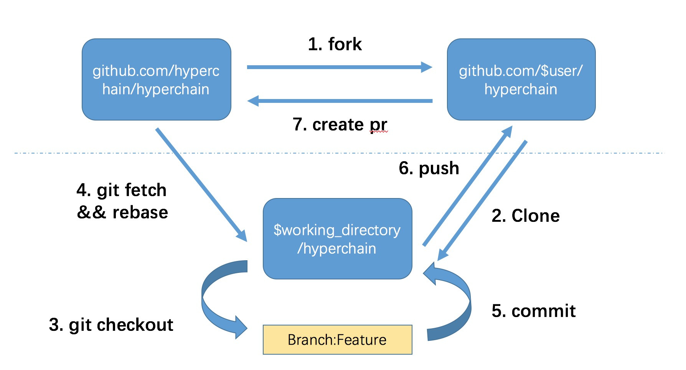

## Developers' Guide

This document describes how to contribute to hyperchain project. It is an entry point for developers who are interested in build, develop, create an issue or pull request to hyperchain.

### Building and Testing

// TODO

### Workflow



**1. fork**

visit https://github.com/hyperchain/hyperchain, click `fork` button

**2. clone**

We assume that you have `go` v1.8 installed, and `GOPATH` is set.

Create your clone:

```Shell
git clone git@github.com:$user/hyperchain.git $GOPATH/src/github.com/hyperchain/hyperchain
```

**3. fetch && rebase**

Get your local master up to date:

```Shell
cd $GOPATH/src/github.com/hyperchain/hyperchain
git fetch upstream
git checkout master
git rebase upstream/master
```

**4. branch**

Branch from it:

```Shell
git checkout -b myfeature
```

Then edit code on the `myfeature` branch.

**5. commit**

```Shell
git commit
```

**6. push**

When ready to review (or just to establish an offsite backup or your work), push your branch to your fork on `github.com`:

```Shell
git push -f ${your_remote_name} myfeature
```

**7. create pull request**

1. Visit your fork at <https://github.com/$user/hyperchain>
2. Click the `Compare & Pull Request` button next to your `myfeature` branch.

### Contributing

Each contributor should follow the git workflow. If your use of git is not particularly clear, please read this  [document](http://nvie.com/posts/a-successful-git-branching-model/) first.

If you would like to contribute to hyperchain, please fork, commit and send a pull request for maintainers to review code and merge to main code base.

**Issue**

If use want to create a issue, please follow this issue template.

```
#### Environment

hyperchain version: `hyperchain --version`
OS: Windows/Linux/OSX
Commit hash:

#### What happened:

#### What you expected to happen:

#### How to reproduce it (as minimally and precisely as possible):

#### Backtrace

​````
[backtrace]
​````

```

**Pull request**

* Pull request should be based on hyperchain's `master` branch
* Commit messages should begin with the package name they modify, e.g.
  * core/executor: use default parameters to initialize executor
* Please use `go fmt` tool to format the source code before submit changes


We encourage any form of contribution, no matter it's bug fixes, new features, or something else. Our team will do our best to make every valuable contribution to get merged as soon as possile.


