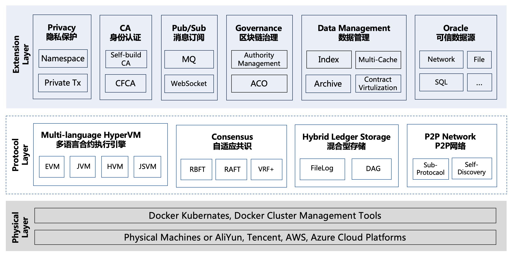

# Hyperchain

 

Hyperchain is a **foundation consortium blockchain platform** that meets the needs of industrial applications. Hyperchain integrates high-performance and reliable consensus algorithm and is compatible with the open source community's smart contract development language and execution environment.

Hyperchain provides a high-quality platform for underlying blockchain support and a convenient and reliable all-in-one solution for decentralized applications such as **digital asset clearing**, **trusted data deposit**, **de-intermediation trade** and so on that address the needs of enterprises and industry alliances.

## Key Features of Hyperchain

* Privacy Protection
  * Partition consensus based on **Namespace**
  * Private Contract & Private Transaction
* Certificate Authority Mechanism of Identity
  * Self-build CA
  * CFCA
* Message Pub/Sub
  * MQ
  * WebSocket
* Blockchain Governance
  * Authority Management Policy
  * ACO
* Blockchain data management
  * Data visualization
  * Data archive
  * Smart contract life cycle management
* Oracle - Trusted off-line data
  * Network
  * Files
  * SQL
* Multi-language support smart contract execution engine **HyperVM**
  * Solidity
  * Java
  * JavaScript
* Self-Adaptive Consensus
  * **RBFT(Robust Byzantine Fault Tolerance)**
  * Raft
  * VRF+
* Hybrid Ledger Storage
  * Filelog (AppendOnly Storage）
  * DAG

## Architecture

The above diagram is a high-level overview of the system architecture used by Hyperchain.

Find more detail in the [english documentation](https://hyperchain.readthedocs.io/en/latest/) and [chinese version](https://hyperchain.readthedocs.io/zh_CN/latest/).

## Quick Start

Refer to our [quick start docs](http://docs.hyperchain.cn/docs/hyperchain/3.1-hyperchain-quickstart)

## Documentation

We used readTheDoc to manage our project documentation, which contains the system architecture design, the introduction of key modules, system configuration, user manuals, project developement roadmap and other details.

If you are interested in the above, please click on the [documentation link](https://github.com/hyperchain/hyperchain/blob/master/Contributing.md) to browse.

Note that we now provide documentation in both English and Chinese.

## Contribution

Thank you for considering to help out with the source code!  No matter it's a system bug report, a new feature purposal, or code contributing, we're all huge welcome.

Please check the [contributing guide](https://github.com/hyperchain/hyperchain/blob/master/Contributing.md) for the full details.

## Community

* Gitter

  https://gitter.im/hyperchaincn-hyperchain/hyperchain

## Troubleshooting and Getting Help

Contacting Technical Support:

Before you contact our technical support staff, have the following information available.

- Your name, title, company name, phone number, and email address
- Operating system and version number
- Product name and release version
- Problem description

Hours: 9:00 AM to 5:00 PM PST (Monday-Friday, except Holidays)

Phone: 0571-81180102, 0571-81180103

Email: support@hyperchain.cn

## LICENSE

The hyperchain is licensed under the [GNU Lesser General Public License v3.0](https://www.gnu.org/licenses/lgpl-3.0.en.html), also included in our repository in the `LICENSE` file.
