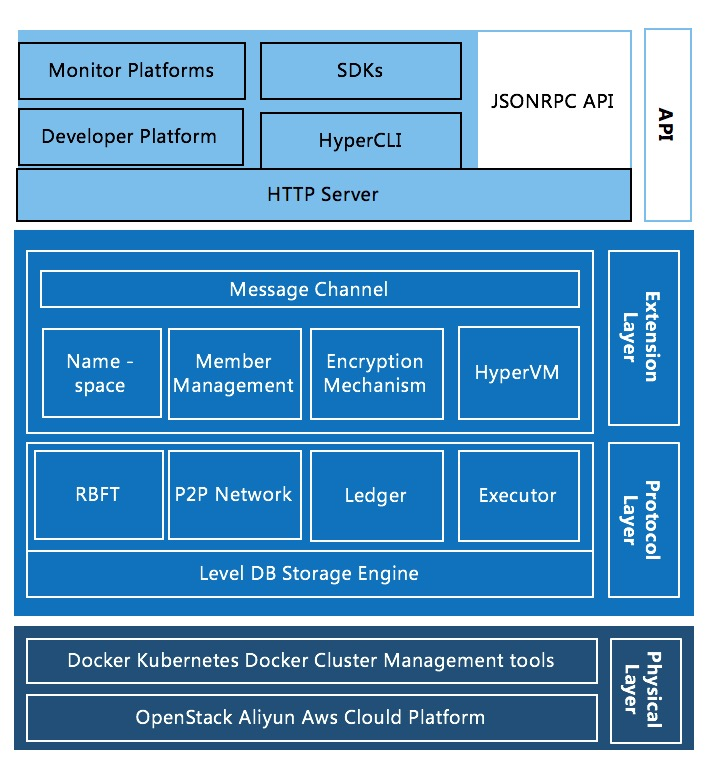

# Hypechain

[]() [](https://gitter.im/hyperchaincn-hyperchain/hyperchain)

Hyperchain is a **foundation consortium blockchain platform** that meets the needs of industrial applications. Hyperchain integrates high-performance and reliable consensus algorithm and is compatible with the open source community's smart contract development language and execution environment. 

Hyperchain provides a high-quality platform for underlying blockchain support and a convenient and reliable all-in-one solution for decentralized applications such as **digital asset clearing**, **trusted data deposit**, **de-intermediation trade** and so on that address the needs of enterprises and industry alliances.

## Key Features of Hyperchain

* Consensus on block coherence based on **RBFT(Robust Byzantine Fault Tolerance)**
* Limit the entry of blockchain node base on **certificate authority**
* Multilevel Encryption Mechanism Based on Cryptography
* Partition consensus based on **Namespace**
* Multi-language support smart contract execution engine **HyperVM**
  * Solidity
  * Java
* Blockchain data management
  * Data visualization
  * Data archive
  * Smart contract life cycle management

## Architecture



The above diagram is a high-level overview of the system architecture used by Hyperchain.

Find more detail in the [english documentation](https://hyperchain.readthedocs.io/en/latest/) and [chinese version](https://hyperchain.readthedocs.io/zh_CN/latest/).

## Quick Start

### Building from Source

**Create Your Clone**
Clone the repository to a directory of your `GOPATH` source path:

```bash
mkdir -p $GOPATH/src/github.com/hyperchain
cd $GOPATH/src/github.com/hyperchain
git clone https://github.com/hyperchain/hyperchain
```

**Building**
Please make sure you've installed Go tool properly, if you don't have it already, please see [Instructions](https://github.com/hyperchain/hyperchain/blob/master/docs/en/prerequisites.rst).

To build Hyperchain:

```bash
cd $GOPATH/src/github.com/hyperchain/hyperchain
govendor build
```

You can run `go build` as well.

### Start up Hyperchain

Since a Hyperchain cluster needs at least 4 nodes to establish a BFT system, we recommend starting up Hyperchain nodes in these modes:

- Local Mode - Local 4 Nodes
- Distributed Mode - Distributed 4 Nodes

#### Local Mode - Local 4 Nodes

We've provided a script named `local.sh` which starts all Hyperchain nodes locally.

```bash
cd $GOPATH/src/github.com/hyperchain/hyperchain/scripts
./local.sh
```

You'll see these information if all Hyperchain nodes start up properly.

```bash
$./local.sh
...
...
start up node 1 ... done
start up node 2 ... done
start up node 3 ... done
start up node 4 ... done
```

#### Distributed Mode - Distribute 4 Nodes

**Enable Password Less**
Since `server.sh` script prompts for a password when executing ssh operations, we recommend generating SSH keys on the deploy node and distribute the public key to each Hyperchain node.

1 . Generate the SSH keys, and leave the passphrase empty:

```bash
ssh-keygen

Generating public/private key pair.
Enter file in which to save the key (/home/hyperchain/.ssh/id_rsa):
Enter passphrase (empty for no passphrase):
Enter same passphrase again:
Your identification has been saved in /home/hyperchain/.ssh/id_rsa.
Your public key has been saved in /home/hyperchain/.ssh/id_rsa.pub.
```

2 . Copy the key to each Hyperchain node, replacing `{username}` with the user name you created.

```bash
ssh-copy-id {username}@node1
ssh-copy-id {username}@node2
ssh-copy-id {username}@node3
ssh-copy-id {username}@node4
```

**Distribute Hyperchain**
We've provided a script named `server.sh` which distributes Hyperchain to all nodes and starts up them separately.

1 . Put servers' IP addresses into a file named serverlist.txt which under hyperchain/scripts directory.

For instance:

```bash
cat $GOPATH/src/github.com/hyperchain/hyperchain/scripts/serverlist.txt
172.16.1.101
172.16.1.102
172.16.1.103
172.16.1.104
```

2 . Start up Hyperchain with server.sh script.

```bash
cd $GOPATH/src/github.com/hyperchain/hyperchain/scripts
./server.sh
```

You'll see these information if all Hyperchain nodes start up properly.

```bash
$./server.sh
...
...
start up node 1 ... done
start up node 2 ... done
start up node 3 ... done
start up node 4 ... done
```

## Documentation

We used readTheDoc to manage our project documentation, which contains the system architecture design, the introduction of key modules, system configuration, user manuals, project developement roadmap and other details.

If you are interested in the above, please click on the [documentation link](https://github.com/hyperchain/hyperchain/blob/master/Contributing.md) to browse.

Note that we now provide documentation in both English and Chinese.

## Contribution

Thank you for considering to help out with the source code!  No matter it's a system bug report, a new feature purposal, or code contributing, we're all huge welcome.

Please check the [contributing guide](https://github.com/hyperchain/hyperchain/blob/master/Contributing.md) for the full details.

## Community

* Gitter

  https://gitter.im/hyperchaincn-hyperchain/hyperchain


## Troubleshooting and Getting Help

Contacting Technical Support:

Before you contact our technical support staff, have the following information available.

- Your name, title, company name, phone number, and email address
- Operating system and version number
- Product name and release version
- Problem description

Hours: 9:00 AM to 5:00 PM PST (Monday-Friday, except Holidays)

Phone: 0571-81180102, 0571-81180103

Email: support@hyperchain.cn

## LICENSE

The hyperchain is licensed under the [GNU Lesser General Public License v3.0](https://www.gnu.org/licenses/lgpl-3.0.en.html), also included in our repository in the `LICENSE` file.

