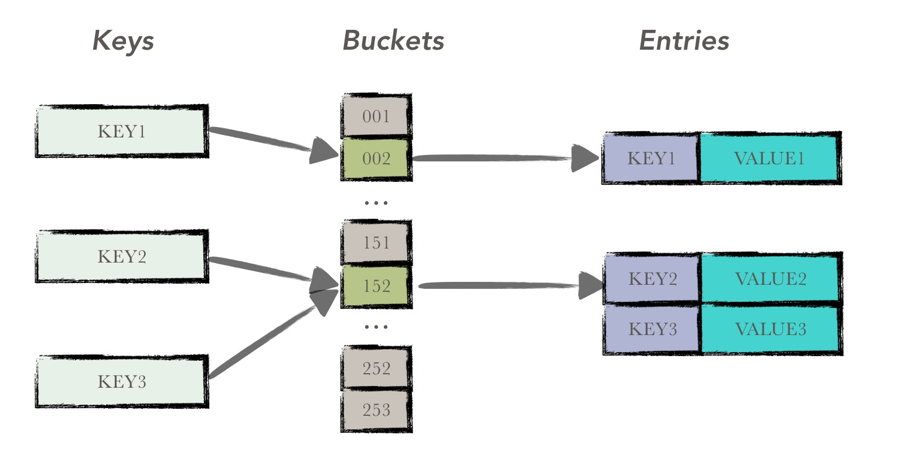
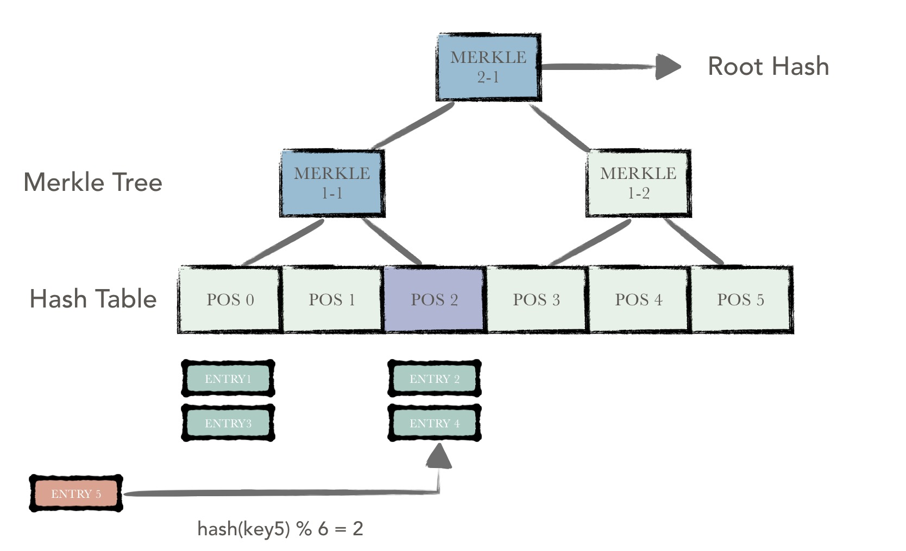

## Bucket tree

### Overview

In hyperchain, the ledger data can be divided into two parts：

* blockchain data
* account data

Among them, the blockchain data include: block, transaction, receipt and other data. This part is what we call the blockchain in the traditional sense. All blocks are chained sequentially from back to front in this chain, with each block pointing to its parent block.

Block contains a number of transactions, the consensus module will be responsible for the unified order of the received transactions and packaged into a block for distribution. After receiving a block, the block chain node executes the transaction in sequence on the basis of the original state, and reads / writes status data of the relevant account during this period; and when the execution ends, all account data are written and changed uniformly. The execution of each transaction means that the blockchain has undergone a state transition.

Here, the state of the blockchain refers to a collection of all the account states on the blockchain, collectively referred to as world states. As support smart contracts, like Ethereum, hyperchain abandoned the Bitcoin UTXO model and used an account model to organize the data, so this part of the data is called account data.

Therefore, hyperchain's accounting system can be broadly divided into the above two parts, the structure diagram is as follows.


In this article we will not start the discussion of the structure of the ledger, but to discuss a tree structure used to quickly calculate the world state hash. In hyperchain, for each block executed,  each node needs to compare the results of the execution in the third phase of BFT is consistent. In other words, the account data needs to be consistent in each node. Therefore, the hyperchain uses a bucket tree structure to hash the account data. The nodes only need to compare the hash values to determine the consistency of the account data.

>  It is noteworthy that the bucket tree does not organize and maintain the account data directly, but only  calculate the hash.

Bucket tree has the following characteristics：

* Provides a mechanism to quickly calculate the hash of account data；
* Provides a mechanism for rollback of ledger；

The theory of bucket tree in hyperchain is the earliest learned from the fabric project, a series of reconstruction and optimization, making the final performance in line with production needs. In the following, the structure of this tree, the main operations, and the final performance are described in detail.

### Structural analysis

Bucket tree is actually a combination of two different data structures, the two data structures：

* merkle tree
* hash table

Therefore, before we introduce the structure of bucket tree, we first briefly introduce the above two data structures。

#### merkle tree

The Merkle tree was introduced many years ago by computer scientist Ralph Merkle and named after his own name, a data structure that is used in bitcoin networks for verification of data correctness.

In bitcoin networks, the merkle tree is used to summarize all transactions in a block and to generate a digital fingerprint of the entire transaction set. In addition, due to the existence of the merkle tree, it becomes possible to extend a "light node" for simple payment verification in the case of a Bitcoin chain.

**Features**

- Merkel tree is a kind of tree, most of them are binary tree, also can be multi-tree, whether it is a few tree, it has all the characteristics of tree structure;
- Merkel Tree leaf node value is the content of the data item, or the data item hash value;
- The value of a non-leaf node is calculated by Hash according to the information of its child node;

**Principle**

In bitcoin networks, the merkle tree is built from the bottom up. In the example below, we first hash the four unit data of ENTRY1-ENTRY4 and then store the hash value to the corresponding leaf node. These nodes are Hash0-0, Hash0-1, Hash1-0, Hash1-1


Combine two adjacent node's hash into a string, and then calculate the hash of this string, the result is the hash of the parent node of these two nodes.

If the number of tree nodes in this layer is a single number, then this case directly performs hashing on the last remaining tree node, and the hash of its parent node is the hash of its hash value (for the singular There are different ways to deal with leaf nodes, and you can copy the last leaf node to get even number of leaf nodes). Loop repeat the calculation process, get the last node as the root node, the hash of the node as the hash of the entire tree.

If the two trees have the same root hash, the contents of the two trees must be the same.

The advantage of using the merkle tree is that when the content of a node changes, it only needs to recalculate the hash of all the tree nodes in the path from the node to the root node to obtain a hash that can represent the status of the whole tree value. It is also because of this feature of the merkle tree that the bucket tree avoids many unnecessary computational overheads and has the ability to quickly compute the world state hash.

#### Hash table

Hash table, also known as hash table, is a very familiar data structure, is based on the key (key) and direct access to the memory storage location. In other words, it speeds up lookup by calculating a function on the key that maps the data of the desired query to a location in the table to access the record. This mapping function is called a hash function, the record array is called a hash table.



The description about the hash is not repeat here. In the bucket tree, use the hash table to maintain the original data。

#### bucket tree



Bucket tree consists of two parts: the bottom of the hash table and the upper Merkel tree. Bucket tree is actually a merkle tree built on the hash table.

A hash table consists of a series of buckets, each of which contains a number of entries that have been hashed into the bucket, all of which are arranged in sequence. Each bucket has a hash value to represent the state of the entire hash bucket, which is hashed according to the contents of all the data items in the bucket.

Except the underlying hashtable, the upper level is a series of merkle tree nodes. A merkle tree node corresponds to n hash buckets or merkle tree nodes in the higher level. This n is also called the degree of aggregation of the merkle tree. The merkle tree node maintains the hash values of the n child nodes, and the hash value of the merkle tree node is calculated according to the hash values of the n child nodes.

So continuous iteration, the ultimate tree node is the root node of the entire tree, the node's hash value represents the hash of the entire tree.

The purpose of this design is：

* Using the characteristics of the merkle tree, the computational cost of re-hashing is minimized every time the state of the tree changes;
* The use of hash table for the maintenance of the underlying data, making the data items evenly distributed;

For example, in the figure above, a new data item entry5 is inserted, and the data item is hashed to a bucket with a POS of 2. The bucket,  as well as all the nodes from the bucket to the root node are marked pink, that is dirty nodes. Hash recalculation of only these dirty nodes gives you a new hash value to represent the new tree state

Because the bucket tree is a fixed-size tree (that is, the underlying hash table can not be changed after the tree has been initialized). Hashing a hash of all data items evenly to avoid data aggregation occurs.

In addition, bucket tree has two important tunable parameters：

* capacity
* aggreation

The former indicates the capacity of the hash table. The larger the value, the more the number of data items that the entire tree can accommodate. Under the condition of the same degree of aggregation, the higher the tree height, the more the number of tree nodes in the path from the leaf node to the root node, and the number of hash calculation increases.

The latter represents the number of child nodes corresponding to a parent node. The larger the value, the faster the tree converges. Under the premise of the same hash table capacity, the tree height is lower, the number of tree nodes in the path from the leaf node to the root node is less, and the hash calculation times are reduced; however, the size of each Merkle tree node is larger, which increases the database IO overhead.

#### Bucket

The definition of a hash bucket is made up of a series of data items, note that these data items are sorted by key's lexicographical order, each of which represents a user data (which can be optimized to store only the hash of user data).

```Go
type Bucket []*DataEntry
```

####merkle node

The definition of merkle node is as follows. The main field is the list of children nodes related to it. Each element in this list is a hash value of a child node.

```Go
// MerkleNode merkleNode represents a tree node except the lowest level's hash bucket.
// Each node contains a list of children's hash. It's hash is derived from children's content.
// If the aggreation is larger(children number is increased), the size of a merkle node will increase too.
type MerkleNode struct {
	pos      *Position
	children [][]byte
	dirty    []bool
	deleted  bool
	lock     sync.RWMutex
	log      *logging.Logger
}
```

### Core operation

The calculation procedure of bucket tree can be divided to four parts：

1. Initialize
2. Prepare
3. Process
4. Commit


#### Initialize

In the initialization phase,  building tree shape construction, cache initialization and historical data recovery (from the db read the latest root node hash)

The so-called tree structure is the use of user configuration capacity and aggreation two parameters to construct the structure of the tree. The build function is as follows：

```Go
var (
		curlevel  int
		curSize   int = cap
		levelInfo     = make(map[int]int)
	)
	levelInfo[curlevel] = curSize
	for curSize > 1 {
		parSize := curSize / aggr 
		if curSize%aggr != 0 {
			parSize++
		}
		curSize = parSize
		curlevel++
		levelInfo[curlevel] = curSize
	}
	conf.lowest = curlevel
	for k, v := range levelInfo {
		conf.levelInfo[conf.lowest-k] = v 
	}
```

In addition, bucket tree in order to (1) increase the efficiency of reading (2) to prevent write loss, use two caches for cache hash bucket and merkle node data. These two cache are achieved by LRUCache, each update will be synchronized to update the contents of the cache. So, the next bucket tree hash calculation, you can hit hot data from the cache, try to avoid the disk read.

As for the prevention of write loss, since validation and commit are two separate asynchronous processes in hyperchain, validation of block 101 may be performed immediately based on the state of 100 as the validation process of block 100 proceeds. At this moment, the modification of the account book in the execution of the block 100 has not yet been submitted to the database, so in order to "prevent write loss", the contents need to hit from the cache. If at this moment there is a situation where the capacity of the cache is too small and the content that which not submitted is driven out, the result of the validation of the block 101 is inconsistent with other nodes (usually the primary node), and the RBFT algorithm is used to perform the fault processing.

The bucketcache is used to store the hash bucket data, each hash bucket is a cache data item. The problem is that a hash bucket itself consists of a number of data entries, with the running time, the size of a hash bucket will be larger and larger, resulting in increasing memory usage.

merkleNodeCache is used to store all merkle node data except for the highest layer, the number of merkle nodes is fixed, and the size of each node is also capped. Therefore, merkleNodeCache does not have a problem that content occupancy is increased.

#### Prepare

During the preparation phase, the bucket tree receives the modified set passed in by the user and constructs a dirty set of hash buckets using the contents of the modified set. Note that in the returned hash bucket, the internal data items are arranged in ascending order of the dictionary.

```Go
func newBuckets(prefix string, entries Entries) *Buckets {
	buckets := &Buckets{make(map[Position]Bucket)}
	for key, value := range entries {
		buckets.add(prefix, key, value)
	}
	for _, bucket := range buckets.data {
		sort.Sort(bucket)
	}
	return buckets
}
```

#### Process

Process is the hash recalculation phase can be divided into two parts (1) dirty hash bucket re-calculation (2) dirty merkle node hash re-calculation.


**Dirty hash bucket re-calculation**

As shown in the figure above, two new entry data items entry5 and entry6 are inserted in the bucket tree. The hash address obtained by entry5 is Pos2, and the hash address obtained by entry6 is Pos5.

There is a merge operation in Pos2 to insert the new data and merge with  historical data with the fixed sorting algorithm to reorder, and ultimately get a new hash bucket, contains All new and old data, and arranged in order.

The hash value of each hash bucket is a result of hashing the data in the whole bucket.

As shown in the figure, Pos2 and Pos5 are two dirty hash buckets. After the calculation is completed, the corresponding child hash value  is set in the parent node.

**Dirty merkle node re-calculation**

When the hash bucket calculation is completed, the hash calculation of the merkle node can be performed. In this step, only the dirty merkle nodes are hash calculated.

Note that the hash calculation of the merkle node is done hierarchically.

Each merkle node maintains the hash value of its child node, and if the child node hash value of the next layer changes, the latest hash value is placed in the parent node in the previous calculation; for no change Child node, you can directly use the history of the hash value.

The hash value of each merkle node, calculated for the hash of all its child node hashes.

#### Commit

After the calculation is completed, the latest hash bucket data and merkle node data needs to be persisted.

In addition, all the hash bucket data, merkle node data will be stored in the cache, for hot data, both to improve data search efficiency, but also to avoid data write loss.


