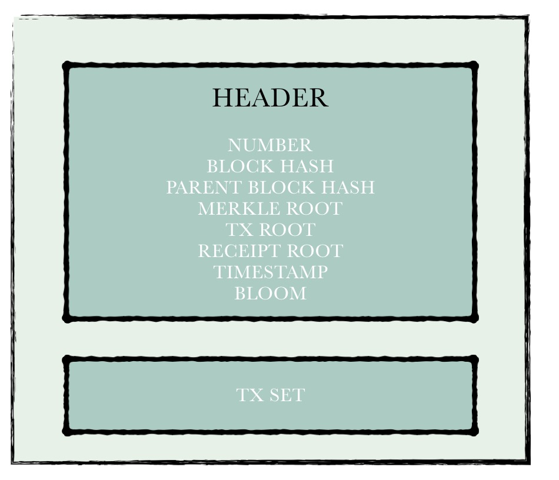
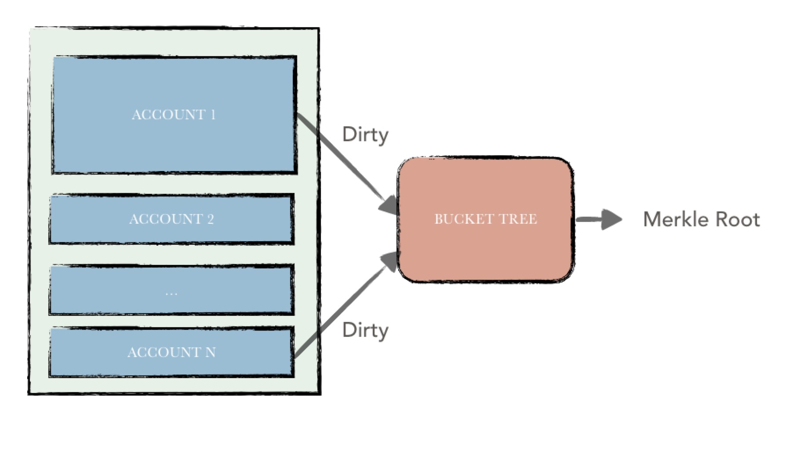

## Ledger

### 1. Overview

The ledger is an important module in the hyperchain platform and is responsible for the maintenance and organization of the blockchain ledger data. Ledger data can be divided into two parts.

- Blockchain data
- Account data

Among them, the blockchain data include:

* block, 
* transaction
* receipt 
* other data. 

This part is what we call the blockchain in the traditional sense. The latter refers to the collection of all account states on the blockchain, collectively referred to as world states. Because hyperchain supports smart contracts, as with Ethereum, it discards Bitcoin's UTXO model and uses an account model to organize the data, so this part of the data is called account data.

Blockchain data is mainly concatenated in blocks. All blocks are chained sequentially from back to front in a chain, with each block pointing to its parent block. Block contains a number of transactions, the consensus module is responsible for unified packaging and sequencing. After receiving a block, the block chain node executes the transaction in turn based on the original account status, and during this period reads / writes the status data of the relevant account. The execution of a transaction means that the state of the blockchain has undergone a transition.

Each transaction, in the hyperchain will have a transaction receipt or illegal transaction records to indicate the final execution result. If the transaction is a valid transaction, the execution result of the transaction will be recorded in the transaction receipt after the execution is completed. Conversely, the cause of the error is recorded in an illegal transaction record.

The logical relationship between the various parts of the ledger can be as follows.

### 2. Blockchain data

 In this chapter, we describe the relationship between the following data structures：

* Block

* Transaction
* Receipt
* Chain
* Invalid Transaction Record

The first two types of data structures form "blockchain data" in the blockchain network, which is the data that needs to be "consensus" in the blockchain network. The latter three types of data structures are maintained locally by each node. The above five data structures make up all the blockchain data in one node.

#### Block

The block structure can be divided into two parts：

（1）Header;

（2)   Body;

The block header mainly contains some blockchain metadata, including: (1) block height (2) block hash (3) parent block hash (4) world state hash (5) transaction set hash (6) receipt set hash (7) timestamp (8) log filtering data.

Block body contains all the transaction data.

The main function of the block is to encapsulate the transaction data and record the blockchain meta data.

#### Transaction

The transaction is initiated by an external user and records the user-specified call information in the transaction.

Transactions can be divided into two categories based on whether smart contracts are executed：

* normal transaction；
* contract transaction；
  * contract deployment
  * contract invocation

The former means that the execution of the transaction does not perform the operation of the smart contract, only the hyperchain token transfer.

The latter that the will trigger smart contract code running.

The latter can be divided to two categories：

(1) contract deployment transaction 

(2) contract invocation transaction.

Transaction includes these fields：

* **Version**：Indicating the version of the transaction data structure, for backward compatibility;
* **Transaction initiator**：Identification of the initiator of the transaction, 20 bytes in length;
* **Transaction receiver**：Identification of the recipient of the transaction, 20 bytes in length. 
  * If the transaction type is contract invocation, the field is the address of the contract to be invoked; 
  * If the field is empty, it indicates that the transaction type is contract deployment;
* **Calling information**: 
  * If the transaction is a normal transaction, specify the number of tokens that need to be transferred in the calling information;
  * If the transaction is a contract invocation transaction, specify the function to be called and the calling parameter in the calling information;
  * If the transaction is a contract deployment transaction, You need to specify the contract's binary code in the call information;
* **Random value**：Random uint64;
* **Transaction Signature**：The user uses his private key to sign the content of five fields of (1) transaction initiator (2) transaction receiver (3) call information (4) timestamp (5) random value, and the generated signature content is filled in the field to prevent the contents of the transaction  been tampered;
* **Transaction Hash**：Hash the above (1) - (5) fields together with the transaction signature to obtain a hash value indicating the transaction;

#### Receipt

Each legitimate transaction, the results of its execution will be packaged into a transaction receipt stored in the blockchain. Transaction receipt includes:

* **Version**：Indicates the version information defined by the receipt data structure for backward compatibility;
* **Transaction Hash**：Transaction hash associated with this receipt;
* **Contract Address**：If the transaction is a contract for deployment contract, the newly deployed contract address is placed in the field, otherwise the field is empty;
* **Execution Result**：If the transaction is a contract invocation transaction, the result of the execution is placed in the field, otherwise the field is empty;
* **Contract Logs**：During a smart contract execution, a series of logs may be generated and the log data is placed in this field;
* **Contract Type**：Contract type is placed in this field, EVM(ethereum virtual machine), JVM or something else.

#### Invalid Transaction Record

Each illegal transaction, the error message will be packaged into an illegal transaction record, stored in the local node.  

Except transaction data related to the illegal record,  the specific causes of the error will also been  recorded, for example: (1) the balance is insufficient (2) the parameters of the contract invocation illegal (3) call permission is not enough and so on.

#### Chain

A local node maintains some blockchain metadata for quick query, so in the hyperchain there is a data structure named chain that records this data, including：

* Latest parent block hash;
* Latest block hash;
* Latest block number;
* Genesis block number: default genesis block number is 0, but can be affected by *data archieve/restore*;
* Transaction amount;
* Extra;

#### Consensus comparison

After executing all the transactions in a block, local node needs to compare the "results" with other nodes in the network, and only when "enough(quorum)" nodes have same result with local node,  these results will be submitted to the database.

The "execution result" of a block consists of the following contents：

* **World state hash**: During the execution of the transaction, the world state data will be changed. When all transactions in a block are executed, the bucket tree is used to perform a hash calculation on the world state, and the calculation result is the world state hash.
* **Transaction set hash**: Using the  *important field* of each transaction in the block as input to the sha256 algorithm, hash result represents the entire transaction set. The important fields are: (1) transaction initiator (2) transaction receiver (3) call information (4) timestamp (5) random value；
* **Receipt set hash**: Using the *important field* for each receipt in a block as input to the sha256 algorithm,  hash result  represents the entire set of receipts. The important fields are as follows: (1) VM execution counters (2) Execution results (3) VM execution logs

### 3. World state

The blockchain data mentioned above can in fact be summarized as a water-flow collection of contract invocation information. The smart contract needs to read / write the contract status data during the execution. Now introduce the structure of this part of the data。

Because hyperchain needs to be compatible with EVM (Ethereum Virtual Machine), and EVM has strong coupling with Ethereum's account system, hyperchain's state is based on Ethereum, and a series of modifications and optimization have been made.

#### Account type

Like Ethereum, accounts in hyperchain can be divided into two categories:

- **External Account**: The private key of external accounts are controlled by the users themselves; this type account and can initiate transaction. Besides, such account does not contain smart contract codes;
- **Contract Account**: The contract account contains an executable smart contract code and has its own storage space for storing its own state variables. The operation of the smart contract can be triggered by initiating a transaction with an external account or by another contract.

Although the two types of accounts differ in logic, but share the same definition:

The metadata for an account includes the following fields:

* **Account address**:  20 bytes, generated by the hash function according to certain input, regardless of hash conflicts, there will be no two accounts with the same address;
* **Balance**: The balance indicates the number token owned by the account. Such tokens can be manipulated through smart contracts or can be traded by initiating normal transaction transfers;
* **State variables hash**: A contract account need to store all of its state variables, a hash value used to represent these state variables is stored in the field；
* **Code hash**: a hash to represents contract code;
* **Status**：the status of contract, normal or frozen；
* **Birthday**：If the account is a contract account, this block number when this contract been deployed will be placed in this field;
* **Creator**：If the account is a contract account, the creator address will be placed in this field;

* **Deployed list**: If the account is a external account, all contract address deployed by itself will been recorded in this list;

Except these "simply" data placed in the account metadata, there are (1) contract source code (2) state variables which require a lot of storage space data are stored directly to database. Only the hash value is stored in account metadata.

In fact, contract state variables are a series of key value pairs. In hyperchain, there is a bucket tree for each contract account to compute the status hash of the contract state variables. 

Each time a transaction is executed and a series of state variables are modified,  these changes can just as input to the bucket tree in order to quickly calculate the "new" state variables hash。

#### Account set

hyperchain serializes the metadata of an account, using the serialized binary as the content of an account. All account data can eventually be converted into a series of kv pairs, the key is the address of the account, and the value is the metadata serialized content.

For the account set, there will be a global bucket tree for the **world state** hash calculation as shown in the figure. 

Each account is serialized as a record in the bucket tree, the hash value of the entire world state is uniformly calculated by that bucket tree. This hash value, as a state of the world state, is not only one of the bases for comparison of the consensus stage but will be recorded later in the block header.

#### Atomicity

Hyperchain uses the batch tool provided by the underlying database leveldb to ensure the atomicity of the ledger. Hyperchain uses rbft as a consensus algorithm, so the entire process is split into 3 phases. During the execution phase, all changes to the ledger will be pre-stored in a leveldb batch. When the result of this execution passes the consensus comparison between nodes, the batch will be removed from the cache and all changes will be placed on the disk.
