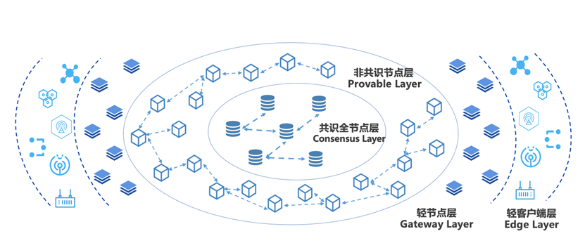

大规模组网
=============================================

随着联盟规模不断扩大，多样化业务模式不断扩展，传统的对等网络已经无法满足应用需求。比如在工业互联网、物联网场景中，传统的对等网络模式难以支撑海量终端设备接入区块链，混合式分层级的新型组网模型才能更好的应对这种大规模终端接入的应用场景。

基于上述问题，平台相应提出大规模分层组网模型, 通过分层架构设计，有效实现整体网络节点水平扩展，并提供实时计算与验证服务，实现数十万级不同类型网络节点的大规模部署。层级结构如下所示：

|image0|

-	**共识节点层** ：由VP（Validation Peer）组成，该层级节点全部参与共识，负责区块链网络的共识验证与账本一致性保证。
-	**非共识节点层** ：由NVP（Non-Validation Peer）组成，同步共识节点账本数据，不参与共识，并通过网络自发现转发模型实现大规模NVP节点组网，实现区块链数据网络水平扩展。
-	**轻节点层** ：包含微数据中心、IOT网关等，靠近边缘设备终端，提供轻量级的计算功能，具备数据缓存以及本地计算的能力，将各种边缘设备与区块链网络桥接起来，赋予边缘计算能力，提高数据的处理效率，降低整体响应延迟。
- **终端设备层** ：包括感知器、通信模组、摄像头等各类IOT设备，负责数据采集与转发上链，解决数据真实性的“第一公里”问题。

读写分离（NVP）
==================================================

在数据新基建的大潮流下，随着人民链、星火链网、BSN等国家级区块链平台的相继推出，未来区块链需要支撑的应用场景规模将会越来越大，这势必会带来性能与扩展性的矛盾。试想如果区块链网络中都为共识节点，一方面，网络复杂度的增加对网络连通性和稳定性提出了更高的要求，但在真实落地场景中，出于网络安全和建设成本的考虑理想化的网络环境往往很难实现；另一方面，共识节点的数量增加会导致共识效率的降低，从而拖慢系统的整体性能。针对这些问题，趣链区块链平台通过非共识节点NVP提供了一种新的解题思路。

NVP定位于轻量级服务节点，不参与共识，仅通过信任的VP来同步账本数据，并对外提供交易转发、查询等服务。NVP拥有完善的数据恢复机制，当由于网络异常等原因导致节点落后时，能及时同步数据，恢复到最新的账本状态，提高了节点的可用性。此外，NVP提供的区块链服务是独立于VP的，除了交易上链、查询、验证等基础功能外，还支持数据索引、数据归档、可信文件存储、接口权限管理等功能，适应更加多样化的应用场景。趣链区块链平台支持一个VP连接多个NVP，用户可选择同步VP的全量账本数据或某个NS的账本数据，同步范围灵活可配。

NVP适用于多种应用场景：

- 针对数据低频写、高度读的存证类场景，机构内部可在VP的基础上再增设NVP，将一部分数据读压力转移到NVP上，让VP专注于数据写入，通过读写分离来分担VP压力，实现区块链系统的高效运行。
- 针对大规模、分层级、跨区域的国家级基础设施类场景，下属机构或中小型企业可用NVP替代VP，从平台角度考虑，一方面减轻了共识网络的压力，在保证性能的提前下提高了区块链网络的可扩展性，另一方面网络复杂度的降低也更利于平台落地；从机构及企业角度考虑，在满足业务需求的同时也降低了设备及运维成本。
- 针对海量终端设备接入的城市级物联网场景，以共识节点层为中心，通过NVP非共识节点层实现数据网络的扩展，优化分摊系统压力。

