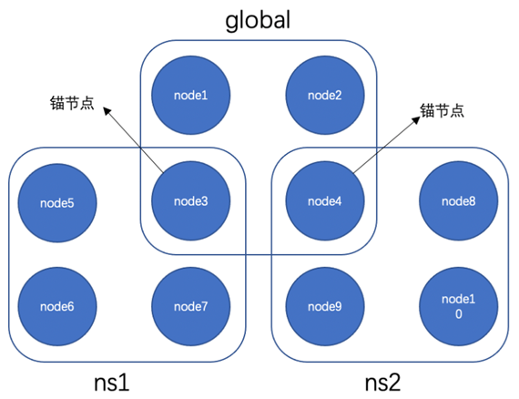

架构拓展
^^^^^^^^^^^^^^

大规模组网
-----------------

随着联盟规模不断扩大，多样化业务模式不断扩展，传统的对等网络已经无法满足应用需求。比如在工业互联网、物联网场景中，传统的对等网络模式难以支撑海量终端设备接入区块链，混合式分层级的新型组网模型才能更好的应对这种大规模终端接入的应用场景。

基于上述问题，平台相应提出大规模分层组网模型, 通过分层架构设计，有效实现整体网络节点水平扩展，并提供实时计算与验证服务，实现数十万级不同类型网络节点的大规模部署。层级结构如下所示：

|image0|

- **共识节点层** ：由VP（Validation Peer）组成，该层级节点全部参与共识，负责区块链网络的共识验证与账本一致性保证。
- **非共识节点层** ：由NVP（Non-Validation Peer）组成，同步共识节点账本数据，不参与共识，并通过网络自发现转发模型实现大规模NVP节点组网，实现区块链数据网络水平扩展。
- **轻节点层** ：包含微数据中心、IOT网关等，靠近边缘设备终端，提供轻量级的计算功能，具备数据缓存以及本地计算的能力，将各种边缘设备与区块链网络桥接起来，赋予边缘计算能力，提高数据的处理效率，降低整体响应延迟。
- **终端设备层** ：包括感知器、通信模组、摄像头等各类IOT设备，负责数据采集与转发上链，解决数据真实性的“第一公里”问题。

读写分离（NVP）
-----------------

在数据新基建的大潮流下，随着人民链、星火链网、BSN等国家级区块链平台的相继推出，未来区块链需要支撑的应用场景规模将会越来越大，这势必会带来性能与扩展性的矛盾。试想如果区块链网络中都为共识节点，一方面，网络复杂度的增加对网络连通性和稳定性提出了更高的要求，但在真实落地场景中，出于网络安全和建设成本的考虑理想化的网络环境往往很难实现；另一方面，共识节点的数量增加会导致共识效率的降低，从而拖慢系统的整体性能。针对这些问题，趣链区块链平台通过非共识节点NVP提供了一种新的解题思路。

NVP定位于轻量级服务节点，不参与共识，仅通过信任的VP来同步账本数据，并对外提供交易转发、查询等服务。NVP拥有完善的数据恢复机制，当由于网络异常等原因导致节点落后时，能及时同步数据，恢复到最新的账本状态，提高了节点的可用性。此外，NVP提供的区块链服务是独立于VP的，除了交易上链、查询、验证等基础功能外，还支持数据索引、数据归档、可信文件存储、接口权限管理等功能，适应更加多样化的应用场景。趣链区块链平台支持一个VP连接多个NVP，用户可选择同步VP的全量账本数据或某个NS的账本数据，同步范围灵活可配。

NVP适用于多种应用场景：

- 针对数据低频写、高度读的存证类场景，机构内部可在VP的基础上再增设NVP，将一部分数据读压力转移到NVP上，让VP专注于数据写入，通过读写分离来分担VP压力，实现区块链系统的高效运行。
- 针对大规模、分层级、跨区域的国家级基础设施类场景，下属机构或中小型企业可用NVP替代VP，从平台角度考虑，一方面减轻了共识网络的压力，在保证性能的提前下提高了区块链网络的可扩展性，另一方面网络复杂度的降低也更利于平台落地；从机构及企业角度考虑，在满足业务需求的同时也降低了设备及运维成本。
- 针对海量终端设备接入的城市级物联网场景，以共识节点层为中心，通过NVP非共识节点层实现数据网络的扩展，优化分摊系统压力。

轻节点（LP）
-----------------

在数据新基建的大潮流下，一系列国家级、省市级和行业级的区块链基础设施平台不断涌现，未来区块链需要支撑的应用场景规模将会越来越大，具体特征包括参与机构数量多、上链数据量大、性能要求高等。

就如目前存在的部分数据同步的问题，部分数据同步指不存储某个分区下的全量区块或账本数据，仅选择性存储部分数据。而当前联盟链场景中，每个参与机构都期望部署自己的节点，所有交易的上链、查询操作也将基于该节点进行。一方面这些机构都期望在业务层面成为链的共同建设者和维护者，另一方面若不部署节点，每次查询时需要跨域访问共识节点，在网络条件较差的环境中，可能遇到带宽资源不足、网络传输耗时过长、网络质量不可控导致的查询任务响应慢、中断、失败等风险，同时在并发量较大的情况下会增加共识节点压力。

非共识节点是否能满足需求？

- 非共识节点存储全量数据，若大部分是跟自身业务无关的数据，会造成存储资源的浪费和数据维护成本的增加，另外，因业务相关或无关的交易数据可能存储在同一区块内，所以无法通过数据归档去解决。
- 同一个分区下的数据无法再按需清分，单分区至少需要4个共识节点才能启动，同时上级或总部节点可能需要同时加入数量众多的分区，而单节点承载的分区数量有限，最终会导致设备和运维成本的增加，存在数据隐私安全问题。

LP节点，也就是轻节点，主要任务是分担网络的压力，作为未来的主力节点，只存储网络的少量数据，通过证明来实现功能。目前，轻节点的主要功能为同步区块头，主要应用场景为轻节点刚启动的区块头同步以及新增区块头的数据同步，整体包含功能包括：1.同步区块头：节点启动数据同步以及新数据推送；2. 转发交易：轻节点转发交易；3. 查询区块头数据：轻节点向共识节点请求交易和回执的证明。除此之外，轻节点不支持同步区块。

分区扁平化
-----------------

现有分区共识的设计是在global分区的基础上，按需选择节点创建各自自定义分区。即创建新的分区的前提是，已加入global分区，而加入global分区的前提是，需要各节点间能够建立连接。在大规模多分区部署区块链网络的场景下，如果所有节点都在global分区下，那么其网络架构将非常复杂，尤其在主侧链场景中，侧链之间的网络是很难通信的，也无需通信，所以平台进行了分区扁平化的设计。

分区扁平化包含以下功能点设计：

- 整体架构扁平化：分区完全扁平化，四个节点及以上可以组成一个分区，网络中不一定需要global分区的存在，分区内的节点建立物理和逻辑连接。
- 网络扁平化：不在同一个分区中的节点之间无需建立p2p连接，将DNS、Topotogy、Ping服务和broadcast挪到ns级别。Network划分成多个子网，每个子网代表一个ns。
- 锚节点管理：组网阶段不考虑锚节点，锚节点通过后续注册的方式进行管理，锚节点的注册通过配置交易进行。
- 证书级别调整：节点证书中新增namespace字段，防止同一个节点的分区借用其他分区的证书。

|image1|

.. |image0| image:: ../../images/massive1.png
