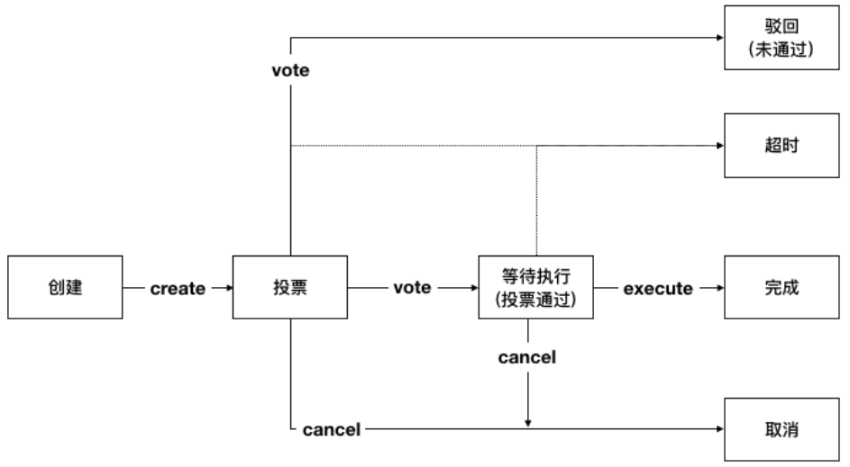

.. _chain-auth-manage:

链级权限管理
^^^^^^^^^^^^^

平台基于 **联盟自治CAF** 框架实现链级权限管理，具体包括链级配置变更、链级角色管理、节点增删管理、合约权限管理、合约生命周期管理、合约命名服务以及账户生命周期管理。

下文将介绍CAF框架下提案-投票流程的具体使用方式及相关接口说明，其他功能的使用说明请前往相应界面：

* :ref:`链级配置管理 <chain-conf-manage>`
* :ref:`链级角色管理 <chain-role-manage>`
* :ref:`节点增删管理 <node-manage>`
* :ref:`合约权限管理 <contract-auth-manage>`
* :ref:`合约生命周期管理 <contract-life-manage>`
* :ref:`合约命名服务CNS <contract-naming-service>`
* :ref:`账户生命周期管理 <account-life-manage>`

功能概述
------------------
联盟自治框架CAF（Consortium Autonomous Framework）由管理员共同形成“联盟自治成员组织”，以联盟协商的形式管理联盟链。该框架适用于一切链级别的变更，如节点增删、合约管理等。

CAF的管理委员会包括 **系统管理委员会** 和 **合约管理委员会**。前者由系统管理员组成，负责链级配置变更、链级角色管理、节点增删等提案的商议与投票；后者由合约管理员组成，负责合约访问权限管理、合约生命周期管理、合约命名服务CNS等提案的商议与投票。

提案的提出、表决、通过等核心逻辑都依托于 **内置智能合约（BVM）** 实现，具体流程如下：

1. 系统管理或合约管理的行为，会被申请人以提案形式提交给相应的委员会；
2. 所有组织成员根据自身制定的投票策略对每个提案作出判断；
3. 当组织中同意该提案的成员数量达到预设阈值时，提案被通过；
4. 所有链上节点根据通过提案的内容自动变更节点状态。

安装及初始化
------------------
使用litesdk与节点交互分为以下几步：

1. 首先需要创建 `HttpProvider` 对象管理与节点的连接；
2. 然后创建 `ProviderManager` 对象负责集成、管理 `HttpProvider`；
3. 然后再根据实际的需要创建相应的服务 `Service` 的具体实现类；
4. 最后将请求发送出去拿到响应结果。

初始化的流程中litesdk的主文档中有详细介绍，此次不再赘述。此外，执行合约需要创建的是 `Service` 的实现类 `ContractService`。

使用说明
------------------

BVM合约接口
>>>>>>>>>>>>>>>>>>>

BVM合约主要通过 `ContractService` 提供的 `invoke` 接口执行，对于特殊的通过bvm合约管理合约生命周期是通过 `ContractService` 提供的 `manageContractByVote` 接口执行（主要是为了与默认的非bvm管理合约生命周期的方式区分开来）。

ContractService 的中的接口声明如下::

    public interface ContractService {
        Request<TxHashResponse> deploy(Transaction transaction, int... nodeIds);
        Request<TxHashResponse> invoke(Transaction transaction, int... nodeIds);
        Request<TxHashResponse> maintain(Transaction transaction, int... nodeIds);
        Request<TxHashResponse> manageContractByVote(Transaction transaction, int... nodeIds);
    }

BVM交易体
>>>>>>>>>>>>>>>>>>>>

**LiteSDK** 使用 **Builder** 模式来负责对 `Transaction` 的创建，通过调用 `build()` 函数来获取到 `Transaction` 实例。针对BVM有相应的 `BVMBuilder` ，集成自父类 `Builder` ， `BVMBuilder` 提供了 `invoke` 接口用于构造参数，其接口声明如下::

    class BVMBuilder extends Builder {
        Builder invoke(BuiltinOperation opt)
    }

`BVMBuilder` 提供的 `invoke` 方法接收一个 `BuiltinOperation` 类型的对象，这个对象集成自统一的父类 `Operation` ， 在 `Operation` 中封装了这个操作要调用的合约方法以及需要的参数；其定义如下::

    public abstract class Operation {
        public void setArgs(String... args) ;
        public void setMethod(ContractMethod method) ;
        public String[] getArgs() ;
        public ContractMethod getMethod() ;
    }

`BuiltinOpetation` 继承自 `Operation`，增加了要调用的合约地址的封装，其定义如下::

    public abstract class BuiltinOperation extends Operation {
        public String getAddress() ;
        public void setAddress(String address) ;
    }

由于bvm中有多种合约，一个合约中也有多个合约方法，为此提供了相应的 `Builder` 来构造相应的操作，封装了一个父类的 `BuilderOperationBuilder` 用于构造内置操作 `BuiltinOperation`，其定义如下::

    public abstract class BuiltinOperationBuilder {
        /**
        * return build BuiltinOperation.
        *
        * @return {@link BuiltinOperation}
        */
        public BuiltinOperation build() ;
    }

针对不同的合约地址中不同的合约方法调用有封装相应的实现类，目前bvm提供的合约有： `HashContract`、 `ProposalContract` 两种，分别有 `BuiltinOperation` 的实现类 `HashOperation` 和 `ProposalOperation`，相应的也提供了 `HashBuilder` 和 `ProposalBuilder` 用于创建相应的操作。

HashContract
::::::::::::::::::::::::

HashContract 中提供的合约方法如下：

*  `Set` : Set方法接收两个参数，一个参数为key，一个参数为value，用于存储键值对。
*  `Get` : Get方法接收一个参数key，用于取出HashContract中与之对应的value值。

构造 `HashContract`操作的构造器 `HashBuilder`提供了 `set` 和 `get` 方法，分别用于构造 `HashContract` 合约中的 `Set` 和 `Get` 方法，其定义如下::

    public static class HashBuilder extends BuiltinOperationBuilder {
        /**
         * create set HashOperation to set hash.
         *
         * @param key   the key value to set hash
         * @param value the value mapping with key to set hash
         * @return {@link HashBuilder}
         */
        public HashBuilder set(String key, String value);

         /**
         * create get HashOperation to get hash.
         *
         * @param key the key to get hash
         * @return {@link HashBuilder}
         */
        public HashBuilder get(String key);
    }

ProposalContract
:::::::::::::::::::::::::

ProposalContract 中提供的合约方法如下：

*  `Create` : Create方法接收两个参数，一个是提案内容，一个是提案类型，用于创建提案
*  `Vote` : Vote方法接收两个参数，一个是投票的提案id，一个是投赞同票还是反对票，用于对提案进行投票
*  `Cancel` : Cancel方法接收一个参数，要取消的提案id，用于取消提案
*  `Execute` : Execute方法接收一个参数，要执行的提案id，用于执行提案

注意：

- 提案总共有六个状态：等待投票、驳回、等待执行、已完成、取消和超时。
- 只有创建者有权取消提案
- 提案创建后通过投票可进入等待执行、驳回状态
- 处于等待执行的提案可有发起者发起执行操作，执行完成进入已完成状态
- 提案处于等待投票、等待执行状态时无法创建新的提案
- 目前提案的默认阈值为链级管理员的总个数，即提案创建后，每个管理员都铜牌同意此提案则通过投票
- 目前提案的默认超时时间为5分钟（当设置当超时时间小于5分钟时，会设置为5分钟），即创建提案的交易打包时间+5分钟则为提案超时时间
- 每次执行提案交易都会拿到当前系统中最新的提案，将当前执行的交易的打包时间与提案的超时时间进行对比，如果大于超时时间，则将提案状态置为超时。（不能单纯的认为提案创建后，过了超时时长就一定超时了，没过超时时长就一定没超时。交易的打包时间是主节点中打包交易时取的当前系统时间，主节点的系统时间可能不是正常的时间序列，例如：如果提案创建后发生了viewchange，viewchange之前的主节点在当前时刻的系统时间为1:00，viewchange之后的主节点中当前时刻的系统时间为1:30，这时即使提案创建之后没有超过超时时长，对提案进行投票，由于新的主节点的时间为1:30，打包的时间戳也为1:30对应的时间戳，在执行提案对比是否超时时，判断的结果就为超时。目前主节点时间变更除了viewchange之外，还有主节点主动作恶、或根据需要主动变更系统时间。）

根据提案的状态以及对提案的操作，可得出一个提案的状态迁移如下图所示：

|image1|

对于提案可根据提案内容划分为以下几类：

- 配置类， ptype为 `config` ，data则为配置项操作列表；
- 权限类，ptype为`permission` ，data为权限操作列表；
- 节点类，ptype为`node` ，data为节点操作列表；
- 合约命名类，ptype为`cns` ，data为合约命名操作列表；
- 合约生命周期管理类，ptype为`contract` ，data为合约生命周期管理操作列表。

构造 `ProposalContract` 操作的构造器 `ProposalBuilder` 提供了 `createForNode` 、 `createForCNS` 、 `createForPermission` 、 `createForContract` 、 `createForConfig` 、 `vote` 、 `cancel` 和 `execute` 方法分别用于创建节点类提案、创建合约命名类提案、创建权限类提案、创建配置类提案、提案投票、取消提案和执行提案的提案操作，其定义如下::

    public static class ProposalBuilder extends BuiltinOperationBuilder {
        /**
         * create creat ProposalOperation for node to create node proposal.
         *
         * @param opts node operations
         * @return {@link ProposalBuilder}
         */
        public ProposalBuilder createForNode(NodeOperation... opts);

        /**
         * create creat ProposalOperation for cns to create cns proposal.
         *
         * @param opts cns operations
         * @return {@link ProposalBuilder}
         */
        public ProposalBuilder createForCNS(CNSOperation... opts);

        /**
         * create creat ProposalOperation for permission to create permission proposal.
         *
         * @param opts permission operations
         * @return {@link ProposalBuilder}
         */
        public ProposalBuilder createForPermission(PermissionOperation... opts);

        /**
         * create creat ProposalOperation for permission to create contract proposal.
         *
         * @param opts contract operations
         * @return {@link ProposalBuilder}
         */
        public ProposalBuilder createForContract(ContractOperation... opts);

        /**
         * create creat ProposalOperation for permission to create config proposal.
         *
         * @param opts config operations
         * @return {@link ProposalBuilder}
         */
        public ProposalBuilder createForConfig(ConfigOperation... opts);

        /**
         * create vote ProposalOperation to vote proposal.
         *
         * @param proposalID proposal id
         * @param vote       vote value, true means agree; false means refuse
         * @return {@link ProposalBuilder}
         */
        public ProposalBuilder vote(int proposalID, boolean vote);

        /**
         * create cancel ProposalOperation to cancel proposal.
         *
         * @param proposalID proposal id
         * @return {@link ProposalBuilder}
         */
        public ProposalBuilder cancel(int proposalID);

        /**
         * create execute ProposalOperation to cancel proposal.
         *
         * @param proposalID proposal id
         * @return {@link ProposalBuilder}
         */
        public ProposalBuilder execute(int proposalID);

    }

配置类操作
:::::::::::::::::::::

配置的操作分以下几种：

- SetFilterEnable，设置filter.enable的值，即是否开启交易拦截过滤器
- SetFilterRules，设置filter.rules的值，即交易拦截过滤规则
- SetConsensusAlgo，设置consensus.algo的值，即共识算法（目前只是修改了配置文件，还没有实现同步切换共识算法。对于整个系统而言，共识算法并没有切换过来，重启之后才会真正切换）
- SetConsensusSetSize，设置consensus.set.set_size的值，即一个节点一次广播的最大交易数（目前只是修改了配置文件，还没有实现同步切换共识配置参数。对于整个系统而言，并没有切换过来，重启之后才会真正切换）
- SetConsensusBatchSize，设置consensus.pool.batch_size的值，即共识打包的最大交易数（目前只是修改了配置文件，还没有实现同步切换共识配置参数。对于整个系统而言，并没有切换过来，重启之后才会真正切换）
- SetConsensusPoolSize，设置consensus.pool.pool_size的值，即节点的交易池存储的最大交易数（目前只是修改了配置文件，还没有实现同步切换共识配置参数。对于整个系统而言，并没有切换过来，重启之后才会真正切换）
- SetProposalTimeout，设置proposal.timeout的值，即提案超时时间（默认超时时间为5分钟，即最短超时时间，当设置当超时时间小于最短超时时间时，会设置为最短超时时间）
- SetProposalThreshold，设置proposal.threshold的值，即提案的投票阈值（默认值为链级管理员总个数）
- SetContractVoteEnable，设置proposal.contract.vote.enable的值，即是否开启通过投票管理合约生命周期，默认关闭
- SetContractVoteThreshold，设置proposal.contract.vote.threshold的值，即合约生命周期管理提案的投票阈值（默认值为合约管理员总个数）

构造配置类操作 `ConfigOperation` 的构造器 `ConfigBuilder` 提供了 `setFilterEnable` 、 `setFilterRules` 、 `setConsensusAlgo` 、 `setConsensusSetSize` 、 `setConsensusBatchSize` 、 `setConsensusPoolSize` 、 `setProposalTimeout` 、 `setProposalThreshold` 、 `setContractVoteEnable` 、 `setContractVoteThreshold` 以及 `build` 方法，其定义如下::

    public static class ConfigBuilder {

        /**
         * create ConfigBuilder to set filter.enable.
         *
         * @param enable the enable value
         * @return {@link ConfigOperation}
         */
        public ConfigBuilder setFilterEnable(boolean enable);

        /**
         * create ConfigBuilder to set filter.rules.
         *
         * @param rules namespace filter rules
         * @return {@link ConfigOperation}
         */
        public ConfigBuilder setFilterRules(List<NsFilterRule> rules);

        /**
         * create ConfigBuilder to set consensus.algo.
         *
         * @param algo consensus algorithm
         * @return {@link ConfigOperation}
         */
        public ConfigBuilder setConsensusAlgo(String algo);

        /**
         * create ConfigBuilder to set consensus.set.set_size.
         *
         * @param size the value of consensus.set.set_size
         * @return {@link ConfigOperation}
         */
        public ConfigBuilder setConsensusSetSize(int size);

        /**
         * create ConfigBuilder to set consensus.pool.batch_size.
         *
         * @param size the value of consensus.pool.batch_size
         * @return {@link ConfigOperation}
         */
        public ConfigBuilder setConsensusBatchSize(int size);

        /**
         * create ConfigBuilder to set consensus.pool.pool_size.
         *
         * @param size the value of consensus.pool.pool_size
         * @return {@link ConfigOperation}
         */
        public ConfigBuilder setConsensusPoolSize(int size);

        /**
         * create ConfigBuilder to set proposal.timeout.
         *
         * @param timeout the value of proposal.timeout
         * @return {@link ConfigOperation}
         */
        public ConfigBuilder setProposalTimeout(Duration timeout);

        /**
         * create ConfigBuilder to set proposal.threshold.
         *
         * @param threshold the value of proposal.threshold
         * @return {@link ConfigOperation}
         */
        public ConfigBuilder setProposalThreshold(int threshold);

        /**
         * create ConfigBuilder to set proposal.contract.vote.enable.
         *
         * @param enable the value of proposal.contract.vote.enable
         * @return {@link ConfigOperation}
         */
        public ConfigBuilder setContractVoteEnable(boolean enable);

        /**
         * create ConfigBuilder to set proposal.contract.vote.threshold.
         *
         * @param threshold the value of proposal.contract.vote.threshold
         * @return {@link ConfigOperation}
         */
        public ConfigBuilder setContractVoteThreshold(int threshold);

        /**
         * return build ConfigOperation.
         *
         * @return {@link ConfigOperation}
         */
        public ConfigOperation build();
    }

权限类操作
:::::::::::::::::::::

权限的操作分以下几种：

- CreateRole，创建角色。其中 `admin、contractManager、nodeOfVP` 为内置角色，合约初始化时默认创建。其中`admin` 为链级管理员，`contractManager` 为合约管理员，`nodeOfVP` 代表VP节点
- DeleteRole，删除角色。其中`admin、contractManager、nodeOfVP` 角色不能被删除。
- Grant，授予账户某角色
- Revoke，回收账户的某角色

构造权限类操作 `PermissionOperation` 的构造器 `PermissionBuilder` 提供了 `createRole` 、 `deleteRole` 、 `grant` 、 `revoke` 以及 `build` 方法，其定义如下::

    public static class PermissionBuilder {
        /**
        * create PermissionBuilder to create role.
        *
        * @param role role name
        * @return {@link PermissionBuilder}
        */
        public PermissionBuilder createRole(String role);
        /**
        * create PermissionBuilder to delete role.
        *
        * @param role role name
        * @return {@link PermissionBuilder}
        */
        public PermissionBuilder deleteRole(String role);
        /**
        * create PermissionBuilder to grant role to address.
        *
        * @param role
        role name
        * @param address account address
        * @return {@link PermissionBuilder}
        */
        public PermissionBuilder grant(String role, String address);
        /**
        * create PermissionBuilder to revoke role from address.
        *
        * @param role
        role name
        * @param address account address
        * @return {@link PermissionBuilder}
        */
        public PermissionBuilder revoke(String role, String address);
        /**
        * return build PermissionOperation.
        *
        * @return {@link PermissionOperation}
        */
        public PermissionOperation build();
    }

节点管理类操作
::::::::::::::::::::::::

节点的操作分为以下几种：

- AddNode，增加建立连接的节点，即将节点加到hosts中（此时没有加入共识）
- AddVP，增加VP节点，即将节点加入共识
- RemoveVP，删除共识VP节点，同时断开此节点在此namespace中与其他节点建立的连接，如果节点没有加入其他namespace，则将节点停掉

构造节点管理类操作 `NodeOperation` 的构造器 `NodeBuilder` 提供了 `addNode` 、 `addVP` 、 `removeVP` 以及 `build` 方法，其定义如下::

    public static class NodeBuilder {
        /**
        * create NodeBuilder to add node with give params.
        *
        * @param pub
        public key of new node
        * @param hostname  host name of new node
        * @param role
        node role
        * @param namespace namespace
        * @return {@link NodeBuilder}
        */
        public NodeBuilder addNode(byte[] pub, String hostname, String role, String namespace);
        /**
        * create NodeBuilder to add vp.
        *
        * @param hostname  host name of new node
        * @param namespace namespace the new node will add
        * @return {@link NodeBuilder}
        */
        public NodeBuilder addVP(String hostname, String namespace);
        /**
        * create NodeBuilder to remove vp.
        *
        * @param hostname  host name of remove node
        * @param namespace namespace the node will be removed
        * @return {@link NodeBuilder}
        */
        public NodeBuilder removeVP(String hostname, String namespace);
        /**
        * return build NodeOperation.
        *
        * @return {@link NodeOperation}
        */
        public NodeOperation build();
    }

合约命名操作
:::::::::::::::::::::

合约命名的操作分以下几种：

- SetCName，设置合约命名，即为某一合约地址设置合约命名

构造合约命名类操作 `CNSOperation` 的构造器 `CNSBuilder` 提供了 `setCName` 和 `build` 方法，其定义如下::

    public static class CNSBuilder {
        /**
        * create CNSOperation to set contract name for contract address.
        *
        * @param address contract address
        * @param name
        contract name
        * @return {@link CNSBuilder}
        */
        public CNSBuilder setCName(String address, String name);
        /**
        * return build CNSOperation.
        *
        * @return {@link CNSOperation}
        */
        public CNSOperation build();
    }

合约生命周期管理操作
::::::::::::::::::::::::::::::

合约生命周期管理的操作分以下几种：

- DeployContract，部署合约，即将合约部署到区块链上以供使用。返回值为部署是否成功以及相应的合约地址。
- UpgradeContract，升级合约，即对已有的合约进行升级
- MaintainContract，维护合约，即对已有的合约进行冻结、解冻和销毁操作

构造合约生命周期管理类操作 `ContractOperation` 的构造器 `ContractBuilder` 提供了 `deploy` 、 `upgrade` 、 `upgradeByName` 、 `maintain` 、 `maintainByName` 以及 `build` 方法，其定义如下::

    public static class ContractBuilder {
        /**
        * create ContractOperation to deploy contract.
        *
        * @param source
        contract source
        * @param bin
        contract bin
        * @param vmType
        vm type
        * @param compileOpt contract compile option(the compile option to compile source to bin)
        * @return {@link ContractBuilder}
        */
        public ContractBuilder deploy(String source, String bin, VMType vmType, Map<String, String> compileOpt);
        /**
        * create ContractOperation to upgrade contract by contract address.
        *
        * @param source
        contract source
        * @param bin
        contract bin
        * @param vmType
        vm type
        * @param addr
        contract address
        * @param compileOpt contract compile option(the compile option to compile source to bin)
        * @return {@link ContractBuilder}
        */
        public ContractBuilder upgrade(String source, String bin, VMType vmType, String addr,
        Map<String, String> compileOpt);
        /**
        * create ContractOperation to upgrade contract by contract name.
        *
        * @param source
        contract source
        * @param bin
        contract bin
        * @param vmType
        vm type
        * @param name
        contract name
        * @param compileOpt contract compile option(the compile option to compile source to bin)
        * @return {@link ContractBuilder}
        */
        public ContractBuilder upgradeByName(String source, String bin, VMType vmType, String name,
        Map<String, String> compileOpt);
        /**
        * create ContractOperation to maintain contract by contract address.
        *
        * @param vmType vm type
        * @param addr
        contract address
        * @param opCode operation code, 2 means freeze, 3 means unfreeze, 5 means destroy
        * @return {@link ContractBuilder}
        */ 
        public ContractBuilder maintain(VMType vmType, String addr, int opCode);
        /**
        * create ContractOperation to maintain contract by contract name.
        *
        * @param vmType vm type
        * @param name
        contract address
        * @param opCode operation code, 2 means freeze, 3 means unfreeze, 5 means destroy
        * @return {@link ContractBuilder}
        */
        public ContractBuilder maintainByName(VMType vmType, String name, int opCode);
        /**
        * return build ContractOperation.
        *
        * @return {@link ContractOperation}
        */
        public ContractOperation build();
    }

bvm的合约操作创建好之后，使用 `BVMBuilder` 提供的 `invoke` 方法构造bvm的交易体，使用 `build` 方法构造出交易 `transaction` ，并为交易设置 `txVersion` 并使用 `sign` 方法签名，得到最终可以发送执行的交易体。

创建请求
>>>>>>>>>>>>>>>>>>>>>>

这个过程分为两步，先创建 `ContractService` 对象，再制定之前构造的交易体调用相应的服务接口。示例如下::

    ContractService contractService = ServiceManager.getContractService(providerManager);
    Request<TxHashResponse> contractRequest = contractService.deploy(transaction);

发送交易体
>>>>>>>>>>>>>>>>>>>>>>

这个过程实际分为两步，调用 `send()` 部署合约拿到响应，再对响应解析拿到 `ReceiptResponse` （执行结果），这是合约相关接口独有的，其他接口一般只需要调用 `send()` 方法拿到响应就结束了。

::

    ReceiptResponse receiptResponse = contractRequest.send().polling();

解析回执
>>>>>>>>>>>>>>>>>>>>>

在 `Decoder` 类中，提供了 `decodeBVM` 的方法用于解析bvm交易回执，其定义如下::

    /**
    * decode bvm receipt result to bvm.Result.
    *
    * @param encode receipt result
    * @return {@link Result}
    */
    public static Result decodeBVM(String encode);

其中 `Result` 中含有三个字段， `success` 表示是否成功（指的是对HashContract以及ProposalContract的操作是否成功，对于ProposalContract而言，提案内容中包含的每个操作在执行时是否成功，在 `ret` 字段中展示，因为提案支持批量操作）， `err` 表示错误信息， `ret` 为返回的相应数据。

当需要解析 `result.ret` 的值时（创建提案失败，或执行提案的时候）， `Decoder` 类中提供了 `decodeBVMResult` 的方法，其定义如下::

    /**
    * decode ret in bvm.Result to bvm.OperationResult list.
    *
    * @param resultRet the list of bvm.OperationResult
    * @return {@link List<OperationResult/>}
    */
    public static List<OperationResult> decodeBVMResult(String resultRet);

其中 `OperationResult` 中含有两个字段， `code` 表示执行结果（200为成功）， `msg` 为相应的错误信息（code不为200时）或操作返回值（部署合约操作的合约地址）。列表中 `OperationResult` 的顺序与创建提案时，提案中包含的操作顺序一致。

使用示例
-------------------------

HashContract
>>>>>>>>>>>>>>>>>>>>>>>>>>>
HashContract中有两个方法可供调用，Set和Get方法。

SetSet方法接收两个参数，一个参数为key，一个参数为value，用于存储键值对。使用HashBuilder 提供的set 方法构造一个BuiltinOperation ，然后使用BVMBuilder 提供的invoke 方法设置参数，使用build 方法构造Transaction ，然后使用ContractService 提供的invoke 方法构造请求，最后将请求发出拿到响应结果，其示例如下::

    String key = "0x123";
	String value = "0x456";
	Account ac = accountService.fromAccountJson(accountJsons[5]);
	Transaction transaction = new Transaction.
	BVMBuilder(ac.getAddress()).
	invoke(new HashOperation.HashBuilder().set(key, value).build()).
	build();
	transaction.sign(ac);
	ReceiptResponse receiptResponse = contractService.invoke(transaction).send().polling();
	Result result = Decoder.decodeBVM(receiptResponse.getRet());
	System.out.println(result);

GetGet方法接收一个参数key，用于取出HashContract中与之对应的value值。其示例如下::

    String key = "0x123";
	Account ac = accountService.fromAccountJson(accountJsons[5]);
	Transaction transaction = new Transaction.
	BVMBuilder(ac.getAddress()).
	invoke(new HashOperation.HashBuilder().get(key).build()).
	build();
	transaction.sign(ac);
	ReceiptResponse receiptResponse = contractService.invoke(transaction).send().polling();
	Result result = Decoder.decodeBVM(receiptResponse.getRet());
	System.out.println(result);

ProposalContract
>>>>>>>>>>>>>>>>>>>>>>>>>>
ProposalContract提供创建提案、取消提案、提案投票以及执行提案的操作，分别对应Create、Cancel、Vote、Execute方法。

创建提案
:::::::::::::::::::::

**配置类**

创建配置类提案时，先使用 `ConfigBuilder` 构造配置类的操作，然后使用 `ProposalBuilder` 提供的 `createForConfig` 构造创建提案的操作，再使用 `BVMBuilder` 提供的 `invoke` 封装操作到交易中，使用 `build` 方法构造交易，然后创建请求、发送请求、解析结果，其示例如下::

    ArrayList<NsFilterRule> rules = new ArrayList<>();
    rules.add(new NsFilterRule());Account ac = accountService.fromAccountJson(accountJsons[5]);
    Transaction transaction = new Transaction.BVMBuilder(ac.getAddress()).invoke(new ProposalOperation.ProposalBuilder().createForConfig(
        new ConfigOperation.ConfigBuilder().setFilterEnable(false).build(),
        new ConfigOperation.ConfigBuilder().setFilterRules(rules).build(),
        new ConfigOperation.ConfigBuilder().setConsensusAlgo("rbft").build(),
        new ConfigOperation.ConfigBuilder().setConsensusBatchSize(100).build(),
        new ConfigOperation.ConfigBuilder().setConsensusPoolSize(200).build(),
        new ConfigOperation.ConfigBuilder().setConsensusSetSize(50).build(),
        new ConfigOperation.ConfigBuilder().setProposalThreshold(4).build(),
        new ConfigOperation.ConfigBuilder().setProposalTimeout(Duration.ofMinutes(8).abs()).build(),
        new ConfigOperation.ConfigBuilder().setContractVoteThreshold(3).build(),
        new ConfigOperation.ConfigBuilder().setContractVoteEnable(true).build()                ).build()).
    ).build()).build();
    transaction.sign(ac);
    ReceiptResponse receiptResponse = contractService.invoke(transaction).send().polling();
    Result result = Decoder.decodeBVM(receiptResponse.getRet());
    System.out.println(result);

**权限类**

创建权限类提案时，先使用 `PermissionBuilder` 构造权限类的操作，然后使用 `ProposalBuilder` 提供的 `createForPermission` 构造创建提案的操作，再使用 `BVMBuilder` 提供的 `invoke` 封装操作到交易中，使用 `build` 方法构造交易，然后创建请求、发送请求、解析结果，其示例如下::

    Account ac = accountService.fromAccountJson(accountJsons[5]);
    Transaction transaction = new Transaction.
    BVMBuilder(ac.getAddress()).invoke(new ProposalOperation.ProposalBuilder().createForPermission(
        new PermissionOperation.PermissionBuilder().createRole("managerA").build(),
        new PermissionOperation.PermissionBuilder().grant("managerA", account.getAddress()).build(),
        new PermissionOperation.PermissionBuilder().revoke("managerA",  account.getAddress()).build(),
        new PermissionOperation.PermissionBuilder().deleteRole("managerA").build()
    ).build()).build();
    transaction.sign(ac);
    ReceiptResponse receiptResponse = contractService.invoke(transaction).send().polling();
    Result result=  Decoder.decodeBVM(receiptResponse.getRet());
    System.out.println(result);

**节点类**

创建节点类提案时，先使用 `NodeBuilder` 构造节点类的操作，然后使用 `ProposalBuilder` 提供的 `createForNode` 构造创建提案的操作，再使用 `BVMBuilder` 提供的 `invoke` 封装操作到交易中，使用 `build` 方法构造交易，然后创建请求、发送请求、解析结果，其示例如下::

    Account ac = accountService.fromAccountJson(accountJsons[5]);
    List<NodeOperation> nodeOpts = new ArrayList<>();
    for (int i = 1; i < 5; i++) {
        nodeOpts.add(new NodeOperation.NodeBuilder().addNode(("pub" + i).getBytes(), "node" + i, "vp", "global").build());
        nodeOpts.add(new NodeOperation.NodeBuilder().addVP("node" + i, "global").build());
    }
    Transaction transaction = new Transaction.
    BVMBuilder(ac.getAddress()).invoke(new ProposalOperation.ProposalBuilder().
        createForNode(nodeOpts.toArray(new NodeOperation[nodeOpts.size()])).build()).build();
    transaction.sign(ac);
    ReceiptResponse receiptResponse = contractService.invoke(transaction).send().polling();
    Result result = Decoder.decodeBVM(receiptResponse.getRet());
    System.out.println(result);

**合约命名类**

创建合约命名类提案时，先使用 `CNSBuilder` 构造合约命名类的操作，然后使用 `ProposalBuilder` 提供的 `createForCNS` 构造创建提案的操作，再使用 `BVMBuilder` 提供的 `invoke` 封装操作到交易中，使用 `build` 方法构造交易，然后创建请求、发送请求、解析结果，其示例如下::

    Account ac = accountService.fromAccountJson(accountJsons[5]);
    Transaction transaction = new Transaction.BVMBuilder(ac.getAddress()).
        invoke(new ProposalOperation.
        ProposalBuilder().
        createForCNS(new CNSOperation.
        CNSBuilder().
        setCName("0x0000000000000000000000000000000000ffff01", "HashContract").
        build()).
        build()).
        build();
    transaction.sign(ac);
    ReceiptResponse receiptResponse = contractService.invoke(transaction).send().polling();
    Result result = Decoder.decodeBVM(receiptResponse.getRet());
    System.out.println(result);

**合约生命周期管理类**

创建合约生命周期管理类提案时，先使用 `ContractBuilder` 构造合约生命周期管理类的操作，然后使用 `ProposalBuilder` 提供的 `createForContract` 构造创建提案的操作，再使用 `BVMBuilder` 提供的 `invoke` 封装操作到交易中，使用 `build` 方法构造交易，然后创建请求、发送请求、解析结果，其示例如下::

    Account ac = accountService.fromAccountJson(accountJsons[5]);
    Transaction transaction = new Transaction.
        BVMBuilder(ac.getAddress()).
        invoke(new ProposalOperation.ProposalBuilder().createForContract(
        // deploy 
        new ContractOperation.ContractBuilder().deploy("source", bin, VMType.EVM, null).build()
        // upgrade 
        // new ContractOperation.ContractBuilder().upgrade("source", bin, VMType.EVM, address,
            null).build(),
        // freeze
        // new ContractOperation.ContractBuilder().maintain(VMType.EVM, address, 2).build()
        // unfreeze by name
        // new ContractOperation.ContractBuilder().maintainByName(VMType.EVM, name, 3).build(),
        // upgrade by name
        // new ContractOperation.ContractBuilder().upgradeByName("source", bin, VMType.EVM, name,
            null).build()).build()).
    build();
    transaction.sign(ac);
    ReceiptResponse receiptResponse = contractService.invoke(transaction).send().polling();
    Result result = Decoder.decodeBVM(receiptResponse.getRet());
    System.out.println(result);

提案投票
:::::::::::::::::::::

提案创建后，具有相应权限的用户可以对提案进行投票（合约管理员可对合约生命周期管理类提案进行投票，链级管理员可对其他类型提案进行投票，目前默认genesis账户既是链级管理员又是合约管理员，后续可通过权限类提案进行变动），同意此提案内容则投赞同票，不同意为反对票，其示例如下::

    Account ac = accountService.fromAccountJson(accountJsons[5]);
	Transaction transaction = new Transaction.
        BVMBuilder(ac.getAddress()).
        invoke(new ProposalOperation.ProposalBuilder().
        // 赞同票
        vote(1, true).
        build()).
        build();
	transaction.sign(ac);
	ReceiptResponse receiptResponse = contractService.invoke(transaction).send().polling();
	Result result = Decoder.decodeBVM(receiptResponse.getRet());
	System.out.println(result);

取消提案
:::::::::::::::::::::

创建后的提案如果处于投票中 `Voting` 、等待执行 `Wating_Exe` 时，提案创建者可以发送交易取消提案，其示例如下::

    Account ac = accountService.fromAccountJson(accountJsons[5]);
	Transaction transaction = new Transaction.
        BVMBuilder(ac.getAddress()).
        invoke(new ProposalOperation.ProposalBuilder().
        cancel(1).
        build()).
        build();
	transaction.sign(ac);
	ReceiptResponse receiptResponse = contractService.invoke(transaction).send().polling();
	Result result = Decoder.decodeBVM(receiptResponse.getRet());
	System.out.println(result);

执行提案
::::::::::::::::::::::

提案创建者可对处于等待执行 `Wating_exe` 的提案发起执行操作，其示例如下::

    Account ac = accountService.fromAccountJson(accountJsons[5]);
        Transaction transaction = new Transaction.
        BVMBuilder(ac.getAddress()).
        invoke(new ProposalOperation.ProposalBuilder().
        execute(1).
        build()).
        build();
	transaction.sign(ac);
	ReceiptResponse receiptResponse = contractService.invoke(transaction).send().polling();
	Result result = Decoder.decodeBVM(receiptResponse.getRet());
	System.out.println(result);

相关接口
-----------------------

接口详情可参考链级权限服务的[API文档-链级权限服务](**缺文档地址**）

查询提案
>>>>>>>>>>>>>>>>>
参数：

- nodeIds 请求向哪些节点发送

::

    Request<ProposalResponse> getProposal(int... nodeIds);

拿到 `ProposalResponse` 后，可通过 `getProposal` 方法拿到提案信息 `Proposal`，其定义如下::

    public class ProposalResponse extends Response {
        public class Proposal {
            private int id;// 提案id
            private String code; //提案内容
            private int timestamp; // 创建时间
            private int timeout;// 超时时间
            private String status;// 提案状态
            private List<VoteInfo> assentor;//赞同列表
            private List<VoteInfo> objector;// 反对列表
            private int threshold; // 阈值
            private int score;// 赞同权重
            private String creator;// 创建者
            private String version;// 版本
            private String type;// 类型
            private String completed;// 执行提案的交易hash
            private String cancel;// 取消提案的交易hash
        }
        public class VoteInfo {
            private String addr;// 投票者地址
            private String txHash;// 投票的交易hash
        }
    }

查询配置
>>>>>>>>>>>>>>>>
参数：

- nodeIds 请求向哪些节点发送

::

    Request<ConfigResponse> getConfig(int... nodeIds);

拿到 `ConfigProposal` 后，通过 `getConfig` 方法拿到配置信息，配置信息是 `toml` 格式的字符串。 

查询连接的节点信息
>>>>>>>>>>>>>>>>>>>
参数：

- role 节点角色（目前只支持查询vp节点）
- nodeIds 请求向哪些节点发送

::

    Request<HostsResponse> getHosts(String role, int... nodeIds);

拿到 `HostsResponse` 后，通过 `getHosts` 方法拿到节点信息。 `getHosts` 方法返回的是key为节点名，value为节点公钥的map。

查询参与共识的节点信息
>>>>>>>>>>>>>>>>>>>>>>>>
参数：

- nodeIds 请求向哪些节点发送

::

    Request<VSetResponse> getVSet(int... nodeIds);

拿到 `VSetResponse` 后，通过 `getVSet` 拿到共识的节点信息。 `getVSet` 方法返回的是所有参与共识的节点列表。

查询所有角色信息
>>>>>>>>>>>>>>>>>>>>>>
参数：

- nodeIds 请求向哪些节点发送

::

    Request<AllRolesResponse> getAllRoles(int... nodeIds);

拿到 `AllRolesResponse` 后，通过 `getAllRoles` 方法拿到所有的角色信息。 `getAllRoles` 方法返回的是key为角色名称，value为角色权重的map。

查询角色是否存在
>>>>>>>>>>>>>>>>>>>>>>
参数：

- role 要查询的角色名称
- nodeIds 请求向哪些节点发送

::

    Request<RoleExistResponse> isRoleExist(String role, int... nodeIds);

拿到 `RoleExistResponse` 后，通过 `isRoleExist` 方法拿到角色是否存在的结果。 `isRoleExist` 方法返回的是一个布尔值， `true` 表示存在， `false`  表示不存在。

根据合约地址查询合约命名
>>>>>>>>>>>>>>>>>>>>>>>>>>>>
参数：

- address 合约地址
- nodeIds 请求向哪些节点发送

::

    Request<NameResponse> getNameByAddress(String address, int... nodeIds);

拿到 `NameResponse` 后，通过 `getName` 方法拿到合约命名。 `getName` 方法返回的是一个字符串。

根据合约命名查询合约地址
>>>>>>>>>>>>>>>>>>>>>>>>>>>>
参数：

- name 合约命名
- nodeIds 请求向哪些节点发送

::

    Request<AddressResponse> getAddressByName(String name, int... nodeIds);

拿到 `AddressResponse` 后，通过 `getAddress` 方法拿到合约地址。 `getAddress` 方法返回的是一个字符串。

查询所有合约地址到合约名的映射
>>>>>>>>>>>>>>>>>>>>>>>>>>>>>>>>>>>
参数：

- nodeIds 请求向哪些节点发送

::

    Request<AllCNSResponse> getAllCNS(int... nodeIds);

拿到 `AllCNSResponse` 后，通过 `getAllCNS` 方法拿到所以的合约地址到合约命名的映射关系。 `getAllCNS` 方法返回的是key为合约地址，value为合约命名的map。

