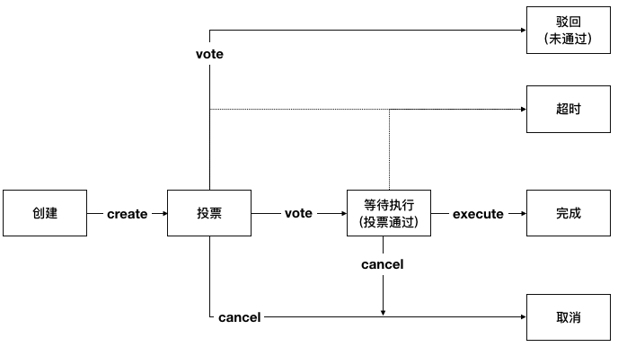

.. _chain-role-manage:

链级角色管理
^^^^^^^^^^^^^

链级角色管理用于管理账户在整个链上的角色。

链级配置管理概述
------------------

链级角色管理通过提案完成，提案的状态迁移如下：

|image1|

通过提案管理链级角色的流程如下：（关于提案的总体介绍参考 :ref:`链级权限管理 <chain-auth-manage>`）

1. 由链级管理员发送交易创建提案，提案中包含了链级角色的对应操作；

2. 由其他的链级管理员发送交易对提案进行投票，交易中携带有投票的提案编号和是否赞同提案中携带的内容；

3. 当提案投票通过后，由提案创建者发送交易执行提案，交易中携带由执行的提案编号。

链级角色管理的操作分为以下几种：

1. CreateRole，创建角色。其中 `admin、contractManager、nodeOfVP` 为内置角色，合约初始化时默认创建。其中 `admin` 为链级管理员， `contractManager` 为合约管理员， `nodeOfVP` 代表VP节点；

2. DeleteRole，删除角色。其中 `admin、contractManager、nodeOfVP` 角色不能被删除；

3. Grant，授予账户某角色；

4. Revoke，回收账户的某角色。

在内置的提案合约初始化时（第一次发交易执行提案操作时），会将带有余额的账户(链启动时，如果没有使用genesis账户向其他账户转账，则是genesis账户，初始化完成后，只能通过提案管理链级角色，为其他账户授权或回收角色，其他账户有了余额也不会再被初始化为具有角色的账户)初始化为链级管理员和合约管理员。

litesdk接口说明
>>>>>>>>>>>>>>>>>>>>>>>>>>

链级角色管理接口
::::::::::::::::::::::::::::

litesdk提供了 `ProposalBuilder` 构造器用于构造提案的操作，在 `ProposalBuilder` 中提供了 `createForPermission` 、 `vote` 、 `cancel` 和 `execute` 方法分别用于创建权限类(即链级角色管理)提案、提案投票、取消提案和执行提案的提案操作，其定义如下::

    public static class ProposalBuilder extends BuiltinOperationBuilder {
        
        /**
         * create creat ProposalOperation for permission to create permission proposal.
         *
         * @param opts permission operations
         * @return {@link ProposalBuilder}
         */
        public ProposalBuilder createForPermission(PermissionOperation... opts);

        /**
         * create vote ProposalOperation to vote proposal.
         *
         * @param proposalID proposal id
         * @param vote       vote value, true means agree; false means refuse
         * @return {@link ProposalBuilder}
         */
        public ProposalBuilder vote(int proposalID, boolean vote);

        /**
         * create cancel ProposalOperation to cancel proposal.
         *
         * @param proposalID proposal id
         * @return {@link ProposalBuilder}
         */
        public ProposalBuilder cancel(int proposalID);

        /**
         * create execute ProposalOperation to cancel proposal.
         *
         * @param proposalID proposal id
         * @return {@link ProposalBuilder}
         */
        public ProposalBuilder execute(int proposalID);
    }

在创建权限类提案时，根据提案内容中需要对链级角色管理的操作，接收对应的权限类操作即可。litesdk为权限类操作 `PermissionOperation` 提供了构造器 `PermissionBuilder` ，构造器中提供了 `createRole` 、 `deleteRole` 、 `grant` 、 `revoke` 以及 `build` 方法，其定义如下::

    public static class PermissionBuilder {

        /**
         * create PermissionBuilder to create role.
         *
         * @param role role name
         * @return {@link PermissionBuilder}
         */
        public PermissionBuilder createRole(String role);
  
        /**
         * create PermissionBuilder to delete role.
         *
         * @param role role name
         * @return {@link PermissionBuilder}
         */
        public PermissionBuilder deleteRole(String role);
  
        /**
         * create PermissionBuilder to grant role to address.
         *
         * @param role    role name
         * @param address account address
         * @return {@link PermissionBuilder}
         */
        public PermissionBuilder grant(String role, String address);
  
        /**
         * create PermissionBuilder to revoke role from address.
         *
         * @param role    role name
         * @param address account address
         * @return {@link PermissionBuilder}
         */
        public PermissionBuilder revoke(String role, String address);
  
        /**
         * return build PermissionOperation.
         *
         * @return {@link PermissionOperation}
         */
        public PermissionOperation build();
    }

链级角色管理的操作构造好后，用ProposalBuild构造器构造提案相关的操作，创建好之后，使用 `BVMBuilder` 提供的 `invoke` 方法构造bvm的交易体，使用 `build` 方法构造出交易 `transaction` ，并为交易设置 `txVersion` 并使用 `sign` 方法签名，得到最终可以发送执行的交易体。

链级角色查询接口
:::::::::::::::::::::::::::::::

litesdk的configService中还提供了查询链级角色是否存在的接口 `isRileExist` 和查询所有链级角色的接口 `getAllRoles` ，另外AccountService中还提供了查询账户链级角色的接口 `getRoles` 和根据链级角色查询账户的接口 `getAccountsByRole` 。

1. 查询链级角色是否存在

参数：

- role 要查询的角色名称；

- nodeIds 请求向哪些节点发送。

::

    Request<RoleExistResponse> isRoleExist(String role, int... nodeIds);

拿到 `RoleExistResponse` 后，通过 `isRoleExist` 方法拿到角色是否存在的结果。 `isRoleExist` 方法返回的是一个布尔值， `true` 表示存在， `false`  表示不存在。

2. 查询所有链级角色

参数：

- nodeIds 请求向哪些节点发送。

::

    Request<AllRolesResponse> getAllRoles(int... nodeIds);

拿到 `AllRolesResponse` 后，通过 `getAllRoles` 方法拿到所有的角色信息。 `getAllRoles` 方法返回的是key为角色名称，value为角色权重的map。

3. 查询账户链级角色

参数：

- address 要查询的账户地址；

- nodeIds 请求向哪些节点发送。

::

    Request<RolesResponse> getRoles(String address, int... nodeIds);

拿到 `RolesResponse` 后，通过 `getRoles` 方法拿到所有的角色信息。 `getRoles` 方法返回的是账户的角色列表。

4. 根据链级角色查询账户

参数：

- role 要查询的链级角色；

- nodeIds 请求向哪些节点发送。

::

    Request<AccountsByRoleResponse> getAccountsByRole(String role, int... nodeIds);

拿到 `AccountsByRoleResponse` 后，通过 `getAllRoles` 方法拿到所有的角色信息。 `getAccounts` 方法返回的是账户列表。

litesdk使用示例
>>>>>>>>>>>>>>>>>>>>

具有链级管理员的账户，使用litesdk创建角色accountManager ，为账户A授权角色accountManager和admin角色，回收账户A的accountManager角色，删除accountManager角色，其代码如下::

    public void testPermissionOperation() throws RequestException {
        String accountA = "37a1100567bf7e0de2f5a0dc1917f0552aa43d88";
        // new proposal create operation for config
        BuiltinOperation opt = new ProposalOperation.ProposalBuilder().createForPermission(
                // new permission operation
                new PermissionOperation.PermissionBuilder().createRole("accountManager").build(),
                new PermissionOperation.PermissionBuilder().grant("accountManager", accountA).build(),
                new PermissionOperation.PermissionBuilder().grant("admin", accountA).build(),
                new PermissionOperation.PermissionBuilder().revoke("accountManager", accountA).build(),
                new PermissionOperation.PermissionBuilder().deleteRole("accountManager").build()
        ).build();
        // send transaction to create proposal
        invokeBVMContract(opt, accountService.fromAccountJson(accountJsons[0]));

        // get proposal
        Request<ProposalResponse> proposal = configService.getProposal();
        ProposalResponse proposalResponse = proposal.send();
        ProposalResponse.Proposal prop = proposalResponse.getProposal();

        // vote
        for (int i = 1; i < 6; i++) {
            invokeBVMContract(new ProposalOperation.ProposalBuilder().vote(prop.getId(), true).build(), accountService.fromAccountJson(accountJsons[i]));
        }

        // execute
        Result result = invokeBVMContract(new ProposalOperation.ProposalBuilder().execute(prop.getId()).build(), accountService.fromAccountJson(accountJsons[0]));
        Assert.assertEquals("", result.getErr());

        System.out.println(result.getRet());
        List<OperationResult> resultList = Decoder.decodeBVMResult(result.getRet());
        for (OperationResult or : resultList) {
            Assert.assertEquals(SuccessCode.getCode(), or.getCode());
            Assert.assertEquals(SuccessCode.getCode(), or.getCode());
        }
    }

    public Result invokeBVMContract(BuiltinOperation opt, Account acc) throws RequestException {
            Transaction transaction = new Transaction.
                    BVMBuilder(acc.getAddress()).
                    invoke(opt).
                    build();
            transaction.sign(acc);

            ReceiptResponse receiptResponse = contractService.invoke(transaction).send().polling();
            Result result = Decoder.decodeBVM(receiptResponse.getRet());
            System.out.println(result);
            return result;
    }

使用litesdk查询链级角色，其代码如下::

    public void testGetRoles() throws RequestException {
        String accountAddress = "000f1a7a08ccc48e5d30f80850cf1cf283aa3abd";
        Request<RolesResponse> balance = accountService.getRoles(accountAddress);
        RolesResponse send = balance.send();
        System.out.println(send.getRoles());
    }

    public void testGetAccountsByRole() throws RequestException {
        String role = "admin";
        Request<AccountsByRoleResponse> balance = accountService.getAccountsByRole(role);
        AccountsByRoleResponse send = balance.send();
        System.out.println(send.getAccounts());
    }

    public void testGetAllRoles() throws RequestException {
    Request<AllRolesResponse> request = configService.getAllRoles();
    AllRolesResponse response = request.send();
    System.out.println(response.getAllRoles());
    }

    public void testIsRoleExist() throws RequestException {
        Request<RoleExistResponse> request = configService.isRoleExist("admin");
        RoleExistResponse response = request.send();
        System.out.println(response.isRoleExist());
    }

