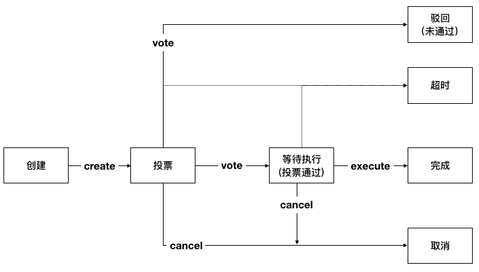

.. _chain-conf-manage:

链级配置管理
^^^^^^^^^^^^^

链级配置管理用于同步变更链级的配置。

链级配置管理概述
------------------

链级配置的修改通过提案修改，提案的状态迁移如下：

|image1|

通过提案修改链级配置的流程如下：（关于链级管理员的相关使用说明参考 :ref:`链级角色管理 <chain-role-manage>`。

关于提案的总体介绍参考 :ref:`链级权限管理 <chain-auth-manage>`）。

1. 由链级管理员发送交易创建提案，提案中包含了要修改的链级配置项及对应的值；

2. 由其他的链级管理员发送交易对提案进行投票，交易中携带有投票的提案编号和是否赞同提案中携带的内容；

3. 当提案投票通过后，由提案创建者发送交易执行提案，交易中携带由执行的提案编号。

可通过提案修改的链级配置项如下：

1. 设置proposal.timeout的值，即提案超时时间（默认超时时间为5分钟，即最短超时时间，当设置当超时时间小于最短超时时间时，会设置为最短超时时间）；

2. 设置proposal.threshold的值，即提案的投票阈值（默认值为链级管理员总个数，另外阈值的范围为1-链级管理员总数，不能小于1，不能大于链级管理员总数）；

3. 设置proposal.contract.vote.enable的值，即是否开启通过投票管理合约生命周期，默认关闭；

4. 设置proposal.contract.vote.threshold的值，即合约生命周期管理提案的投票阈值（默认值为合约管理员总个数，另外阈值的范围为1-合约管理员总数，不能小于1，不能大于合约管理员总数）；

5. 设置filter.enable的值，即是否开启交易拦截过滤器；

6. 设置filter.rules的值，即交易拦截过滤规则。

在内置的提案合约初始化时（第一次发交易执行提案操作时），会将带有余额的账户初始化为链级管理员和合约管理员，并将提案阈值以及合约生命周期管理的投票阈值默认设为对应管理员的总数、提案的超时时间默认设为5分钟（当设置的超时时间小于5分钟时，会设置为5分钟），即创建提案的交易打包时间+5分钟则为提案超时时间。

litesdk接口说明
>>>>>>>>>>>>>>>>>>>>>>>>>>>>>

链级配置管理接口
::::::::::::::::::::::::::::::::

litesdk提供了 `ProposalBuilder` 构造器用于构造提案的操作，在 `ProposalBuilder` 中提供了 `createForConfig` 、 `vote` 、 `cancel` 和 `execute` 方法分别用于创建配置类提案、提案投票、取消提案和执行提案的提案操作，其定义如下::

    public static class ProposalBuilder extends BuiltinOperationBuilder {
        
        /**
         * create creat ProposalOperation for config to create config proposal.
         *
         * @param opts config operations
         * @return {@link ProposalBuilder}
         */
        public ProposalBuilder createForConfig(ConfigOperation... opts);

        /**
         * create vote ProposalOperation to vote proposal.
         *
         * @param proposalID proposal id
         * @param vote       vote value, true means agree; false means refuse
         * @return {@link ProposalBuilder}
         */
        public ProposalBuilder vote(int proposalID, boolean vote);

        /**
         * create cancel ProposalOperation to cancel proposal.
         *
         * @param proposalID proposal id
         * @return {@link ProposalBuilder}
         */
        public ProposalBuilder cancel(int proposalID);

        /**
         * create execute ProposalOperation to cancel proposal.
         *
         * @param proposalID proposal id
         * @return {@link ProposalBuilder}
         */
        public ProposalBuilder execute(int proposalID);

    }

在创建配置类提案操作时，根据提案内容中需要修改的配置项不同，接收的配置类操作不同。litesdk为配置类操作 `ConfigOperation` 提供了构造器 `ConfigBuilder` ，里面提供了 `setFilterEnable` 、 `setFilterRules` 、 `setProposalTimeout` 、 `setProposalThreshold` 、 `setContractVoteEnable` 、 `setContractVoteThreshold` 以及 `build` 方法，其定义如下::

    public static class ConfigBuilder {
  
        /**
         * create ConfigBuilder to set filter.enable.
         *
         * @param enable the enable value
         * @return {@link ConfigOperation}
         */
        public ConfigBuilder setFilterEnable(boolean enable);
  
        /**
         * create ConfigBuilder to set filter.rules.
         *
         * @param rules namespace filter rules
         * @return {@link ConfigOperation}
         */
        public ConfigBuilder setFilterRules(List<NsFilterRule> rules);
  
        /**
         * create ConfigBuilder to set proposal.timeout.
         *
         * @param timeout the value of proposal.timeout
         * @return {@link ConfigOperation}
         */
        public ConfigBuilder setProposalTimeout(Duration timeout);
  
        /**
         * create ConfigBuilder to set proposal.threshold.
         *
         * @param threshold the value of proposal.threshold
         * @return {@link ConfigOperation}
         */
        public ConfigBuilder setProposalThreshold(int threshold);
  
        /**
         * create ConfigBuilder to set proposal.contract.vote.enable.
         *
         * @param enable the value of proposal.contract.vote.enable
         * @return {@link ConfigOperation}
         */
        public ConfigBuilder setContractVoteEnable(boolean enable);
  
        /**
         * create ConfigBuilder to set proposal.contract.vote.threshold.
         *
         * @param threshold the value of proposal.contract.vote.threshold
         * @return {@link ConfigOperation}
         */
        public ConfigBuilder setContractVoteThreshold(int threshold);
  
        /**
         * return build ConfigOperation.
         *
         * @return {@link ConfigOperation}
         */
        public ConfigOperation build();
    }

链级配置管理的操作构造好后，用ProposalBuild构造器构造提案相关的操作，创建好之后，使用 `BVMBuilder` 提供的 `invoke` 方法构造bvm的交易体，使用 `build` 方法构造出交易 `transaction` ，并为交易设置 `txVersion` 并使用 `sign` 方法签名，得到最终可以发送执行的交易体。

链级配置查询接口
::::::::::::::::::::::::::::

另外，litesdk在ConfigService中还提供了查询当前链的配置的接口，其说明如下：

参数：

- nodeIds 请求向哪些节点发送

::

    Request<ConfigResponse> getConfig(int... nodeIds);

拿到 `ConfigResponse` 后，通过 `getConfig` 方法拿到配置信息，配置信息是 `toml` 格式的字符串。

javasdk使用示例
>>>>>>>>>>>>>>>>>>>>>>>

通过提案修改配置filter.enable的值为false，修改filter.rules的值，修改proposal.threshold的值为4，修改proposal.timeout的值为8min，修改proposal.contract.vote.enable的值为true，proposal.contract.vote.threshold的值为3，其代码如下::

    public void testConfigOperation() throws RequestException {
        ArrayList<NsFilterRule> rules = new ArrayList<>();
        rules.add(new NsFilterRule());
        // new proposal create operation for config
        BuiltinOperation opt = new ProposalOperation.ProposalBuilder().createForConfig(
                // new config operation
                new ConfigOperation.ConfigBuilder().setFilterEnable(false).build(),
                new ConfigOperation.ConfigBuilder().setFilterRules(rules).build(),
                new ConfigOperation.ConfigBuilder().setProposalThreshold(4).build(),
                new ConfigOperation.ConfigBuilder().setProposalTimeout(Duration.ofMinutes(8).abs()).build(),
                new ConfigOperation.ConfigBuilder().setContractVoteThreshold(3).build(),
                new ConfigOperation.ConfigBuilder().setContractVoteEnable(true).build(),
                new ConfigOperation.ConfigBuilder().setProposalTimeout(Duration.ofMinutes(8).abs()).build(),
                new ConfigOperation.ConfigBuilder().setContractVoteThreshold(3).build(),
                new ConfigOperation.ConfigBuilder().setContractVoteEnable(true).build()
        ).build();
        // send transaction to create proposal
        invokeBVMContract(opt, accountService.fromAccountJson(accountJsons[0]))
        
        // get proposal
        Request<ProposalResponse> proposal = configService.getProposal();
        ProposalResponse proposalResponse = proposal.send();
        ProposalResponse.Proposal prop = proposalResponse.getProposal();

        // vote
        for (int i = 1; i < 6; i++) {
            invokeBVMContract(new ProposalOperation.ProposalBuilder().vote(prop.getId(), true).build(), accountService.fromAccountJson(accountJsons[i]));
        }

        // execute
        Result result = invokeBVMContract(new ProposalOperation.ProposalBuilder().execute(prop.getId()).build(), accountService.fromAccountJson(accountJsons[0]));
        Assert.assertEquals("", result.getErr());

        System.out.println(result.getRet());
        List<OperationResult> resultList = Decoder.decodeBVMResult(result.getRet());
        for (OperationResult or : resultList) {
            Assert.assertEquals(SuccessCode.getCode(), or.getCode());
            Assert.assertEquals(SuccessCode.getCode(), or.getCode());
        }
    }

    public Result invokeBVMContract(BuiltinOperation opt, Account acc) throws RequestException {
        Transaction transaction = new Transaction.
                BVMBuilder(acc.getAddress()).
                invoke(opt).
                build();
        transaction.sign(acc);

        ReceiptResponse receiptResponse = contractService.invoke(transaction).send().polling();
        Result result = Decoder.decodeBVM(receiptResponse.getRet());
        System.out.println(result);
        return result;
    }

通过javasdk查询配置，其代码如下::

    public void testGetConfig() throws RequestException {
        Request<ConfigResponse> request = configService.getConfig();
        ConfigResponse response = request.send();
        System.out.println(response.getConfig());
    }

