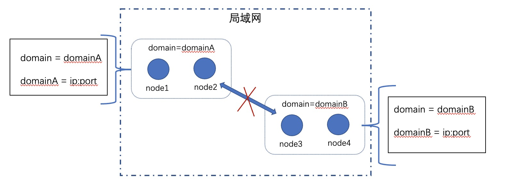
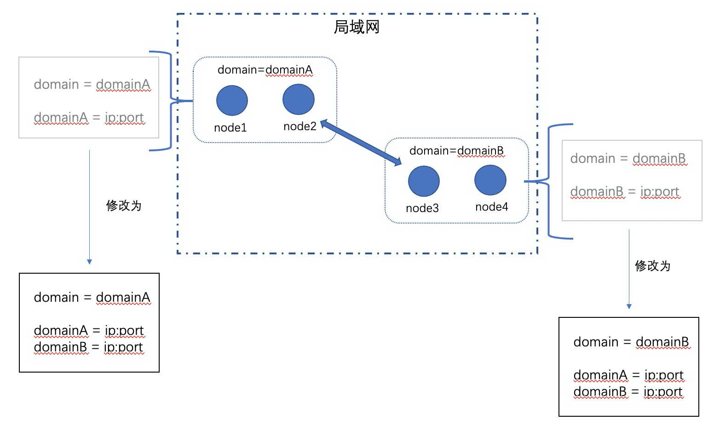
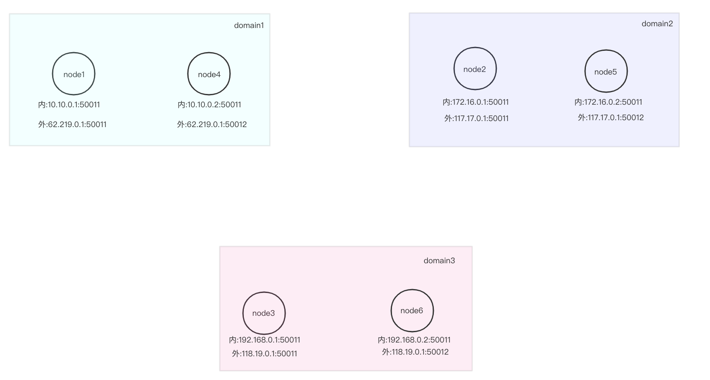
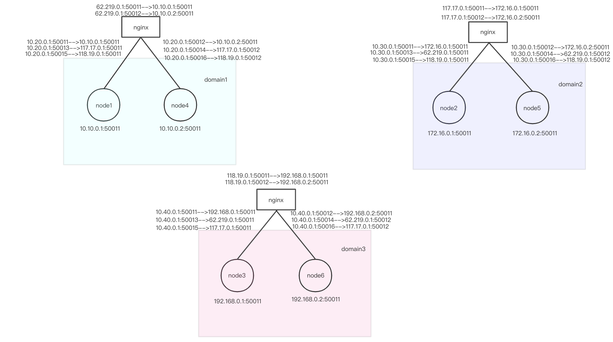
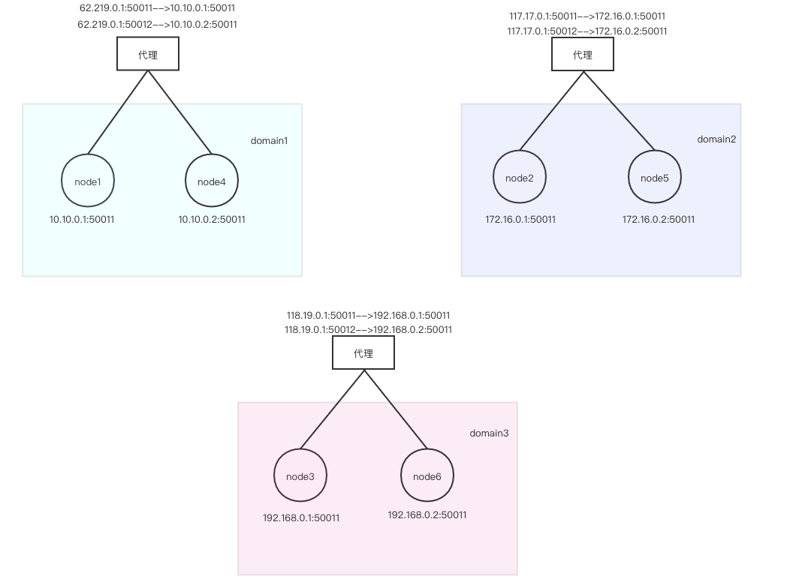
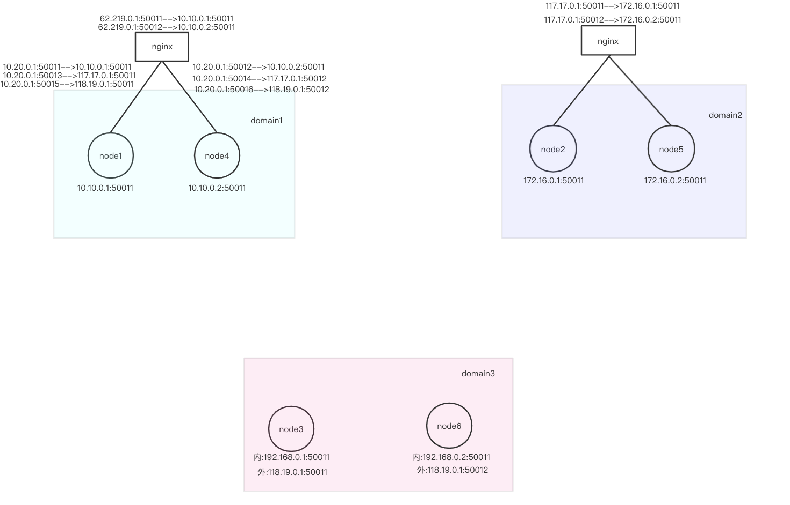

.. _Cross-domain-network-User-Manual:

跨域网络使用手册
^^^^^^^^^^^^^^^^^^

1. 引言
============

1.1 编写目的
--------------

此文档描述Hyperchain网络里的跨域和节点发现相关概念、介绍网络地址配置项含义，使软件开发人员能清楚地了解Hyperchain的网络配置，便于Hyperchain的组网部署。

1.2 相关配置
--------------

网络地址相关的配置有两个地方，分别位于系统级别 `configuration/dynamic.toml` 配置文件和分区级别 `configuration/<分区名>/ns_dynamic.toml` 配置文件里。

1.2.1 dynamic.toml
>>>>>>>>>>>>>>>>>>>>>>

`dynamic.toml` 与网络地址相关的配置如下代码所示，主要用来配置本地节点的域相关信息::

 [p2p]
	[p2p.ip.self]
        # domain 用于指定本地节点目前处在的网络域名称，比如本地节点目前
        # 所处的域名称为“domain1”
	    domain = "domain1"

	    # addrs 用于指定本地节点网络可互通的网络域有哪些，并且指定了这些域
        # 下的节点应该使用哪个 IP 地址来连自己（即本地节点），这个 IP 地址可能为本地
        # 节点的 IP 地址，也可能是代理设备的地址
	    addrs = [
	     "domain1 192.168.10.1:50011",
	     "domain2 118.19.0.1:50011",
	     "domain3 35.10.208.183:50011",
	    ]

1.2.2 ns_dynamic.toml
>>>>>>>>>>>>>>>>>>>>>>>>>>>

`ns_dynamic.toml` 与网络地址相关的配置如下代码所示，主要用来配置本地节点在该分区下的要去连接的对端节点地址信息::

 [p2p]
    [p2p.ip.remote]
        # hosts 用于指定本地节点启动后要向哪些节点发起连接，并且指定了通往
        # 这些节点的可连通地址，这个地址可能是对端节点的 IP 地址，也可能是
        # 代理转发设备的地址。
        # 如果该列表里指定了本地节点自己的hostname和地址，则自动忽略该项。
        hosts = [
            "node1 127.0.0.1:50011",
            "node2 127.0.0.1:50012",
            "node3 127.0.0.1:50013",
            "node4 127.0.0.1:50014",
        ]

当本地节点向 `[p2p.ip.remote.hosts]` 里配置的对端节点发起连接后，对端节点会把本地节点 `dynamic.toml` 里的域列表信息广播给网络里的其他节点，如果其他节点与本地节点还没建立起连接，则从收到的域列表里挑选名称与自己所在域一样的网络域下对应的地址，自动发起网络连接。

2. 功能说明
==============

在跨域网络里，存在网络域和网络域地址列表两个配置项，分别用于配置本地节点目前处在的网络域名称和本地节点在不同网络域下可被访问的 IP 地址和端口号，也可以理解为用于指定这些域下的节点应该使用哪个 IP 地址来连本地节点自己。

在 hyperchain v2.0.8 以及之后的版本，系统集成了节点发现功能，默认开启。 **节点发现使得新加入的节点在启动之前，网络地址配置得到极大简化，并且对于仅仅开放了单向网络通道的两个节点，不管该单向网络通道是 新节点->老节点 还是 新节点 <- 老节点，都只需要做好新节点网络地址的配置就行，而不需要对老节点的网络配置进行人工修改** 。

下面将分别介绍 **跨域通信** 和 **节点发现** 功能。

2.1 跨域通信
---------------

网络域，与局域网的概念类似，在同一个网络域下的节点可以互相连通，不在同一个网络域名下的节点无法互通。网络域与计算机网络里的局域网差别在于，这里的网络域，指的是逻辑上的网络域，即虽然节点在同一个局域网内且IP互通，但是可以被划分为逻辑上不同的网络域。

在 **hyperchain v2.0.8 之前版本** 的设计里，节点间在建立连接的时候，虽然IP是可通的，但是因为逻辑上处在不同的网络域，如果网络域地址列表里面不包含 **彼此** 的网络域，则不能成功建立连接，连接会被拒绝掉。网络拓扑示意图如下所示，网络域 domainA 内的节点和网络域 domainB 内的节点的网络域地址列表里都只有一个网络域，因此 node1、node2、node3、node4 均不是跨域节点，domainA 下的节点无法与 domainB 下的节点建立物理连接：（通过在建立物理连接的过程中，去检查彼此的网络域地址列表来决定是否拒绝连接）

|image0|

然而，通过修改网络域地址列表，让处在不同网络域下的节点的网络域地址列表里都配有可跨的网络域，这两个网络域的节点才能成功建立起连接，此时，node1、node2、node3、node4 均称为 **跨域节点** ，如下图所示：

|image1|

在 **hyperchain v2.0.8  及之后的版本** 里，在上述设计的基础上，针对新增节点并且新增网络域的场景做了优化，允许老节点的网络域地址列表里没有新域的情况下，在新节点网络配置正确的前提下，新节点依旧可以与老节点建立起网络连接，同时老节点会动态新增网络域，在自己的网络域地址列表里回写新节点所在的域。也就是说，  网络连接是否能建立起来，完全取决于 `[p2p.ip.remote.hosts]` ， **只要** `[p2p.ip.remote.hosts]` **配了对端节点的可连通地址，不管网络域地址列表配置如何、是否配全，都可以建立起网络连接，但是不同情况下节点可能有不一样的行为表现** 。为了便于读者理解，下面使用一个具体例子来说明：假设两个跨域节点分别为 node1 和 node2，node1 在 domainA 下，node2 在 domainB 下，且 node1 确实有 domainB 下所能连得通的 IP，node2 也是拥有 domainA 下所能连得通的 IP：

- **场景一：** node1 的网络域地址列表配置了 domainB 下的 IP，node2 的网络域地址列表没有配置 domainA 下的 IP。

如果此时 node1 主动连接 node2，这种情况下只要拨号地址的物理网络本身是可到达的，则可以成功建立连接，并且 node2 的网络域地址列表会自动回写 domainA 。

如果此时 node2 主动连接 node1，这种情况下只要拨号地址的物理网络本身是可到达的，则可以成功建立连接，但是 node2 日志会定时打印找不到 domainA 下的 IP 的警告提示，这条警告信息并不会影响节点的正常运行，若要消除警告日志，需要运维人员手动使用 node2 的 IPC 命令线上增加 domainA 网络域以消除警告日志。

- **场景二：** node1 的网络域地址列表没有配置 domainB 下的 IP，node2 的网络域地址列表配置了 domainA 下的 IP。

情况和上述一样，node1 会发生和上述描述的 node2 发生的情况。

- **场景三：** 双方的网络域地址列表都没有配置对方域下的 IP。

如果此时 node1 主动连接 node2 ，这种情况下只要拨号地址的物理网络本身是可到达的，则可以成功建立连接，并且 node2 的网络域地址列表会自动回写 domainA，node1 日志会出现找不到 domainB 下的 IP 提示，这时候需要运维人员手动使用 node1 的 IPC 命令线上增加 domainB 网络域以消除警告日志。

反过来，如果此时 node2 主动连接 node1，这种情况下只要拨号地址的物理网络本身是可到达的，则可以成功建立连接，并且 node1 的网络域地址列表会自动回写 domainB，node2 日志会出现找不到 domainA 下的 IP 提示，这时候需要运维人员手动使用 node2 的 IPC 命令线上增加 domainA 网络域以消除警告日志。

综上所述，总结一下，不同局域网内的节点肯定处在不同的网络域，同时，通过网络域地址列表，可以让处在同一个局域网内的节点处于不同的网络域，这些 **网络域** 都是 **人为划分** 的逻辑上的网络域，由区块链系统部署人员或者运维人员来定义区块链集群的网络域。而一个节点是否为 **跨域节点** ，同样也是 **人为指定** ，由部署人员或运维人员来指定并且设置节点网络域地址列表，网络域地址列表有两个及以上不同 `domain` 下的 `IP` 的节点即为跨域节点。部署人员或运维人员也可以通过IPC命令 **线上增加或修改网络域及其地址** 。

一般来说，一个内网定义为一个网络域，不同内网的节点想要进行通信，则称之为跨域通信。实际生产环境中的网络比前文举的例子要复杂很多，本文第三章将对不同部署场景下的跨域配置进行举例。

2.2 节点发现
-------------

在 **hyperchain v2.0.8** 以及之后的版本，系统集成了节点发现功能，默认开启。节点发现使得节点想要与区块链系统的其他节点组网，其启动前的网络地址配置得到极大简化，并且对于仅仅开放了单向网络通道的两个节点，不管该单向网络通道是 新节点-> 老节点 还是 新节点 <- 老节点，都只需要做好新节点网络地址的配置就行，而不需要对老节点的网络配置进行人工修改。

2.2.2节 和 2.2.3节 分别就不同场景对网络地址配置进行说明。

2.2.1 相关配置
>>>>>>>>>>>>>>>>>>

节点发现是系统自带功能，与其相关的配置有：

`ns_static.toml`文件::

 [p2p]
    [p2p.discover]
        # discoverInterval 为每次发送 discovery reqeust 去获取网络里与
        # 自己domain相通的节点信息的时间间隔，默认为 10m
        discoverInterval = "10m"
		# 为了避免网络消息的冗余，本地节点有一块缓存去记录自己曾经向哪些节点发送过
		# 哪些peer信息，以此来避免重复发送一样的内容。discoverEmptyInterval 即
        # 为清理这块缓存的时间间隔。默认为 12h
        discoverEmptyInterval = "12h"

2.2.2 新节点加入-双向打通
>>>>>>>>>>>>>>>>>>>>>>>>>>

假设现在有一个新节点要加入分区网络，并且这个新节点与对端节点的网络通道已经双向打通，新节点网络地址如何配置呢？

**推荐方法一：**

1. `dynamic.toml` 里的 `[p2p.ip.self.addrs]` 配全当前区块链系统里的 **所有网络域及对应的地址** ，对应的地址指的是该域下面的节点要向本地节点发起连接时应该使用的 IP 和 Port；

2. `ns_dynamic.toml` 里的 `[p2p.ip.remote.hosts]` 配全了本地节点所有要连接的 **所有对端节点及其地址** ，地址指的是本地节点向对端节点发起连接时应该使用的 IP 和 Port；

**推荐方法二（简化）：**

1. `dynamic.toml` 里的 `[p2p.ip.self.addrs]` 只配置了新域及对应的地址，对应的地址指的是该域下面的节点要向本地节点发起连接时应该使用的 IP 和 Port；

2. `ns_dynamic.toml` 里的 `[p2p.ip.remote.hosts]` 配全当前区块链系统里所有对端节点及其地址。

新节点与其他对端节点网络连接建立完成后：1. 由于新节点 `ns_dynamic.toml` `[p2p.ip.remote.hosts]` 配全了所有对端节点及其地址，因此，其他对端节点 `dynamic.toml` 里的 `[p2p.ip.self.addrs]` 将自动动态回写新节点携带过来的新域及对应地址（如果新节点处在一个新域名下的话） 。2. 由于新节点 `dynamic.toml`  `[p2p.ip.self.addrs]` 只配置了新域及对应的地址， 因此，新节点日志文件里将打印缺少其他domain信息的警告，这个提示不会影响节点的正常运行，可以参考IPC使用手册，在新节点上执行新增域信息的命令，来消除这个警告日志。

**推荐方法三（简化）：**

1. `dynamic.toml` 里的 `[p2p.ip.self.addrs]` 配全当前区块链系统里的 **所有网络域及对应的地址** ，对应的地址指的是该域下面的节点要向本地节点发起连接时应该使用的 IP 和 Port；

2. `ns_dynamic.toml` 里的 `[p2p.ip.remote.hosts]` 至少配了一个对端节点及其地址。如果 hosts 里指定的对端节点与区块链系统里的其他对端节点所构成的网络连接拓扑是一个连通图，则通过节点发现，本地节点将与其他所有对端节点自动建立起网络连接。

2.2.3 新节点加入-单向打通
>>>>>>>>>>>>>>>>>>>>>>>>>>>

假设现在有一个新节点要加入分区网络，并且这个新节点打通了到对端节点的单向网络通道（后文简称“正向通道”），而对端节点到新节点的网络通道未打通（后文简称“反向通道”），新节点网络地址如何配置呢？

**推荐方法一：**

1. `dynamic.toml` 里的 `[p2p.ip.self.addrs]` 配置只打通了反向通道和打通了正向通道与反向通道的域的地址信息；

2. `ns_dynamic.toml` 里的 `[p2p.ip.remote.hosts]` 配置只打通了正向通道但是未打通反向通道的节点地址信息和打通了正向通道与反向通道的节点地址信息，至少配一个对端节点及其地址。

**推荐方法二（简化）：**

1. `dynamic.toml` 里的 `[p2p.ip.self.addrs]` 只配置打通了反向通道的域的地址信息；

2. `ns_dynamic.toml` 里的 `[p2p.ip.remote.hosts]`  **必须** 配置只打通正向通道但是未打通反向通道的节点地址信息，至少配一个对端节点及其地址。

3. 配置举例
==============

本节根据不同部署场景提供具体配置示例供部署人员参考，部署场景包括：

- **内外网** ：无Nginx、无代理设备，同一个内网里的节点通过内网 IP 地址通信，与外网的节点通过公网 IP 地址通信。

- **全Nginx代理** ：同一个内网里的节点通过内网 IP 地址通信（或 nginx 代理内网 IP 通信）；与外网的节点通过 nginx 代理公网 IP 通信，即节点不管是访问外网的节点还是被外网节点访问，都需要通过 nginx 进行代理。

- **全Nginx反向代理** ：同一个内网里的节点通过内网 IP 地址通信；通过公网 IP 地址访问外网的节点，外网的节点通过 nginx 代理访问本地节点，即节点通过公网 IP 地址访问外网的节点，但是被外网节点访问，则需要通过 nginx 进行代理；

- **混合型代理** ：前面三种的混合存在。

同时，本节将对上述任一部署场景下的全量配置和简化配置都进行配置说明。

- 全量配置：指的是节点的 `[p2p.ip.remote.hosts]` 配置里配了所有直连节点的网络地址。

- 简化配置：指的是节点的 `[p2p.ip.remote.hosts]` 配置里只配了部分直连节点的网络地址，通过节点发现来与其他直连节点建立起网络连接。

3.1 内外网
-----------

无Nginx、无代理设备，同一个内网里的节点通过内网 IP 地址通信，与外网的节点通过公网 IP 地址通信。

3.1.1 全量配置
>>>>>>>>>>>>>>>>>>>

|image2|

domain1 是 机构A 所在的网络域，domain2 是 机构B 所在的网络域，domain3 是 机构C 所在的网络域。每个节点都拥有一个内网地址和一个外网地址，中间没有架设任何的代理服务器。因此，内网节点可以使用内网 IP 访问内网里的节点，使用公网 IP 访问外网节点。

在上面的例子中，各个节点的网络配置理应如下：

node1::

 # dynamic.toml
 self = "node1"

 [p2p]
    [p2p.ip.self]
      addrs = [ "domain1 10.10.0.1:50011",
				"domain2 62.219.0.1:50011",
				"domain3 62.219.0.1:50011" ]
      domain = "domain1"

 # ns_dynamic.toml
 [p2p]
    [p2p.ip.remote]
      hosts = [ "node2 117.17.0.1:50011",
				"node3 118.19.0.1:50011",
				"node4 10.10.0.2:50011",
				"node5 117.17.0.1:50012",
				"node6 118.19.0.1:50012", ]

 node2:

 # dynamic.toml
 self = "node2"

 [p2p]
    [p2p.ip.self]
      addrs = [ "domain1 117.17.0.1:50011",
				"domain2 172.16.0.1:50011",
				"domain3 117.17.0.1:50011" ]
      domain = "domain2"

 # ns_dynamic.toml
 [p2p]
    [p2p.ip.remote]
      hosts = [ "node1 62.219.0.1:50011",
				"node3 118.19.0.1:50011",
				"node4 62.219.0.1:50012",
				"node5 172.16.0.2:50011",
				"node6 118.19.0.1:50012" ]

node3::

 # dynamic.toml
 self = "node3"

 [p2p]
    [p2p.ip.self]
      addrs = [ "domain1 118.19.0.1:50011",
				"domain2 118.19.0.1:50011",
				"domain3 192.168.0.1:50011" ]
      domain = "domain3"

 # ns_dynamic.toml
 [p2p]
    [p2p.ip.remote]
      hosts = [ "node1 62.219.0.1:50011",
				"node2 117.17.0.1:50011",
				"node4 62.219.0.1:50012",
				"node5 117.17.0.1:50012",
				"node6 192.168.0.2:50011" ]

node4::

 # dynamic.toml
 self = "node4"

 [p2p]
    [p2p.ip.self]
      addrs = [ "domain1 10.10.0.2:50011",
				"domain2 62.219.0.1:50012",
				"domain3 62.219.0.1:50012" ]
      domain = "domain1"

 # ns_dynamic.toml
 [p2p]
    [p2p.ip.remote]
      hosts = [ "node1 10.10.0.1:50011",
				"node2 117.17.0.1:50011",
				"node3 118.19.0.1:50011",
				"node5 117.17.0.1:50012",
				"node6 118.19.0.1:50012" ]

node5::

 # dynamic.toml
 self = "node5"

 [p2p]
    [p2p.ip.self]
      addrs = [ "domain1 117.17.0.1:50012",
				"domain2 172.16.0.2:50011",
				"domain3 117.17.0.1:50012" ]
      domain = "domain2"

 # ns_dynamic.toml
 [p2p]
    [p2p.ip.remote]
      hosts = [ "node1 62.219.0.1:50011",
				"node2 172.16.0.1:50011",
				"node3 118.19.0.1:50011",
				"node4 62.219.0.1:50012",
				"node6 118.19.0.1:50012" ]

 node6:

 # dynamic.toml
 self = "node6"

 [p2p]
    [p2p.ip.self]
      addrs = [ "domain1 118.19.0.1:50012",
				"domain2 118.19.0.1:50012",
				"domain3 192.168.0.2:50011" ]
      domain = "domain3"

 # ns_dynamic.toml
 [p2p]
    [p2p.ip.remote]
      hosts = [ "node1 62.219.0.1:50011",
				"node2 117.17.0.1:50011",
				"node3 192.168.0.1:50011",
				"node4 62.219.0.1:50012",
				"node5 117.17.0.1:50012" ]

3.1.2 简化配置
>>>>>>>>>>>>>>>

（ **注：虽不用配置全部hosts，但配置也需保证整个网络拓扑图为连通图，即不存在网络分区的现象** ）。

|image3|

使用与 **3.1.1 全量配置** 一样的例子，网络配置不需要配全量直连节点的地址，即 node1 和 node3 虽然都没有配置彼此的IP，但他们最终可以通过其他节点互相发现对方。各个节点的网络配置详见下文。

当然，网络配置也可以更加简化，只要保证两个节点之间有共同连接的节点，那么他们就不用配彼此的IP，可以通过这个共同节点发现对方，这样便可以简化对于 `hosts` 的配置。

node1::

 # dynamic.toml
 self = "node1"

 [p2p]
    [p2p.ip.self]
      addrs = [ "domain1 10.10.0.1:50011",
				"domain2 62.219.0.1:50011",
				"domain3 62.219.0.1:50011" ]
      domain = "domain1"

 # ns_dynamic.toml
 [p2p]
    [p2p.ip.remote]
      hosts = [ "node2 117.17.0.1:50011",
				"node4 10.10.0.2:50011",
				"node6 118.19.0.1:50012", ]

node2::

 # dynamic.toml
 self = "node2"

 [p2p]
    [p2p.ip.self]
      addrs = [ "domain1 117.17.0.1:50011",
				"domain2 172.16.0.1:50011",
				"domain3 117.17.0.1:50011" ]
      domain = "domain2"

 # ns_dynamic.toml
 [p2p]
    [p2p.ip.remote]
      hosts = [ "node1 62.219.0.1:50011",
				"node4 62.219.0.1:50012",
				"node5 172.16.0.2:50011",
				"node6 118.19.0.1:50012" ]

node3::

 # dynamic.toml
 self = "node3"

 [p2p]
    [p2p.ip.self]
      addrs = [ "domain1 118.19.0.1:50011",
				"domain2 118.19.0.1:50011",
				"domain3 192.168.0.1:50011" ]
      domain = "domain3"

 # ns_dynamic.toml
 [p2p]
    [p2p.ip.remote]
      hosts = [ "node2 117.17.0.1:50011",
				"node4 62.219.0.1:50012",
				"node5 117.17.0.1:50012",
				"node6 192.168.0.2:50011" ]

node4::

 # dynamic.toml
 self = "node4"

 [p2p]
    [p2p.ip.self]
      addrs = [ "domain1 10.10.0.2:50011",
				"domain2 62.219.0.1:50012",
				"domain3 62.219.0.1:50012" ]
      domain = "domain1"

 # ns_dynamic.toml
 [p2p]
    [p2p.ip.remote]
      hosts = [ "node1 10.10.0.1:50011",
				"node2 117.17.0.1:50011",
				"node3 118.19.0.1:50011",
				"node6 118.19.0.1:50012" ]

node5::

 # dynamic.toml
 self = "node5"

 [p2p]
    [p2p.ip.self]
      addrs = [ "domain1 117.17.0.1:50012",
				"domain2 172.16.0.2:50011",
				"domain3 117.17.0.1:50012" ]
      domain = "domain2"

 # ns_dynamic.toml
 [p2p]
    [p2p.ip.remote]
      hosts = [ "node2 172.16.0.1:50011",
				"node3 118.19.0.1:50011",
				"node4 62.219.0.1:50012",
				"node6 118.19.0.1:50012" ]

node6::

 # dynamic.toml
 self = "node6"

 [p2p]
    [p2p.ip.self]
      addrs = [ "domain1 118.19.0.1:50012",
				"domain2 118.19.0.1:50012",
				"domain3 192.168.0.2:50011" ]
      domain = "domain3"

 # ns_dynamic.toml
 [p2p]
    [p2p.ip.remote]
      hosts = [ "node1 62.219.0.1:50011",
				"node2 117.17.0.1:50011",
				"node3 192.168.0.1:50011",
				"node4 62.219.0.1:50012",
				"node5 117.17.0.1:50012" ]

3.2 全Nginx代理
-----------------

同一个内网里的节点通过内网 IP 地址通信（或 nginx 代理内网 IP 通信）；与外网的节点通过 nginx 代理公网 IP 通信，即节点不管是访问外网的节点还是被外网节点访问，都需要通过 nginx 进行代理。

3.2.1 全量配置
>>>>>>>>>>>>>>>>>>

|image4|

如上图所示，domain1 是 机构A 所在的网络域，domain2 是 机构B 所在的网络域，domain3 是 机构C 所在的网络域，并且它们都各自架设了一台 nginx 做转发，这样的好处是节点不需要连接外网也可相互通信，机构内的节点都只需根据内网 IP 进行连接即可。说明一下图中 nginx 的映射规则：

 ::

 - 机构A：nginxA：62.219.0.1 (外) --> 10.20.0.1 (内)
 - node1 和 node4 在 nginxA 上的映射分别为：
 - nginxA-->node1: 62.219.0.1:50011 (nginxA外) --> 10.20.0.1:50011 (nginx内) --> 10.10.0.1:50011 (内)
 - nginxA-->node4: 62.219.0.1:50012 (nginxA外) --> 10.20.0.1:50012 (nginx内) --> 10.10.0.2:50011 (内)
 - 而机构A内的节点想要访问机构B中的节点 node2 和 node5，则在机构A中的 nginxA 上对 node2 和 node5 做映射，
 - 即使用 niginxA 映射到 node2 和 node5 所在机构B的 nginxB 的公网IP，使得机构A通过访问nginxA的内网就可以将流量转发到机构B中的节点
 - node2 和 node5 在机构A中架设的 nginxA 上的映射为：
 - nginxA-->node2: 10.20.0.1:50013 (nginxA内) --> 117.17.0.1:50011 (nginxB外)
 - nginxA-->node5: 10.20.0.1:50014 (nginxA内) --> 117.17.0.1:50012 (nginxB外)
 - 同理，node3 和 node6 在机构A中架设的 nginxA 上的映射为：
 - nginxA-->node3: 10.20.0.1:50015 (nginxA内) --> 118.19.0.1:50011 (nginxC外)
 - nginxA-->node6: 10.20.0.1:50016 (nginxA内) --> 118.19.0.1:50012 (nginxC外)

 - 机构B：nginxB: 117.17.0.1 (外) --> 10.30.0.1 (内)
 - node2 和 node5 在 nginxB 的映射分别为：
 - nginxB-->node1: 117.17.0.1:50011 (nginxB外) --> 10.30.0.1:50011 (nginxB内) --> 172.16.0.1:50011 (内)
 - nginxB-->node4: 117.17.0.1:50012 (nginxB外) --> 10.30.0.1:50012 (nginxB内) --> 172.16.0.2:50011 (内)
 - 而机构B内的节点想要访问机构A中的节点 node1 和 node4，则在机构B中的 nginxB 上对 node1 和 node4 做映射，
 - 即使用 niginxB 映射到 node1 和 node4 所在机构A的 nginxA 的公网IP，使得机构B通过访问nginxB的内网就可以将流量转发到机构A中的节点
 - node1 和 node4 在机构B中架设的 nginxB 上的映射为：
 - nginxB-->node1: 10.30.0.1:50013 (nginxB内) --> 62.219.0.1:50011 (nginxA外)
 - nginxB-->node4: 10.30.0.1:50014 (nginxB内) --> 62.219.0.1:50012 (nginxA外)
 - 同理，node3 和 node6 在机构B中架设的 nginxB 上的映射为：
 - nginxB-->node3: 10.30.0.1:50015 (nginxA内) --> 118.19.0.1:50011 (nginxC外)
 - nginxB-->node6: 10.30.0.1:50016 (nginxA内) --> 118.19.0.1:50012 (nginxC外)

 - 机构C：nginxC: 118.19.0.1 (外) --> 10.40.0.1 (内)
 - node3 和 node6 在 nginxC 的映射分别为：
 - nginxC-->node3: 118.19.0.1:50011 (nginxC外) --> 10.40.0.1:50011 (nginxC内) --> 192.168.0.1:50011 (内)
 - nginxC-->node6: 118.19.0.1:50012 (nginxC外) --> 10.40.0.1:50012 (nginxC内) --> 192.168.0.2:50011 (内)
 - node1 和 node4 在 nginxC 上的映射分别为：
 - nginxC-->node1: 10.40.0.1:50013 (nginxC内) --> 62.219.0.1:50011 (nginxA外)
 - nginxC-->node4: 10.40.0.1:50014 (nginxC内) --> 62.219.0.1:50012 (nginxA外)
 - node2 和 node5 在 nginxC 上的映射分别为：
 - nginxC-->node2: 10.40.0.1:50015 (nginxA内) --> 117.17.0.1:50011 (nginxB外)
 - nginxC-->node5: 10.40.0.1:50016 (nginxA内) --> 117.17.0.1:50012 (nginxB外)

在上面的例子中，各个节点的网络配置理应如下:

node1::

 # dynamic.toml
 self = "node1"

 [p2p]
    [p2p.ip.self]
      addrs = [ "domain1 10.10.0.1:50011",
				"domain2 10.30.0.1:50013",
				"domain3 10.40.0.1:50013" ]
      domain = "domain1"

 # ns_dynamic.toml
 [p2p]
    [p2p.ip.remote]
      hosts = [ "node2 10.20.0.1:50013",
				"node3 10.20.0.1:50015"，
				"node4 10.10.0.2:50011",
				"node5 10.20.0.1:50014",
				"node6 10.20.0.1:50016" ]

node2::

 # dynamic.toml
 self = "node2"

 [p2p]
    [p2p.ip.self]
      addrs = [ "domain1 10.20.0.1:50013",
				"domain2 172.16.0.1:50011",
				"domain3 10.40.0.1:50015" ]
      domain = "domain2"

 # ns_dynamic.toml
 [p2p]
    [p2p.ip.remote]
      hosts = [ "node1 10.30.0.1:50013",
				"node3 10.30.0.1:50015"，
				"node4 10.30.0.1:50014",
				"node5 172.16.0.2:50011",
				"node6 10.30.0.1:50016" ]

node3::

 # dynamic.toml
 self = "node3"

 [p2p]
    [p2p.ip.self]
      addrs = [ "domain1 10.20.0.1:50015",
				"domain2 10.30.0.1:50015",
				"domain3 192.168.0.1:50011" ]
      domain = "domain3"

 # ns_dynamic.toml
 [p2p]
    [p2p.ip.remote]
      hosts = [ "node1 10.40.0.1:50013",
				"node2 10.40.0.1:50015",
				"node4 10.40.0.1:50014",
				"node5 10.40.0.1:50016",
				"node6 192.168.0.2:50011" ]

node4::

 # dynamic.toml
 self = "node4"

 [p2p]
    [p2p.ip.self]
      addrs = [ "domain1 10.10.0.2:50011",
				"domain2 10.30.0.1:50014",
				"domain3 10.40.0.1:50014" ]
      domain = "domain1"

 # ns_dynamic.toml
 [p2p]
    [p2p.ip.remote]
      hosts = [ "node1 10.10.0.1:50011",
				"node2 10.20.0.1:50013",
				"node3 10.20.0.1:50015",
				"node5 10.20.0.1:50014",
				"node6 10.20.0.1:50016" ]

node5::

 # dynamic.toml
 self = "node5"

 [p2p]
    [p2p.ip.self]
      addrs = [ "domain1 10.20.0.1:50014",
				"domain2 172.16.0.2:50011",
				"domain3 10.40.0.1:50016" ]
      domain = "domain2"

 # ns_dynamic.toml
 [p2p]
    [p2p.ip.remote]
      hosts = [ "node1 10.30.0.1:50013",
				"node2 172.16.0.1:50011",
				"node3 10.30.0.1:50015",
				"node4 10.30.0.1:50014",
				"node6 10.30.0.1:50016" ]

node6::

 # dynamic.toml
 self = "node6"

 [p2p]
    [p2p.ip.self]
      addrs = [ "domain1 10.20.0.1:50016",
				"domain2 10.30.0.1:50016",
				"domain3 192.168.0.2:50011" ]
      domain = "domain3"

 # ns_dynamic.toml
 [p2p]
    [p2p.ip.remote]
      hosts = [ "node1 10.40.0.1:50013",
				"node2 10.40.0.1:50015",
				"node3 192.168.0.1:50011",
				"node4 10.40.0.1:50014",
				"node5 10.40.0.1:50016", ]

3.2.2 简化配置
>>>>>>>>>>>>>>>>

（ **注：虽不用配置全部hosts，但配置也需保证整个网络topo图为连通图，即不存在网络分区的现象** ）。

|image4|

使用与 **3.2.1 全量配置**  一样的例子，网络配置不需要配全量直连节点的地址，即 node1 和 node3 虽然都没有配置彼此的IP，但他们最终可以通过其他节点互相发现对方，各个节点的网络配置详见下文。

当然， 网络配置也可以更加简化，只要保证两个节点之间有共同连接的节点，那么他们就不用配彼此的IP，可以通过这个共同节点发现对方，这样便可以简化对于 `hosts` 的配置。

node1::

 # dynamic.toml
 self = "node1"

 [p2p]
    [p2p.ip.self]
      addrs = [ "domain1 10.10.0.1:50011",
				"domain2 10.30.0.1:50013",
				"domain3 10.40.0.1:50013" ]
      domain = "domain1"

 # ns_dynamic.toml
 [p2p]
    [p2p.ip.remote]
      hosts = [ "node2 10.20.0.1:50013",
				"node4 10.10.0.2:50011",
				"node6 10.20.0.1:50016" ]

node2::

 # dynamic.toml
 self = "node2"

 [p2p]
    [p2p.ip.self]
      addrs = [ "domain1 10.20.0.1:50013",
				"domain2 172.16.0.1:50011",
				"domain3 10.40.0.1:50015" ]
      domain = "domain2"

 # ns_dynamic.toml
 [p2p]
    [p2p.ip.remote]
      hosts = [ "node1 10.30.0.1:50013",
				"node3 10.30.0.1:50015",
				"node5 172.16.0.2:50011" ]

node3::

 # dynamic.toml
 self = "node3"

 [p2p]
    [p2p.ip.self]
      addrs = [ "domain1 10.20.0.1:50015",
				"domain2 10.30.0.1:50015",
				"domain3 192.168.0.1:50011" ]
      domain = "domain3"

 # ns_dynamic.toml
 [p2p]
    [p2p.ip.remote]
      hosts = [ "node2 10.40.0.1:50015",
				"node4 10.40.0.1:50014",
				"node5 10.40.0.1:50016",
				"node6 192.168.0.2:50011" ]

node4::

 # dynamic.toml
 self = "node4"

 [p2p]
    [p2p.ip.self]
      addrs = [ "domain1 10.10.0.2:50011",
				"domain2 10.30.0.1:50014",
				"domain3 10.40.0.1:50014" ]
      domain = "domain1"

 # ns_dynamic.toml
 [p2p]
    [p2p.ip.remote]
      hosts = [ "node1 10.10.0.1:50011",
				"node2 10.20.0.1:50013",
				"node6 10.20.0.1:50016" ]

node5::

 # dynamic.toml
 self = "node5"

 [p2p]
    [p2p.ip.self]
      addrs = [ "domain1 10.20.0.1:50014",
				"domain2 172.16.0.2:50011",
				"domain3 10.40.0.1:50016" ]
      domain = "domain2"

 # ns_dynamic.toml
 [p2p]
    [p2p.ip.remote]
      hosts = [ "node1 10.30.0.1:50013",
				"node2 172.16.0.1:50011",
				"node3 10.30.0.1:50015",
				"node4 10.30.0.1:50014",
				"node6 10.30.0.1:50016" ]

node6::

 # dynamic.toml
 self = "node6"

 [p2p]
    [p2p.ip.self]
      addrs = [ "domain1 10.20.0.1:50016",
				"domain2 10.30.0.1:50016",
				"domain3 192.168.0.2:50011" ]
      domain = "domain3"

 # ns_dynamic.toml
 [p2p]
    [p2p.ip.remote]
      hosts = [ "node1 10.40.0.1:50013",
				"node2 10.40.0.1:50015",
				"node3 192.168.0.1:50011",
				"node4 10.40.0.1:50014",
				"node5 10.40.0.1:50016", ]

3.3 全Nginx反向代理
-----------------------

nginx 反向代理指的是外域节点访问本域节点需要通过本域下的 nginx 做转发，而本域节点想要访问外域节点，可以直接访问外网地址，不需要通过自己域下的 nginx 做转发。这种网络情况比全 nginx 代理要简单的多。

3.3.1 全量配置
>>>>>>>>>>>>>>>>>

|image5|

如上图所示，domain1 是 机构A 所在的网络域，domain2 是 机构B 所在的网络域，domain3 是 机构C 所在的网络域，并且它们都各自架设了一台 nginx 做转发

说明一下图中 nginx 的映射规则::

 - 机构A：62.219.0.1 (外)
 - node1 62.219.0.1:50011 (外) --> 10.10.0.1:50011 (内)
 - node4 62.219.0.1:50012 (外) --> 10.10.0.2:50011 (内)

 - 机构B：117.17.0.1 (外)
 - node2 117.17.0.1:50011 (外) --> 172.16.0.1:50011 (内)
 - node5 117.17.0.1:50012 (外) --> 172.16.0.2:50011 (内)

 - 机构C：118.19.0.1 (外)
 - node3 118.19.0.1:50011 (外) --> 192.168.0.1:50011 (内)
 - node6 118.19.0.1:50012 (外) --> 192.168.0.2:50011 (内)

node1::

 # dynamic.toml
 self = "node1"

 [p2p]
    [p2p.ip.self]
      addrs = [ "domain1 10.10.0.1:50011",
				"domain2 62.219.0.1:50011",
				"domain3 62.219.0.1:50011" ]
      domain = "domain1"

 # ns_dynamic.toml
 [p2p]
    [p2p.ip.remote]
      hosts = [ "node2 117.17.0.1:50011",
				"node3 118.19.0.1:50011",
				"node4 10.10.0.2:50011",
				"node5 117.17.0.1:50012",
				"node6 118.19.0.1:50012", ]

node2::

 # dynamic.toml
 self = "node2"

 [p2p]
    [p2p.ip.self]
      addrs = [ "domain1 117.17.0.1:50011",
				"domain2 172.16.0.1:50011",
				"domain3 117.17.0.1:50011" ]
      domain = "domain2"

 # ns_dynamic.toml
 [p2p]
    [p2p.ip.remote]
      hosts = [ "node1 62.219.0.1:50011",
				"node3 118.19.0.1:50011",
				"node4 62.219.0.1:50012",
				"node5 172.16.0.2:50011",
				"node6 118.19.0.1:50012" ]

node3::

 # dynamic.toml
 self = "node3"

 [p2p]
    [p2p.ip.self]
      addrs = [ "domain1 118.19.0.1:50011",
				"domain2 118.19.0.1:50011",
				"domain3 192.168.0.1:50011" ]
      domain = "domain3"

 # ns_dynamic.toml
 [p2p]
    [p2p.ip.remote]
      hosts = [ "node1 62.219.0.1:50011",
				"node2 117.17.0.1:50011",
				"node4 62.219.0.1:50012",
				"node5 117.17.0.1:50012",
				"node6 192.168.0.2:50011" ]

node4::

 # dynamic.toml
 self = "node4"

 [p2p]
    [p2p.ip.self]
      addrs = [ "domain1 10.10.0.2:50011",
				"domain2 62.219.0.1:50012",
				"domain3 62.219.0.1:50012" ]
      domain = "domain1"

 # ns_dynamic.toml
 [p2p]
    [p2p.ip.remote]
      hosts = [ "node1 10.10.0.1:50011",
				"node2 117.17.0.1:50011",
				"node3 118.19.0.1:50011",
				"node5 117.17.0.1:50012",
				"node6 118.19.0.1:50012" ]

node5::

 # dynamic.toml
 self = "node5"

 [p2p]
    [p2p.ip.self]
      addrs = [ "domain1 117.17.0.1:50012",
				"domain2 172.16.0.2:50011",
				"domain3 117.17.0.1:50012" ]
      domain = "domain2"

 # ns_dynamic.toml
 [p2p]
    [p2p.ip.remote]
      hosts = [ "node1 62.219.0.1:50011",
				"node2 172.16.0.1:50011",
				"node3 118.19.0.1:50011",
				"node4 62.219.0.1:50012",
				"node6 118.19.0.1:50012" ]

node6::

 # dynamic.toml
 self = "node6"

 [p2p]
    [p2p.ip.self]
      addrs = [ "domain1 118.19.0.1:50012",
				"domain2 118.19.0.1:50012",
				"domain3 192.168.0.2:50011" ]
      domain = "domain3"

 # ns_dynamic.toml
 [p2p]
    [p2p.ip.remote]
      hosts = [ "node1 62.219.0.1:50011",
				"node2 117.17.0.1:50011",
				"node3 192.168.0.1:50011",
				"node4 62.219.0.1:50012",
				"node5 117.17.0.1:50012" ]

3.3.2 简化配置
>>>>>>>>>>>>>>>>>>

（ **注：虽不用配置全部hosts，但配置也需保证整个网络topo图为连通图，即不存在网络分区的现象** ）。

|image6|

使用与 **3.3.1 全量配置** 一样的例子，网络配置不需要配全量直连节点的地址，即 node1 和 node3 虽然都没有配置彼此的IP，但他们最终可以通过其他节点互相发现对方，各个节点的网络配置详见下文。

当然， 网络配置也可以更加简化，只要保证两个节点之间有共同连接的节点，那么他们就不用配彼此的IP，可以通过这个共同节点发现对方，这样便可以简化对于 `hosts` 的配置。

node1::

 # dynamic.toml
 self = "node1"

 [p2p]
    [p2p.ip.self]
      addrs = [ "domain1 10.10.0.1:50011",
				"domain2 62.219.0.1:50011",
				"domain3 62.219.0.1:50011" ]
      domain = "domain1"

 # ns_dynamic.toml
 [p2p]
    [p2p.ip.remote]
      hosts = [ "node2 117.17.0.1:50011",
				"node4 10.10.0.2:50011",
				"node5 117.17.0.1:50012",
				"node6 118.19.0.1:50012" ]

node2::

 # dynamic.toml
 self = "node2"

 [p2p]
    [p2p.ip.self]
      addrs = [ "domain1 117.17.0.1:50011",
				"domain2 172.16.0.1:50011",
				"domain3 117.17.0.1:50011" ]
      domain = "domain2"

 # ns_dynamic.toml
 [p2p]
    [p2p.ip.remote]
      hosts = [ "node1 62.219.0.1:50011",
				"node3 118.19.0.1:50011",
				"node4 62.219.0.1:50012",
				"node5 172.16.0.2:50011",
				"node6 118.19.0.1:50012" ]

node3::

 # dynamic.toml
 self = "node3"

 [p2p]
    [p2p.ip.self]
      addrs = [ "domain1 118.19.0.1:50011",
				"domain2 118.19.0.1:50011",
				"domain3 192.168.0.1:50011" ]
      domain = "domain3"

 # ns_dynamic.toml
 [p2p]
    [p2p.ip.remote]
      hosts = [ "node2 117.17.0.1:50011",
				"node4 62.219.0.1:50012",
				"node5 117.17.0.1:50012",
				"node6 192.168.0.2:50011" ]

node4::

 # dynamic.toml
 self = "node4"

 [p2p]
    [p2p.ip.self]
      addrs = [ "domain1 10.10.0.2:50011",
				"domain2 62.219.0.1:50012",
				"domain3 62.219.0.1:50012" ]
      domain = "domain1"

 # ns_dynamic.toml
 [p2p]
    [p2p.ip.remote]
      hosts = [ "node1 10.10.0.1:50011",
				"node2 117.17.0.1:50011",
				"node3 118.19.0.1:50011",
				"node5 117.17.0.1:50012",
				"node6 118.19.0.1:50012" ]

node5::

 # dynamic.toml
 self = "node5"

 [p2p]
    [p2p.ip.self]
      addrs = [ "domain1 117.17.0.1:50012",
				"domain2 172.16.0.2:50011",
				"domain3 117.17.0.1:50012" ]
      domain = "domain2"

 # ns_dynamic.toml
 [p2p]
    [p2p.ip.remote]
      hosts = [ "node1 62.219.0.1:50011",
				"node2 172.16.0.1:50011",
				"node3 118.19.0.1:50011",
				"node4 62.219.0.1:50012",
				"node6 118.19.0.1:50012" ]

node6::

 # dynamic.toml
 self = "node6"

 [p2p]
    [p2p.ip.self]
      addrs = [ "domain1 118.19.0.1:50012",
				"domain2 118.19.0.1:50012",
				"domain3 192.168.0.2:50011" ]
      domain = "domain3"

 # ns_dynamic.toml
 [p2p]
    [p2p.ip.remote]
      hosts = [ "node1 62.219.0.1:50011",
				"node2 117.17.0.1:50011",
				"node3 192.168.0.1:50011",
				"node4 62.219.0.1:50012",
				"node5 117.17.0.1:50012" ]

3.4 混合型网络
---------------

3.4.1 全量配置
>>>>>>>>>>>>>>>>>>>

|image7|

domian1为机构A所在的网络域，domain2为机构B所在的网络域，domain3是机构C所在的网络域，机构A要求使用nginx做转发，机构B使用nginx做反向代理，机构C无代理服务器，如上图所示，机构A，B，C都部署了两个节点，并且机构A，B都架设了一台nginx做转发。

 ::

 - 机构A：nginxA：62.219.0.1 (外) --> 10.20.0.1 (内)
 - node1和node4在nginxA上的映射分别为：
 - nginxA-->node1: 62.219.0.1:50011 (nginxA外) --> 10.20.0.1:50011 (nginx内) --> 10.10.0.1:50011 (内)
 - nginxA-->node4: 62.219.0.1:50012 (nginxA外) --> 10.20.0.1:50012 (nginx内) --> 10.10.0.2:50011 (内)
 - 而机构A想要访问机构B中的节点node2和node5，机构A又不想访问公网IP，则在机构A中的nginxA上对node2和node5做映射，即使用niginxA映射到node2和node5的公网IP
 - 使得机构A通过访问nginxA的内网就可以访问到机构B中的节点
 - node2和node5在机构A中架设的nginxA上的映射为：
 - nginxA-->node2: 10.20.0.1:50013 (nginxA内) --> 117.17.0.1:50011 (domain2外)
 - nginxA-->node5: 10.20.0.1:50014 (nginxA内) --> 117.17.0.1:50012 (domain2外)

 - 机构B：117.17.0.1 (外)
 - nginxB-->node2 117.17.0.1:50011 (外) --> 172.16.0.1:50011 (内)
 - nginxB-->node5 117.17.0.1:50012 (外) --> 172.16.0.2:50011 (内)
 - 而机构B想要访问机构A中的节点node1和node4，直接访问对应的公网IP即可

 - 机构C：118.19.0.1 (外)
 - node3 118.19.0.1:50011 (外) --> 192.168.0.1:50011 (内)
 - node6 118.19.0.1:50012 (外) --> 192.168.0.2:50011 (内)

在上面的例子中，结合第一章节和第二章节中介绍的映射规则，也即对于domain2中的节点，别的域要想连接domain2中的节点，就必须向它提供自己的外网地址。配置理应如下：

node1::

 # dynamic.toml
 self = "node1"

 [p2p]
    [p2p.ip.self]
      addrs = [ "domain1 10.10.0.1:50011",
				"domain2 69.219.0.1:50011",
				"domain3 69.219.0.1:50011" ]
      domain = "domain1"

 # ns_dynamic.toml
 [p2p]
    [p2p.ip.remote]
      hosts = [ "node2 10.20.0.1:50013",
				"node3 10.20.0.1:50015",
				"node4 10.10.0.2:50011",
				"node5 10.20.0.1:50014",
				"node6 10.20.0.1:50016" ]

node2::

 # dynamic.toml
 self = "node2"

 [p2p]
    [p2p.ip.self]
      addrs = [ "domain1 10.20.0.1:50013",
				"domain2 172.16.0.1:50011",
				"domain3 117.17.0.1:50011" ]
      domain = "domain2"

 # ns_dynamic.toml
 [p2p]
    [p2p.ip.remote]
      hosts = [ "node1 69.219.0.1:50011",
				"node3 118.19.0.1:50011",
				"node4 69.219.0.1:50012",
				"node5 172.16.0.2:50011",
				"node6 118.19.0.1:50012" ]

node3::

 # dynamic.toml
 self = "node3"

 [p2p]
    [p2p.ip.self]
      addrs = [ "domain1 10.20.0.1:50015",
				"domain2 118.19.0.1:50011",
				"domain3 192.168.0.1:50011" ]
      domain = "domain3"

 # ns_dynamic.toml
 [p2p]
    [p2p.ip.remote]
      hosts = [ "node1 69.219.0.1:50011",
				"node2 117.17.0.1:50011",
				"node4 69.219.0.1:50012",
				"node5 117.17.0.1:50012",
				"node6 192.168.0.2:50011" ]

node4::

 # dynamic.toml
 self = "node4"

 [p2p]
    [p2p.ip.self]
      addrs = [ "domain1 10.10.0.2:50011",
				"domain2 69.219.0.1:50012",
				"domain3 69.219.0.1:50012" ]
      domain = "domain1"

 # ns_dynamic.toml
 [p2p]
    [p2p.ip.remote]
      hosts = [ "node1 10.10.0.1:50011",
				"node2 10.20.0.1:50013",
				"node3 10.20.0.1:50015",
				"node5 10.20.0.1:50014",
				"node6 10.20.0.1:50016" ]

node5::

 # dynamic.toml
 self = "node5"

 [p2p]
    [p2p.ip.self]
      addrs = [ "domain1 10.20.0.1:50014",
				"domain2 172.16.0.2:50011",
				"domain3 117.17.0.1:50012" ]
      domain = "domain2"

 # ns_dynamic.toml
 [p2p]
    [p2p.ip.remote]
      hosts = [ "node1 69.219.0.1:50011",
				"node2 172.16.0.1:50011",
				"node3 118.19.0.1:50011",
				"node4 69.219.0.1:50012",
				"node6 118.19.0.1:50012" ]

node6::

 # dynamic.toml
 self = "node6"

 [p2p]
    [p2p.ip.self]
      addrs = [ "domain1 10.20.0.1:50016",
				"domain2 118.19.0.1:50012",
				"domain3 192.168.0.2:50011" ]
	  domain = "domain3"

 # ns_dynamic.toml
 [p2p]
    [p2p.ip.remote]
      hosts = [ "node1 69.219.0.1:50011",
				"node2 172.16.0.1:50011",
				"node3 192.168.0.1:50011",
				"node4 69.219.0.1:50012",
				"node5 117.17.0.1:50012" ]

3.4.2 简化配置
>>>>>>>>>>>>>>>>

（ **注：虽不用配置全部hosts，但配置也需保证整个网络topo图为连通图，即不存在网络分区的现象** ）。

|image8|

同样的例子，即可和上述配置一样，也可如下配置：

node1::

 # dynamic.toml
 self = "node1"

 [p2p]
    [p2p.ip.self]
      addrs = [ "domain1 10.10.0.1:50011",
				"domain2 69.219.0.1:50011",
				"domain3 69.219.0.1:50011" ]
      domain = "domain1"

 # ns_dynamic.toml
 [p2p]
    [p2p.ip.remote]
      hosts = [ "node2 10.20.0.1:50013",
				"node4 10.10.0.2:50011",
				"node5 10.20.0.1:50014" ]

node2::

 # dynamic.toml
 self = "node2"

 [p2p]
    [p2p.ip.self]
      addrs = [ "domain1 10.20.0.1:50013",
				"domain2 172.16.0.1:50011",
				"domain3 117.17.0.1:50011" ]
      domain = "domain2"

 # ns_dynamic.toml
 [p2p]
    [p2p.ip.remote]
      hosts = [ "node1 69.219.0.1:50011",
				"node3 118.19.0.1:50011",
				"node4 69.219.0.1:50012",
				"node5 172.16.0.2:50011"]

node3::

 # dynamic.toml
 self = "node3"

 [p2p]
    [p2p.ip.self]
      addrs = [ "domain1 10.20.0.1:50015",
				"domain2 118.19.0.1:50011",
				"domain3 192.168.0.1:50011" ]
      domain = "domain3"

 # ns_dynamic.toml
 [p2p]
    [p2p.ip.remote]
      hosts = [ "node2 117.17.0.1:50011",
				"node4 69.219.0.1:50012",
				"node6 192.168.0.2:50011" ]

node4::

 # dynamic.toml
 self = "node4"

 [p2p]
    [p2p.ip.self]
      addrs = [ "domain1 10.10.0.2:50011",
				"domain2 69.219.0.1:50012",
				"domain3 69.219.0.1:50012" ]
      domain = "domain1"

 # ns_dynamic.toml
 [p2p]
    [p2p.ip.remote]
      hosts = [ "node1 10.10.0.1:50011",
				"node2 10.20.0.1:50013",
				"node3 10.20.0.1:50015",
				"node6 10.20.0.1:50016" ]

node5::

 # dynamic.toml
 self = "node5"

 [p2p]
    [p2p.ip.self]
      addrs = [ "domain1 10.20.0.1:50014",
				"domain2 172.16.0.2:50011",
				"domain3 117.17.0.1:50012" ]
      domain = "domain2"

 # ns_dynamic.toml
 [p2p]
    [p2p.ip.remote]
      hosts = [ "node1 69.219.0.1:50011",
				"node3 118.19.0.1:50011",
				"node4 69.219.0.1:50012",
				"node6 118.19.0.1:50012" ]

node6::

 # dynamic.toml
 self = "node6"

 [p2p]
    [p2p.ip.self]
      addrs = [ "domain1 10.20.0.1:50016",
				"domain2 118.19.0.1:50012",
				"domain3 192.168.0.2:50011" ]
	  domain = "domain3"

 # ns_dynamic.toml
 [p2p]
    [p2p.ip.remote]
      hosts = [ "node1 69.219.0.1:50011",
				"node2 172.16.0.1:50011",
				"node3 192.168.0.1:50011",
				"node4 69.219.0.1:50012",
				"node5 117.17.0.1:50012" ]

node1和node3都没有配置彼此的IP，但他们最终可以通过其他节点互相发现对方。当然也可以更加简化，只要保证两个节点之间有共同连接的节点，那么他们就可以不用配彼此的IP，可以通过这个共同节点发现对方，这样便可以简化对于 `p2p.ip.remote.hosts` 的配置。

.. |image2| image:: ../../images/Crossnetwork3.png

.. |image5| image:: ../../images/Crossnetwork6.png

.. |image7| image:: ../../images/Crossnetwork8.png

