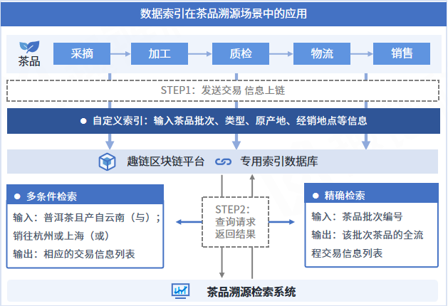

数据管理
========

数据归档
-------

随着区块链运行时间的增长，区块链系统存储的数据容量将高速增长，且数据的增长的速度甚至会超过存储介质容量增长的速度，从而限制区块链技术的发展。为此，平台实现了区块链数据归档，在不停机的情况下，将一部分线上数据迁移到线下存储。以此解决在有限存储空间下区块链数据的存储问题。平台也提供归档数据浏览器，支持用户查阅归档数据。平台也实现了归档数据恢复的功能，在不影响链上正常工作的情况下，支持运维人员将线下存储的数据恢复至线上。

数据归档针对的主体是区块数据，同时包括区块对应的日志数据、索引数据、交易回执数据。平台支持用户自定义归档范围，用户可以直接指定一个已经被提交的区块号作为参数，创世区块到入参区块的数据将被归档至线下。另外，考虑到直接归档的流程较为耗时，直接归档的请求返回和归档流程将异步进行，用户可通过查询归档结果的接口查询归档是否成功。数据归档功能支持各节点自主定义归档范围，节点间无需同步归档。数据归档对区块链的变化如下图所示:

|image0|

数据索引
-------

数据查询是区块链应用中最普遍的场景，但由于区块链独特的账本结构，一直以来都缺少一种高效安全的查询手段。

区块链底层的账本数据以Key-Value键值对模型进行存储，目前只能提供基于key 的精确检索，而在实际应用场景存在更广泛的基于value（业务数据）的检索需求。比如在商品溯源场景中，我们可能要通过商品ID来检索出该商品在整个流通过程中的交易，受限于区块链底层数据的存储特点，只能通过遍历区块的方式来检索，效率十分低下。为了提高检索效率，目前有两种解决思路，一种是将商品ID到交易哈希的映射关系存储在外部数据库当中，但数据安全难以得到有效保障；另一种是将映射关系存储在智能合约中，但随着数据量增大，合约会遇到性能瓶颈，检索效率依然难以得到提升。

为了解决上述问题，平台依托底层索引数据库，从区块中提取关键信息存储到索引数据库中，实现高效安全的业务数据自定义条件检索功能，极大简化了上层业务系统开发和维护复杂度。平台采用内嵌式索引数据库，保证检索结果可信的同时，极大提升了业务数据的检索效率，检索速度达毫秒级。为了更加贴合实际使用场景，平台支持自定义多条业务索引信息，满足更加精准的检索需求，同时支持精准、匹配（模糊）、多条件查询等多种检索模式，并支持大数据量分页查询，避免出现查询接口OOM问题。
 
|image1|

数据索引的应用十分广泛，特别是在查询频繁的存证类场景中。以茶品溯源场景为例，当茶品溯源平台将茶品采摘、加工、质检、物流、销售流程中的相关信息以交易的形式上链存证时，用户可在交易的ExtraID字段中输入茶品批次、类型、原产地、经销地点等自定义索引信息，这些索引信息将存储在底层专用索引数据库当中。随后，用户可调用相应接口，通过精确检索模式查询某一批次编号的产品全流程交易信息，或通过多条件检索模式查询云南产普洱茶的交易信息。

可信文件共享
-----------

中心化的文件存储与共享存在易篡改、低可信、单点故障等问题，而区块链因其可信任、安全不可篡改、冗余备份、多方协作等特性在文件可信存储与共享方面具有天然的优势，但目前区块链对于商业化文件存储与共享存在成本高、容量小、性能差、结构单一等问题，具体表现在：

- 文件容量大导致系统性能下降。目前的区块链技术架构，大容量的文本、文件由每个节点全量直接链上存储不仅需要消耗大量的存储资源，还会严重影响平台性能，无法满足商业场景的需求。

- 链上存储结构单一。区块链的存储结构对结构化文件友好，但不适于图片、音视频等非结构化文件的直接存储，无法适应涉及大量非结构化文件的应用场景。

为此，平台通过自研可信文件共享功能，通过链上存证、链下传输的文件分离存储模型，实现了文件可信存储、安全共享与高效查询。在保证平台性能和稳定性不受影响的情况下，能支持GB级别图片、音视频等非结构化文件的可信存储，并通过区块链网络定向流传输共享。向用户提供节点白名单和用户白名单，支持用户多维度自定义授权存储节点与用户下载权限，允许用户按需查询、下载文件，有效降低链上非结构性文件存储与共享的成本并增强可用性、可控性。可信文件共享由一方上传文件，多方同步文件索引信息、定向共享文件，功能示意图如下所示：

|image2|

可信数据源服务
-------------

在中国人民银行发布的《区块链能做什么？不能做什么？》的报告中，预言机定义如下：区块链外信息写入区块链内的机制，一般被成为预言机。预言机解决的是链外数据不可信、不确定而导致不可用的问题，由于区块链对于用户来说是一个黑盒，只了解输入和输出但不知晓内部的细节，系统内部为了满一致性要求，需保持合约运行结果的一致性和确定性，但如Web天气服务、航班动态信息、随机数等都是变化的数据，区块链想使用这些动态变化的数据就需要预言机。预言机作为区块链和外部世界的桥梁，通过可信计算技术以及建立信任的约束机制，让区块链系统打破了封闭，使区块链主动获取外部数据成为现实。

预言机使用过程中首先需要事先部署oracle合约，负责与预言机服务交互，用户编写自己的用户合约去调用oracle合约对外部预言机合约请求数据，预言机服务向外部请求数据再将数据返回给oracle合约，最终返回给用户合约触发合约执行逻辑（详见下图预言机示例）。

|image3|

对于数据源获取：Oracle预言机可以从外部引入世界状态的信息，包括网站数据、传感器采集数据、随机数、跨链数据等实时、动态、可变的数据；     

对于预言机服务：平台支持硬件TEE可信以及软件可信“双可信”预言机服务，保证预言机服务在数据处理，数据传输过程中的真实可信；

对于数据安全：支持HTTPS、TLS等安全传输协议，保证数据传输过程中防篡改且真实性可查验。

消息订阅服务
-----------

Hyperchain作为一个“共享状态”的区块链实现，其运转通过不断的状态变迁实现。每一次状态变迁，都会产生相应的一系列事件作为本次状态变迁的标志。

为了方便外部业务系统捕获、监听区块链的状态变化，我们提供了消息订阅功能，现已支持rabbit MQ和KafKa双模式。外部可以监听到的事件类型包括：

- **区块事件** ：每产生新的区块都将主动向订阅者推送最新区块信息；
- **合约事件** ：合约相关的事件触发（比如合约上账户余额变动）将会向订阅者推送消息；
- **交易事件** ：写入区块的交易的交易体与交易回执都会主动推送给订阅者；
- **系统异常事件** ：当平台有异常抛出或者系统状态改变的时候，便会向订阅者主动推送消息。

