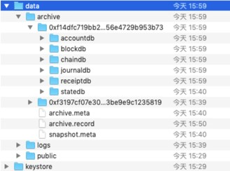

.. _Data-Archiving:

数据归档
^^^^^^^^^^^^^

功能概述
=============

数据归档功能的主要职责是将一部分旧的线上数据移到线下转存。

一次完整的归档过程包括：

- filelog数据从线上到线下的迁移，包括区块数据、区块对应的日志数据、交易回执数据。
- leveldb数据从线上到线下的迁移，主要包括交易索引数据。

新创建的数据包括：

- snapshot.meta：存储本次归档的manifest内容；
- archive.meta：存储本次archive过程中迁移的数据的统计结果；
- archive.record：为保证本次archive流程的完整性记录文件。

使用说明
==========

用户可以直接指定一个已经被提交的区块号作为参数，归档结果为：[创世区块, 入参区块) 的数据将被归档至线下，入参区块将成为新的创世区块。考虑直接归档的流程较为耗时，直接归档的请求返回和归档流程是异步的，可以通过后文提到的查询归档结果的接口查询归档是否成功。
需要注意的是，必须保证归档操作涉及到的区块是早于 `ns_static.toml` 配置文件中 `duplicate.tx_active_time` 加上 `duplicate.tx_drift_time` 的，即若这两个配置分别为24h和5m（默认配置），那么只能归档24小时5分钟之前生成的区块。
此外，需要保证归档的区块号小于或等于最新的一个checkpoint，checkpoint为整10的数。例如目前区块高度为125，则checkpoint为120，归档的区块号必须小于等于120。

归档数据
>>>>>>>>>>>>>>>>>>>>>>>>
调用JSONRPC接口::

    curl localhost:8081 POST --data '{
    "jsonrpc":"2.0",
    "namespace":"global",
    "method":"archive_archiveNoPredict",
    "params":[5],
    "id":1}'

该请求会返回一个长度为32的随机字符串，标识当前创世区块对应的世界状态数据库，从 ``namespaces/global/data/archive`` 文件夹中可以找到 ``SNAPSHOT_FileterID`` 为名称的归档数据库。

查询归档结果
--------------

调用JSONRPC接口::

    curl localhost:8081 --data '{
    "jsonrpc":"2.0",
    "namespace":"global",
    "method":"archive_queryArchive",
    "params":["<filterId>"],
    "id":1}'

该接口用于查询指定的filterID对应的数据，从当前的链上状态来看其归档的状态。可以通过查询请求的返回值判断当前归档的状态。

- not finish：未完成该filterID对应的归档任务。
- achieved：已完成该filterID对应的归档任务。
- restore：该filterID对应的归档任务已被恢复至链上。

查询最新归档结果
-------------------

查询直接归档的jsonrpc接口调用方式为::

     curl localhost:8081 --data '{"jsonrpc":"2.0","namespace":"global","method":"archive_queryLatestArchive","params":["<filterId>"],"id":1}'

该接口用于查询最近一次归档或restore的进度。可以通过查询请求的返回值判断当前归档的状态，如果归档失败也将显示失败的原因。

- archive running：归档任务正在进行
- archive failed：归档任务已经失败
- archive finished：归档任务完成
- archive rollback：归档任务失败了，但已经被平台自动回滚到归档前的状态
- restore running：恢复任务正在进行
- restore failed：恢复任务已经失败
- restore finished：恢复任务完成
- restore rollback：恢复任务失败了，但已经被平台自动回滚到恢复前的状态
- never archived：不曾归档

若归档或restore失败，还将显示失败原因。

查询归档列表
--------------

调用JSONRPC接口::

    curl localhost:8081 --data '{
    "jsonrpc":"2.0",
    "namespace":"global",
    "method":"archive_listSnapshot",
    "params":[" "],
    "id":1}'

该接口将返回目前归档过的所有记录，即snapshot.meta中所有manifest记录，返回的信息包括以下字段，当有多次归档记录时，则会有多组下列信息。

- FilterID：归档编号
- Height：本次归档的终点区块号。
- Genesis：本次归档的起点区块号。
- hash：本次归档的终点区块的区块哈希。
- MerkleRoot：截至本次归档的终点区块的账本状态默克尔根。
- Namespace：本次归档的对应分区。
- TxCount：0号区块到本次归档高度间所有的合法交易数量。
- InvalidTxCount：0号区块到本次归档高度间所有的非法交易数量。
- Status：本次归档的归档结果。
- DBVersion：*该字段为内部使用字段，对用户无特殊意义*

数据库变更
>>>>>>>>>>>>>>>>>
归档成功后的数据库结构如下：

|image1|

归档成功后的数据库结构如下，所有归档的数据在配置的archive目录下，每一个文件夹名为filterID，其中一个为0号区块的snapshot，其余的为每次归档的数据存放目录。第一次归档，snapshot.meta文件中会多两条记录，其中一条为当前的归档请求对应的manifest文件，另一条是为配合0号区块的世界状态数据库而存在的manifest记录，但这条记录并不表示一次实际的归档操作。

归档数据线下查询
-------------------

提供Archive-Reader归档数据浏览器组件，用于在独立服务器资源使用Archive-reader进行归档数据的查询浏览。Archive-Reader的使用指南详见 **Archive-Reader使用手册** 。

归档数据恢复至区块链
----------------------

支持使用IPC命令进行归档数据的恢复。
IPC命令：
- restore<namespace><filterID><shouldSync>
- namespace：归档数据恢复至目标分区的标识。
- filterID：归档数据对应的归档编号。需要从最近归档的部分开始恢复。
- shouldSync：True/False，是否同步返回回执消息。
    - True：归档数据恢复完成后才返回归档数据恢复的回执消息。
    - False：归档数据恢复发起后就返回回执消息，归档数据恢复的执行结果需用户自行轮询检查。

注意事项
------------------
- 各个子文件夹为各次归档产生的文件，其中accountdb与statedb文件夹存储的是snapshot数据，如果要在此基础上进一步做归档，这两个文件夹不能删除。其余文件夹的删除对于线上功能不会有任何影响。即不可删除最后一次归档产生的snapshot文件夹中的accountdb与statedb。
- archive.meta与snapshot.meta文件为flato系统级别重要文件，不可删除。
- 如果想要恢复归档完的数据到线上，需要采用运维手段调用ipc接口。
- 请在归档前估算归档的数据量，并在磁盘中预留该部分的空间，因为归档过程中会发生多一倍的数据膨胀。线下数据生成后才会删除线上数据，释放磁盘空间。
- 由于去重需要，可以归档的最新区块产生时间需要早于tx_active_time，tx_active_time配置于ns_static.toml中。

