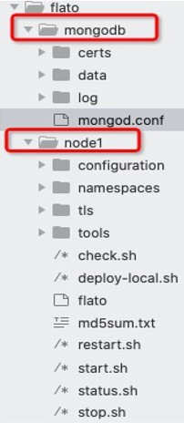

.. _Data-Index:

数据索引
^^^^^^^^^^^^^

功能概述
------------------

索引数据库设计目的是提高部分现有接口查询效率以及提供交易数据索引的功能。

客户端可以向开启索引数据库的节点发起查询请求，过滤出交易from、交易to、交易extraId、区块写入时间戳范围为指定值的符合条件的交易。交易extraId与交易extra类似，用户可自定义与业务相关的数据，区别在于：

- extra 类型是string，而 extraId 类型是数组，数组元素可以为int64类型或者string类型，每个数组元素都可作为交易的索引；
- extra 为实际完整业务数据内容，可能为一个JSON字符串；而 extraId 为实际用于业务内容索引的字段，它可以与extra内容存在业务关联也可以无关联，完全取决于客户端的设计。对于节点来说，节点不关心这两个字段存储的实质内容，但是可以通过 extraId 的值快速定位到与其相关的交易有哪些。

目前支持的数据索引功能常用应用场景包括：

- **存证类** ：对存证场景中的图片、视频、PDF等大文件数据，将文件哈希存储在 extraId 中，建立文件哈希到交易哈希的映射，可快速通过文件哈希检索到文件的存证交易信息，并在必要时返回原文件。
- **溯源类** ：每个商品拥有唯一ID，将商品ID存储在extraId中，可通过商品ID快速检索到该商品生产、物流、分销等流通过程中的所有交易信息，实现全品类、全流程的商品质量溯源。
- **查询过滤** ：可通过数据索引中的过滤功能，快速查询交易相关信息，如查询某个交易发送方或者交易接收方地址下的所有交易等，借此开展精确高效的交易查询。

**术语说明**

.. list-table:: 
 :widths: 30 70
 :header-rows: 1

 * - 术语名称
   - 解释说明
 * - 一层索引
   - 从块链数据里提取出来的关键信息，作为交易索引数据，这些数据称作一层索引，被存储在索引数据库中。
 * - 二层索引
   - 为了进一步提高交易查询效率，在一层索引数据的基础上创建的数据库索引，也即索引数据库索引。

    
安装及初始化
------------------

数据索引功能是 **可选的** （默认不开启），即可以通过节点开关配置来决定节点是否启用索引数据库功能，相关配置位于 ``configuration/global/ns_static.toml`` 中。

平台默认不开启数据索引功能， **如果您想启用该功能，请将下述配置复制到 ns_static.toml 中，并做好相应配置**。

- ``database.indexdb.layer1.enable``：是否开启数据索引功能(true, false)；
- ``database.indexdb.layer1.dbType``：指定索引数据库底层存储引擎，可选项为mongodb；
- ``database.indexdb.mongodb.uri``：若采用MongoDB，需配置MongoDB的URL。

示例如下::
    
    [database.indexdb]
        [database.indexdb.layer1]
            enable = true
            dbType = "mongodb"
        
        [database.indexdb.mongodb]
            uri = "mongodb://127.0.0.1:27017"

安装MongoDB
>>>>>>>>>>>>>>>>>>>>>>>>

下载安装包
:::::::::::::::
数据索引功能目前依赖于外接MongoDB数据库，本部分将先介绍 MasOS、CentOS7 两种操作系统下的 MongoDB 安装部署步骤。MongoDB 版本必须为 4.2 及以上。

总体来说，MongoDB的安装只需要下载安装包、解压安装包然后配置系统环境变量即可。

首先，请根据操作系统类型至MongoDB官网下载相应的MongoDB安装包（版本推荐4.2.5及以上版本，Package选择“tgz”）：

https://www.mongodb.com/try/download/community

然后，将安装包放到自己指定的安装目录下，进行解压缩：

MacOS::

    tar zxvf mongodb-macos-x86_64-4.2.5.tgz

CentOS::

    tar zxvf mongodb-linux-x86_64-rhel70-4.2.5.tgz

配置系统环境变量
:::::::::::::::
修改 ``~/.zshrc`` 或者 ``~/.bashrc`` 文件，在文件末尾添加::

    export MONGODB_HOME=<your mongodb install path>
    export PATH=$PATH:$MONGODB_HOME/bin

其中， ``<your mongodb install path>`` 为上一步解压缩后生成的目录的路径。添加完成以后，执行::

    source ~/.zshrc
    或者
    source ~/.bashrc

至此，MongoDB Server安装完毕。

启动MongoDB服务
>>>>>>>>>>>>>>>>>>>>>>>>
将 **MongoDB启动目录** （点击\ `此处 <https://upload.filoop.com/mongodb.tar.gz>`__\ 下载启动目录）的mongodb压缩包，解压缩后放到节点部署目录的上一级。

|image1|

::

    # 进入到mongodb目录下，然后执行下面命令启动 MongoDB Server
    mongod --config mongod.conf
    # 也可以将 mongod.conf 文件里的路径改为绝对路径，这样在任意位置都可以执行上面命令

实际上，mongodb目录可以解压缩放到任意 **具有读写权限** 的位置。

修改配置文件
>>>>>>>>>>>>>>>>>>>>>>>>
要启动数据索引功能，主要有两个配置需要修改:

- ``database.indexdb.layer1.enable`` 设置为 **true**
- ``database.indexdb.mongodb.uri`` 设置为 **MongoDB URI**

修改后的配置文件如下::

    [database.indexdb]
        [database.indexdb.layer1]
            enable = true
            dbType = "mongodb"
        [database.indexdb.layer2]
            # Defines for which fields to create layer2 index, optional value including:
            #   1 - indicate field named block write time;
            #   2 - indicate field named transaction from;
            #   3 - indicate field named transaction to;
            #   4 - indicate field named transaction hash;
            # For example:
            #      active = [] - means dont create any layer2 index;
            #      active = [1] - means create layer2 index for block write time;
            #      active = [1, 2] - means create layer2 index for block write time and transaction from;
            # This config item works only when database.indexdb.layer1.enable is true.
            active = []
        [database.indexdb.mongodb]
            uri = "mongodb://127.0.0.1:27017/?w=1&journal=true"
            limit = 5000

启动数据索引服务
>>>>>>>>>>>>>>>>>>>>>>>>
请根据规范正常启动节点，即可启用数据索引服务。如果您的节点已经在运行过程中，请停机完成初始配置后再启动。

使用说明
----------------------------

外部接口JSONRPC
>>>>>>>>>>>>>>>>>>>>>>>>>>>>
数据索引功能相关的JSON-RPC接口如下：

.. list-table:: 
 :widths: 30 70
 :header-rows: 1

 * - RPC方法
   - 功能
 * - tx_sendTransaction
   - 发送交易
 * - tx_getTransactionsByExtraID
   - 查询extraId为指定值的交易
 * - tx_getTransactionsByFilter
   - 查询符合过滤条件的交易
 * - tx_getTransactionsByTimeWithLimit
   - 查询指定时间区间内的交易（可用于分页）

tx_sendTransaction
::::::::::::::::::::::
发送交易的时候可以自定义extraId字段的值，该值作为这笔交易的可索引信息。由于交易结构的ExtraId的值支持int64数组、string数组或者包含int64和string的数组，因此在发送交易的接口里 **新增了两个参数 extraIdInt64 和 extraIdString** ，类型分别为 []int64 和 []string。

新增的这两个参数均为可选参数，分别用来接收不同数据类型的索引值。允许接收到的发送交易请求参数里 **不包含这两个字段、只包含extraIdInt64字段、只包含extraIdString字段或者同时包含这两个字段** 。如果同时包含这两个字段，则最终生成的交易结构的ExtraId值为这两个数组的拼接， **数组拼接顺序为int64数组后面拼接string数组**。

**Example1**：该例子最终生成的交易结构ExtraId字段为 ["0F384"]::

    curl -X POST --data '{
    "jsonrpc":"2.0",
    "namespace":"global",
    "method":"tx_sendTransaction",
    "params":[{
        "signature":"01047ea464762c333762d3be8a04536b22955d97231062442f81a3cff46cb009bbdbb0f30e61ade5705254d4e4e0c0745fb3ba69006d4b377f82ecec05ed094dbe873046022100b16176bc233000f9039a4209daa82a1c7bc662cbfe7cbef7b8ae44dc81043335022100e8f87fff65631726b3975a54c5c561b3277b6d60b2138cdd8281abc23dafd4f1",
        "from":"0x856E2B9A5FA82FD1B031D1FF6863864DBAC7995D",
        "to":"0x794BF01AB3D37DF2D1EA1AA4E6F4A0E988F4DEA5",
        "type":"EVM",
        "nonce":8916188877127249,
        "simulate":false,
        "value":53,
        "timestamp":1566188957839922607,
        "extra":"{\"id\":\"0F384\", \"name\":\"tom\", \"class\":\"0808\"}",
        "extraIdString": ["0F384"]
    }],"id":1}'

**Example2**：该例子最终生成的交易结构ExtraId字段为 [100, "0F384"]::

    curl -X POST --data '{
    "jsonrpc":"2.0",
    "namespace":"global",
    "method":"tx_sendTransaction",
    "params":[{
        "signature":"01047ea464762c333762d3be8a04536b22955d97231062442f81a3cff46cb009bbdbb0f30e61ade5705254d4e4e0c0745fb3ba69006d4b377f82ecec05ed094dbe873046022100b16176bc233000f9039a4209daa82a1c7bc662cbfe7cbef7b8ae44dc81043335022100e8f87fff65631726b3975a54c5c561b3277b6d60b2138cdd8281abc23dafd4f1",
        "from":"0x856E2B9A5FA82FD1B031D1FF6863864DBAC7995D",
        "to":"0x794BF01AB3D37DF2D1EA1AA4E6F4A0E988F4DEA5",
        "type":"EVM",
        "nonce":8916188877127249,
        "simulate":false,
        "value":53,
        "timestamp":1566188957839922607,
        "extra":"{\"id\":\"0F384\", \"name\":\"tom\", \"class\":\"0808\", \"score\": 100}",
        "extraIdInt64": [100],
        "extraIdString": ["0F384"]
    }],"id":1}'

tx_getTransactionsByExtraID
::::::::::::::::::::::

**接口含义**

根据extraId的值和交易接收方地址(可选)来查询符合查询条件的交易。

**输入参数**

该接口的入参定义如下::

    {
        detail: <bool> [可选] 表示是否返回交易详情，默认为false。若为true，则返回的结果为交易详情[<TransactionResult>]，否则为交易摘要[<TransactionSummary>]。
        mode: <int> [可选] 表示本次查询请求的查询模式，目前有0、1、2三个值可选，默认为0。0 表示按序精确查询模式，即筛选出的的交易 extraId 数组的数值和顺序都与查询条件完全一致；1 表示非按序精确查询模式，即筛选出的交易 extraId 数组包含查询条件里指定的全部数值，顺序无要求；2 表示非按序匹配查询模式，即筛选出的交易 extraId 数组包含部分或全部查询条件指定的值，且顺序无要求。    
        metadata: <Metadata>[可选] 指定本次查询的起始位置、查询方向以及返回的条数。若未指定，则默认从最新区块开始向前查询，默认返回条数是5000条。   
        filter: <Filter>[必选] 指定本次查询过滤条件。 
    }

Metadata结构包含以下可用成员::

    {
        pagesize: <int32> [可选] 表示本次查询返回多少条交易。如果未指定，则pagesize默认值为5000，如果超过5000，则使用节点默认值5000。
        bookmark: <Bookmark> [可选] 表示本次查询的书签位置， 即起始位置，返回的结果里不包含用户指定的书签所对应的交易。如果未指定且backward为false，则默认从最新区块开始向前遍历，如果未指定且backward为true，则默认从创世区块开始向后遍历。
        backward: <bool> [可选] 表示本次查询的方向，false表示以起始位置为起点从高区块往低区块遍历，true 表示以起始位置为起点从低区块往高区块遍历，默认查询方向为false。
    }

**Bookmark** 结构有以下可用成员::

    {
        blkNum: <uint64>交易所在区块号。  
        txIndex: <int64>交易索引号，即交易在区块内的位置。
    }

**Filter** 结构包含以下可用成员::

    {
        extraId: <array> [必选] 指定交易extraId的值。
        txTo: <string> [可选] 指定交易接收方的地址。
    }

**返回值**

该接口返回值定义如下::

    {
        hasmore: <bool> 表示是否有更多符合查询条件的交易未被返回。
        data: [<TransactionResult>] 或 [<TransactionSummary>] 交易详情数组或者交易摘要数组。
    }

**TransactionResult** 结构如下::

    {
        version: <string> 平台版本号
        hash: <string> 交易的哈希值,32字节的十六进制字符串
        blockNumber: <number> 交易所在的区块高度
        blockHash: <string> 交易所在区块哈希值
        txIndex: <number> 交易在区块中的交易列表的位置
        from: <string> 交易发送方的地址,20字节的十六进制字符串
        to: <string> 交易接收方的地址,20字节的十六进制字符
        cName: <string> 交易接收方的名称，合约的命名
        amount: <number> 交易量
        timestamp: <number> 交易发生的unix时间戳(单位 ns)
        nonce: <number> 16位随机数
        extra: <string> 交易的额外信息
        executeTime: <string> 交易的处理时间(单位ms)
        payload: <string> 部署合约与调用合约的时候才有这个值，可以通过这个值追溯到合约调用的方法以及调用传入的参数
        signature: <string> 交易签名
        invalid: <boolean> 交易是否不合法
        invalidMsg: <string> 交易的不合法信息
        blockTimestamp:<number> 交易打包时间
        blockWriteTime:<number> 交易写块时间
    }

**TransactionSummary** 结构如下::

    {
        txHash: <string> 交易哈希值
        blkNum: <uint64> 交易所在区块号
        txIndex: <int64> 交易在区块里的索引值
        from: <string> 交易发送方地址
        to: <string> 交易接收方地址
        extraId:<any> 交易的extraId值
    }
**注意：该接口必须要指定 extraId 的值，交易接收方地址为可选项；当节点的索引数据库创建了针对该地址的extraId部分索引的时候，提供地址可以加快查询速度。**

**Example1** ::

    // requestcurl -X POST --data '{
    "jsonrpc":"2.0",
    "method":"tx_getTransactionsByExtraID",
    "params":[{
        "detail": false,
        "mode": 0,
        "metadata": {
            "backward": true,
            "pagesize": 3,
            "bookmark": {
                "blkNum": 7,
                "txIndex": 485		
                }
            },
            "filter": {
                "extraId": [123]	
                }}],
            "id":1
            }'
            // response{
                "jsonrpc": "2.0",
                "namespace": "global",
                "id": 1,
                "code": 0,
                "message": "SUCCESS",
                    "result": {
                        "hasmore": true,
                        "data": [
                        {
                        "txHash": "0xb34b1cce284c55383769f2c113d888cf5153d5597a52e842ce1ffd09b5731b9b",
                        "blkNum": 7,
                        "txIndex": 492,
                        "from": "0xe93b92f1da08f925bdee44e91e7768380ae83307",
                        "to": "0xb18c8575e3284e79b92100025a31378feb8100d6",
                        "extraId": [123]
                        },
                        {
                        "txHash": "0x93bcb6e22b8d0597da3a4d88da6019840a02c5b155a1ceed4864e3b081b81371",
                        "blkNum": 8,
                        "txIndex": 21,
                        "from": "0x000f1a7a08ccc48e5d30f80850cf1cf283aa3abd",
                        "to": "0xe93b92f1da08f925bdee44e91e7768380ae83307",
                        "extraId": [123]
                        },
                        {
                        "txHash": "0xe4144de6dbe279e19c38d74d508ebf52a6d487ffa01dbaa4c91c99d98f61aeaf",
                        "blkNum": 8,
                        "txIndex": 26,
                        "from": "0xe93b92f1da08f925bdee44e91e7768380ae83307",
                        "to": "0x6201cb0448964ac597faf6fdf1f472edf2a22b89",
                        "extraId": [123]
                        }
                        ]
                        }}

**Example2** ::

    // requestcurl -X POST --data '{
    "jsonrpc":"2.0",
    "method":"tx_getTransactionsByExtraID",
    "params":[{
    "detail": false,
    "mode": 0,
    "metadata": {
    "backward": true,
    "pagesize": 3,
    "bookmark": {
    "blkNum": 7,
    "txIndex": 485
    }
    },
    "filter": {
    "extraId": [123],
    "txTo": "0xb18c8575e3284e79b92100025a31378feb8100d6"
    }}],
    "id":1}'
    // response{
    "jsonrpc": "2.0",
    "namespace": "global",
    "id": 1,
    "code": 0,
    "message": "SUCCESS",
    "result": {
    "hasmore": true,
    "data": [
    {
    "txHash": "0xb34b1cce284c55383769f2c113d888cf5153d5597a52e842ce1ffd09b5731b9b",
    "blkNum": 7,
    "txIndex": 492,
    "from": "0xe93b92f1da08f925bdee44e91e7768380ae83307",
    "to": "0xb18c8575e3284e79b92100025a31378feb8100d6",
    "extraId": [123]
    },
    {
    "txHash": "0xb1057c5081e42bc9a20fe5a43b71dfc30c64e5cc6e173dc54fd4bea05e8f2eb9",
    "blkNum": 8,
    "txIndex": 193,
    "from": "0xb18c8575e3284e79b92100025a31378feb8100d6",
    "to": "0xb18c8575e3284e79b92100025a31378feb8100d6",
    "extraId": [123]
    },
    {
    "txHash": "0x54e03fb03feaf0232681f5fb9da6b35542029aff9b8a2f78c8749484a863cc0a",
    "blkNum": 8,
    "txIndex": 279,
    "from": "0x6201cb0448964ac597faf6fdf1f472edf2a22b89",
    "to": "0xb18c8575e3284e79b92100025a31378feb8100d6",
    "extraId": [123]
    }
    ]
    }}

tx_getTransactionsByFilter
::::::::::::::::::::

**接口含义**

根据过滤条件来查询符合查询条件的交易。

**输入参数**

该接口的入参定义如下::

    {
        detail: <bool> [可选] 表示是否返回交易详情，默认为false。若为true，则返回的结果为交易详情[<TransactionResult>]，否则为交易摘要[<TransactionSummary>] 。	
        mode: <int> [可选] 表示本次查询请求的查询模式，目前有 0、1 两个值可选，默认为0。0表示多条件与查询模式，即交易对应字段的值与查询条件里所有指定的字段值都完全一致；1表示多条件或询模式，即交易对应字段的值至少有一个等于查询条件里指定的字段值。
        metadata: <Metadata>[可选] 指定本次查询的起始位置、查询方向以及返回的条数。若未指定，则默认从最新区块开始向前查询，默认返回条数是5000条。
        filter: <Filter>[必选] 指定本次查询过滤条件。 
    }

**Metadata** 结构包含以下可用成员::

    {
        pagesize: <int32> [可选] 表示本次查询返回多少条交易。如果未指定，则pagesize默认值为5000，如果超过5000，则使用节点默认值5000。 
        bookmark: <Bookmark> [可选] 表示本次查询的书签位置， 即起始位置，返回的结果里不包含用户指定的书签所对应的交易。如果未指定且backward为false，则默认从最新区块开始向前遍历；如果未指定且backward为true，则默认从创世区块开始向后遍历。  
        backward: <bool> [可选] 表示本次查询的方向，false表示以起始位置为起点从高区块往低区块遍历，true 表示以起始位置为起点从低区块往高区块遍历，默认查询方向为false。
    }

**Bookmark** 结构有以下可用成员::

    {
        blkNum: <uint64>交易所在区块号。  
        txIndex: <int64>交易索引号，即交易在区块内的位置。
    }

**Filter** 结构包含以下可用成员::

    {
        txHash: <string> [可选] 指定交易的哈希值。
        blkNumber: <uint64> [可选] 指定交易所在的区块号。
        txIndex: <int64> [可选] 指定交易在区块内的索引位置。
        txFrom: <string> [可选] 指定交易发送方的地址。
        txTo: <string> [可选] 指定交易接收方的地址。
        extraId: <array> [可选] 指定交易extraId的值。
    }

**返回值**

该接口返回值定义如下::

    {
        hasmore: <bool> 表示是否有更多符合查询条件的交易未被返回。
        data: [<TransactionResult>] 或 [<TransactionSummary>] 交易详情数组或者交易摘要数组
    }

**TransactionResult** 和 **TransactionSummary**

结构定义请参见 ``getTransactionByExtraID`` 接口

**Example**::

    // requestcurl -X POST --data '{
    "jsonrpc":"2.0",
    "method":"tx_getTransactionsByFilter",
    "params":[{	"detail": false,
    "mode": 1,
    "metadata": {
    "backward": true,
    "pagesize": 6	},
    "filter": {
    "txFrom": "0xb18c8575e3284e79b92100025a31378feb8100d6",
    "txTo": "0xb18c8575e3284e79b92100025a31378feb8100d6"
    }}],
    "id":1}'
    // response{
    "jsonrpc": "2.0",
    "namespace": "global",
    "id": 1,
    "code": 0,
    "message": "SUCCESS",
    "result": {
    "hasmore": true,
    "data": [
    {
    "txHash": "0x2fb76887bc6fcaec50eb68b967244b5ec813fbcb7d6a4f5f2c305d97aaf6c8ee",
    "blkNum": 1,
    "txIndex": 1,
    "from": "0x000f1a7a08ccc48e5d30f80850cf1cf283aa3abd",
    "to": "0xb18c8575e3284e79b92100025a31378feb8100d6",
    "extraId": [
    "abc",
    123
    ]
    },
    {
    "txHash": "0x108bc89ec2c077a57a0e4e70f014c08daedb900be6ea238b9f2826cf14d6a0c5",
    "blkNum": 1,
    "txIndex": 2,
    "from": "0xe93b92f1da08f925bdee44e91e7768380ae83307",
    "to": "0xb18c8575e3284e79b92100025a31378feb8100d6",
    "extraId": [
    123
    ]
    },
    {
    "txHash": "0x0b8f24d4e5daba7d09b7d32278a0749ec14ef2b418d6c0c192849ccce52b5493",
    "blkNum": 1,
    "txIndex": 6,
    "from": "0xb18c8575e3284e79b92100025a31378feb8100d6",
    "to": "0xb18c8575e3284e79b92100025a31378feb8100d6",
    "extraId": [
    123
    ]
    },
    {
    "txHash": "0xcee5342772c3fdc93d809f52e978a66babd15ddd826ba3f63163fb6ce8eba5c7",
    "blkNum": 1,
    "txIndex": 9,
    "from": "0x000f1a7a08ccc48e5d30f80850cf1cf283aa3abd",
    "to": "0xb18c8575e3284e79b92100025a31378feb8100d6",
    "extraId": ["efg"]
    },
    {
    "txHash": "0x7d1accf199aa945d614bbfd34a344fa2232386ebb59f9ddb058f89483e86c41e",
    "blkNum": 1,
    "txIndex": 10,
    "from": "0xe93b92f1da08f925bdee44e91e7768380ae83307",
    "to": "0xb18c8575e3284e79b92100025a31378feb8100d6"
    },
    {
    "txHash": "0xd35870cf4f611b78ce72c037668f6006ff8a80ed95d19a0786acf26a91b6f606",
    "blkNum": 1,
    "txIndex": 11,
    "from": "0xb18c8575e3284e79b92100025a31378feb8100d6",
    "to": "0xe93b92f1da08f925bdee44e91e7768380ae83307",
    "extraId": ["abc"]
    }
    ]
    }}

tx_getTransactionsByTimeWithLimit
:::::::::::::::::

如果节点未开启索引数据库，则接口查询方法走原来的逻辑，直接遍历filelog里的区块数据。如果节点开启了索引数据库，则查询方法与原来不同，首先检索索引数据库再从filelog里取到交易详情。

不管节点是否开启了索引功能，当接口入参一样时，期望查询得到的结果也完全一样。

接口参数详情请参考接口文档

外部接口IPC
>>>>>>>>>>>>>>>>

增加索引数据库相关的IPC命令，命令为`indexdb`，用于创建( create )、删除( delete )、查询( list )索引数据库二层索引。

indexdb子命令如下::

    indexdb register <namespace name> - register command namespace scope

    indexdb scope - list command current namespace scope

    indexdb list [-d] - list all layer2 indexes name.

    indexdb create <field id> [-d] - create field layer2 index, you can provide multiple field name. <field id> including:
                        1 - indicate field named block write time;
                        2 - indicate field named transaction from;
                        3 - indicate field named transaction to;
                        4 - indicate field named transaction hash;

    indexdb createPartial <address> [-d] - create partial extraId layer2 index. <address> should be a transaction to address.

    indexdb delete <index name> [-d]  - delete layer2 index.

由于索引数据库是namespace级别的，因此每次使用 `indexdb` 命令都需要指定命令作用域，所谓作用域即表示该命令要作用于哪个namespace。因此 `indexdb` 命令提供了注册作用域( register )和查询当前作用域( scope )的子命令。

用户也可以不注册 `indexdb` 命令作用域，而在子命令后面指定 `-d` 即可，表示使用默认(default)的namespace **global** 作用域。

下面列举一些使用例子::

    # 0. 在节点启动的情况下，使用该命令进入交互式命令行界面
    > ./flato（“flato”为趣链区块链平台新版英文简称） -s --ipc=hpc_1.ipc

    # 1. 列举global下索引数据库的二层索引信息
    >>> indexdb list -d
    current scope: "global"
    total indexes: 1
    [ mongodb.IndexResult{Name:"_id_", Ns:"global@node1.blocks", Key:map[string]interface {}   {"_id":1}} ]

    # 2. 在global下，创建作用于区块写入时间的二层索引
    >>> indexdb create 1 -d
    current scope: "global"
    successfully create index

    # 3. 再次查询global下索引数据库的二层索引信息，可以看到新增了一项
    >>> indexdb list -d
    current scope: "global"
    total indexes: 2
    [ mongodb.IndexResult{Name:"_id_", Ns:"global@node1.blocks", Key:map[string]interface {}  {"_id":1}} ]
    [ mongodb.IndexResult{Name:"writeTime_1", Ns:"global@node1.blocks",   Key:map[string]interface {}{"writeTime":1}} ]

    # 4. 删除global下的名称为 writeTime_1 的二层索引
    >>> indexdb delete writeTime_1 -d
    current scope: "global"
    successfully delete index

    >>> indexdb list -d
    current scope: "global"
    total indexes: 1
    [ mongodb.IndexResult{Name:"_id_", Ns:"global@node1.blocks", Key:map[string]interface {}  {"_id":1}} ]
    >>>  

    # 5. 创建extraId部分索引
    >>> indexdb createPartial 0xe93b92f1da08f925bdee44e91e7768380ae83307 -d
    current scope: "global"
    successfully create partial index
    >>> indexdb list -d
    current scope: "global"
    total indexes: 2
    [ mongodb.IndexResult{Name:"_id_", Ns:"global@node1.blocks", Key:map[string]interface {} {"_id":1}} ]
    [ mongodb.IndexResult{Name:"txs.extraId_0xe93b92f1da08f925bdee44e91e7768380ae83307",   Ns:"global@node1.blocks", Key:map[string]interface {}{"_id":1,   "_partial_index_0xe93b92f1da08f925bdee44e91e7768380ae83307":1, "txs.eid":1}} ]
    >>> 

数据索引附件资源
---------------

（咨询平台运维人员获取）

