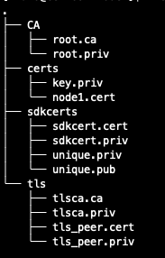
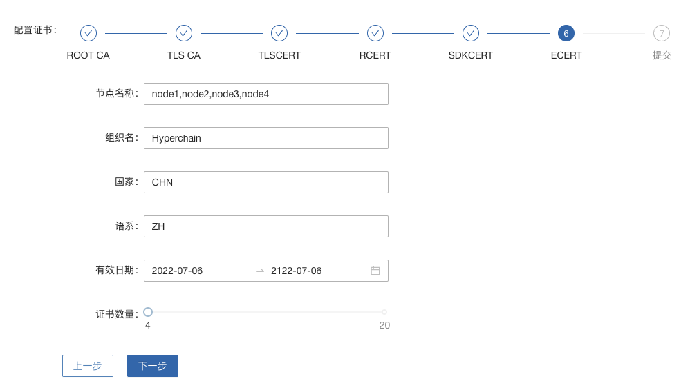

部署文档
^^^^^^^^

前言
-----

该文档将介绍如何部署一个拥有4个节点的Flato集群，操作步骤会较其他系统的部署稍繁琐一些，用户需要 **分别登录到4台服务器上** 进行操作。

这里假设4台服务器的IP分别为node1、node2、node3和node4，操作用户都是flato。

**该部署文档是为模拟平台上线部署的场景而编写的，所有的操作都只有普通用户权限，因此不涉及任何sudo权限的操作。不推荐使用root用户部署平台，容易养成不好的操作习惯，也不利于发现操作步骤中的错误。**

第一章 获取安装包以及用户登录
--------------------------

1.获取安装包
>>>>>>>>>>>>>

如果您已通过其他方式获取安装包请忽略此步骤。

【线下获取】对接趣链科技相关人员

【公司外部】登录飞洛官方资源库下载

Flato二进制包下载地址：https://filoop.com/console/binary

Flato证书签发地址：https://filoop.com/console/issue

Flato License签发地址：https://filoop.com/console/license

【公司内部】登录OA：https://moffi.hyperchain.cn

点击签发->平台组件->组件列表->flato->下载，选择使用您平台的flato版本下载

点击签发->证书->创建证书，选择V1.7+证书体系，按步骤点击后下载得到证书zip文件

点击签发->许可->我的许可，申请适合您需求的LICENSE，审批通过后在许可状态中下载LICENSE文件

至此，您已经获得了所有需要的安装包，注意：**证书和LICENSE文件将在flato部署完成时用到，详见3.2节**。

2.创建使用用户及文件权限
>>>>>>>>>>>>>>>>>>>>>>>

创建平台部署所需的用户，例如创建如下用户::

    1. 用户名：flato
    2. 密码：flato

可用如下命令创建新用户::

    1. sudo useradd -m -d /home/flato -s /bin/bash -k /etc/skel flato
    2. sudo passwd flato

修改部署路径及数据存放路径的目录权限，例如 ``/opt/flato`` 及 ``/data/hype`` ::

    1. sudo chown -R flato: /data/flato

3. 上传安装包
>>>>>>>>>>>>>

登录服务器前需要上传Flato安装包和另外的小工具。

以服务器地址 ``node1`` ，用户名 ``flato`` 为例，操作步骤如下::

    1. #上传Flato安装包
    2. #具体操作时将flato-install.tar.gz换成实际安装包名，将node1换成实际服务器IP地址
    3. scp flato-installer.tar.gz flato@node1:~
    4. #上传nt工具包
    5. #具体操作时将node1换成实际服务器IP地址
    6. scp nt-linux64.tar.gz flato@node1:~

4. 登录操作用户
>>>>>>>>>>>>>>>
    ::

    1. #具体操作时将node1换成服务器IP地址
    2. ssh flato@node1
    3. Password:
    4. #输入登录密码

5. 重复操作
>>>>>>>>>>>>

- 请按照1.2~1.3中的步骤，再分别登录到 ``node2~node4`` 上，以继续之后的操作。

第二章 检查系统环境
------------------

首先以 ``node1`` 服务器为例，完成以下的检查步骤。

1. 检查服务器时间
>>>>>>>>>>>>>>>>

检查Flato节点所在服务器的时间是否与标准时间同步，如果不同步请联络系管理员同步系统时钟。
    ::

    1. #查看服务器时间命令
    2. date

2. 检查服务器配置
>>>>>>>>>>>>>>>>

检查服务器配置是否与预期的配置一致，如果不一致请联系系统管理调整配置。
    ::

    1. #查看CPU主频
    2. cat /proc/cpuinfo | grep 'model name' | uniq
    3. #查看CPU核数
    4. cat /proc/cpuinfo | grep 'model name' | wc -l
    5. #查看内存大小
    6. #如果free -h执行失败，可以直接调用free查看
    7. q
    8. #查看挂载的文件系统大小
    9. df -h

3. 检查端口占用情况
>>>>>>>>>>>>>>>>>>

检查Flato节点所需的端口是否被其他进程占用，如已被占用请联络系统管理员进行调整。

检查端口是否被监听，以查看8001端口为例::

    1. #查看端口是否被占用的命令
    2. netstat -nap | grep 8001

如果存在被占用的情况，上述命令会打印出以下类似信息::

    1. (Not all processes could be identified, non-owned process info
    2. will not be shown, you would have to be root tosee it all.)
    3. tcp6 0 0 8001 * LISTEN 30207/./process1

4. 检查网络连通性
>>>>>>>>>>>>>>>>

检查网络连通性的目的，就是为了检查Flato节点所监听的端口能否被其他节点访问到，如果其他节点访问不到请联络系统管理做处理。可以使用以下三种方法检查网络连通性， ``选择任意一种即可`` 。

- nt工具
- nc命令
- Python HTTP模块

- 使用nt工具测试连通性

nt是一个专门用于测试网络连通性的工具。假设Flato节点IP地址node1~node4，需要验证node2~node4与node1上8001端口的连通性，使用方法如下::

    1. #登录node1
    2. #具体操作时将node1换成服务器IP地址
    3. ssh flato@node1
    4. #解压nt工具包
    5. tar xvf nt-linux64.tar.gz
    6. cd nt-linux64
    7. #启动nt监听
    8. ./nt server -l 0.0.0.0:8001
    9. #登录node2
    10. #具体操作时将node2换成服务器IP地址
    11. ssh flato@node2
    12. #解压nt工具包
    13. tar xvf nt-linux64.tar.gz
    14. #编辑servers.txt，向servers.txt中加入需要检测的IP:Port，本例中填入一下内容
    15. #具体操作时将node1换成服务器IP地址
    16. echo 'node1:8001' > servers.txt
    17. #检查servers.txt内容是否符合预期
    18. cat servers.txt
    19. #启动客户端测试
    20. ./nt client
    21. #看到类似如下带SUCCESS字样的输出，即表明测试成功
    22. [CLIENT] TEST node1:8001 [SUCCESS] RESP: s:server_resp [0.0.0.0:8001], C->S: 0 ms, RTT: 0 ms
    23. #在node3、node4上重复在node2上操作即可
    24. #测试完之后返回到node1
    25. #按 CTRL-C 结束server监听
    26. CTRL-C

nt工具支持同时检查多个IP:Port的连通性，只要在servers.txt中以每行一个IP:Port的格式填写即可。

- 使用nc命令测试连通性

还可以用nc命令测试连通性，此方法的优点是操作步骤简单，但缺点是有些系统不会自带安装nc命令。
 ::

    1. #安装nc命令如下：
    2. sudo yum install -y nc

假设Flato节点IP地址node1~node4，需要验证node2~node4与node1上8001端口的连通性，使用方法如下::

    1. #登录node1
    2. #具体操作时将node1换成服务器IP地址
    3. ssh flato@node1
    4. #启动nc监听, -l设置开启监听模式，-k开启支持多客户端同时连接模式，-p指定监听端口
    5. nc -l -k -p 8001
    6. #登录node2
    7. #具体操作时将node2换成服务器IP地址
    8. ssh flato@node2
    9. #使用nc命令测试连通性，-w选项设置3秒等待时间,-i选项设置连接成功后空闲等待时间(空闲超3秒即退出)
    10. #具体操作时将node1换成服务器IP地址
    11. nc -w 3 -i 3 -v node1 8001
    12. #如果出现以下带Connected字样的输出，表示测试成功。
    13. Ncat: Connected to node1:8001.
    14. Ncat: Idle timeout expired (3000 ms).
    15. #在node3、node4上重复在node2上操作即可
    16. #测试完之后返回到node1
    17. #按 CTRL-C 结束nc监听
    18. CTRL-C

- 使用Python的HTTP模块测试连通性

使用Python自带的HTTP模块也能快速开启对一个端口的监听，如果在使用上述两种方法时遇到问题，可以考虑使用此方法快速测试网络连通性。

假设Flato节点IP地址node1~node4，需要验证node2~node4与node1上8001端口的连通性，使用方法如下::

    1. #登录node1
    2. #具体操作时将node1换成服务器IP地址
    3. ssh flato@node1
    4. #启动Python HTTP模块监听，命令如下(注意大小写)
    5. python -m SimpleHTTPServer 8001
    6. #登录node2
    7. #具体操作时将node2换成服务器IP地址
    8. ssh flato@node2
    9. #使用curl命令测试连通性
    10. #具体操作时将node1换成服务器IP地址
    11. curl node1:8001 >& /dev/null  echo yes  echo no
    12. #如果测试成功就打印yes，否则打印no
    13. #在node3、node4上重复在node2上操作即可
    14. #测试完之后返回到node1
    15. #按 CTRL-C 结束Python监听
    16. CTRL-C

5. 检查系统字符集
>>>>>>>>>>>>>>>>>

``flato`` 节点默认使用的字符集为 ``UTF-8`` ，请检查 ``SDK`` 或者应用服务器的默认字符集是否为 ``UTF-8`` ，如果不是，有可能造成签名非法。
 ::

    1. Linux系统字符集查看
    2. echo $LANG
    3. Linux修改字符集
    4. vim /etc/sysconfig/i18n
    5. LANG="zh_CN.UTF-8"
    6. 修改文件保存退出之后要生效要执行如下命令才可生效
    7. source /etc/sysconfig/i18n

6. 检查最大文件句柄数
>>>>>>>>>>>>>>>>>>>>

启动flato之前，需要保证文件句柄数至少为65535，否则有可能会由于文件句柄数不足引发系统宕机。
 ::

    1. Linux检查文件句柄数
    2. ulimit -n

查询到的数值应至少为65535，否则，建议联系当前服务器的管理员进行修改。

7. 重复操作
>>>>>>>>>>>>>

在完成以上步骤后， ``node1`` 服务器的系统环境就检查完毕了。请按照2.1~2.5中的步骤，再分别登录到 ``node2~node4`` 上做一次检查。

第三章 安装节点
---------------

1. 备份数据
>>>>>>>>>>>>

在做安装操作之前，需要先检查目标目录是否有数据，如果不是首次安装，请先备份一下历史数据。

2. 安装节点
>>>>>>>>>>>>

以下步骤以安装node1上的Flato为例

首先解压安装包::

    1. #回到用户主目录，解压安装包
    2. cd
    3. #根据实际情况修改flato-install.tar.gz
    4. tar xvf flato-installer.tar.gz
    5. #根据实际情况修改flato-abcdef
    6. cd flato-abcdef

假设目标安装目录是 ``/opt/flato`` , 请先对照操作步骤2.2中的文件系统检查结果，再次确认目标目录的大小满足需求。
    ::

    1. df -h

若安装目录尚不存在，且登陆用户为非root用户，则需要使用sudo命令获取管理员权限后新建安装目录::

    1. sudo mkdir /opt/flato

**注意，在安装之前，一定要确认好目标目录的大小，这点经常会被忽略。请务必仔细检查，以避免不必要的麻烦。**

倘若检查结果没有问题，请执行以下命令完成安装::

    1. ./deploy-local.sh -d /opt/flato
    2. #如果想直接安装到当前目录，执行以下命令：
    3. #./deploy-local.sh -d ./

**注意：确保操作用户对-d指定的安装目录具有可写权限，否则安装将会出错。**

部署完成可看到如下信息::

    1. flato has been successfully installed in:/opt/flato
    2. Please run these commands to start flato process:
    3. cd /opt/flato
    4. ./start.sh

然后把之前申请的证书和license文件从本地机器复制到该节点的安装目录下（需要 **先退出用户登录在本地终端执行该命令**，执行完毕后再登录）::

    1. #在本地解压证书文件
    2. #根据具体情况替换证书文件名字
    3. unzip 2019-10-31_06_43_59_allcerts.zip

解压后的2019-10-31_06_43_59_allcerts文件夹里包含了一个README文件，请先仔细阅读该文件，并按照文件内容进行操作。
    ::

    1. #上传LICENSE文件
    2. #根据具体情况替换LICENSE文件的名字
    3. scp license.zip flato@node1:/opt/falto
    4. #解压license文件
    5. unzip xvf license.zip
    6. #解压出的license文件名可能不是LICENSE，需要重命名
    7. #根据实际情况替换LICENSE_20191031文件的名字
    8. mv LICENSE_20191031 LICENSE

最后，再执行以下命令，完成Flato节点的安装::

    1. source ~/.bashrc

3. 验证安装是否成功
>>>>>>>>>>>>>>>>>>

在执行完步骤3.2后，需要验证一下节点是否已经正确安装。请执行以下命令做测试::

    1. #/opt/flato为Flato的目标安装目录，可根据实际情况做修改
    2. cd /opt/flato/
    3. ./flato version

假如显示正确的版本信息，说明节点安装成功，示例如下::

    1. $ ./flato version
    2. Flato Commercial Version: 0.1

如果出现了以下报错信息，说明openssl的动态链接库没有安装成功
 ::

    1. error while loading shared libraries: libxxx. so: cannot open shared object file: No such file or directory

需要向用户目录下的 ``.bashrc`` 文件添加一行::

    1. #添加一个环境变量LD_LIBRARY_PATH，根据实际情况修改/opt/flato路径
    2. echo 'export LD_LIBRARY_PATH=/opt/flato/tools/lib/' ~/.bashrc
    3. #导出环境变量
    4. source ~/.bashrc

在完成以上操作之后，再执行一次 ``./flato --version`` ，应该就可以输出正常的版本信息了。

至此，node1服务器上的Flato节点就算完成了。

第四章 检查、修改配置文件
----------------------

**注意，以下操作都是在Flato的目标安装目录操作的，不是在原先未安装前的目录下操作。本例中，是在/opt/flato路径下检查、修改配置文件。**

安装包中的文件内容包括：

|image0|

1. 检查LICENSE文件
>>>>>>>>>>>>>>>>>>

由于LINCESE文件和Flato安装包不是一起打包分发的，所以在启动节点前，需要检查一下LICENSE文件是否已经更新到正确版本。

LICENSE文件位于Flato节点的根录下，文件名即LICENSE，如果不确定是否是最新版本，可以用原始的LICENSE文件再覆盖一遍。
    ::

    1. #解压缩
    2. cd ~
    3. tar xvf LICENSE-20180701.tar.gz
    4. #解压出来后，LICENSE文件夹的名字可能是License-20180701
    5. #更新所有节点的LICENSE
    6. #根据实际情况修改License-20180701/LICENSE-abcdef和/opt/flato
    7. #拷贝命令的目标文件名，一定是LICENSE
    8. cp License-20180701/LICENSE-abcdef/opt/flato/LICENSE

请依次检查4个节点的LICENSE文件。

2. vi编辑器使用方法
>>>>>>>>>>>>>>>>>>>

下面的配置文件的编辑需要使用到vi文本编辑器，在此介绍vi的使用方法

1. 使用vi命令加文件名对某个文件进行编辑，进入vi编辑文件的界面

- vi anyFile.txtna

2. 按下i键进入编辑模式，方向键控制光标移动
3. 编辑完成后，按下Esc键进入命令模式，输入:wq保存修改并退出vi

- :wq

4. 若要放弃本次编辑，按下Esc键进入命令模式,输入:q!放弃修改并退出vi
- :q!

3. 修改配置文件
>>>>>>>>>>>>>>>

- **dynamic.toml**

编辑 ``dynamic.toml``

1. ``vi configuration/dynamic.toml``

其内容如下::

    1. self = "node1"
    2. ##########################################################
    3. #
    4. # key ports section
    5. #
    6. ##########################################################
    7. [port]
    8. jsonrpc = 8081
    9. grpc = 50011 # p2p
    10. ##########################################################
    11. #
    12. # p2p system config
    13. # 1. define the remote peer's hostname and its IP address
    14. # 2. define self address list under different domain
    15. #
    16. ##########################################################
    17. [p2p]
    18. [p2p.ip.remote]
    19. # this node will connect to those peer, if here has self hostname, we will ignore it
    20. hosts = [
    21. "node1 127.0.0.1:50011",
    22. "node2 127.0.0.1:50012",
    23. "node3 127.0.0.1:50013",
    24. "node4 127.0.0.1:50014",
    25. ]
    26. [p2p.ip.self]
    27. domain = "domain1"
    28. # addr is (domain,endpoint) pair, those items defined the ip address:port which
    29. # other domains' host how connect to self
    30. addrs = [
    31. "domain1 127.0.0.1:50011",
    32. "domain2 127.0.0.1:50011",
    33. "domain3 127.0.0.1:50011",
    34. "domain4 127.0.0.1:50011",
    35. ]
    36. [[namespace]]
    37. name = "global"
    38. start = true

- **修改hose配置**

内容为::

    1. [p2p.ip.remote]
    2. hosts = [
    3. "node1 127.0.0.1:50011",
    4. "node2 127.0.0.1:50012",
    5. "node3 127.0.0.1:50013",
    6. "node4 127.0.0.1:50014",
    7. ]

配置规则很简单： ``hostname ip_address:port`` 将所有的节点的节点名称和IP地址端口配置好即可（port为节点间通讯的端口）。

修改方法为：

- 将每行的 ``127.0.0.1`` 替换为4台服务器各自的IP地址
- 将每行的 ``5001x`` 端口换成每个Flato节点自己的grpc端口

**因为我们选择单服务器单节点模式，实际上每个节点可以使用默认的50011端口，但是为了介绍如何正确修改节点配置，这里还是将grpc端口定为** ``50011~50014``

以服务器IP ``10.10.10.1~10.10.10.4`` 为例，将hosts.toml文件修改为类似以下的内容::

    1. hosts = [
    2. "node1 10.10.10.1:50011",
    3. "node2 10.10.10.2:50012",
    4. "node3 10.10.10.3:50013",
    5. "node4 10.10.10.4:50014"]

需要注意的是，4个节点的hosts配置都是一致的，请依次配置。

- **修改port配置**

内容为::

    1. [port]
    2. jsonrpc = 8081
    3. grpc = 50011 # p2p

因为我们选择单服务器单节点模式，实际上每个节点可以使用默认的port配置，但是为了介绍如何正确修改节点配置，这里还是区别一下各节点的端口，
即1~4号节点分别使用为 ``xxxx1~xxxx4`` 号端口

以2号节点为例，它的port内容如下::

    1. [port]
    2. jsonrpc = 8082
    3. grpc = 50012 # p2p

需要注意的是，本例中除了1号节点不需要修改port配置，其他节点都要修改port配置。请依次配置剩余节点的port配置。

- **修改addr配置**

以下是详细的配置说明::

    1. [p2p.ip.self]
    2. # 本节点所在域名的域名
    3. domain = "domain1"
    4. # 其他节点访问本节点的时候的地址
    5. addrs = [
    6. "domain1 127.0.0.1:50012",
    7. "domain2 127.0.0.1:50012",
    8. "domain3 127.0.0.1:50012",
    9. "domain4 127.0.0.1:50012",
    10. ]
    11. #这里配置时候需要注意,配置的是其他节点访问本节点时，使用的本节点的IP地址，举个例子，如果节点2属于域`domain2`，那么节点2访问节点1时需要用节点1声明的在`domain2`域中对外暴露的地址，换句话说，节点2访问本节点时用的地址是`127.0.0.1:50012`。
    12. #需要注意的是，这里的域的数目可以比host数目少。

这里是配置是比较容易出错的地方，最简单的配置方式就是：

- 所有节点都在一个domain里：所有节点都在同一个内网环境，只要配置一个domain和该节点在这个domain里的IP地址

**请按照上述内容格式，依次配置剩余服务器的addr配置。**

**更复杂的网络环境下：**

在一些加入了类似Nginx代理的网络环境中，这个文件的配置极其容易出错，一般可以这样理解，服务器node1在domain1中有自己的 ``node1_domain1_ip`` ；
但是在domain2中它的 ``node1_domain2_ip`` ，是它在domain2中 ``最内层的一个Nginx代理上，所分配的服务器node1转发地址`` ，domain2中其他的
服务器node2、node3是通过连接最内层的Nginx上的 ``node1_domain2_ip`` 访问处于外部的node1服务器的。所以domain2中最内层Nginx上的
``node1_domain2_ip`` ，就是node1服务器addr.toml中，该填的 ``domain2 node1_domain2_ip`` 地址。

- **ns_dynamic.toml**

编辑 ``ns_dynamic.toml``

1. vi configuration/global/ns_dynamic.toml

其内容如下::

    1. [consensus]
    2. algo = "RBFT"
    3. [consensus.set]
    4. set_size = 25 # How many transactions should the node broadcast at once
    5. [consensus.pool]
    6. batch_size = 500 # How many txs should the primary pack before sending pre-prepare
    7. pool_size = 50000 # How many txs could the txPool stores in total
    8. [self]
    9. n = 4 # 运行时修改。表示所连vp节点的个数，该值在节点运行过程中会实时变化。
    10. hostname = "node2" # 运行时修改，仅限于CVP节点。对于cvp来说，该值会发生变化，仅在cvp节点升级为vp的时候，这里的hostname会被替换为要升级vp的hostname。
    11. new = false # 运行时修改。新节点成功加入网络以后，该值会变为false。
    12. # the value can only be vp、nvp and cvp, caseinsensitive
    13. type = "vp" # （未来将使用的节点类型配置项，还未合并）运行时修改，仅限于CVP节点。对于cvp来说，该值会发生变化，仅在cvp节点升级为vp的时候，该值从“cvp”变为“vp”。
    14. vp = true # （过时配置，目前使用的节点类型配置项）
    15. #[[cvps]] # 运行时修改。cvps在节点运行过程中实时变化。
    16. #hostname = "cvp1"
    17. #[[cvps]]
    18. #hostname = "cvp2"
    19. #[[nvps]] # 运行时修改。nvps数组在节点运行过程中实时变化。
    20. #hostname = "nvp1"
    21. #[[nvps]]
    22. #hostname = "nvp2"
    23. [[nodes]] # 运行时修改。nodes数组在节点运行过程中实时变化。
    24. hostname = "node1"
    25. score = 10
    26. [[nodes]]
    27. hostname = "node2"
    28. score = 10
    29. [[nodes]]
    30. hostname = "node3"
    31. score = 10
    32. [[nodes]]
    33. hostname = "node4"
    34. score = 10

其中需要注意 ``[[nodes]]`` 配置，连接多少个VP节点，就加入多少个 ``[[nodes]]`` 部分::

    1. [[nodes]]
    2. hostname = "node4"
    3. score = 10

上面的 ``hostname`` 必须要在 ``dynamic.toml`` 文件中的host配置中存在；

在 ``self`` 部分需要注意的几个配置项以及配置解释::

    1. [self]
    2. n = 4 # 运行时修改。表示所连vp节点的个数，该值在节点运行过程中会实时变化。
    3. hostname = "node1" # 运行时修改，仅限于CVP节点。对于cvp来说，该值会发生变化，仅在cvp节点升级为vp的时候，这里的hostname会被替换为要升级vp的hostname。
    4. new = false # 运行时修改。新节点成功加入网络以后，该值会变为false。
    5. # the value can only be vp、nvp and cvp, caseinsensitive
    6. type = "vp" # （未来将使用的节点类型配置项，还未合并）运行时修改，仅限于CVP节点。对于cvp来说，该值会发生变化，仅在cvp节点升级为vp的时候，该值从“cvp”变为“vp”。
    7. vp = true # （过时配置，目前使用的节点类型配置项）

通常我们拿到默认的配置文件，只需要修改其中的self部分，将hostname改为本节点对应的内容即可。

以2号节点为例，它的self内容如下::

    1. [self]
    2. n = 4
    3. hostname = "node2"
    4. new = false
    5. type = "vp"
    6. vp = true

**需要注意的是，本例中除了1号节点不需要修改ns_dynamic.toml，其他节点都要修改配置。请依次配置剩余节点的ns_dynamic.toml文件。**

- **ns_static.toml**

在ns_static.toml的最上方有创世账户的默认配置，如下所示::

    1. [genesis]
    2. [genesis.alloc]
    3. "000f1a7a08ccc48e5d30f80850cf1cf283aa3abd" = "1000000000"
    4. "e93b92f1da08f925bdee44e91e7768380ae83307" = "1000000000"
    5. "6201cb0448964ac597faf6fdf1f472edf2a22b89" = "1000000000"
    6. "b18c8575e3284e79b92100025a31378feb8100d6" = "1000000000"
    7. "856E2B9A5FA82FD1B031D1FF6863864DBAC7995D" = "1000000000"
    8. "fbca6a7e9e29728773b270d3f00153c75d04e1ad" = "1000000000"

这些账户及其对应的余额会在区块链启动时被创建。需要注意的是，作为默认账户，它们的私钥并不会对外暴露，因此请您自行创建创世账户，填入所有创世节点的配置文件，并妥善保管账户私钥。

4. 检查配置文件
>>>>>>>>>>>>>>

1号节点：
>>>>>>>>>
 ::

    1. self = "node1"
    2. ##########################################################
    3. #
    4. # key ports section
    5. #
    6. ##########################################################
    7. [port]
    8. jsonrpc = 8081
    9. grpc = 50011 # p2p
    10. ##########################################################
    11. #
    12. # p2p system config
    13. # 1. define the remote peer's hostname and its IP address
    14. # 2. define self address list under different domain
    15. #
    16. ##########################################################
    17. [p2p]
    18. [p2p.ip.remote]
    19. # this node will connect to those peer, if here has self hostname, we will ignore it
    20. hosts = [
    21. "node1 10.10.10.1:50011",
    22. "node2 10.10.10.2:50012",
    23. "node3 10.10.10.3:50013",
    24. "node4 10.10.10.4:50014",
    25. ]
    26. [p2p.ip.self]
    27. domain = "domain1"
    28. # addr is (domain,endpoint) pair, those items defined the ip address:port which
    29. # other domains' host how connect to self
    30. addrs = [
    31. "domain1 10.10.10.1:50011",
    32. ]
    33. [[namespace]]
    34. name = "global"
    35. start = true

2号节点:
>>>>>>>>>
 ::

    1. self = "node2"
    2. ##########################################################
    3. #
    4. key ports section
    5. #
    6. ##########################################################
    7. [port]
    8. jsonrpc = 8082
    9. rpc = 50012 # p2p
    10. ##########################################################
    11. #
    12. # p2p system config
    13. # 1. define the remote peer's hostname and its IP address
    14. # 2. define self address list under different domain
    15. #
    16. ##########################################################
    17. [p2p]
    18. [p2p.ip.remote]
    19. # this node will connect to those peer, if here has self hostname, we will ignore it
    20. hosts = [
    21. "node1 10.10.10.1:50011",
    22. "node2 10.10.10.2:50012",
    23. "node3 10.10.10.3:50013",
    24. "node4 10.10.10.4:50014",
    25. ]
    26. [p2p.ip.self]
    27. domain = "domain1"
    28. # addr is (domain,endpoint) pair, those items defined the ip address:port which
    29. # other domains' host how connect to self
    30. addrs = [
    31. "domain1 10.10.10.2:50012",
    32. ]
    33. [[namespace]]
    34. name = "global"
    35. start = true

- 各节点dynamic.toml

1号节点：
>>>>>>>>>
 ::

 self = "node1"
 #
 #
 # key ports section
 #
 #
 [port]
 jsonrpc     = 8081
 grpc        = 50011 # p2p
 #
 #
 # p2p system config
 # 1. define the remote peer's hostname and its IP address
 # 2. define self address list under different domain
 #
 #
 [p2p]
	[p2p.ip.remote]
	 # this node will connect to those peer, if here has self hostname, we will ignore it
	hosts = [
	"node1 10.10.10.1:50011",
	"node2 10.10.10.2:50012",
	"node3 10.10.10.3:50013",
	"node4 10.10.10.4:50014",
	]
 [p2p.ip.self]
	domain = "domain1"
	# addr is (domain,endpoint) pair, those items defined the ip address:port which
	# other domains' host how connect to self
	addrs = [
	"domain1 10.10.10.1:50011",
	]
 [[namespace]]
 name = "global"
	start = true

2号节点：
>>>>>>>>>
 ::

 self = "node2"
 #
 #
 # key ports section
 #
 #
 [port]
 jsonrpc     = 8082
 grpc        = 50012 # p2p
 #
 #
 # p2p system config
 # 1. define the remote peer's hostname and its IP address
 # 2. define self address list under different domain
 #
 #
 [p2p]
	[p2p.ip.remote]
 # this node will connect to those peer, if here has self hostname, we will ignore it
	hosts = [
	"node1 10.10.10.1:50011",
 "node2 10.10.10.2:50012",
 "node3 10.10.10.3:50013",
 "node4 10.10.10.4:50014",
	]
	[p2p.ip.self]
	domain = "domain1"
	# addr is (domain,endpoint) pair, those items defined the ip address:port which
	# other domains' host how connect to self
	addrs = [
	"domain1 10.10.10.2:50012",
	]
 [[namespace]]
 name = "global"
 start = true

3号节点：
>>>>>>>>>
 ::

 self = "node3"
 #
 #
 # key ports section
 #
 #
 [port]
 jsonrpc     = 8083
 grpc        = 50013 # p2p
 #
 #
 # p2p system config
 # 1. define the remote peer's hostname and its IP address
 # 2. define self address list under different domain
 #
 #
 [p2p]
 [p2p.ip.remote]
 # this node will connect to those peer, if here has self hostname, we will ignore it
 hosts = [
	"node1 10.10.10.1:50011",
 "node2 10.10.10.2:50012",
 "node3 10.10.10.3:50013",
 "node4 10.10.10.4:50014",
 ]
 [p2p.ip.self]
 domain = "domain1"
 # addr is (domain,endpoint) pair, those items defined the ip address:port which
 # other domains' host how connect to self
 addrs = [
 "domain1 10.10.10.3:50013",
 ]
 [[namespace]]
 name = "global"
 start = true

4号节点：
>>>>>>>>>
 ::

 self = "node4"
 #
 #
 # key ports section
 #
 #
 [port]
 jsonrpc     = 8084
 grpc        = 50014 # p2p
 #
 #
 # p2p system config
 # 1. define the remote peer's hostname and its IP address
 # 2. define self address list under different domain
 #
 #
 [p2p]
 [p2p.ip.remote]
 # this node will connect to those peer, if here has self hostname, we will ignore it
 hosts = [
 "node1 10.10.10.1:50011",
	"node2 10.10.10.2:50012",
	"node3 10.10.10.3:50013",
	"node4 10.10.10.4:50014",
	]
 [p2p.ip.self]
 domain = "domain1"
 # addr is (domain,endpoint) pair, those items defined the ip address:port which
 # other domains' host how connect to self
 addrs = [
 "domain1 10.10.10.4:50014",
 ]
 [[namespace]]
 name = "global"
 start = true

- 各节点ns_dynamic.toml
>>>>>>>>>>>>>>>>>>>>>>>>
 ::

 [consensus]
 algo = "RBFT"
 [consensus.set]
 set_size       = 25    # How many transactions should the node broadcast at once
 [consensus.pool]
 batch_size       = 500    # How many txs should the primary pack before sending pre-prepare
 pool_size        = 50000  # How many txs could the txPool stores in total
 [self]
 n         = 4           # 运行时修改。表示所连vp节点的个数，该值在节点运行过程中会实时变化。
 hostname    = "node2"   # 运行时修改，仅限于CVP节点。对于cvp来说，该值会发生变化，仅在cvp节点升级为vp的时候，这里的hostname会被替换为要升级vp的hostname。
 new         = false     # 运行时修改。新节点成功加入网络以后，该值会变为false。
 # the value can only be vp、nvp and cvp, case-insensitive
 type        = "vp"		# （未来将使用的节点类型配置项，还未合并）运行时修改，仅限于CVP节点。对于cvp来说，该值会发生变化，仅在cvp节点升级为vp的时候，该值从“cvp”变为“vp”。
 vp          = true      # （过时配置，目前使用的节点类型配置项）
 #[[cvps]]				# 运行时修改。cvps在节点运行过程中实时变化。
 #hostname 	= "cvp1"
 #[[cvps]]
 #hostname 	= "cvp2"
 #[[nvps]]				# 运行时修改。nvps数组在节点运行过程中实时变化。
 #hostname	= "nvp1"
 #[[nvps]]
 #hostname	= "nvp2"
 [[nodes]]				# 运行时修改。nodes数组在节点运行过程中实时变化。
 hostname    = "node1"
 score       = 10
 [[nodes]]
 hostname    = "node2"
 score       = 10
 [[nodes]]
 hostname    = "node3"
 score       = 10
 [[nodes]]
 hostname    = "node4"
 score       = 10

5. 检查证书配置
>>>>>>>>>>>>>>>

- 非分布式CA证书配置

flato在默认配置下都是以非分布式CA的方式进行启动。

在INFO或者OA上下载的V1.7+证书套件解压后会看到ca、flato、hyperchain三个目录，详细使用可见README.md。 **注意下载时需要指明节点对应的节点名称
（hostname），名称应该和稍后部署时填写的节点名称一致。**

其中flato目录里的证书套件用来部署flato，打开flato目录后可以看到一系列node目录，如下图所示。

|image1|

以节点1为例，部署时直接 **将证书套件里node1目录下的CA、certs目录（如下图）放到./namespaces/global/certs/目录下** 即可。
将tls目录下的tlsca.ca 、tls_peer.cert、tls_peer.priv放到flato项目node1的./tls目录下即可。tls相关的配置在global.toml的p2p配置项下。

|image2|

注意事项：

- 如果发生找不到证书这类错误，请检查./configuration/global/ns_static.toml文件中的

[encryption.]配置项，修改为 ``ca = "certs/CA"``

[encryption.ecert]配置项，修改为 ``ecert = "certs/certs"``

- 如果节点启动报错 **"the searched certificate configuration item does not match hostname : need hostname1, but hostname2"**
此类的错误，请查看证书生成时是否有误。在INFO或者OA上申请SDKCERT,ECERT时，节点名称（域名）一栏需要填写每个节点对应的hostname，如下图：

|image3|

- 分布式CA证书配置

目前分布式CA的证书能够通过certgen生成或INFO进行下载，证书放置路径和非分布式CA相同，但是需要修改./configuration/global/ns_static.toml文件中的

[distributedCA]配置项，修改为 `enable = true`

通过INFO下载分布式CA证书需要选择“分布式CA”选项：

|image4|

通过certgen生成的方式需要借助于如下脚本：

······附件

下载完成后将其放到和可执行 certgen 二进制文件同一目录下，输入

``text ./gencert.sh``

指令运行，按照提示输入相关内容即可 ~~完成~~ 证书的创建。

该shell脚本是通过调用certgen相关指令来完成创建证书的操作的，能够让操作者选择生成分布式CA或者非分布式CA的证书。无论是分布式CA还是非分布式CA都会
选择是否生成国密自签证书和国密公私钥，需要说明的是，选择了生成国密自签证书会自动生成国密公私钥对，选择生成非国密自签证书会生成非国密公私钥对，两者需要配套。

对于分布式CA来说，该脚本默认生成4个CA，需要按照提示输入CA相关信息；并默认生成4个节点的证书，生成顺序为：

node1需要生成node2.cert(root2颁发), node3.cert(root3颁发), node4.cert(root4颁发);

node2需要生成node1.cert(root1颁发),node3.cert, node4.cert;

node3需要生成node1.cert, node2.cert, node4.cert;

node4需要生成node1.cert, node2.cert, node3.cert;

其中CA1与node1对应按照提示输入信息即可。

对于非分布式CA来说，默认生成一个CA，输入CA相关信息后会提示输入要生成的节点证书的数量，例如如果有5个节点需要生成证书，输入5，
然后根据提示输入相关信息即可。

- SOLO模式的证书说明

共识算法配置为solo的情况下启动flato时，flato单节点运行的模式称为solo模式。solo模式仅用于单节点功能的演示或者测试，不需要
节点间的链接，因而我们不需要额外的证书配置。

当ns_dynamic.toml的[consensus.algo]配置为“SOLO”时，节点工作于solo模式。节点不需要任何证书的配置。

- 不启用证书功能

当用户对区块链安全有较高要求时（例如有信息安全等级保护要求时）可能选择使用外部的硬件SSL VPN网关来保证准入控制和链路安全，这时
可以手动关闭准入控制功能。
方法是手动将ns_static.toml中的 **[encryption.check.enable]**和**[encryption.check.enableT]** 设置为false。
这种情况下节点不需要配置任何证书即可启动::

 ``text``
 ``[encryption.check]``
 ``enable     = false   #enable RCert``
 ``enableT    = false  #enable TCert``

这时节点关闭准入控制功能，但是仍然会启用链路加密。可以同将 **[encryption.security. algo]** 设置为pure关闭链路加密功能
（默认为sm4加密保护）::

 text
 [consensus]
 algo = "SOLO"

请 **注意** 这种情况下 **请务必采取必要的外部措施保护区块链网络安全** 。

第五章 启动节点
---------------

1. 保存配置
>>>>>>>>>>>>

在启动节点前，将整个/opt/flato目录备份一下，主要是dynamic.toml和ns_dynamic.toml需要备份。

备份方法如下::

 #根据实际情况修改/opt/flato
 cd /opt/flato/. ./
 tar zcvf ~/flato-backup.tar.gz flato

**请依次备份4个节点的Flato目标安装目录，本例中就是** ` **/opt/flato** ` **目录。**

2. 启动节点
>>>>>>>>>>>>

启动请再按照步骤 `3.3` 检查一次flato二进制程序能否正常执行::

 #根据实际情况修改/opt/flato
 cd /opt/flato/
 ./flato --version

检查完毕后，使用`start.sh`启动flato进程::

     #根据实际情况修改/opt/flato
     cd /opt/flato
     ./start.sh
     #或者如果上面命令失败，尝试下面这个命令
     #./flato start

**依次启动4台服务器上的Flato进程。**

3. 查看日志
>>>>>>>>>>>

查看flato的日志，查看运行情况。

System级别日志的路径默认为：

``/opt/flato/system/logs``

Namespace级别日志的路径默认(以global为例)：

``/opt/flato/namespaces/global/data/logsls``

若Namespace <u>级别日志显示如下信息</u> ，即表示节点都连上，flato平台部署启动完成。

|image5|

**请依次检查4台服务器上的Flato日志。**

4. 停止节点
>>>>>>>>>>>

停止某个节点的flato，执行步骤如下::

     cd /opt/flato
     ./stop.sh
     #或者如果上面命令失败，尝试下面这个命令
     #./flato stop

5. 重启节点
>>>>>>>>>>>>

重启某个节点的flato，执行步骤如下::

  cd /opt/flato
  ./restart.sh
  #或者如果上面命令失败，尝试下面这个命令
  #./flato restart

6. 失败恢复
>>>>>>>>>>>

若启动失败，需要使用5.1小节当中的备份进行失败恢复

将/opt/flato中的dynamic.toml和ns_dynamic.toml两个配置文件替换为备份中的相应配置文件::

  tar xvf ~/flato-backup.tar.gz ~/
  cp ~/flato/configuration/dynamic.toml /opt/flato/configuration/dynamic.toml
  cp ~/flato/configuration/global/ns_dynamic.toml /opt/flato/configuration/global/ns_dynamic.toml

.. |image0| image:: ../../images/Deployment1.png
.. |image1| image:: ../../images/Deployment2.png
.. |image2| image:: ../../images/Deployment3.png

.. |image5| image:: ../../images/Deployment6.png
