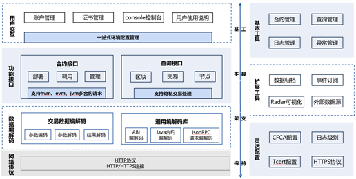

区块链生态组件
=============

多语言SDK
---------

SDK作为应用与Hyperchain交互的工具，是上层应用和区块链平台连接的桥梁。SDK功能强大，用户不仅可以通过SDK快速访问区块链、开发合约编写业务逻辑，还可以通过SDK进行用户管理、事件订阅以及灵活配置。通常，SDK会提供外部API接口，将应用给出的参数进行封装、加密、签名等，形成http请求后发送给平台，平台收到请求后返回结果，然后SDK对返回的结果进行解析，返回给上层，形成上层应用与区块链一个完整的交互流程。为适应不同语言开发工程师管理区块链平台，平台具有多语言SDK支持，如LiteSDK、JavaSDK、GoSDK、JSSDK、CSDK、C#SDK等，优先推荐使用LiteSDK。目前的SDK架构具有完成的功能接口支以及灵活易用的工具支持。

|image0|

SDK整体架构主要分为基本架构和扩展工具两大部分。基本架构可以支持完备高效的主流程操作，包括账户证书管理、合约部署调用、区块交易查询、数据编解码以及安全网络通讯，来进行合约开发的一系列工作；工具支持是基于SDK基本架构构建的一个完备的系统生态，对证书、日志级别、网络协议进行灵活的配置，支持合约、查询、日志、异常管理等基本工具，为了方便用户区块链数据的查询和管理，SDK提供了数据归档、消息订阅以及外部数据源等扩展功能，总而言之，SDK可以满足用户对区块链操作的各种需求。

Frigate测试框架
--------------

Frigate是趣链科技自主研发的通用的区块链性能测试框架，支持趣链区块链平台、Fabric等主流联盟链性能测试。用户可自定义测试场景针对配置好的区块链网络进行性能测试，获取一系列的测试结果并生成测试报告，主要分为交易发送、数据统计、资源监控、报告生成四大功能。

1.	交易发送 

交易发送包括测试环境配置、测试用例设计、交易封装发送、受测平台适配四个步骤。

-	测试环境配置：用户可通过测试参数配置以及平台连接配置自定义压力测试的环境。其中，测试参数配置主要涉及配置文件中各参数的设置，平台连接配置指对测试时的底层适配器进行配置。
-	测试用例设计：测试用例设计即测试脚本编写，主要控制测试生成的负载。受测平台可在SDK接口中进行测试用例的函数入口约定，压测工具只提供接口，具体测试用例需自己根据需求进行设计。
-	交易封装发送：压测工具通过SDK进行交易封装与发送，将交易生成接口化。测试工具仅提供接口与受测平台进行对接，由受测平台自行完成底层适配。测试框架可发送转账交易、合约调用交易等多种类型的交易。
-	受测平台适配：性能测试框架只提供适配接口，受测平台在Friagte提供的统一SDK接口基础上，继承类Blockchain并重写相应方法进行底层适配。

2.	数据统计 

本地化数据统计，记录交易执行过程中系统各类型数据，压测结束之后，在visual/index.html页面有压测过程中统计的数据，可用浏览器打开进行可视化查阅（默认是关闭数据统计的，需要在配置文件中开启）。

3.	资源监控 

在区块链系统中植入资源监控的功能，对服务器进行资源、用量指标的监控和采样。

4.	报告生成 

性能测试框架在按照设定的测试时长正常退出之后会自动生成一份测试报告。报告分成Overview和Details两个部分。Overview中会记录测试的总体数据，并且大致展示压测交易的执行情况。Details会展示一些本地的总体统计数据，系统根据调用的函数名进行聚合统计。

Archive-reader浏览器
--------------------

当数据完成归档后，此部分数据将无法在区块链上查阅，因此平台提供了Archive-reader浏览器用于查阅归档数据。该浏览器无需与区块链部署在同一服务器上，用户可在独立的服务器上运行Archive-reader浏览器，并导入相关归档数据即可开始查阅。同时，Archive-reader浏览器支持包括数据索引功能在内的快速数据检索服务。由此，平台实现了归档数据持续可查、灵活查阅的高易用性。

消息订阅
-------

Hyperchain作为一个“共享状态”的区块链实现，其运转通过不断的状态变迁实现。每一次状态变迁，都会产生相应的一系列事件作为本次状态变迁的标志。

为了方便外部业务系统捕获、监听区块链的状态变化，我们提供了消息订阅功能，现已支持rabbit MQ和KafKa双模式。外部可以监听到的事件类型包括：

-	**区块事件** ：每产生新的区块都将主动向订阅者推送最新区块信息；
-	**合约事件** ：合约相关的事件触发（比如合约上账户余额变动）将会向订阅者推送消息；
-	**交易事件** ：写入区块的交易的交易体与交易回执都会主动推送给订阅者；
-	**系统异常事件** ：当平台有异常抛出或者系统状态改变的时候，便会向订阅者主动推送消息。

