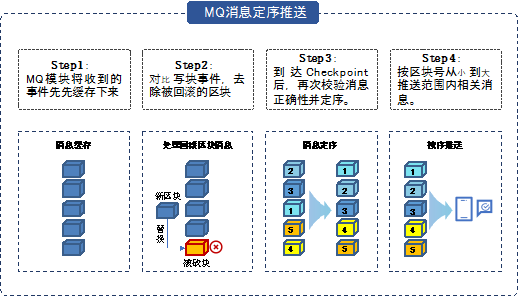

区块链生态组件
^^^^^^^^^^^^^^^

Archive-Reader浏览器
----------------------

数据归档中介绍了平台支持对区块数据的归档与恢复。当数据完成归档后，此部分数据将无法在区块链上查阅，因此平台提供了Archive-reader浏览器用于查阅归档数据。该浏览器无需与区块链部署在同一服务器上，用户可在独立的服务器上运行Archive-reader浏览器，并导入相关归档数据即可开始查阅。同时，Archive-reader浏览器支持包括数据索引功能在内的快速数据检索服务。由此，平台实现了归档数据持续可查、灵活查阅的高易用性。

状态证明组件使用archive Reader二进制，通过在其上增加api的形式提供账本数据验证及验证结果查询功能。

趣链区块链浏览器
----------------------

趣链区块链平台v2.7版本发布了趣链区块链浏览器（内嵌版Baas），趣链区块链浏览器是管理人员可视化管理hyperchain相关链上业务的可视化工具，支持基于web页面查看区块链上信息、节点/合约实例可视化管理等核心操作。包括节点信息查看、节点配置，合约部署、查看、调用、升级、冻结、解冻等。

消息订阅
---------

趣链区块链平台作为一个“共享状态”的区块链实现，其运转通过不断的状态变迁实现。每一次状态变迁，都会产生相应的一系列事件作为本次状态变迁的标志。

为了方便外部业务系统捕获、监听区块链的状态变化，我们提供了消息订阅功能，现已支持rabbit MQ和KafKa双模式。外部可以监听到的事件类型包括：

- **区块事件&交易事件** ：产生新的区块都将主动向订阅者推送最新区块信息，区块信息主要包括区块号、区块哈希、交易及交易回执等；
- **合约事件** ：合约事件（如合约账户上的余额变动）触发后将主动向订阅者推送消息，合约事件由用户在编写合约时自行定义，推送信息主要包括合约地址、合约事件的具体内容等；
- **系统异常事件** ：当平台有异常抛出或者共识状态发生变更时，会主动向订阅者推送消息，触发的事件类型包括viewChange（主节点切换）、systemBusy（节点打包失败）、recovery（节点数据恢复）、stateUpdate（节点状态更新）、confChange（节点增删）。
- **文件保险箱事件** ：用户使用文件保险箱功能（详见3.5.3章节）时，当文件存入文件系统且相关交易上链后会主动向订阅者推送消息，推送信息包括文件内容、文件哈希等。

为保障消息推送内容及推送顺序的正确性，平台将在区块链达到共识稳定点前，将上一共识稳定点至今的待推送消息进行临时存储。当区块链达到共识稳定点后，将对待推送消息按区块顺序进行排序，并按顺序对外推送消息，保障了用户接收到的消息内容及顺序的正确性。

HyperBench测试框架
----------------------

HyperBench是趣链科技自主研发的通用的区块链性能测试框架，支持趣链区块链平台、Fabric等主流联盟链性能测试。用户可自定义测试场景针对配置好的区块链网络进行性能测试，获取一系列的测试结果并生成测试报告，主要分为交易发送、数据统计、资源监控、报告生成四大功能。

1. **交易发送**

交易发送包括测试环境配置、测试用例设计、交易封装发送、受测平台适配四个步骤。

- 测试环境配置：用户可通过测试参数配置以及平台连接配置自定义压力测试的环境。其中，测试参数配置主要涉及配置文件中各参数的设置，平台连接配置指对测试时的底层适配器进行配置。
- 受测平台适配：性能测试框架只提供适配接口，受测平台在Hyperbench提供的统一SDK接口基础上，继承类Blockchain并重写相应方法进行底层适配。

2. **数据统计**

本地化数据统计，记录交易执行过程中系统各类型数据，压测结束之后，在visual/index.html页面有压测过程中统计的数据，可用浏览器打开进行可视化查阅（默认是关闭数据统计的，需要在配置文件中开启）。

3. **资源监控**

在区块链系统中植入资源监控的功能，对服务器进行资源、用量指标的监控和采样。

4. **报告生成**

性能测试框架在按照设定的测试时长正常退出之后会自动生成一份测试报告。报告分成Overview和Details两个部分。Overview中会记录测试的总体数据，并且大致展示压测交易的执行情况。Details会展示一些本地的总体统计数据，系统根据调用的函数名进行聚合统计。

5. **HyperBench 白皮书**
https://upload.hyperchain.cn/HyperBench%E7%99%BD%E7%9A%AE%E4%B9%A6.pdf

