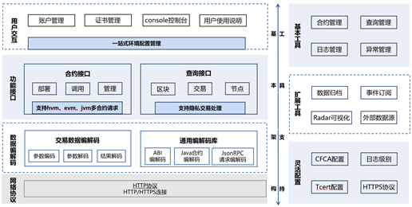

外部接口
^^^^^^^^^^^^^^^

多语言SDK
------------

SDK作为与趣链区块链平台交互的工具，是上层应用和区块链平台连接的桥梁。SDK功能强大，用户不仅可以通过SDK快速访问区块链、开发合约编写业务逻辑，还可以通过SDK进行用户管理、事件订阅以及灵活配置。通常，SDK会提供外部API接口，将应用给出的参数进行封装、加密、签名等，形成http请求后发送给平台，平台收到请求后返回结果，然后SDK对返回的结果进行解析，返回给上层，形成上层应用与区块链一个完整的交互流程。为适应不同语言开发工程师管理区块链平台，平台具有多语言SDK支持，如JavaSDK、GoSDK、JSSDK、CSDK、C#SDK等，优先推荐使用JavaSDK。目前的SDK架构具有完成的功能接口支以及灵活易用的工具支持。

|image0|

SDK整体架构主要分为基本架构和扩展工具两大部分。基本架构可以支持完备高效的主流程操作，包括账户证书管理、合约部署调用、区块交易查询、数据编解码以及安全网络通讯，来进行合约开发的一系列工作；工具支持是基于SDK基本架构构建的一个完备的系统生态，对证书、日志级别、网络协议进行灵活的配置，支持合约、查询、日志、异常管理等基本工具，为了方便用户区块链数据的查询和管理，SDK提供了数据归档、消息订阅以及外部数据源等扩展功能，总而言之，SDK可以满足用户对区块链操作的各种需求。

JSON-RPC
------------

JSON-RPC是一个无状态且轻量级的远程过程调用(RPC)协议。它允许运行在基于socket、http等诸多不同消息传输环境的同一进程中,其使用JSON作为数据格式。发送一个请求对象至服务端代表一个RPC调用,一个请求对象包含下列成员:

- jsonrpc:指定JSON-RPC协议版本的字符串,如果是2.0版本,则必须准确写为 “2.0”。
- method:表示所要调用方法名称的字符串。以RPC开头的方法名,用英文句号(U+002E or ASCII 46)连接的为预留给RPC内部的方法名及扩展名,且不能在其他地方使用。
- params:调用方法所需要的结构化参数值,该成员参数可以被省略。
- id:已建立客户端的唯一标识id,该值必须包含一个字符串、数值或NULL值。如果不包含该成员则被认定为是一次通知调用。该值一般不为NULL,若为数值则应为整数。

当发起一次rpc调用时,服务端都必须回复一个JSON对象作为响应,响应对象包含下列成员: 

- jsonrpc: 指定JSON-RPC协议版本的字符串,如果是2.0版本,则必须准确写为“2.0”。 
- result: 该成员在成功时必须包含，当调用方法失败时必须不包含该成员。服务端中的被调用方法决定了该成员的值。 
- error: 该成员在失败时必须包含，当没有错误引起时,不包含该成员。若引起错误,则该成员对象将包含code和message两个属性。 
- id: 该成员必须包含。该成员值必须与请求对象中的id成员值一致。若在检查请求对象id时错误(例如参数错误或无效请求),则该值必须为空值（NULL）。 

gRPC消息推送
------------

gPRC消息推送主要替代依赖于第三方mq进行消息推送的问题，消息推送主要包含grpc层、mq模块层及sdk端的调用，调用方式主要支持普通调用模式、服务端单向流调用模式、客户端单向流调用模式及双向流调用模式。

1. **普通调用模式**：最为传统的调用方式，即客户端发起一次请求，服务端响应一个数据；
2. **服务端单向调用模式**：这种模式是客户端发起一次请求，服务端返回一段连续的数据流；
3. **客户端单向调用模式**：与服务端数据流模式相反，这次是客户端源源不断的向服务端发送数据流，而在发送结束后，由服务端返回一个响应；
4. **双向流调用模式**：客户端和服务端都可以向对方发送数据流，这个时候双方的数据可以同时互相发送，也就是可以实现实时交互。

