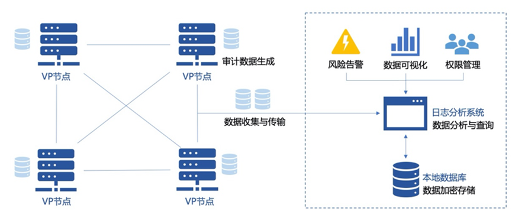
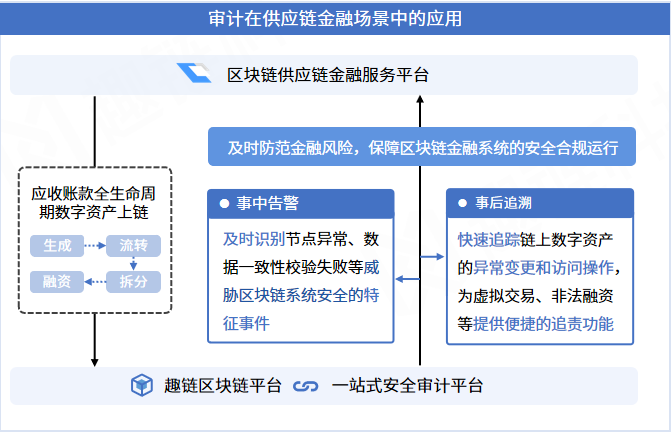
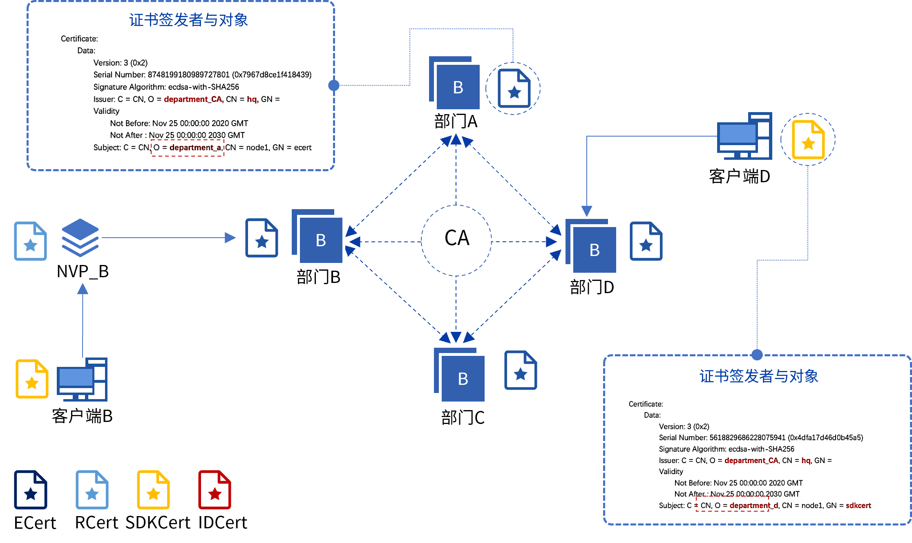
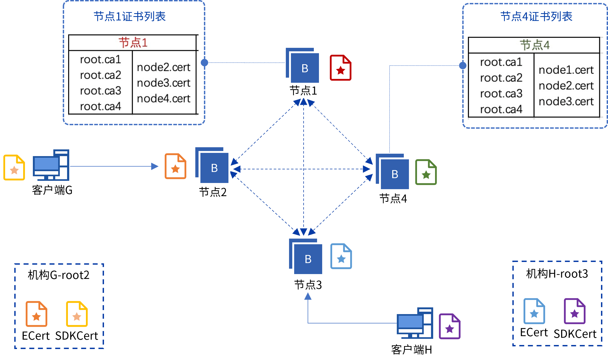

治理与审计
^^^^^^^^^^

身份认证/准入机制
-----------------

平台使用CA证书体系进行联盟成员的准入控制。主要分为集中式CA认证体系、分布式CA认证体系两种方式。根据业务需求，任一节点可能参与一个或多个业务分区，所有在同一个分区中的节点都处于同一条链上，不同的分区处于不同的链上。不同的分区将拥有各自的证书体系，分区间不共享证书体系。

中心化CA
>>>>>>>>>>>

中心化CA认证体系可以由可信机构提供，也可通过自建CA体系实现。平台已通过集成CFCA（China Financial Certification Authority）实现数字证书管理功能，适用于对于证书系统安全性与权威性有较高要求的银行或金融机构；自建CA体系需要建设独立的PKI／CA系统，并且建立完整的运营管理体系。中心化CA证书体系的证书类型与签发关系如下图所示：

|image0|

在中心化CA模型下，每个节点需配置其参与的每个分区所信任的CA，将CA的根证书配置到成员管理文件夹（MSP）中，后续该节点在与其他节点建立P2P网络连接时（节点加入区块链阶段），该节点将信任由成员管理文件夹中所记录的CA根证书所签发的数字证书。因为，数字证书签发能力由若干CA掌握，因此我们称其为中心化CA。

|image6|

分布式CA
>>>>>>>>>>>

分布式CA体系认证管理是将证书管理权限由中心机构移到联盟链各参与方，联盟网络节点互相颁发准入证书给其他网络节点，在建立连接阶段完成证书认证。分布式CA治理具有去中心、自动化、高效等优点。如：网络中有四个节点（node1、node2、node3、node4），node1需要与其他三个节点交互需要三个节点各向它签发一个证书。在该结构下，暂不支持非共识节点（NVP）。分布式CA证书体系的证书类型与签发关系如下图所示

|image1|

由上述两种身份认证CA模型可以看出，平台的身份准入控制是通过多类型的数字证书进行区分与控制的。平台所涉及的身份证书说明如下:

- **RootCA** :RootCA（Root Certificate Authority）为根证书颁发机构，代表PKI体系中的信任锚。在节点连接时，若节点的信任锚与其他链上节点的信任锚不同，则无法与其他节点成功建立连接。
- **ECert** :ECert是节点准入证书，持有ECert的节点为共识节点，可以同链上其他节点同步数据并参与共识。在节点连接时，若节点的ECert无法通过证书合法性校验，则无法与其他节点成功建立连接。
- **RCert** :RCert主要是用于证明该节点是受信任的准入节点，该节点为非共识节点（NVP），不可参与共识验证，仅允许向特定共识节点同步账本数据。在节点连接时，若节点的RCert无法通过证书合法性校验，则无法与其他节点成功建立连接。
- **SDKCert** :SDKCert 为客户端的准入证书，用于证明客户端的合法性，非法的客户端将无法向节点发出请求。每一个SDKCert将对应连接一个节点。若一个客户端需要连接多个节点，则该客户端连接每个节点都需要一个SDKCert。在交易发送时，若客户端的SDKCert无法通过证书合法性校验，则交易将无法被节点接收。
- **IDCert** :IDCert为账户证书，用于维持账户地址与账户密钥间的映射关系。依此证书，账户将获得注册、冻结/解冻、密钥重置、注销的账户生命周期管理功能。
- **TLSCert** :TLSCert(Transport Layer Security Cert) 为安全传输层协议证书。TlsCert 用于传输层安全协议证书，即在传输网络传输过程中需要验证传输层安全协议证书的安全性，验证通过即可以进行正常网络通信，反之则无法进行网络通信。

在分布式CA模型下，每个节点将拥有独立的根证书，并使用该根证书签发网络连接身份证明所需的数字证书。在初次加入区块链网络时，节点将与其他区块链节点两两互换证书，节点增删事项以提案的形式提交至区块链中进行投票共识决议。因为该模式下，节点是两两相互签发认证证书的，无需指定的CA进行签发，具有分布式认证的特征，遂称为分布式CA。在分布式CA体系下，SDKCert和IDCert皆由某一节点的根证书签发。

|image7|

用户账户体系
------------

公私钥对是用户在联盟链平台中进行交易发起、账户操作的主要元素，为标识用户在联盟链中的账户进而基于公钥通过数学运算生成一个账户地址，该账户地址即为用户在区块链上的标识。不同的应用场景对账户的使用需求和管理需求各不相同，针对不同的账户体系需求，趣链区块链平台提供两类账户标识、三类用户账户。两类账户标识分别是普通账户标识和DID账户标识，三类用户账户分别是普通账户、证书账户、DID账户。

- **普通账户** 使用普通账户标识，为链上的基础账户，是另外两类账户的基础，但该账户不具备账户生命周期管理能力，亦不具备密钥更换的能力，因此使用普通账户的用户应妥善保管其私钥。
- **证书账户** 使用普通账户标识，为链上的高安全账户。普通账户经CA认证获得IDCert后可升级为证书账户，用户也可直接向CA申请IDCert注册证书账户。证书账户具有账户生命周期管理功能，且支持密钥更换，具有高安全的特点，但对区块链的开销较大，不建议注册大量证书账户，适用于业务场景中具有强安全需求的账户。
- **DID账户** 使用DID账户标识，每一个DID账户标识都有一个普通账户标识与之对应。用户需要基于DID账户使用分布式数字身份的功能。用户可自主将普通账户升级为DID账户，亦可在初次注册时直接注册DID账户。DID账户支持账户生命周期管理能力，可为每个DID账户定义不同的管理员账户，支持密钥更换，具有灵活、安全、易用的特点。

分布式数字身份（DID）
>>>>>>>>>>>>>>>>>>>>>>

趣链提供用户自主可控、全域自发现的分布式数字身份（Decentralized Identity, DID），将用户身份的管控权还给用户，并打破跨平台间的信息屏障。一个用户的数字身份由DID、DID文档、可验证凭证三个部分组成。每一个DID都必须拥有唯一的DID文档，但拥有不定数量的可验证凭证。

- **DID** 为用户在数字世界的标识，对每一个所使用的数字应用，用户都将有一个DID数字身份。
- **DID文档** 为DID在数字世界的身份档案，包含账户公钥、账户状态、授权管理账户等。倘若用户未注册DID账户，链上将无DID文档的记录，则无法签发和接收可验证凭证，他人也无法在该区块链中寻得未注册的DID账户。
- **可验证凭证** 为桥接用户数字世界身份与现实世界身份的桥梁，用于表述、证明DID账户持有人在现实世界的身份属性，具有描述性、可验证的特点。用户可部署智能合约，通过智能合约进行可验证凭证的验证和使用。

|image5|

多级权限管理
-------------

联盟链的准入机制虽然能一定程度上保障安全性，但缺乏针对不同角色的细粒度的权限管理。因此，为了支撑更丰富复杂的商业应用场景需求，平台建立了多层级权限管理体系，进一步保障商业隐私和安全。

目前，平台设有系统管理员、审计管理员、节点管理员、合约操作员以及用户五个主要账户角色：

- 系统管理员 :参与区块链级别的权限管理，包括节点管理、系统升级、合约升级的权限控制，往往是各联盟机构指定的内部超级管理员。节点准入、系统升级这种链级别的操作权限需由系统管理员代表联盟各机构投票决定。链级权限管理需要借助联盟自治框架进行提案发起与提案投票，详见章节联盟自治CAF。
- 节点管理员 :往往是各联盟机构指定的运维管理员，参与节点级别的访问权限管理。节点管理员责任包括：向受节点信任的客户端颁发SDK证书，配置用户权限表，分配用户访问SDK的权限，比如访问调用合约的权限、获取区块权限等。
- 合约管理员 :负责对链上已部署的智能合约进行运维管理。平台支持合约管理员或合约部署者对智能合约发起合约升级、合约冻结、合约解冻、合约禁用、合约访问权限的操作提案。合约管理员需借助联盟自治框架对上述提案进行发起与投票，投票通过的提案由平台执行提案。
- 用户 :普通用户，可按规则参与链上交易，可被赋予上述管理员角色。

联盟自治框架CAF
---------------

为了满足灵活多变、迭代更替的业务规则，平台提出了一种具备联盟协商、迭代升级的联盟自治框架CAF（Consortium Autonomous Framework），由管理员共同形成“联盟自治成员组织”，以联盟协商的形式管理联盟链。该框架适用于一切链级的变更，如节点增删、合约升级等。

1. 系统管理委员会：由系统管理员组成，负责系统级提案及节点增删提案的商议与投票。
2. 合约管理委员会：由合约管理员组成，负责合约管理与合约升级等提案的商议与投票。

|image2|

提案从创建到执行的整个流程，具体如下：

1. 系统管理或合约管理的行为，会被申请人以提案形式提交给相应的委员会；
2. 所有组织成员根据自身制定的投票策略对每个提案作出判断；
3. 当组织中同意该提案的成员数量达到预设阈值时，提案被通过；
4. 所有链上节点根据通过提案的内容自动变更节点状态。

其中，提案的提出、表决、通过等核心逻辑都依托于智能合约实现。由于智能合约在不同节点间的状态由平台的共识算法保证，能保持时刻同步且严格一致，因此借助智能合约为载体，可以高效实现提案事件的分发以及投票结果的聚合。

目前，CAF可灵活用于共识节点管理、成员角色管理以及智能合约管理三类应用场景：

- **共识节点管理** :现有联盟链的节点变更往往与管理机构身份认证绑定，身份认证一般都是由CA授权认证，成为多中心区块链系统中的身份认证中心。CAF利用预编译智能合约，支持系统不停机的进行联盟成员增删提案发起、提案投票、提案执行，使成员变更流程具有多中心化的特点，同时整个协商过程也公开透明。
- **成员角色管理** :联盟链中系统管理员的增删、合约管理员的增删都需由系统管理员进行提案，并由提案前的系统管理委员会进行投票表决，平台对符合预设投票规则的提案予以执行，完成成员角色管理。
- **智能合约管理** :传统的合约升级方式只能由合约部署者发起合约升级交易完成，这种方式一方面存在单点故障风险，导致合约无法升级，另一方面合约部署者可能在没征得其余参与方同意的情况下，单方面进行合约升级。基于CAF，组织成员可事先指定升级策略写入智能合约，在需要升级时由部署者或合约管理员发起提案，借助权限受控的合约自升级指令，解决智能合约的升级问题。

安全审计服务
------------

随着区块链商业应用的步伐加快，如何通过有效审计来保障区块链系统及数据安全是区块链行业发展需要重点关注的问题。央行于今年发布了《金融分布式账本技术安全规范》和《区块链技术金融应用评估规则》，被业内视为区块链在金融行业内应用的重要标准，两份标准都对区块链系统的安全审计提出了明确要求。

为此，平台推出了区块链系统安全审计服务，帮助审计方对系统事件展开精确有效的审计工作，全面符合金融级审计要求。

作为审计对象的系统事件包括账本数据访问记录、变更记录、同步记录，节点共识历史以及系统异常事件等。事件在平台内部以日志形式进行记录和采集，再通过外接日志分析系统，实现日志的快速检索、风险告警以及可视化展示功能。

|image3|

平台的审计日志中记录了丰富的事件信息，一方面支持对异常操作和安全事故进行追本溯源，另一方面也帮助用户建立一套贴合实际业务场景的安全告警机制，及时防范风险。这里的告警规则是灵活可配的，为了降低使用门槛，平台预先将审计事件分为NORMAL、WARN、RISK三个风险等级，并以字段形式记录在审计日志中，用户可按需对不同等级的事件进行告警。此外，平台也支持用户根据审计日志中的IP、用户、时间、操作内容等字段信息，按需设置用户访问黑白名单等规则，适应多样化的应用场景。

安全审计服务的使用十分便捷，用户只需要在启动平台之前修改配置文件开启审计即可。平台现已适配GaryLog和ELK两种常用日志分析系统，用户可根据实际需求进行选择。

除了符合《金融分布式账本技术安全规范》以及《区块链技术金融应用评估规则》的要求，该功能可在供应链金融等多个领域发挥潜在价值。以区块链供应链金融服务平台为例，借助安全审计平台，一方面可以帮助用户及时识别节点异常、数据一致性校验失败等威胁系统正常运行的特征事件，避免风险进一步扩大导致服务中断；另一方面，事后能快速追踪链上数字资产的异常变更和访问操作，为虚拟交易、非法融资等提供便捷的追责功能。

|image4|

