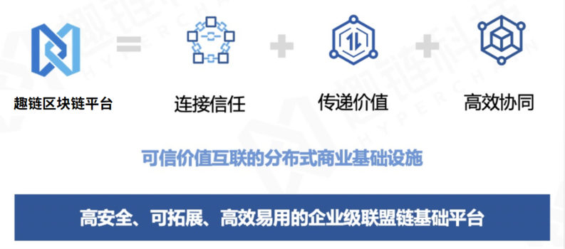
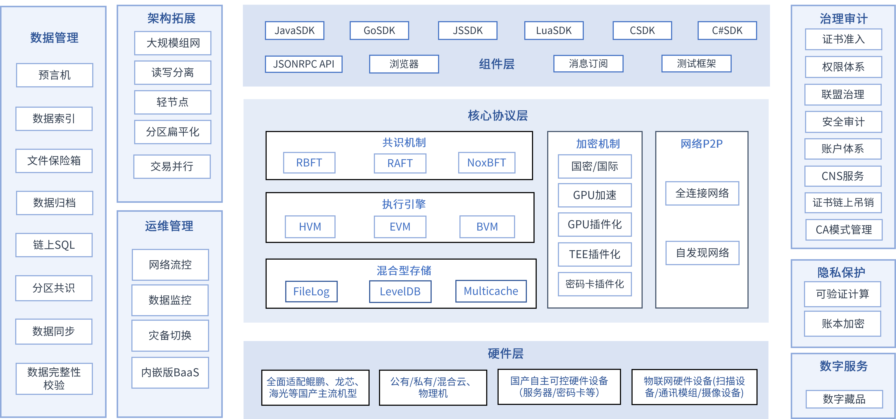
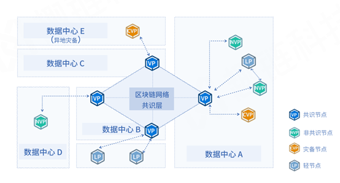

平台介绍
============

1. 产品简介
---------------
趣链区块链底层平台Hyperchain历时多年打磨，是领先全球的新一代国产自主可控平台，以高性能、高可用、可扩展、易运维、强隐私保护、混合型存储等特性更好的支撑企业、政府、产业联盟等行业应用，促进多机构间价值高效流通，是国内第一批通过工信部标准院与信通院区块链标准测试并符合国家战略安全规划的区块链核心技术平台。

|image0|

2. 产品特性
---------------

高性能
^^^^^^^

-	实际标准投产环境中(8核16G，HDD机械硬盘的标准服务器)下可达3.7wTPS，单链硬件加速条件下性能可达5wTPS
- 原生高性能智能合约引擎沙箱Java/Solidity
-	硬件加速 GPU/FPGA

高安全
^^^^^^^

-	全国密支持：首个提供全国密支持，包括国密证书、国密TLS、SSL协议
-	多级加密机制：数据指纹（SHA-3, SM3），数字签名（椭圆曲线ECDSA,SM2）
-	通信安全：实现密钥协商技术对传输层数据加密（ECDH,3DES,SM4）
-	机构安全：基于CA的权限控制与准入机制，集成CFCA，实现分布式CA
-	可信执行环境：基于TEE的节点密钥管理和数据加密存储

高可用
^^^^^^^

-	动态数据失效恢复机制
-	动态增删节点
-	热备切换

强隐私
^^^^^^^

-	命名空间业务隔离与数据隔离
-	隐私交易，交易粒度的隐私保护
-	分级权限管理机制，合约访问权限控制
-	基于加法同态的数据隐私保护（AHRE）
-	零知识证明（zk-snarks）

可扩展
^^^^^^^

-	支持每日1T数据上链，支持GB级大文件存储，支持多类型数据可信存储，并提供数据定期归档支持
-	支持跨域多层级路由转发，支持IPv4、IPv6协议以及IPv4和IPv6协议混用，可自定义子协议
-	支持NoxBFT、RBFT、RAFT、SOLO（单机版）多类型共识算法
-	支持同构跨链、异构跨链

易运维
^^^^^^^

-	CAF联盟自治框架
-	可视化监控平台
-	合约全生命周期管理，无缝升级
-	支持多种主流语言SDK
-	支持高效数据索引
-	支持复杂查询、数据报表
-	区块链组件模块化、容器化支持
-	BaaS平台提供一站式区块链服务

3. 整体架构
---------------

平台具有万级TPS吞吐量和毫秒级系统延迟，支持交易级别的隐私数据保护、混合型数据存储、可信执行环境、联盟自治、预言机以及可视化运维等特性。

|image1|

- **基础物理层** ：包括物理机云平台等基础资源，并配以硬件加密机、密码卡等安全设配，物联网硬件设备，使平台可在云服务、软硬件结合、物联网等多种场景下安全稳定运行；
- **核心协议层** ：区块链的核心组成部分，主要包括共识算法、P2P网络、智能合约引擎以及存储引擎等组件，为整个区块链网络提供安全可信的支撑环境；
- **扩展组件层** ：构建于协议层之上，基于区块链网络为上层应用扩展提供安全、高效、友好、易用的功能特性，如支持大规模组网模型，数据隐私保护、成员自治管理、账本加密、可视化数据运维等，打造最佳应用体验；
- **接口管理层** ：面向区块链用户，支持多种协议的 RPC/API 接口以及SDK软件开发工具，提供应用与区块链交互的桥梁。

4. 核心功能
---------------

1. 自适应共识算法

平台支持RBFT、NoxBFT、RAFT等多种共识算法，用户可以根据区块链中不同的网络环境和业务场景采用最优的共识算法。

- **RBFT** ：一种高鲁棒性拜占庭共识算法。可以在节点数据强一致性的情况下支持万级TPS和毫秒级延迟。并且通过内部Recovery机制支持节点动态管理和失效数据恢复，很好的满足区块链商业应用中高性能、高鲁棒性、高可用的需求。
- **NoxBFT** ：一种支持大规模组网的新型共识算法。可支持上千节点规模共识组网。通过聚合签名、活性机制等方法将网络复杂度由O(n2)降低至O(n)，有效解决大规模节点组网场景下共识效率低下、可扩展性不强的问题。
- **RAFT** ：一种高可信分布式共识算法，相比RBFT可以容忍更多的错误节点，整体性能优于RBFT，但在其共识网络环境下不能容忍拜占庭错误（节点作恶，发送错误消息等），适用于高可信的联盟链网络环境或者企业内部私有化部署。

2. P2P网络

平台支持gRPC和QUIC网络协议，通过自适应路由进行网络节点自发现，支持跨域转发机制，降低网络连接数。

3. 加密机制

平台采用可插拔多级加密机制，从不同层级保证平台安全。消息摘要（SHA3/SHA-256/SM3）保证数字安全，数字签名（ECDSA/ED25519/SM2）保证身份安全，密钥协商（ECDH/SM2）、密文传输（AES/SM4）与TLS保证通信安全，并实现基于GPU/FPGA加速的验签算法,以及基于ED25519的批量验签，满足大规模并发计算的需求。同时集成硬件密码卡，提供密钥存储和随机数生成等功能。

4. 存储模型

平台自研区块数据专用存储引擎FileLog，支状态数据存储引擎LevelDB、索引数据存储引擎MongoDB，并设计状态数据多级缓存机制，现已支持日均TB级数据量链上存储。

5. 执行引擎

平台支持Java、Solidity、Go等多种主流合约语言，并配以HVM、EVM、BVM等多种合约执行引擎，提供完善的合约全生命周期管理，具有编程友好、合约安全、执行高效的特性。其中自主研发的HVM支持Java语言合约编写、分层调用模式、合约访问控制和丰富的工具方法集等特性。

6. 拓展架构

- **大规模组网** ：大规模组网模型支持多类型节点的分层部署，以共识节点层为中心，凭借非共识节点层实现区块链数据网络扩展，依靠轻节点层实现区块链验证网络扩展，最后通过轻客户端层将数以万计的物联网终端设备接入区块链，实现数十万不同类型网络节点的大规模部署。

- **读写分离** ：平台提供非验证节点NVP，不参与共识，仅同步账本数据，通过提供交易转发、查询等服务，实现读写分离，减轻VP节点及共识网络压力，保证区块链系统的高效运行。

7. 隐私保护

- **分区共识** ：将业务场景中互不相关的敏感交易通过分区进行数据存储和执行空间的隔离，数据存储和执行过程在不同分区之间不可见，通过分区隔离实现隐私保护。
- **隐私交易** ：采取将交易明细只存储在相关方，交易哈希公开广播全网的方式，保证了隐私交易有效隔离和可信验证，实现交易的可验不可见。
- **账本加密** ：账本加密通过TEE可信执行环境将用户的账户信息和业务数据进行按需加密，在保证安全性的同时做到可查验可审计。 

8. 治理审计

- **身份认证/准入机制** ：平台采取集中式认证体系、分布式认证体系两种方式实现准入控制。集中式认证体系包括自建CA和CFCA两种证书体系，其中 CFCA满足对于证书系统安全性与权威性有较高要求的银行或金融机构的需求。分布式认证体系将证书管理权限由中心机构转移到联盟链各参与方，具有去中心、自动化、高效等优点。
- **多级权限管理** ：将链上账户角色划分为链级管理员、节点管理员、审计管理员、合约管理员以及普通用户，通过链级联盟自治管理CAF、节点级证书授权访问控制、用户级合约权限访问控制等方式，实现多层级管理和限制，为系统及账本数据管理提供全方位安全性保障。
- **联盟自治CAF** ：采取在联盟链网络中创建联盟链自治成员组织，通过提案和投票的形式在组织内部表决联盟中的状态行为（系统升级、合约升级、成员管理等）的方式，实现了一种促进链自我改进的有效治理机制。
- **安全审计** ：通过日志采集分析系统，允许审计方对全量账本数据及系统日志展开精确有效的审计工作，并建立实时风险预警机制，完全符合央行《金融分布式账本技术安全规范》的审计标准。

9. 数据管理

- **数据归档** ：将旧的线上区块数据归档移到线下转存，同时提供Archive Reader用于归档数据浏览。
- **数据索引** ：将关键数据存储底层索引数据库中，支持语句粒度的查询记录，满足高效检索、监管友好的需求。
- **可信文件共享** ：支持GB级大文件的可信存储、安全共享与高效查询，同时支持用户按需存储。
- **可信数据源** ：采用Oracle预言机服务，将外界信息写入到区块链内，完成区块链与现实世界的数据互通。

10.	运维管理
- **网络流控** ：平台提供交易拦截、消息分发、带宽限流等多维度网络流量控制服务，在请求激增场景下保证系统的稳定运行，提高系统可用性。
- **数据监控** ：平台提供一站式数据可视化监控服务，满足业务数据大屏展示需求，同时帮助运维人员轻松了解底层平台运行情况，快速定位问题。
- **灾备切换** ：平台提供灾备节点CVP，在必要时可快速升级为共识节点VP，有效降低运维门槛，保障系统高可用。

11.	完备生态组件

- **多语言SDK** ：平台提供LiteSDK/JavaSDK、GoSDK、JSSDK、CSSDK以及LuaSDk等多语言SDK工具集，支持不同语言的开发工程师更方便快速地开发区块链应用。
- **Hyperbench测试框架** ：平台自研通用区块链测试框架Hyperbench，支持针对趣链区块链平台、Fabric等主流联盟链平台的性能测试。
- **消息订阅** ：支持rabbit MQ和KafKa双模式，以便外部系统捕获、监听区块链平台的状态变化，实现链上链下的消息互通。

5. 国产自主可控
---------------

平台集成国产自主可控的服务器硬件，打造符合国家信创标准的区块链软硬件一体机设备，为开发者提供强隐私、高性能、高安全、即用即上链的区块链技术服务；针对政务、军事等对安全性有严格要求的场景，进一步集成区块链密码卡、网络共识加速器、可信执行环境等硬件设备与技术，构建区块链领域专用安全自主可控设备包括：申泰 RM5000-F服务器、申泰 RM5020-L服务器、华为TaiShan 2280服务器等。

6. 节点类型
-----------

平台节点分为验证节点（VP，Validate Peer）、非验证节点（NVP，Non-Validate Peer）、热备节点（CVP，Candidate VP）三类：
- VP指区块链网络中参与共识验证的节点；
- NVP指区块链网络中不参与共识验证，仅同步账本数据的节点；
- CVP指区块链网络中提供灾备服务的节点，在必要时可升级为VP。

|image2|

7. 交易流程
----------

平台在进行数据操作时，通常以一笔交易的形式在区块链网络中进行流转，用户存储的数据和合约都存储在交易结构当中，其具体的运转流程如下图所示：

|image3|

1. **交易发起** ：在客户端发起一笔交易之前，需要拿到证书管理中心（CA）颁发的准入证书，并且所需智能合约已经部署在区块链节点上。联盟机构通过部署在机构内部的后台应用服务进行交易，然后通过调用SDK发交易的API接口生成一条交易，SDK会用客户端指定的用户私钥对交易进行签名，再对交易进行JSON-RPC协议封装。
2. **交易共识** ：当交易通过以上验证后，交易请求会汇集到统一的消息分发事件总线，事件总线收到消息后会转发给共识模块，执行共识流程，如RBFT算法共识即为三阶段流程共识。
3. **交易确认** ：交易共识完成后，证明多方已经确认该笔交易顺序及内容的正确性，在此之后会将打包的交易提交给虚拟机执行引擎，进行执行操作。
4. **交易执行** ：交易执行会将交易体结构进行解析，解析的主要内容为交易的主体信息（交易体）以及交易中的合约信息（合约体），执行引擎会根据交易的内容和合约的业务逻辑进行相关业务操作。
5. **交易存储** ：交易执行之后，会对交易信息（区块数据）和合约信息（状态数据）进行持久化操作，同步写入区块和账本，最终持久化到FileLog和LevelDB中，至此完成整个交易流程。

.. |image3| image:: ../../images/deal1.png

