.. _Certgen-manage:

Certgen使用手册
^^^^^^^^^^^^^^^^^^

一、安装包获取
===============

1.1下载
----------

可以通过OA系统或者飞洛下载

目前提供多种操作系统版本下载

|image0|

1.2安装包结构
-----------------

安装包解压后包含certgen二进制文件、README.md文档、依赖库tools和两个脚本文件。两个脚本分别为install.sh和gencert.sh。前者可以完成安装功能，后者可以快速生成证书套件。

二、安装（可选步骤）
==================

certgen二进制文件本身是编译好的命令行工具，能够提供全部功能。gencert.sh脚本能够简化生成证书套件的操作，帮助快速生成可供flato使用的证书套件。

我们提供开箱即用的使用体验，当下载解压并进入解压后的目录后，这两个可执行文件（certgen和gencert.sh）已经完成工作。例如:

|image1|

但是此时仅能够在当前目录中使用该工具，我们建议此时执行安装脚本install.sh完成安装。您可以查看install.sh脚本的内容。

三、快速上手
=============

**certgen** 提供了证书和密钥的验证、签发、补发和相关套件的一系列功能。cergen有五个命令，主要功能可以分为三类：

**1. 生成证书、私钥等文件；**

**2. 查看私钥、相关证书文件的具体内容；**

**3. 验证证书的合法性和有效性。**

建议您查看README.md的内容以便学习certgen的使用。但是也有一些快速上手的方式，下面我们逐一介绍。

3.1利用certgen的提示功能快速上手
----------------------------------

为了提供完备功能，certgen有若干条命令，每条命令都有若干选项可以指定。我不建议您尝试记忆这些命令和选择，利用certgen的提示功能是快速上手的好办法。

例如直接在命令行键入certgen（如果没有安装则需要进入到certgen所在目录执行./certgen），则可以看到全部命令，您将了解到生成根证书的命令为gs。这时您还不知道gs需要哪些参数或者选项，没有关系，现在您可以键入certgen gs来查看帮助：

|image2|

可以看到，Example中提供了最基础的用法实例，大部分情况下您直接按照example执行即可。而下方的flags是详细的选项说明。

***注意⚠️：可以使用flag直接指定相关内容，也可以留空通过交互式操作手动填充关键信息。*** 详情可分别通过根命令和子命令的 `--help` 自行查看相关用法。

3.2通过查看gencert.sh脚本内容快速上手
------------------------------------

gencert.sh是bash脚本，可以用来自动化生成一整套的证书套件。如果您熟悉bash脚本的语法，那么阅读gencert.sh也可以快速了解到certgen的使用方法。

3.3使用gencert.sh脚本
------------------------

gencert.sh是交互式的，只会询问必要的参数选项即可生成一套证书套件，例如执行国密算法和非分布式ca，并且输入一些选项即可生成证书目录。

非分布式CA

|image3|

分布式CA：

|image4|

tls证书：

|image5|

生成的证书目录certsDir结构如下：

非分布式CA下有按照节点名称命名的目录，以node1为例，其目录结构如下图:

|image6|

分布式CA下有按照节点名称命名的目录，以node1为例，其目录结构如下图：

|image7|

tls,生成的tls证书被放在当前路径的tlsCertsDir目录下，其内的结构如图：

|image8|

以配置node1的global下证书为例，只需要将certsDir下的CA和certs目录拷贝到节点目录./namespaces/global/certs下即可。替换后的节点目录如下：

|image9|

四、命令详解
=================

4.1. **生成**
----------------

**1.1** `gc` 命令通过根CA签发子证书(请查阅附录所有的flag用法)

示例 1(全交互式)：假设需要一个子证书。

终端输入： `certgen gc ./root_ca.pem ./root_priv.pem ./sub.pem`

终端输出：

|image10|

*删除光标处的内容后可以输入其他证书类型*

|image11|

*若成功，输出如上图所示*

***

示例 2(使用flag)：假设需要一个ecert类型的子证书(且为CA证书)，有P10请求文件。主机名为node2，组织为Hyperchain，曲线为p256类型。

终端输入： `certgen gc ./root_ca.pem ./root_priv.pem ./sub.pem --p10 ./p10.csr --cn node2 --org Hyperchain --c p256 --ct ecert --isca yroot_ca.pem: CA证书文件root_priv.pem: CA私钥文件sub.pem: 目标子证书文件P10.csr: P10请求文件路径`

终端输出：

|image12|

*若成功，输出如上图所示*

***

**1.2** `gs` 命令生成自签名证书类似于 `gc` 命令，flag减少为四个，分别为 `--c, --cn, --ct, --org`

示例 1(全交互式)：假设需要一个自签名证书。

终端输入： `certgen gs ./root_ca.pem ./root_priv.pem`

终端输出：

|image13|

*删除光标处内容后可以输入其他曲线类型*

同 `gc` 命令的交互式反馈

|image14|

*若成功，输出如上图所示*

***

示例 2(使用flag)：假设需要一个ecert类型的自签名子证书，主机名为node3，组织为HyperChain，曲线为p256类型。

终端输入： `certgen gs ./root_ca.pem ./root_priv.pem --ct ecert --cn node2 --org Hyperchain --c p256`

终端输出：

|image15|

*若成功，输出如上图所示*

***

**1.3**  `gk` 命令生成PEM格式的私钥

示例 1(交互式)：生成一个密钥对，然后终端输入加密算法

终端输入： `certgen gk ./PrivKey.pem ./PubKey.pem`

终端输出：

|image16|

*删除光标处内容后可以输入其他曲线，如p256, sm2*

|image17|

若成功，输出如上图所示

示例 2(使用flag)：生成一个使用secp256k1的密钥对

终端输入： `certgen gk ./PrivKey.pem ./PubKey.pem --c secp256k1`

示例 3(使用flag)：生成一对使用p256的密钥对

终端输入： `certgen gk ./PrivKey.pem ./PubKey.pem --c p256`

示例 4(使用flag)：生成一个使用sm2的密钥对

终端输入： `certgen gk ./PrivKey.pem ./PubKey.pem --c sm2`

终端输出：

|image18|

*若成功，示例2、3、4的输出如上图所示*

`PrivKey.pem: 目标私钥文件`

`PubKey.pem: 目标公钥文件`

***

**1.4**  `gp` 命令合并私钥和对应证书生成pfx证书

终端输入： `certgen gp ./cert.pem ./priv.pem ./tartget.pfx --pwd 12345`

***

**1.5**  `env` 命令编码并输出输入的路径；解码并创建输入的编码后的路径

示例 1：

终端输入： `certgen env /DirA/DirB/`

终端输出： `Base64编码后的路径名`

示例 2：

终端输入： `certgen env base64路径名 --decode`

***

4.2. **查看信息**
-------------------

`print` 命令打印相关信息,如密钥对(私钥/公钥)，证书

终端输入：

`certgen print ./PrivKey.pem certgen print ./PubKey.pemPrivKey.pem: 需要打印的私钥文件PubKey.pem: 需要打印的公钥文件`

***注意⚠️：如果私钥创建时没有设置passphrase，则不需填写password(密码)。***

假设输入一个无 *passphrase* 的P256曲线的PEM私钥，输出如下::

    Private Key:    ECDSA Private Key
        D:0x8a47c85fa6439c45c5369995158de14f8a5f2df3ba31c5c27bfbd50809b4a5aa
    Public Key:    ECDSA Public Key, Curve Name: P-256
        X:0x347ea1811a00c37024c502ab711772d27b29ba814bde47772c62f44bc73770be
        Y:0x333be106d78a67e532cdccea800769e08a64a84182ce374339ced1bbe3f22e6
    Addr: 0x1c117c590ca127ad224f82c52496e8810f63d2f9
    Public PEM :
    -----BEGIN PUBLIC KEY-----
    MFkwEwYHKoZIzj0CAQYIKoZIzj0DAQcDQgAENH6hgRoAw3AkxQKrcRdy0nspuoFL
    3kd3LGL0S8c3cL4DM74QbXimflMs3M6oAHaeCKZKhBgs43QznO0bvj8i5g==
    -----END PUBLIC KEY-----

***

终端输入： `certgen print ./X509.pemX509.pem: 需要打印的证书文件`

假设输入一个 *ecert* 类型证书文件，输出如下::

    Certificate:
        Data:
            //版本
            Version: 3
            //序列号
            Serial Number: 0x1
            //签名算法
            Signature Algorithm: ECDSA-SHA256
            //颁发者
            Issuer: CN=node1,O=flato,C=ZH
            //有效期
            Validity
                //此前无效
                Not Before: 2020-09-09 01:57:04 +0000 UTC
                //此后无效
                Not After : 2120-08-16 02:57:04 +0000 UTC
            //主题
            Subject: CN=node1,O=flato,C=ZH
            //主题公钥信息
            Subject Public Key Info:
                //公钥算法
                Public Key Algorithm: ECDSA
                //公钥长度
                Public-Key: (256 bit)
                //公钥
                Pub(in HEX, length: 65):
                    04be4a031f974728c6c080b775ebafd23828c74dd788c1214992bc56d2fa748f
                    d5c40ad83d737c6bcd801d3c4a317e934ab347ad03f85acc475681f51a5187df
                    c0
                //使用了p256曲线的椭圆函数
                CURVE: P-256
            //扩展部分
            X509v3 extensions:
                X509v3 Key Usage: critical
                    DigitalSignature
                X509v3 Extended Key Usage:
                    ClientAuth, ServerAuth, 1.2.3, 2.59.1
                //基本约束
                X509v3 Basic Constraints: critical
                    Is CA: true
                //主题关键标识符
                X509v3 Subject Key Identifier:
                    0x040401020304
            //签名算法
            Signature Algorithm: ECDSA-SHA256
            //签名
            Signature(in HEX, length: 71):
                304502206a457087bf7442b867d33e2359ea95aeab4d3719906f45afbefa5026
                    04d021ac022100cf89b5cfa82e405f8494943a90fd40d6f82c0c6bc858abdc63
                    0f5dcbbd3ecb18

***

4.3. **证书验证**
-----------------------

`cc` 命令负责验证目标证书是是否由CA签发

终端输入：

`certgen cc ./root_ca.pem ./cert.pemroot_ca.pem: CA证书文件cert.pem: 需要验证的证书文件`

如果验证通过，输出::

    Check the sub cert is signed by root cert or not
    > root cert: root_ca.pem
    > sub cert: cert.pem
    ======================
    SUCCESS

***

如果验证失败，输出::

    Check the sub cert is signed by root cert or not
    > root cert: root_ca.pem
    > sub cert: cert.pem
    ======================
    FAILED, reason:x509: invalid signature: parent certificate cannot sign this kind of certificate

***

4.4生成IDCert（账户证书）
---------------------------

 使用gc命令可以签发账户证书。其中账户证书中绑定的地址需要通过--cn指定

 ::

    certgen gc ./root.ca ./root.priv   ./idcert.cert \
    --cn "ffffffffff04dd69707ba4aa9d350a59d1aaaaa1" \
    --to "2221-10-30" --ct idcert

通过上述命令产生./idcert.cert文件，该文件为pen编码的x509格式，其中不包含私钥信息，不能直接用于在SDK中新建账户。通过openssl的pkcs12命令可以将格式转换为需要的pfx格式。需要两个输入为证书和私钥。

 ::

    openssl pkcs12 -export \
    -out certificate.pfx -inkey subcert.priv -in idcert.cert

  注意，pfx是有加密保护的格式，因此在生成pfx证书时需要输入密码。此后SDK调用NewAccount时需要传入此密码。

Appendix
--------------

相关参数::

    必须通过参数指定
    CACertPath: 根CA证书的路径
    CAPrivPath:  根CA私钥的路径
    SubCertPath: 目标子证书的路径

    必须通过flag或者交互式(二选一)指定
    CertType: 证书类型

flag说明::

    CertType: --ct，证书的类型。支持三种类型的参数，为“ecert”、“rcert”和“sdkcert”
    SubPub: --pub，用于子证书的公钥文件路径
    SubJson: --json， 用于子证书的账号文件路径(json类型的文件)
    P10: --p10，用于子证书的p10文件路径
    PWD: --pwd，用于加密文件的密码
    IsCA: --isca，指定是否将子证书指定为CA证书(参数为y/n，默认为n)
    HostName: --cn，指定hostname或者domain。默认为node1
    Organization: --org，指定组织名称。默认为flato
    Curve: --c，指定曲线的类型。支持三种类型，为“p256”、“secp256k1”和“sm2”
    SubCertPrivPath: --priv，指定子证书私钥的生成路径
	NVP: --nvp 后面参数为NVP或LP要绑定的VP节点的hostname

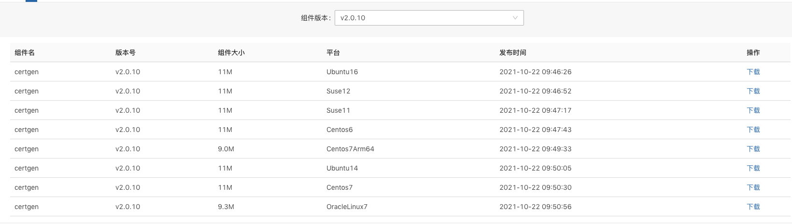
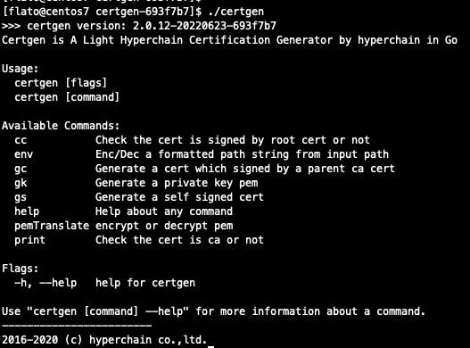
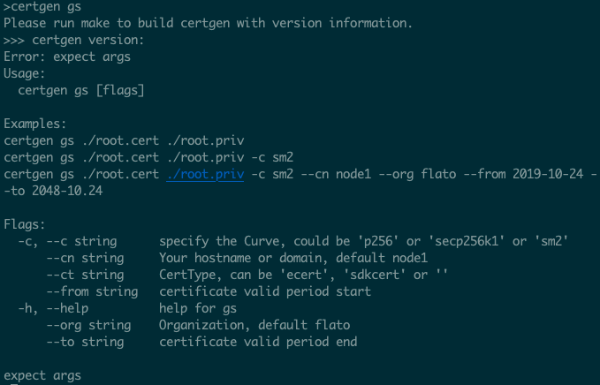
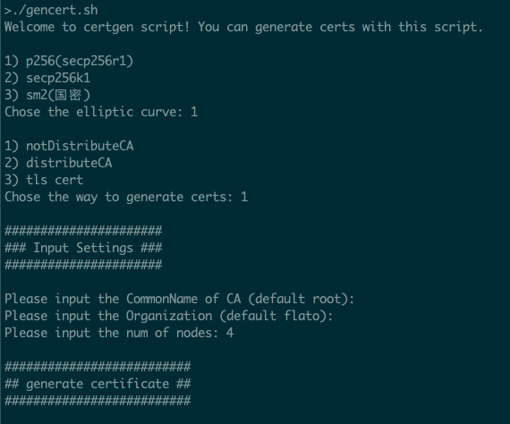
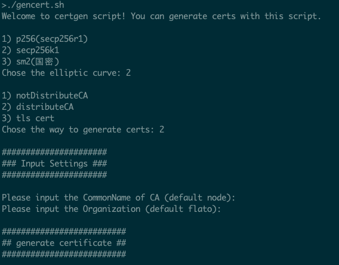
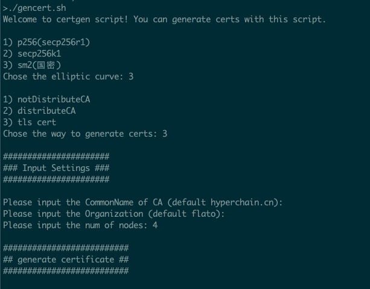
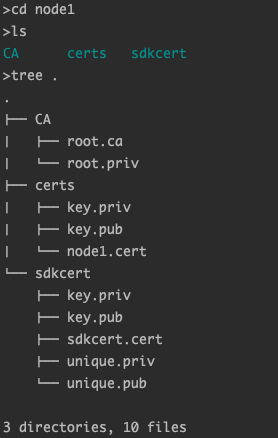
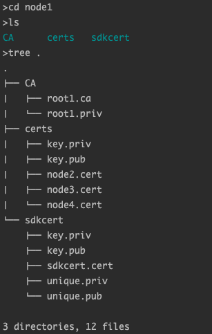
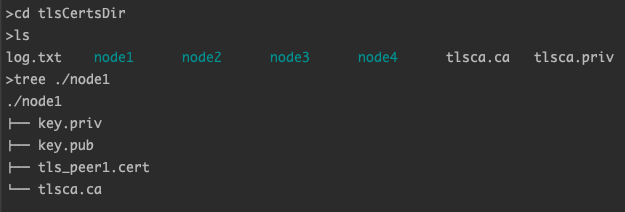
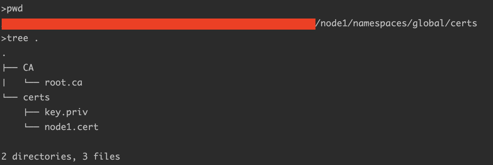

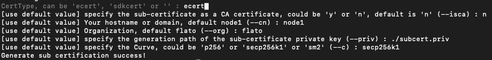
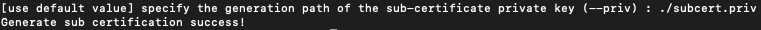

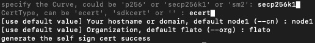

.. |image16| image:: ../../../images/certgen16.jpg
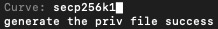

