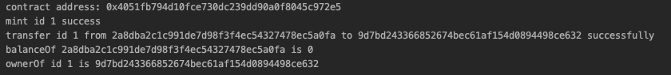

.. _NFT-and-contract-writing:

数字藏品合约编写
===============

前言
------

数字藏品作为近期区块链领域的热点之一而备受大众关注，因其利用区块链技术，数字藏品便有了唯一不可篡改的凭证，在保护其数字版权的基础上，实现真实可信的数字化发行、购买、收藏和使用。但是数字藏品是如何产生的、它是如何流转的，以及又是如何与区块链进行结合起来保护数字藏品的安全的这些问题却不被大众所了解，区块链上的数字藏品对普通人而言还存在着一定的门槛。

概念介绍
-----------

智能合约？
>>>>>>>>>>

智能合约，是一段写在区块链上的代码，一旦某个事件触发合约中的条款，代码即自动执行。也就是说，满足条件就执行，不需要人为操控。

简单来说，智能合约就是一种把我们生活中的合约数字化，当满足一定条件后，可以由程序自动执行的技术。我们的生活中处处充满着合约，就好比你跟我做了一个约定，我们订好了奖惩措施，但由于种种原因可能没法履行其中的条款，出现了无法履约的情况，而在进入赔付环节，往往会出现毁约，失约，耍赖的情况，最后弄得有理说不清。但是如果我们把约定通过代码的形式，录入区块链中，一旦触发约定时的条件，就会有程序来自动执行，这就是智能合约。

数字藏品？
>>>>>>>>>

NFT全称为Non-Fungible Tokens，即“非同质化代币”。

同质化代币又称可互换型代币，各代币之间没有任何区别，可以随意交换及拆分整合，每个单位彼此等效，类似于每个面额相同的硬币一样。在以太坊上，有三种代币协议，使用ERC-20协议开发的智能合约生成的token是同质化代币也就是大家说的最多的加密货币，而使用ERC-721和ERC-1155协议开发的智能合约生成的token是非同质化代币也就是大家说的NFT。

NFT实质是一种数字藏品，不以融资为目的，不具有等价交换物特征。数字藏品的创新在于使用区块链技术进行加密编码，在中心化服务之外重新定义原生数字藏品所有权的标记方式，最大特点在于其唯一性、不可拆分性，每一个数字藏品都单独存在，无法相互替代。数字藏品的特性决定了其不可能成为一般等价物或统一的记账单位，因此也不可能成为虚拟货币或代币，它的交易和变现必须通过货币实现。

数字藏品可以通过区块链技术将艺术品、声音、图像、文字、游戏中的物品等任何有价值的内容通证化，生成一个无法篡改的独特编码，将物品转化为数字化抽象物，从而确保其唯一性和真实性，该数字藏品的所有权可实时追溯。这也表明，数字藏品本身并不是交易的对象，通过数字藏品技术转变为数字藏品的商品才是被交易的对象，相应价值也是由数字商品来实现的。

数字藏品合约功能？
>>>>>>>>>>>>>>>>>

假如你想发一套属于自己的系列数字藏品，需要怎么写合约？，这个合约将有可能需要什么功能？

 - ”铸造“功能（mint）：数字藏品是非同质化代币，即一种token，所谓铸造，就是在区块链上记载一个token的ID和其拥有者的地址。
 - 转移功能：即拥有者把一个token转移给另一个人。
 - 查询功能：查询某个token在谁手里，某个人有多少个token等查询功能。
 - 元数据功能：描述某事物各种属性的信息，比如一个人的属性就有姓名、性别、年龄、肤色、身份证号、职业等。一个数字藏品的元数据就比如人物的发型、肤色、性别、年龄等。一般情况下，都先读取某个
 - 合约元数据功能：在数字藏品平台上的一些基本属性设置，其与元数据不同是针对于整个数字藏品系列来说的。
 - 其他：例如团队分账、白名单预售等等。

数字藏品协议
---------------

工欲善其事必先利其器，在对数字藏品进行深入解剖前，需要先了解下数字藏品协议。数字藏品协议是一种约定当前数字藏品项目规范的方式，因为不同的数字藏品项目的需求都不同，其对外提供的接口服务也会因为其项目自身的特殊性而不同。但是没有统一的标准就不适合一个行业的产生，一旦每个数字藏品项目都有其自己的对外提供服务接口，那么对于区块链浏览器、数字钱包和买卖交易双方都将造成很大的困扰，需要为每个数字藏品项目都进行适配，那显然是不合适的。因此需要有数字藏品项目的规范来约定一个数字藏品项目应该提供怎么样的功能以及其接口的出入参格式，方便第三方进行适配统一才能让数字藏品变得流通，所以一个具备标准通用的数字藏品协议就变得十分迫切。

类似以太坊中的ERC721协议，我们在HVM中也提供了相同功能的HPC721协议，让我们来看看协议中的具体内容::

    public interface HPC721 {

        // 声明发生数字藏品转移时触发的event事件
        void eventTransfer(String from, String to, long id);

        // 声明发生某个数字藏品授权时触发的event事件
        void eventApproval(String owner, String approved, long id);

        // 声明发生某个账户授权其所有数字藏品时触发的event事件
        void eventApprovalForAll(String owner, String operator, boolean approved);

        // 查询一个账户拥有的数字藏品数量
        long balanceOf(String owner);

        // 通过数字藏品凭证查询其所有者
        String ownerOf(long id);

        // 转移数字藏品
        void transferFrom(String from, String to, long id);

        // 转移数字藏品，并记录额外调用信息
        void transferFrom(String from, String to, long id, byte[] calldata);

        // 授权数字藏品给某个账户
        void approve(String to, long id);

        // 获取某个数字藏品的授权人
        String getApproved(long id);

        // 设置是否将所有数字藏品给予某个账户权限
        void setApprovalForAll(String operator, boolean approved);

        // 查询某个账户是否具有另一账户的授权
        boolean isApprovedForAll(String owner, String operator);
    }

同时还有HPC721的扩展协议，用来定义数字藏品项目的扩展信息(可按需实现)::

    public interface HPC721Metadata extends HPC721 {

        // 获取数字藏品项目名称
        String name();

        // 获取数字藏品项目的含义
        String symbol();

        // 获取某个数字藏品的uri
        String uri(long id);
    }

简单来讲数字藏品项目就是一个数字藏品合约，而数字藏品协议就是一个合约接口，指定了合约所提供的功能。

实现一个数字藏品合约
-------------------

了解了数字藏品协议以后我们就可以基于上述接口来实现一个数字藏品合约。首先是构建一个HVM合约项目，将合约主类名称之为PropertyContract并实现HPC721协议接口::

    public class PropertyContract extends BaseContract implements HPC721 {
        // ...
    }

定义好合约主类后，我们便可以填充合约主类的内容了，首先是 **定义存储合约数据的账本数据结构** ::

    // 记录账户地址下的数字藏品数量
    @StoreField(hvmType = StoreField.TypeNestedMap)
    private NestedMap<String, Long> balances;

    // 记录某个数字藏品是否授权给某个账户地址
    @StoreField(hvmType = StoreField.TypeNestedMap)
    private NestedMap<Long, String> propertyApprovals;

    // 记录某个账户是否给另一个账户全部数字藏品的授权
    @StoreField(hvmType = StoreField.TypeNestedMap)
    private NestedMap<String, NestedMap<String, Boolean>> operatorApprovals;

分别定义了三个NestedMap结构来存储以下信息：账户地址下的数字藏品数量、某个数字藏品是否授权给某个账户地址和某个账户是否给另一个账户全部数字藏品的授权，用于满足协议中的方法所定义的功能。此处可能会发现与一般的数字藏品合约不同，没有一个存储数字藏品的数据结构，也没有存储数字藏品ID到所有者的对应关系，这是因为我们在HVM中引入了PropertyAccount藏品账户的概念，藏品账户是一种将数字藏品映射为区块链底层账户模型的一种方式，用一个区块链底层账户来存储数字藏品，既能提高执行效率又能提高数据的安全性。

在对合约方法进行正式编写前，还需要定义好合约事件，在某些情况下触发合约事件，外部可以通过合约事件来解析在智能合约中发生的行为，以此一些第三方在获取合约数据时，便有了一个统一方便的方式。 **合约中需要定义的事件** 如下::

    @Override
    public void eventTransfer(String from, String to, long id) {
            event(null,  "Transfer", from, to, String.valueOf(id));
    }

    @Override
    public void eventApproval(String owner, String approved, long id) {
            event(null, "Approval", owner, approved, String.valueOf(id));
    }

    @Override
    public void eventApprovalForAll(String owner, String operator, boolean approved) {
            event(null, "ApprovalForAll", owner, operator, String.valueOf(approved));
    }

三个事件分别在发生数字藏品转移(包括铸造)、授权某个数字藏品和对某个账户的全部数字藏品授权这三个场景下。定义好了事件内容后，便可以完善合约方法的部分了，同时将上述提到的账本数据结构、藏品账户和合约事件融入到合约方法中。

首先是进行 **数字藏品铸造** 。由于铸造数字藏品并不属于协议内容，因此对数字藏品的铸造逻辑的自由度就会大一些::

    public void mintProperty(long id, String owner, String meta) {
        // 检查参数合法性
        if (StringUtil.checkEmpty(owner) || meta == null) {
            throw new RuntimeException("the emit param is illegal");
        }
        // 通过emit0方法铸造藏品账户
        byte[] identity = ByteUtil.longToBytes(id);
        emit0(identity, owner, meta.getBytes());
        // 对owner拥有的藏品数量进行更新
        if (balances.get(owner) == null) {
            balances.put(owner, 1L);
        } else {
            balances.put(owner, balances.get(owner)+1);
        }
        // 发送铸造成功事件
        eventTransfer("", owner, id);
    }

在示例中我们通过了内置的emit0方法铸造生产了一个藏品账户，在藏品账户铸造时要求传入藏品账户的ID、所有者和meta元数据信息，随后更新藏品数量和发送铸造合约事件，因此完成对一个数字藏品的铸造，将来可通过ID来查询到当前合约中的数字藏品藏品账户。

有了数字藏品后我们便可以将数字藏品托管给第三方帮忙进行交易，这里托管的方式有两种，对单一数字藏品进行托管或对账户下所有数字藏品都进行托管，后续的转移将只能由数字藏品所有者或其指定的托管人才有权限操作。

**单一数字藏品托管** ::

    public void approve(String to, long id) {
        // 判断被授权人与拥有者是否一致
        String owner = ownerOf(id);
        if (owner.equals(to)) {
            throw new RuntimeException("approval to current owner");
        }
        // 判断授权人是否为拥有者或被拥有者指定的管理人
        if (!(getSender().equals(owner) && isApprovedForAll(owner, getSender()))) {
            throw new RuntimeException("approve caller is not token owner or approved for all");
        }
        // 更新数字藏品的授权人
        propertyApprovals.put(id, to);
        // 发生数字藏品授权事件
        eventApproval(owner, to, id);
    }

**所有数字藏品托管** ::

    public void setApprovalForAll(String operator, boolean approved) {
        // 判断被授权人与拥有者是否一致
        String owner = getSender();
        if (owner.equals(operator)) {
            throw new RuntimeException("approve to caller");
        }
        // 标记授权人下的所有藏品是否授权给operator
        if (operatorApprovals.get(owner) == null) {
            NestedMap<String, Boolean> nestedMap = new NestedMap<>();
            operatorApprovals.put(owner, nestedMap);
            nestedMap.put(operator, approved);
        } else {
            NestedMap<String, Boolean> nestedMap = operatorApprovals.get(owner);
            nestedMap.put(operator, approved);
        }
        // 发送所有数字藏品授权事件
        eventApprovalForAll(owner, operator, approved);
    }

托管后可通过 `getApproved` 和 `isApprovedForAll` 来查询是否托管的信息:

**查询单个数字藏品托管信息** ::

    public String getApproved(long id) {
        // 判断数字藏品ID是否存在
        getPropertyNotNull(id);
        return propertyApprovals.get(id);
    }

    public PropertyV1 getPropertyNotNull(long id) {
        // 通过getProperty0传入ID读取藏品账户信息
        PropertyV1 property = getProperty0(ByteUtil.longToBytes(id));
        if (property == null) {
            throw new RuntimeException("the property is not exist");
        }
        return property;
    }

查询所有数字藏品托管信息::

    public boolean isApprovedForAll(String owner, String operator) {
        if (operatorApprovals.get(owner) != null) {
            return operatorApprovals.get(owner).get(operator);
        }
        return false;
    }

有了托管功能后便可将数字藏品交由第三方代为管理，当然拥有者仍然具有权限进行管理。

接着我们就可以为 **合约定义转移功能** 了::

    public void transferFrom(String from, String to, long id) {
        // 判断交易操作者是否为藏品的拥有者或者授权人
        if (!isApprovedOrOwner(getSender(), id)) {
            throw new RuntimeException("caller is not token owner or approved");
        }
        // 获取到藏品账户，判断参数from是否为藏品的拥有者
        PropertyV1 property = getPropertyNotNull(id);
        if (!from.equals(property.getOwner())) {
            throw new RuntimeException("transfer from incorrect owner");
        }
        if (StringUtil.checkEmpty(to)) {
            throw new RuntimeException("transfer to the zero address");
        }
        // 移除藏品ID的授权信息以及更新拥有者的藏品数量
        propertyApprovals.remove(id);
        balances.put(from, balances.get(from)-1);
        if (balances.get(to) == null) {
            balances.put(to, 1L);
        } else {
            balances.put(to, balances.get(to)+1);
        }
        // 更新藏品的拥有者信息
        property.setOwner(to);
        // 发送转移藏品事件
        eventTransfer(from, to, id);
    }

由此我们便拥有了一个数字藏品合约项目所需要主要功能，最后再将 **查询数字藏品信息** 的功能补充上，例如查询账户下的藏品数量和查询藏品拥有者信息::

    public long balanceOf(String owner) {
        Long l = balances.get(owner);
        if (l == null) {
            return 0;
        }
        return l;
    }

    public String ownerOf(long id) {
        PropertyV1 property = getPropertyNotNull(id);
        return property.getOwner();
    }

调用数字藏品合约
------------------

最后，我们便可以通过SDK来发起对合约的调用了::

    String contractAddress = deployContract();

    // 铸造ID为1的数字藏品，在藏品meta元信息中填入数字藏品源文件在ipfs上的链接
    {
        InvokeDirectlyParams invokeDirectlyParams = new InvokeDirectlyParams.ParamBuilder("mintProperty")
                .addlong(1)
                .addString(account.getAddress())
                .addString("https://ipfs.io/ipfs/QmPTtdDthdzPM6gWiLhsBUs79LdMmXgTVTcz978c5JsDJF?filename=Image.png")
                .build();
        invokeContract(account, invokeDirectlyParams, String.class, contractAddress);
        System.out.println("mint id 1 success");
    }

    // 将账户下的数字藏品转移给另一个账户
    {
        Account a1 = accountService.genAccount(Algo.SMRAW);
        InvokeDirectlyParams invokeDirectlyParams = new InvokeDirectlyParams.ParamBuilder("transferFrom")
                .addString(account.getAddress())
                .addString(a1.getAddress())
                .addlong(1)
                .build();
        invokeContract(account, invokeDirectlyParams, String.class, contractAddress);
        System.out.println("transfer id 1 from " + account.getAddress() + " to " + a1.getAddress() + " successfully");
    }

    // 查询账户下当前拥有的数字藏品数量，应变为0
    {
        InvokeDirectlyParams invokeDirectlyParams = new InvokeDirectlyParams.ParamBuilder("balanceOf").addString(account.getAddress()).build();
        String ret = invokeContract(account, invokeDirectlyParams, String.class, contractAddress);
        System.out.println("balanceOf " + account.getAddress() + " is " + ret);
    }

    // 查询ID为1的数字藏品的拥有者，应为藏品被转入的账户地址
    {
        InvokeDirectlyParams invokeDirectlyParams = new InvokeDirectlyParams.ParamBuilder("ownerOf").addlong(1).build();
        String ret = invokeContract(account, invokeDirectlyParams, String.class, contractAddress);
        System.out.println("ownerOf id 1 is " + ret);
    }

该调用逻辑模拟了账号A铸造了一个ID为1的数字藏品，并在数字藏品的meta元数据中记录了源文件所在的ipfs地址，随后将数字藏品转移给账户B，之后向合约进行查询发现账户A下的数字藏品数量变为0，且ID为1的数字藏品的拥有者变为了账户B。进行完整的合约调用后将获得如下输出：

|image0|

总结
------

至此我们完成了通过HVM来编写一个数字藏品合约项目，了解了数字藏品协议的内容和作用，并基于数字藏品协议补充了数字藏品合约的内容，最后通过SDK模拟场景调用了编写的合约方法，进行了数字藏品铸造、转移和查询。从这一系列过程中我们发现数字藏品其实也没有那么难理解，其本质上是通过区块链技术进行背书的数字凭证，通过区块链来明确数字藏品的所有权和保障数据安全。

