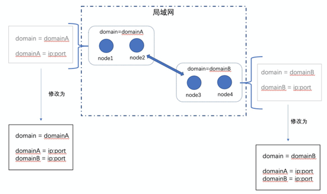
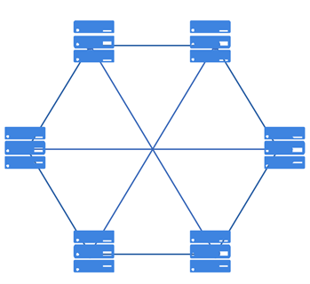
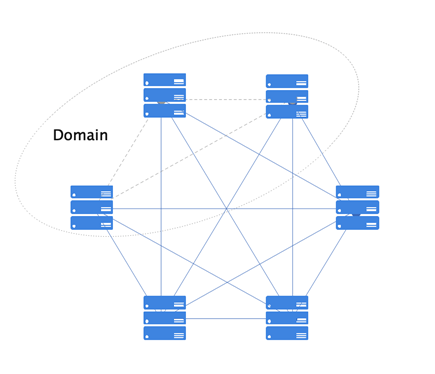
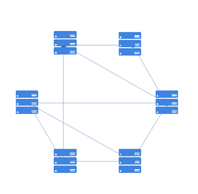

网络协议
^^^^^^^^^

网络协议作为平台的基础协议，主要负责节点发现、节点安全连接的建立、节点握手协商、消息安全传输等功能，同时需要支持弱网和复杂网络环境下，网络连接的可用性、可恢复性和稳定性。在整体设计上，网络模块仅仅负责管理节点间的连接，专注于网络协议的开发，而不参与区块链协议层的逻辑处理，是一个无状态模块。

区块链网络是由按照区块链协议运行的一系列节点的集合，这些节点共同完成特定的计算任务，并共同维护区块链账本的安全性、一致性和不可篡改性。目前，在平台网络模块支持的三种网络模型。

- **DIRECT** ：全连接网络，节点启动之前需要配置网络里所有节点的信息。
.. - **DISCOVER** ：自发现全连接网络，节点启动之前配置网络里部分节点的信息，同一个域下的节点可实现自发现全连接。
- **RELAY** ：自发现转发网络，节点启动之前配置网络里部分节点的信息，且两个节点不在同一域下，未建立直接物理连接，那么两个节点想要相互发送消息，只要网络拓扑里有一条可达路径，就可通过中间节点进行消息转发。

节点发现
--------------
区块链采用P2P的网络作为其底层，区块链中的节点通过特定的发现算法相互发现，进而直接建立通道进行通信。节点发现是任何一个新入网节点连接P2P网络的第一步。通过节点发现的过程，节点能够尽可能地了解网络的全貌，建立自己的网络拓扑，为之后与其他网络节点之间的数据交换建立通信基础。一个好的节点发现算法应该是运行高效的，同时能够对网络拓扑结构的快速变化做出积极响应，并通过一定的随机过程保证节点不会因被恶意节点包围而与网络中的其他诚信节点割裂开来。

平台支持当节点启动配置里的网络模型为DIRECT和RELAY时，节点的网络发现功能将会开启。开启网络发现的节点会将自身的 selfAddr 内容以及收到的来自其他开启网络发现节点的 selfAddr 内容，即节点在不同域名下的IP地址列表，周期性广播给直接相邻节点。

直连网络
--------------

所有节点间两两互连，消息的发送不需要经过中间节点传播直接到达对端，因此，具有实现简单、通信高效的优点，但是网络扩展性不高，而且节点在启动之前需要配置网络里所有的节点网络连接相关信息。

|image0|

自发现全连接网络
-----------------

自发现全连接网络拓扑图如下所示，无需配置全部节点的连接信息，可依据对端节点的连接信息自动识别同域节点信息并建立物理连接（图中灰色连接线为自发现建立的连接），需要注意的是，这种情况下，只可自动在同域节点间建立连接。

|image1|

跨域通信
-----------------

跨域通信基于网络域实现。网络域，与局域网的概念类似，在同一个网络域下的节点可以互相连通，不在同一个网络域名下的节点无法互通。网络域与计算机网络里的局域网差别在于，这里的网络域，指的是逻辑上的网络域，即虽然节点在同一个局域网内且IP互通，但是可以被划分为逻辑上不同的网络域。

不同局域网内的节点肯定处在不同的网络域，同时，通过网络域地址列表，可以让处在同一个局域网内的节点处于不同的网络域，这些网络域都是人为划分的逻辑上的网络域，由区块链系统部署人员或者运维人员来定义区块链集群的网络域。而一个节点是否为跨域节点，同样也是人为指定，由部署人员或运维人员来指定并且设置节点网络域地址列表，网络域地址列表有两个及以上不同domain下的IP的节点即为跨域节点。部署人员或运维人员也可以通过IPC命令线上增加或修改网络域及其地址。

针对新增节点并且新增网络域的场景，平台允许老节点的网络域地址列表里没有新域的情况下，在新节点网络配置正确的前提下，新节点依旧可以与老节点建立起网络连接，同时老节点会动态新增网络域，在自己的网络域地址列表里回写新节点所在的域。也就是说， 网络连接是否能建立起来，完全取决于是否配齐对端节点的可连通地址，不管网络域地址列表配置如何、是否配全，都可以建立起网络连接，但是不同情况下节点可能有不一样的行为表现。

一般来说，一个内网定义为一个网络域，不同内网的节点想要进行通信，则称之为跨域通信。

.. 
 自发现转发网络拓扑
 --------------------
 自发现转发网络的拓扑如下图所示，不需要所有节点两两互连，无需配置所有节点信息，只要整个网络拓扑形成一个连通图即可，因此理论上，网络可无限扩展，但是实现较为复杂且通信可能有一定的延迟。考虑到拜占庭节点的情况，自发现转发网络模型对网络拓扑图的要求很高，网络拓扑需要支持满足拜占庭容错要求，平台提供相应工具工具，可自动生成支持拜占庭容错的网络拓扑。
 |image2|
 gRPC消息推送
 -----------------
 gPRC消息推送主要替代依赖于第三方mq进行消息推送的问题，消息推送主要包含grpc层、mq模块层及sdk端的调用，调用方式主要支持普通调用模式、服务端单向流调用模式、客户端单向流调用模式及双向流调用模式。
 - **普通调用模式** ：最为传统的调用方式，即客户端发起一次请求，服务端响应一个数据；
 - **服务端单向调用模式** ：这种模式是客户端发起一次请求，服务端返回一段连续的数据流；
 - **客户端单向调用模式** ：与服务端数据流模式相反，这次是客户端源源不断的向服务端发送数据流，而在发送结束后，由服务端返回一个响应；
 - **双向流调用模式** ：客户端和服务端都可以向对方发送数据流，这个时候双方的数据可以同时互相发送，也就是可以实现实时交互。

