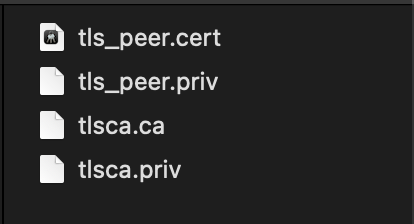

.. _CVP-User-Manual:

灾备节点介绍
^^^^^^^^^^^

功能说明
==========

CVP是一个独立运行的节点，可以对 **线上节点（目前包括VP、NVP）进行实时的容灾备份，当线上节点发生了不可恢复的错误时，通过运维命令自动对CVP进行升级，替代原节点继续工作** 。实际使用过程中，CVP和线上节点仅支持一对一连接。

Hyperchain中支持 **分区共识** 功能，即一个节点上可以同时运行多个完全隔离的分区，节点在不同分区内可以是不同的角色，如VP或者NVP。CVP提供节点级别的热备服务，可以对目标 **节点** 进行完全的备份，即不论目标节点上有多少分区、不同分区内的节点角色（VP或NVP）是否一致，均可以实现备份。

数据同步
=========

CVP上的备份数据主要包括：

- 相连节点的配置文件；

- 相连节点上所有分区的MQ注册队列；

- 相连节点上所有分区的链上数据（包括区块及账本数据）。

**本节将对CVP的工作方式进行简单介绍，具体操作请参考第二到第四章节内容。**

配置文件
---------

为了使CVP能够替代线上节点工作，CVP节点的二进制所在目录中需要保存两份配置文件：

- `configuration` 目录下保存CVP节点自己运行时所需的配置文件，如数据库路径、证书路径、网络等配置，可以参考《运维手册》对CVP进行必要的配置；

- `system/cvp/configuration_vp` 目录下保存了CVP节点所连接的线上节点的全量配置文件， **这份配置文件由CVP自动同步并保持更新，无须用户手动准备** 。

CVP会对目标节点上的配置文件进行全量的同步，当CVP连接到目标节点，并且完成一次握手后，会触发一次同步，而后续若发生网络断连恢复或节点重启等事件时也会触发一次同步；我们提供了IPC命令以及RPC命令对一些配置项进行在线的修改（不宕机），那么对于有一些比较重要的配置项的在线修改，也会以 **强同步** 的方式同步至CVP上。这里的强同步指的是一次配置文件的修改，需要在目标节点和CVP节点都完成修改后，才正常返回。

MQ队列
-------

CVP会在进行握手的时机进行 **全量MQ队列的同步** ；在线上节点上进行的MQ队列的 **注册/解注册事件也** 将会被自动同步至CVP节点，无须用户手动在CVP节点上重复注册。同样的，事件同步方式为强一致，即完成队列注册操作意味着两个节点都注册完成了该队列，保证CVP升级后能继续提供完整的MQ服务。

**需要注意的是，CVP只同步队列，不同步MQ消息。**

链上数据
-----------

 **CVP将自动同步线上节点所有分区的区块及账本数据。** 与前述同步方式不同，链上数据的同步是 **弱一致** 的，这种方式可以尽可能地保证线上节点的性能不受太大影响。

节点准备
==========

配置文件
-----------

为了启用CVP功能，需要对以下配置文件进行修改：

修改系统级别dynamic.toml
>>>>>>>>>>>>>>>>>>>>>>>>>>

 `configuration/dynamic.toml` 中需要修改的配置项如下所示::

 [cvp]
 enable    = false
 node_type = "provider"
 remote     = [""]

上述配置项的具体含义如下所示：

- `enable` ：是否开启CVP功能，CVP要与目标节点建立连接，双方必须开启该字段，可通过IPC命令动态开启该开关；

- `node_type` ：节点类型，可选项为provider或receiver，CVP配置为receiver，线上节点配置为provider；

- `remote` ：对端节点的hostname以及地址。

**举例来说，一份正确的新增配置如下所示**::

 // 线上节点配置如下
 [cvp]
 enable = true
 node_type = "provider"
 remote = ["cvp 127.0.0.1:50015"]

 // CVP节点配置如下
 enable = true
 node_type = "receiver"
 remote = ["node1 127.0.0.1:50011"]

修改Namespace级别ns_dynamic.toml
>>>>>>>>>>>>>>>>>>>>>>>>>>>>>>>>>>>

仅CVP节点需要修改ns_dynamic.toml配置文件，沿用前一节中的例子，CVP节点的 `configuration/global/ns_dynamic.toml` 的正确修改如下所示::

 [self]
 n         = 1           # 运行时修改。表示所连vp节点的个数，该值在节点运行过程中会实时变化。
 hostname    = "cvp"   # 本地节点的hostname名称
 new         = false     # 运行时修改。新节点成功加入网络以后，该值会变为false。
 type        = "cvp"
 trustNodes  = false     #运行时修改。节点成功加入共识以后，该值会变为false。当需要信任配置当nodes列表时，将此值配为true

 [[nodes]]
 hostname    = "node1"
 score       = 10

即对于CVP节点来说，其只连接一个节点，因此nodes字段只保留一个节点的信息；self字段中，将n修改为1，且节点自身类型配置为 “cvp” 。

私钥准备
==========

作为一个灾备节点，CVP需要随时顶替线上继续工作，因此CVP需要在启动之前为每个分区配备相应的节点私钥，从而在其升级后与其他节点建立连接。

由于私钥性质特殊，用户需要在CVP启动前进行 **手动备份** ，即将目标的节点私钥放置于CVP每个分区的 `certs/certs` 目录下。

TLS准备
---------

若要开启目标节点与CVP节点之间的安全连接，则需要为CVP节点配置TLS。具体来说，在CVP节点的 **根目录** 下创建一个 `tls目录` ，目录中配备合法的TLS证书、TLS私钥与CA、CA私钥，如下图所示：

|image0|

随后进入 `system.toml` 配置文件，对如下字段进行配置::

 [p2p]
 enableTLS = true

**CVP和目标可以共用同一份TLS数据，且要求两者同时开启或关闭上述配置开关。**

启动节点
----------

在完成上述准备后，可以通过 `start.sh` 脚本或 `./hyperchain` 来启动节点。由于节点之间可以动态地建立连接，因此无须同时启动。

对于线上节点来说，当其开启了CVP功能却未连接任何CVP节点时，节点仍然可用（共识打包、交易执行、数据查询等），但不会向任何CVP节点备份数据。此时若有CVP节点主动连接该节点，则这两个节点可以成功建立连接并开始数据备份。

对于CVP节点来说，若其未连接任何线上节点，则除了有限的查询接口外（见附录），不提供任何服务。

可以通过在 **线上节点** 上执行IPC命令 `cvp status` 来查询与CVP的连接状态，若展示结果为 **normal** ，说明CVP正常工作。

启动成功后，hyperchain二进制所在根目录会创建一个 `system/cvp` 目录，其中记录了CVP功能相关的元数据，除此之外，完成一次握手之后CVP会在根目录生成一个 `system/cvp/configuration_vp` 目录，其中存储了CVP所备份的线上节点的配置文件， **在正常情况下绝对不能删除上述两个目录。**

CVP升级
===========

**在确认目标节点宕机离线后** ， **运维人员可对CVP节点进行升级。**

通过IPC命令 `cvp upgrade` 完成CVP的在线升级，有如下事项需要注意：

- 确保CVP升级之前，目标节点已经宕机；

- 确保CVP升级之前，其根目录下存在 `configuration_vp` 目录，该目录在两个节点第一次建立连接并握手之后会同步至CVP节点；

- CVP升级之后会以原VP的身份（hostname, 证书等)尝试与其他节点建立连接，因此需要确保CVP与线上其他节点网络的连通性；

- 由于链上数据的同步是弱一致的，CVP升级之后的区块高度可能是落后的，可自动通过数据同步恢复；

运维命令
===========

平台提供CVP连接状态查询、CVP动态启停、CVP升级三类IPC运维命令。

连接状态查询
------------

命令： `cvp status` （ **该条命令只能在线上节点上执行** ）

查询CVP和VP的连接状态，包含两种返回信息：

- cvp is normal：连接正常；

- cvp is abnormal：连接异常；

动态开启CVP功能
-----------------

命令： `cvp enable` （ **该条命令只能在线上节点上执行** ）

开启CVP功能，节点将被动和CVP建立连接。当 `cvp enable` 命令执行成功后，配置文件 `dynamic.toml` 中的 `cvp.enable` 字段变为true，若在已开启CVP功能的情况下使用此命令将会出错，但不会影响系统状态。

**使用场景示例：**

线上节点处在未开启CVP功能且正常运行中的状态，此时若希望**在不停节点的情况下添加一个CVP节点**，则需要：

1. 在线上节点上执行 `cvp enable` 命令；

2. 准备并启动CVP节点，该CVP节点配置了线上节点的地址等信息，线上节点**不需要**进行任何配置修改；

3. 启动CVP之后若能通过 `cvp status` 命令查询正常状态，说明节点间连接建立成功，CVP开始正常工作。

动态关闭CVP功能
================

命令： `cvp disable` （ **该条命令只能在线上节点上执行** ）

关闭CVP功能，此时线上节点将主动断开与CVP的物理连接，并不再接收来自其他CVP的连接请求。当 `cvp disable` 命令执行成功后，配置文件 `dynamic.toml` 中的 `cvp.enable` 字段将变为false。

**使用场景示例：**

线上节点与对应的CVP节点正常工作中，此时若希望停止CVP的备份服务，则可以通过直接在线上节点上执行 `cvp disable` 命令完成。

动态升级CVP
==============

命令： `cvp upgrade` （**该条命令只能在CVP上执行**）

升级CVP，具体可参考 **第三章《CVP升级》** 。

注意事项
===========

连接/工作模式
---------------

1. 在当前版本中仅支持CVP和线上节点的一对一连接；

2. 不支持一个CVP节点在不清除旧数据的情况下，更换所连接的线上节点；

3. 网络波动、CVP节点宕机等异常事件并不会对线上节点服务造成影响；

4. CVP对线上节点造成的性能影响非常有限；

5. CVP宕机后线上节点将继续工作，但数据同步会停止，当CVP重启后将自动备份所缺数据。

分区管理
---------

一般来说，有两种新增分区的方式：

- 修改配置文件后重启节点

- 通过IPC命令动态新增

两种方式都需要提前在特定目录中准备好待新增的配置文件、证书等数据。 **这些数据同样也需要在CVP上提前准备好** ，若未在CVP上提前准备，将直接以目标节点的配置文件启动CVP上的新分区，因此 **若两者的节点环境（路径、开放端口等）完全一致，则可以不用为CVP准备配置文件和证书。**

原则上，目标节点和CVP上启动的分区必须完全匹配，因此在握手中过程中会进行分区状态的检查，若发现不一致，则会自动恢复至匹配的状态，如目标节点运行了ns1，ns2两个分区，而CVP连接时只有ns3一个分区，那么在完成握手后，CVP节点会自动停止ns3分区，并以目标节点的相关配置运行ns1，ns2两个分区。

数据索引
-----------

数据索引功能需要外接MongoDB数据库，用于存储区块数据的索引信息，详情可参考《数据索引使用手册》。

**CVP和目标节点的数据索引开关应保持一致** ，即同时开启或同时关闭，否则CVP将无法与目标节点成功建立连接。

除了索引开关，CVP上的其他配置项可按照《数据索引使用手册》的内容进行独立配置。注意，若配置错误导致索引数据库没有正常启动，CVP将无法完成索引数据的灾备，待CVP升级后需要重新生成这部分数据，在区块数量很多的情况下，这一过程将花费很长时间，从而影响正常业务运行。因此，为了规避上述风险，**在目标节点开启数据索引功能的情况下，请务必检查CVP上的索引数据库是否正常启动**。

此外，由于二层索引可在不停机的情况下进行动态创建且耗时较短，因此CVP未进行二层索引的一致性检查和同步，用户可在CVP上手动调用IPC命令创建相应的二层索引。

可信文件共享
--------------

可信文件共享功能需要外接文件系统，用于存储原文件数据，详情可参考《可信文件共享使用手册》。

CVP节点不支持可信文件共享功能。

**CVP节点不会备份上传至VP的文件，若有需要请自行对文件进行备份。**

安全审计
-----------

安全审计功能需要配置审计后端，用于存储审计日志数据，详情可参考《安全审计使用手册》。

CVP节点不支持安全审计功能。

**CVP节点不会备份审计数据，因此推荐采用ELK或Graylog审计后端，CVP升级之后可以直接使用这部分审计数据。**

CVP节点开放功能
----------------

CVP节点的核心功能是备份，因此只保留有限的开放接口，如下：

- 禁用所有的IPC接口，只保留 `cvp upgrade` 命令；

- 禁用大部分RPC请求，开放接口见附录。

证书
--------

CVP不需要线上节点为其颁发的证书，而只需要一份合法的TLS的证书即可与线上节点进行通信。在连接初始的握手阶段，CVP会同步线上节点所有分区的证书信息，以供升级后继续使用，而对于线下手动替换的证书，若不重启节点或网络则无法让CVP同步到更新后的证书，此时也需要手动将证书放到CVP节点的对应目录下，或在CVP升级后进行证书替换。CVP证书放置目录为 `namespaces/global/system/cvp` 。

附录
======

CVP接口开放清单
---------------

`CVP接口开放清单列表 <https://upload.filoop.com/RTD-Hyperchain%2FCVP%20JSONRPC%E6%8E%A5%E5%8F%A3%E5%BC%80%E6%94%BE%E6%B8%85%E5%8D%95.xlsx>`_

