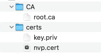
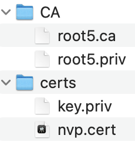
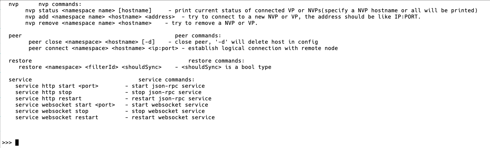

.. _NVP-User-Manual:

非共识节点介绍
^^^^^^^^^^^

引言
======

编写目的
-----------

本文档用于向开发、运维人员介绍NVP功能和使用方式。

NVP（Non-Validate Peer）不参与共识，仅通过信任的VP来同步数据，并对外提供数据查询、交易转发上链等服务。NVP同一时刻只能连接一个VP，但可动态替换VP，VP可以连接多个NVP。

连接方式
----------

vp和nvp互相连接一共四种方式，分别是：

1. 在vp的配置文件里增加nvp信息，启动后自动连接；
2. 在nvp的配置文件里增加vp信息，启动后自动连接；
3. 通过ipc命令，在vp上动态添加nvp；
4. 通过ipc命令，在nvp上动态添加vp；

启动节点&检查证书配置
=====================

VP节点部署
-----------

可以参照部署文档，启动vp节点。

NVP节点部署
--------------

NVP与VP之间需要进行基于证书的身份认证：在双方进行网络连接时，VP需要验证NVP确实拥有自己为其签发的rcert证书，否则将无法正常通信。

基于VP网络CA模式选择的不同，证书的签发和部署也有两种不同的方式：

非分布式CA下NVP节点部署
=========================

在非分布式CA的场景下，需要配置nvp的 **节点证书和根证书** ：

- 节点证书--NVP通过节点证书来指定要绑定的VP节点，节点证书由VP节点为其颁发。必须是NVP类型的节点证书（certgen生成）。

- 根证书--和绑定VP节点的根证书保持一致。目录下可以有多个CA，与VP节点的CA目录保持一致即可。

NVP节点证书配置后的证书目录如下图所示，其中CA目录下存放的文件与VP节点CA目录中的文件相同，certs目录下存放了NVP自己的私钥和VP节点为NVP颁发的节点证书：

|image0|

**注：** 以上CA目录下包含了多个CA只是示例中的一种，主要体现为了与VP节点的CA目录保持一致，通常情况该目录下只包含一个CA。

分布式CA下NVP节点部署
======================

在分布式CA的场景下，NVP需要配置节点证书和根证书要求如下：

- 节点证书--NVP通过节点证书来指定要绑定的VP节点，节点证书由VP节点为其颁发。必须是NVP类型的节点证书（由certgen生成）。

- 根证书--可以是独立的根证书，也可以与VP的根证书保持一致。目录下必须只能包含一个CA。

节点证书配置目录如下图所示，这里CA目录下包含一个.ca文件（根证书），包含一个.priv文件（私钥文件）。certs目录下包含一个节点证书和一个私钥：

|image1|

注：上图假设NVP节点配置了一个与其他VP节点不同的CA，因此叫做root5.ca，也可以与要绑定的VP节点其CA目录中的文件保持一致。

NVP证书生成
--------------

对应生成证书的命令::

 certgen gk ./key.priv ./key.pub

 certgen gc --cn node5 --nvp node1 --ct rcert --pub ./key.pub ./root1.ca ./root1.priv ./node5.cert
 解释
 --cn  后面参数代表本节点的hostname
 --nvp 后面参数为NVP要绑定的VP节点的hostname
 --ct  为证书类型，NVP为rcert，VP为ecert
 --pub 后面跟需要申请证书节点的公钥的路径，可以是相对路径
 ./root1.ca   代表证书颁发者的根证书路径，可以是相对路径
 ./root1.priv 代表证书颁发者的根证书私钥路径，可以是相对路径
 ./node5.cert 代表要生成的证书的名称

节点连接
============

对于NVP节点来说，若其未连接任何VP节点，也能正常工作，但不能转发交易，不能同步新数据。当要与VP节点连接时，NVP节点需要提前准备和VP相连的证书文件，还需要进行相应的配置：

1. NVP作为独立节点启动，需要在NVP节点的 `configuration/dynamic.toml` 文件中 **修改self节点名称、port端口、域配置。**

- 注意： **NVP的配置信息不能和VP节点的配置信息重复**

2. 在NVP节点的 `configuration/global/ns_dynamic.toml` 文件 **修改[self]信息，** 具体的配置根据不同的连接方式略有不同，在下面详细介绍。

3. 配置完成之后，可以通过 `start.sh` 脚本或 `./hyperchain` 来启动节点。由于VP和NVP可以动态地建立连接，因此无须同时启动。

VP和NVP节点互相连接方式一共有四种，选择任意一种方式都可以完成NVP和VP的连接，下文将详细介绍每种连接方式。

在VP上配置NVP
----------------

如果要在VP启动时能够自动去连接指定的NVP，需要在VP节点的 `configuration/global/ns_dynamic.toml` 文件做相应修改。在四个VP节点启动并相互连接的场景下，增加两个与node1相连接的NVP需要修改的配置项如下所示::

 [[nvps]]				# 运行时修改。nvps数组在节点运行过程中实时变化。
 hostname	= "nvp1"    # nvp节点的名称
 score       = 10        # 默认为10，表示节点的优先级

 [[nvps]]				# 运行时修改。nvps数组在节点运行过程中实时变化。
 hostname	= "nvp2"    # nvp节点的名称
 score       = 10        # 默认为10，表示节点的优先级

 [p2p]

  [p2p.ip]

    [p2p.ip.remote]

      hosts = [
		"node1 127.0.0.1:50011",
		"node2 127.0.0.1:50012",
		"node3 127.0.0.1:50013",
		"node4 127.0.0.1:50014",
		"nvp1 127.0.0.1:50215",
		"nvp2 127.0.0.1:50216",
		]

由于NVP是namespace级别的节点，所以只需要增加nvp列表字段：

- [[nvps]]表示nvp数组，数组中记录有nvp的信息。

- [p2p]的hosts列表中，增加nvp的节点名和地址信息字段。

其他部分的内容无需修改，[self]中的n数量指的是连接的vp数量，无需变化。

在NVP上配置VP
-----------------

同理，在NVP节点启动前需要指定连接的VP，先按照部署文档进行必要的地址端口修改，然后在NVP节点的 `configuration/global/ns_dynamic.toml` 文件做相应修改。 **NVP只能连接一个VP** ，需要修改的配置项如下::

 [[nodes]]            # 运行时修改。nodes数组记录vp节点信息
	                 # 在节点运行过程中实时变化。
  hostname = "node1" # vp节点的名称
  score = 10         #节点的优先级，默认为10

 [p2p]

  [p2p.ip]

    [p2p.ip.remote]
		# hosts里面需要配置nvp连接的vp的节点名称和ip地址
      hosts = ["node1 127.0.0.1:50011"]

 [self]
  hostname = "nvp1"  # nvp节点的名称
  n = 1              # 连接的vp数量(0或者1)
  type = "nvp"       # 节点类型

- [[nodes]]字段，只添加与NVP节点连接的VP节点信息；

- [p2p]字段，同时配置VP的节点名称和ip地址；

- [self]字段，修改对应的NVP信息；

  - hostname为NVP节点的名称；

  - n表示要连接的VP数量为1（NVP上n的数值<=1)；

  - type字段用来记录节点的类型为NVP；

通过ipc命令新增
------------------

上述通过配置的方式需要进行节点的启停从而使配置生效，实际上也可以通过ipc命令动态地进行NVP的增删操作。

命令格式： `nvp add <namespace> <hostname> <address>` 。

通过ipc命令新增VP
--------------------

在nvp上也可以通过命令动态地增删VP，这里不再赘述。

IPC命令
===========

平台提供查询NVP状态、新增NVP、删除NVP三类IPC运维命令。

1. `nvp status` ：查询NVP的当前状态，在NVP和VP执行返回信息不同；

2. `nvp add` ：在VP上执行为新增NVP，在NVP上执行为新增VP；

3. `nvp remove` ：在VP上执行为删除NVP，在NVP上执行为删除VP。

IPC命令格式如下::

 nvp add <namespace> <hostname> <addr>    //新增
 nvp remove <namespace> <hostname>        //删除
 nvp status <nameapce> [hostname]         //状态查询

调用IPC命令前，需要先启动IPC交互式命令行::

 ./hyperchain -s --ipc=hpc_1.ipc

进入如下页面，命令行启动成功：

|image2|

nvp status
----------------

该命令可以用于查询NVP和VP的连接状态。 **VP节点上可以同时得知连接的NVP的状态和自己的状态；NVP节点只能查询到自己的状态信息** 。

命令： `nvp status <namespace> [hostname]` （该条命令可在VP和NVP上执行）

**上述命令格式的具体含义如下所示：**

- `<namespace>` ：必要参数，由于NVP是namespace级别的节点，因此需指定所在的namespace；

- `[hostname]` ：可选参数，在VP上调用时，若不指定hostname，将以列表形式返回所有与VP相连的NVP状态信息；在NVP上调用时，由于NVP只能和一个VP相连，是否指定hostname对返回结果没有影响。

在NVP上调用 `nvp status` 命令，返回信息如下表所示：

========== ===============
返回信息   含义
========== ===============
hostname   NVP连接的VP名称
nvp_status NVP当前的状态
height     NVP当前区块高度
========== ===============

在VP上调用 `nvp status` 命令，返回信息如下表所示：

========== ============================================================
返回信息   含义
========== ============================================================
hostname   VP连接的NVP名称
vp_status  VP当前的状态
nvp_status NVP当前的状态
height     NVP当前区块高度
msg        对当前NVP的描述，这份描述内容是NVP的握手或区块事件的回复信息
========== ============================================================

**以下是一些正常的状态指令实例：**

NVP节点查询状态::

 # nvp节点和一个vp节点相连接:格式 nvp status <namespace>
 >>> nvp status global
 {hostname: node1, nvp_status: IDLE, height: 0}

 # nvp节点和一个vp节点相连接:格式 nvp status <namespace> [hostname]
 >>> nvp status global node1
 {hostname: node1, nvp_status: IDLE, height: 0}

VP节点查询状态::

 # 场景：vp节点，和多个nvp节点相连接。
 # 使用命令格式 nvp status <namespace> 查询
 >>> nvp status global
 {hostname: nvp1, vp_status: IDLE, nvp_status: NORMAL, height: 0, msg: NULL}
 {hostname: nvp2, vp_status: IDLE, nvp_status: NORMAL, height: 0, msg: NULL}

 # 使用命令格式 nvp status <namespace> [hostname]查询其中一个节点信息
 >>> nvp status global nvp2
 {hostname: nvp2, vp_status: IDLE, nvp_status: NORMAL, height: 0, msg: NULL}

 # 使用命令格式 nvp status <namespace> [hostname]查询其中一个节点信息
 >>> nvp status global nvp1
 {hostname: nvp1, vp_status: IDLE, nvp_status: NORMAL, height: 0, msg: NULL}

nvp add
-------------

该命令用于动态增加节点场景，VP和NVP都可以使用该指令动态增加节点。

命令： `nvp add <namespace> <hostname> <address>`

**上述命令格式的具体含义如下所示：**

- `<namespace>` ：必要参数，由于NVP是namespace级别的节点，因此需指定所在的namespace；

- `<hostname>` ：必要参数，指定要连接节点的名称；

- `<address>` ：必要参数，指定要连接节点的ip地址；

**注意：新增命令的成功返回并不意味着连接建立成功**，若在VP上执行新增命令，则可以通过先前介绍的 `nvp status` 命令查询NVP状态，若查询结果显示 `nvp_status=NORMAL` 则代表连接建立成功，而若一直处于 `ABNORMAL` 状态，则需要根据日志进一步排查问题；而由于NVP端无法查询VP状态，因此若在NVP上执行新增命令，是否连接成功只能通过日志来进行确认。

**NVP连接VP示例** ::

 # 初始阶段，nvp没有连接任何vp
 >>> nvp status global
 this nvp connects no vp

 # 正确使用add命令，连接node1，此时不代表新增node1成功
 >>> nvp add global node1 127.0.0.1:50011
 success

 # 使用状态查询，发现成功连接vp节点
 >>> nvp status global
 {hostname: node1, nvp_status: IDLE, height: 0}

 nvp remove
 >>>>>>>>>>>>>>

该指令用于VP和NVP之间断开连接，VP和NVP都可以使用该指令动态删除节点。

ipc命令格式： `nvp remove <namespace> <hostname>`

- `<namespace>` ：必要参数，由于NVP是namespace级别的节点，因此需指定其所在的namespace；

- `<hostname>` ：必要参数，指定要连接节点的名称；

该命令的行为如下：

- 通知对端进行同样的删除操作；

- 断开网络逻辑连接；

- 删除对端配置文件信息；

- 清空相应的缓存；

- 进行证书吊销；

该命令有如下两种返回值：

- `remove [hostname] success:` 这意味着成功通知到对方，双方都会执行上述删除流程；

- `inform [hostname] to delete failed, maybe need manual operation:` 这意味着由于网络或其他节点异常问题，导致未能成功通知到对端进行删除，在这种情况下，本地仍然会执行上述删除流程， **可能带来的影响是** 对端的配置文件或内存中仍然保留本节点的信息，因此仍然会尝试进行连接，但由于本节点已经进行了证书吊销，连接不会建立成功， **解决方法是在对端重新执行删除命令** 。

**VP删除NVP示例** ::

 # vp节点查询状态，显示和多个nvp节点连接
 >>> nvp status global
 {hostname: nvp1, vp_status: IDLE, nvp_status: NORMAL, height: 0, msg: NULL}
 {hostname: nvp2, vp_status: IDLE, nvp_status: NORMAL, height: 0, msg: NULL}

 # 删除其中一个NVP节点
 >>> nvp remove global nvp1
 remove [nvp1] success

 # 删除成功，查询状态
 >>> nvp status global
 {hostname: nvp2, vp_status: IDLE, nvp_status: NORMAL, height: 0, msg: NULL}

 # 删除第二个NVP节点
 >>> nvp remove global nvp2
 remove [nvp2] success

 # 删除成功，查询状态
 >>> nvp status global
 this vp connects no nvp

操作实例
=========

这章会列举一些实际操作场景。

NVP动态切换VP
---------------

场景：NVP通过IPC命令动态的切换VP。

IPC命令如下::

 >>> nvp status global
 {hostname: node1, nvp_status: IDLE, height: 0}

 >>> nvp remove global node1
 remove [node1] success

 >>> nvp status global
 this nvp connects no vp

 >>> nvp add global node2 127.0.0.1:50012
 add node2 success

 >>> nvp status global
 {hostname: node2, nvp_status: IDLE, height: 0}

**使用过程介绍：**

1. NVP目前已经有连接的VP，通过状态查询命令可以查询到当前连接的VP节点信息；
2. NVP执行指令删除自己所连接的VP节点： `nvp remove global node1` ；
3. NVP节点收到返回信息 `remove [node1] success` 表明成功删除；
4. 使用状态查询命令查询当前状态，验证已经删除成功，此时应该没有连接任何VP节点，结果应返回 `this nvp connects no vp` ；
5. 通过add指令，添加新的想要连接的VP节点；添加新的节点之前需要根据 **第二章节进行证书配置；**
6. 如果VP节点未启动，那么需要先启动该VP节点，节点配置 **参考部署文档** ；
7. 在NVP节点执行 `nvp add global node2 127.0.0.1:50012` 命令；
8. 等待返回 `add node2 success` ，说明和node2连接的准备工作完成，但此时还不证明已经连接成功；
9. 使用状态查询命令查询当前状态，验证已经添加成功，此时应该成功连接新的VP节点，结果应返回NVP的状态信息： `{hostname: node2, nvp_status: IDLE, height: 0}` ；

异常处理
============

指令格式输入错误
--------------------

- 命令长度/类型出现问题::

 # 命令长度不够，小于3
 >>> nvp status
 Error: invalid command

 # 命令中的namespace不存在
 >>> nvp status g
 Error: namespace [g] not exists

 # 命令中长度正确但是指令类型不支持，目前仅支持add、remove、status三种
 >>> nvp type global
 Error: invald command

- add指令格式有误::

 # 如namespace或者hostname的参数为空，或者输入的ip地址/端口号有问题
 >>> nvp add global   127.0.0.1:500231
 Error: invalid command

 # 命令格式不正确，add命令长度必须为5，即nvp add namespace hostname addr
 >>> nvp add global
 Error: invalid command: expected length: 5

 >>> nvp add global node1
 Error: invalid command: expected length: 5

 # 端口号异常
 >>> nvp add global node1 127.0.0.1：50011
 Error: Uknown rune: 65306

**解决方案：** 参照 **第4章节** ，正确输入指令

查询状态时VP与NVP并未互相连接
-------------------------------

 在状态查询指令之中，输入 `nvp status <namespace> [hostname]` 指令，如果查询询不到，根据节点类型返回 `this vp connects no nvp/this nvp connects no vp`

**解决方案：** 使用添加连接命令，进行节点连接。

重复添加存在节点
-----------------

 ::

 # 如果输入指令中的hostname和现在已经启动的vp/nvp的hostname重复将会报错
 >>> nvp add global node1 127.0.0.1:50023
 Error: hostname collide with existed vp

**解决方案：** 检查NVP，VP，CVP各个节点的配置文件，查看是否有重名现象，进行更改。

**删除并不存在的节点**
----------------------

 ::

 # 删除并不存在的节点
 >>> nvp remove global nvp2
 Error: not existed: nvp2

**解决方案：** 该节点不存在或已经删除成功，无法再进行重复操作，可以进行下一步操作，无需处理。

添加节点失败
----------------

在添加节点之后如果出现以下情况说明添加节点失败：

1）如果日志信息一直在显示反复连接，出现timeout等日志信息，此时表明建立连接失败；

2）如果是vp节点使用状态查询的指令，如果连接的nvp节点状态一直都是 `ABNORMAL` 状态，也表明建立连接出现问题。

**解决方案：**

- 此时不做处理也可以正常运行，但是后台会一直尝试连接该节点，反复打印timeout日志信息；

- 如果想要停止打印日志信息，用户可以调用remove指令撤回上一条连接add指令。

 ::

 # 删除节点成功
 >>> nvp remove global node1
 remove [node1] success

 # vp节点和nvp之间的连接存在问题，需要人工介入
 >>> nvp remove global nvp1
 inform [nvp1] to delete failed, maybe need manual operation

针对remove出错，没有成功返回success信息的场景

**解决方案：** nvp和vp之间的连接状态不正常，需要根据日志信息进行人工介入。

