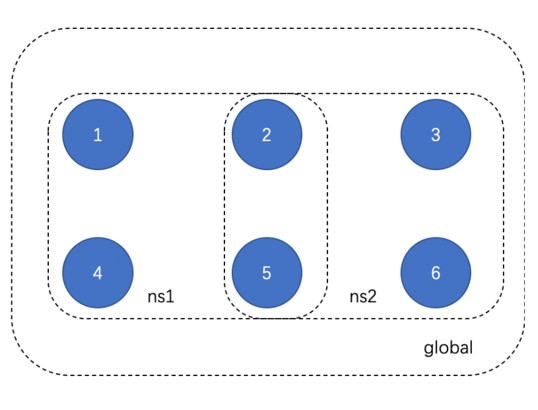
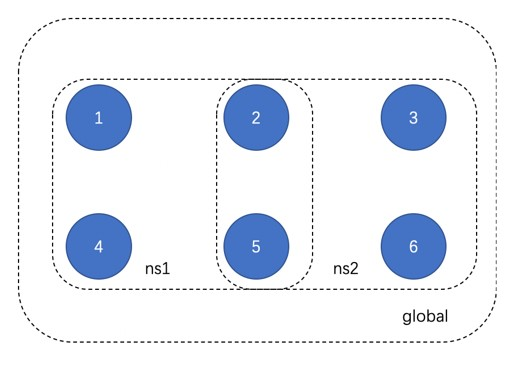

.. _Partition-Consensus:

分区共识
^^^^^^^^^^^^^

功能概述
------------------
多分区架构如下图所示，使用时需遵循以下规则：

- 所有节点都必须在 **global** 这个namespace下；
- 任意四个及以上节点可以组成一个新的namespace；
- 在多namespace运行的情况下，某一个ns的宕机不影响其他ns运行；
- 但是如果global宕机，所有ns将一起停止。

|image0|

使用说明
------------------
多分区的使用可以在节点启动时配置，也可以在启动后通过IPC命令进行动态增删。

节点启动配置
>>>>>>>>>>>>>>>>>>>
节点在启动前可以配置多个分区。其中，global分区是必须存在的，且必须连接网络中的所有节点。在系统资源充足的情况下，其他分区的个数不做限制。每一个分区下的 ``ns_dynamic.toml`` 文件需要配置该分区下连接的节点。

::

    [[nodes]]            
    hostname    = "node1"

    [[nodes]]
    hostname    = "node2"

    [[nodes]]
    hostname    = "node3"

    [[nodes]]
    hostname    = "node4"

此外，节点的 ``configuration/dynamic.toml`` 中需要加入其他分区

::

    self = "node1"

    [[namespace]]
    name = "global"
    start = true

    [[namespace]]
        name = "ns1"
        start = true

    [[namespace]]
        name = "ns2"
        start = true

start字段表示节点启动时是否启动该分区。如需全部启动，则将start均设置为true。

节点动态增删分区
>>>>>>>>>>>>>>>>>>
节点在启动后，可以通过ipc命令增删分区。

namespace有4个子命令，分别用于 **启动（start）、停止（stop）、删除（destroy）、列举（list）namespace**。

namespace相关的ipc命令时针对节点级别的，启停namespace只影响该节点中的ns列表，而不会影响全局的ns列表。如果要在已有分区中增删节点，需要使用配置交易增删节点功能。

**namespace start**

**命令** ： namespace start <namespace name>

启动一个namespace。启动的namespace需要保证还未在线上运行，且配置文件准备正确。

例子::

    >>> namespace start ns1
    Error: namespace exist
    >>>
    >>> namespace start ns2
    successfully start namespace: "ns2"
    >>>

**namespace stop**

**命令**：namespace stop <namespace name>

停止一个正在运行的namespace。

例子::

    >>> namespace stop ns1
    Error: namespace "ns1" is not running
    >>> namespace stop ns2
    successfully stop namespace "ns2"

**namespace destroy**

**命令**：namespace destroy <namespace name>

删除一个namespace下的所有数据。

例子::

    >>> namespace destroy ns1
    Error: namespace has not stopped
    >>> namespace destroy ns2
    successufully destroy namespace "ns2"

**namespace list**

**命令**：namespace list

列举目前正在运行的namespace。

例子::

    >>> namespace list
    global,ns1,ns2

使用示例
>>>>>>>>>>>>>>>>>

**1. 节点运行过程中，某节点加入一个分区**

该节点在configuration目录下建立一个该分区名对应的文件夹，放入配置好的ns_dynamic.toml和ns_static文件，使用ipc命令namespace start <namespace name>即可。

**2. 节点运行过程中，某节点停止运行一个分区**

该节点使用ipc命令namespace stop <namespace name>即可。

操作实例
----------------------

场景说明
>>>>>>>>>>>>>>>>>>>>
以要建立如图所示的一个分区架构为例，初始有global和ns1分区，运行一段时间后添加ns2分区。

|image2|

节点启动
>>>>>>>>>>>>>>>>>>>>
启动时node1、2、4、5配置global和ns1两个分区，node3、6仅配置global分区启动。

增加分区
>>>>>>>>>>>>>>>>>>>>>
node2、3、5、6在configuration文件夹下建立ns2文件夹，里面写入配置文件，通过ipc命令namespace start ns2新增分区ns2。

分区新增节点
>>>>>>>>>>>>>>>>>>>>>
如ns2分区增加4号节点。首先通过配置交易在ns2分区中申请加入node4。然后node4在configuration文件夹下建立ns2文件夹，里面写入配置文件，通过ipc命令namespace start ns2启动分区ns2。

接口参数说明
--------------------
向节点发送交易的接口参数中有namespace字段，默认为global，若需要向其他分区发送请求，该字段填入分区名即可。例如::

    // Request
    curl -X POST --data '{"jsonrpc":"2.0","namespace":"ns2",
    "method":"tx_sendTransaction","params":
    [{"signature":"01047ea464762c333762d3be8a04536b22955d97231062442f81a3cff46cb009bbdbb0f30e61ade5705254d4e4e0c0745fb3ba69006d4b377f82ecec05ed094dbe873046022100b16176bc233000f9039a4209daa82a1c7bc662cbfe7cbef7b8ae44dc81043335022100e8f87fff65631726b3975a54c5c561b3277b6d60b2138cdd8281abc23dafd4f1","extra":"","from":"0x856E2B9A5FA82FD1B031D1FF6863864DBAC7995D","to":"0x794BF01AB3D37DF2D1EA1AA4E6F4A0E988F4DEA5","type":"EVM","nonce":8916188877127249,"simulate":false,"value":53,"timestamp":1566188957839922607}],"id":1}'

    // Result
    {
        "jsonrpc": "2.0",
        "namespace": "ns2",
        "id": 1,
        "code": 0,
        "message": "SUCCESS",
        "result": "0xed2ee1d92b7f99b69ca5b736e424f92d5118494d311b0c1efaa0f0941e1a4cca"
    }

注意事项
-----------------

1. 节点的ipc命令只能控制节点自身的分区启停，并不能完成增删节点操作，增删节点需要通过配置交易完成。
2. 当使用ipc命令退出global分区后，整个节点将退出。
3. 分区退出后，dynamic.toml配置中分区的start值将改为false，若节点重启时需要启动该分区，请调整配置文件。
4. 分区间彼此独立，但共享系统资源，若业务要求多分区架构，需要保证有更高的机器配置，可以考虑将节点各分区的数据挂载在不同磁盘下。

