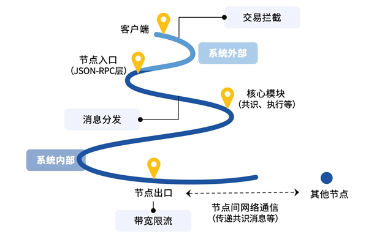
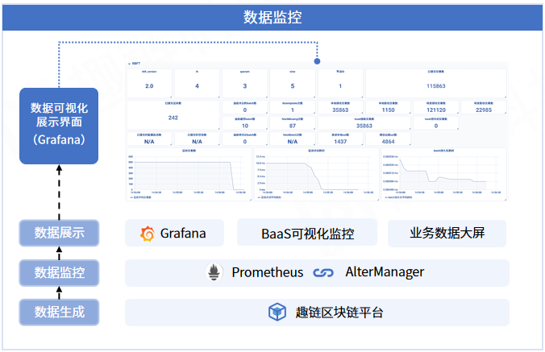

运维管理
^^^^^^^^^^

网络流控
---------

区块链系统作为分布式系统，任意时间内到来的请求往往随机不可控，而系统处理能力有限，因此需要根据系统处理能力对流量进行控制，否则，
暴涨的突发请求容易引起区块链服务或接口不可用，严重时可能导致整个区块链系统陷入雪崩状态。

为了提供更稳定可靠、柔性可用的服务，平台提供交易拦截、消息分发、带宽限流等多维度网络流量控制服务，在请求激增场景下保证系统的稳定运行。

|image0|

- 交易拦截：在系统最外层及早对交易进行拦截，阻止交易渗透到主流程花费不必要的系统开销；
- 消息分发器：在P2P网络层将消息带权分发给对应模块处理，降低各模块由于处理能力差异而相互干扰，保证核心模块正常运行；
- 网络带宽限流：限制节点最大出口带宽流量，使得系统整体带宽使用量可控，不需要另外搭建nginx服务器或者通过root权限修改操作系统配置来进行带宽流控，
适用于对网络带宽有限制需求的场景。

数据监控
--------

平台提供一站式的数据可视化监控服务，帮助用户轻松了解底层平台运行情况，及时识别并处理异常。

数据监控平台由数据生成层趣链区块链平台、数据监控层Prometheus以及数据展示层Grapana三部组成。趣链区块链平台负责生成需要监控的数据并推送到
Prometheus服务器中；Prometheus负责存储趣链区块链平台推送出来的数据，并对外提供读取接口；Grapana：负责从Prometheus服务器中读取数据，
并在web上进行展示。其中，数据展示层除了Grapana，还支持对接BaaS及业务层的可视化展示模块，适应客户多样化部署环境，减少上层开发及维护成本。

|image1|

平台现已支持100 +业务及系统层面的监控指标，指标开关灵活可配，具体可参考使用手册中的指标清单。此外，借助Prometheus的AlterManager组件，
平台实现了节点license过期、磁盘空间不足、共识状态异常等告警功能，保障系统的持续稳定运行。

灾备切换（CVP）
------------

完善的灾备方案是政府、企业信息化建设过程中的重要组成部分，能在信息化时代有效防范灾难、降低损失，而区块链作为一种新型信息基础设施，增设灾备节点的
意义也愈发凸显。

尽管区块链本身具有冗余存储的特性，且RBFT共识算法支持拜占庭容错，天然具有灾备特性，但在实际落地过程中仍存在一些亟待解决的问题。首先，在目前
的联盟链中，节点大多归机构私有，即尽管每个节点拥有全量账本数据，但某一机构的交易上链、查询、验证等操作只基于该机构拥有的节点进行，若只拥有一个
节点，当节点故障后，由于无法通过其他机构节点接入区块链网络，会导致该机构的区块链服务中断。此外，当故障节点数超过一定阈值时（如4节点共识网络中该
阈值为1），会导致区块链系统整个服务不可用。因此，仍有必要为区块链节点提供灾备服务，保障节点及系统高可用。

为此，平台提供专门的灾备节点CVP，能在VP发生异常宕机时可快速升级为VP，参与共识，并提供和原VP同等的区块链服务。CVP对VP的备份包括两部分，一部分
是账本数据，CVP同样具有数据恢复机制，当CVP断连恢复后，能快速同步数据，恢复到和VP相同的账本状态，确保任意时刻的数据安全；另一部分是配置文件，涉
及到配置变更的操作，如创建NS、增删节点、开启权限等，会影响到CVP升级后是否能避免数据被越权访问，是否能保证系统的正常运行，故这类配置变更需要在
CVP和VP间保持强一致，CVP拥有一套完善的一致性保证机制和操作指令恢复机制，帮助CVP升级后能准确复制VP的行为状态。

CVP的升级操作十分便捷，当维护人员作出确认升级判断后，只需通过一条IPC命令便可完成升级。原VP恢复后，可重新配置为现VP的CVP，最大限度利用节点资源，
节约成本。目前，Hyperchain仅支持VP与CVP一对一连接，后续会支持一个VP连接多个CVP，实现两地三中心多地灾备方案。

CVP的优势在于由平台保证数据和配置的一致性，当故障或灾难发生时支持一键快速升级，即降低了运维门槛，也避免了人为操作失误带来的额外损失，极大缩短
了RTO时间（Recovery Time Objective，系统宕机导致业务停顿到恢复正常运行间的时间），在金融、国网等对系统高用性及容灾能力有硬性要求的场景中
具有很大的应用潜力。

