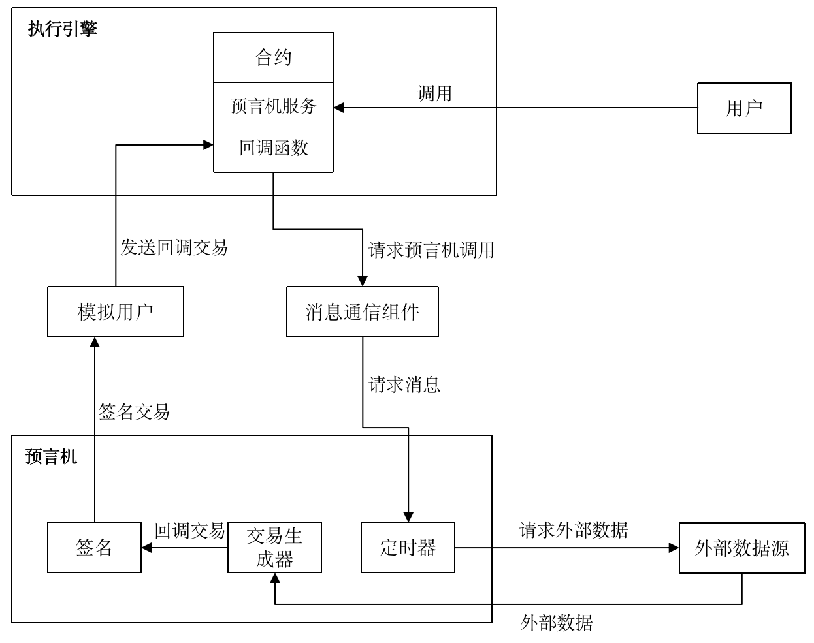

预言机
^^^^^^^^^^^^^

功能概述
------------------
为提供给区块链智能合约一个安全可靠的获取外部数据源的功能，我们引入Oracle预言机来帮助获取可信的外部数据，并将获取到的外部数据提供给合约进行使用。通过HVM智能合约发起获取外部数据的请求，由Oracle预言机将外部数据获取后，返回给HVM智能合约使用。本节将介绍如何通过HVM合约使用Oracle服务。

**一次完整的Oracle执行流程如下：**

1. 用户调用HVM合约请求Oracle服务；
2. HVM执行合约以及Oracle服务，并返回uuid（uuid表示本次Oracle请求的唯一ID，绑定回调交易哈希）；
3. Oracle服务执行成功，平台发起回调交易；
4. 在回调交易中执行用户编写的回调逻辑。

**在这个流程当中，与用户发生交互的步骤包括以下两点：**

- 调用HVM合约请求Oracle服务
- 编写回调函数逻辑

使用说明
------------------

调用合约请求Oracle服务
>>>>>>>>>>>>>>>>

本小节将介绍如何编写HVM合约来调用Oracle服务。需要在maven或gradle导入 **1.1.0及以上** 版本的HVM-SDK。

Oracle服务接口
::::::::::::::::::::

在HVM-SDK里的BaseContract中，我们增加了新接口以提供用户通过调用合约的方式使用Oracle服务，接口如下::

    public String callOracle(OracleRequest request) {}

其中OracleRequest的结构如下::

    public class OracleRequest {
        String url;
        RequestMethod method = RequestMethod.GET;
        Map<String, String> header;
        String body;
        String bizId;
        String callBackAddress;
        String callBackMethod;
    }

其中各参数的意义如下：

- `url`：请求资源的web网址，必须是支持https的服务站点;
- `method`：请求方法。RequestMethod是一个默认方法，包括GET、POST，默认为GET方法，其结构如下::

    public enum RequestMethod {
        GET,
        POST;
    }
- `header`：请求资源时想要带上的自定义http请求头;
- `body`：请求资源时想要带上的请求体;
- `bizID`：用户针对业务需求自定义的唯一标识ID;
- `callBackAddress`：回调函数所在的合约地址;
- `callBackMethod`：回调函数名，回调函数声明格式为: `<return_type>  <method_name>(OracleResponse response);`

合约中调用Oracle服务
:::::::::::::::::
我们可以在合约中调用 `callOracle` 接口来使用Oracle服务，下面的例子是向 `https://www.hyperchain.cn` 请求数据，并将 `callbackOracle` 作为我们的回调函数，回调函数将在下一小节进行介绍。在调用Oracle服务接口后，返回uuid，uuid绑定回调交易的交易哈希::

    public class OracleContract extends BaseContract implements IOracleContract {
        ……
        /**
        * 调用Oracle服务
        */
        @Override
        public String oracleRequest() {
            // 构造Oracle服务需要的参数
            HashMap<String, String> header = new HashMap<>();
            header.put("Host", "https://www.hyperchain.cn");
            header.put("Accept", "text/html");
            OracleRequest req = new OracleRequest("https://www.hyperchain.cn", header, "", "demo");
            req.setCallBackMethod("callbackOracle");

            // 调用Oracle服务接口，得到uuid，uuid绑定回调交易的交易哈希
            String uuid = callOracle(req);
            return uuid;
        }
        ……
    }

回调函数
>>>>>>>>>>>>>>>>>

在前面的章节中，我们在调用Oracle请求中传入了回调函数的名称，平台在成功执行预言机请求后 **自动发起回调交易，执行用户指定的回调函数** 。回调函数由用户自己实现，本节我们将介绍如何编写回调函数。

回调函数介绍
:::::::::::::::::::

回调函数的 **参数有且仅有一个OracleResponse，而且在回调函数中不能再次发起Oracle请求调用**，回调函数的格式如下::

    <return_type>  <method_name>(OracleResponse response);

其中OracleResponse的结构如下::

    public class OracleResponse {
        private int code;
        private String message;
        private Map<String, String> repHeader;
        private String repBody;
        byte[] uuid;
        String bizId;
        byte[] callerContract;
    }

各参数的意义如下：

- `code`：预言机服务制定的状态码标准，具体的返回结果状态码如下表所示：

.. list-table:: 
 :widths: 30 70
 :header-rows: 1

 * - Oracle回调状态码
   - 含义
 * - 200
   - 请求成功
 * - 404
   - 请求资源不存在
 * - 999
   - 请求超时
- `message`：状态码表示的信息
- `repHeader`：响应请求头
- `repBody`：响应请求体
- `uuid`：由平台计算出的每次Oracle请求的唯一标识
- `bizId`：用户针对业务需求自定义的唯一标识ID
- `callerContract`：发起Oracle服务请求的合约地址

编写回调函数逻辑
::::::::::::::::
在介绍完回调函数逻辑后，我们给出一个简单的回调函数示例，通过回调函数打印一些响应信息。
::

    public class OracleContract extends BaseContract implements IOracleContract {
        ……
        private Logger logger = Logger.getLogger(OracleContract.class);

        /**
        * 用户编写的回调函数示例，
        * 打印响应的部分信息
        */
        public void callbackOracle(OracleResponse response) {
            logger.notice("this is callbackOracle");
            logger.notice("bizId is:" + response.getBizId());
            logger.notice("uuid is:" + response.getUuid());
            logger.notice("message is:" + response.getMessage());
            logger.notice("repBody is:" + response.getRepBody());
        }
        ……
    }

获取回调交易哈希
''''''''''''''''''
前面提到过，Oracle服务执行成功，平台发起回调交易，在回调交易中执行用户编写的回调逻辑。如果用户想要获取这笔回调交易的交易哈希，可以在合约中执行`getCallbackTxHash`的逻辑，该接口由BaseContract提供，根据uuid返回回调交易的哈希。

::

    public class OracleContract extends BaseContract implements IOracleContract {
        ……
        /**
        * 根据uuid获取回调交易的哈希
        */
        @Override
        public String getTxHashByUuid(String uuid) {
            return getCallbackTxHash(uuid);
        }
        ……
    }

操作流程图
:::::::::::::::::::

|image1|

使用示例
>>>>>>>>>>>>>>>
本小节我们将基于前面给出的OracleContract合约，给出LiteSDK 的使用示例，示例包含两个部分：

1. OracleContract合约部署，通过合约调用Oracle服务；
2. 调用合约获取回调交易哈希。

调用Oracle服务
::::::::::::::::::
我们通过invokeBean的方式进行合约调用，首先给出InvokeBean的代码。

**InvokeOracle代码**

::

    public class InvokeOracle implements BaseInvoke<String, IOracleContract> {
        @Override
        public String invoke(IOracleContract iOracleContract) {
            return iOracleContract.oracleRequest();
        }
    }

**InvokeCallback代码**

::

    public class InvokeCallback implements BaseInvoke<String, IOracleContract> {
        private String uuid;

        public InvokeCallback() {
        }

        public InvokeCallback(String uuid) {
            this.uuid = uuid;
        }

        @Override
        public String invoke(IOracleContract iOracleContract) {
            return iOracleContract.getTxHashByUuid(uuid);
        }
    }

**测试代码**

::

    public class TestOracle {
        private static String jarPath = "oracleContractDemo-1.0-SNAPSHOT.jar";
        private static String defaultURL = "localhost:8081";
        @Test
        public void testOracle() throws IOException, RequestException,InterruptedException {
            //1.部署合约
            InputStream is = FileUtil.readFileAsStream(jarPath);
            DefaultHttpProvider defaultHttpProvider = new DefaultHttpProvider.Builder().setUrl(defaultURL).build();
            ProviderManager providerManager = ProviderManager.createManager(defaultHttpProvider);
            ContractService contractService = ServiceManager.getContractService(providerManager);
            AccountService accountService = ServiceManager.getAccountService(providerManager);
            Account account = accountService.genAccount(Algo.ECRAW);
            Transaction transaction = new Transaction.HVMBuilder(account.getAddress()).deploy(is).txVersion(TxVersion.TxVersion23).build();
            transaction.sign(account);
            ReceiptResponse receiptResponse = contractService.deploy(transaction).send().polling();
            String contractAddress = receiptResponse.getContractAddress();
            System.out.println("contract address: " + contractAddress);

            //2.调用合约，调用预言机服务的方式和正常交易流程一致
            Transaction transaction1 = new Transaction.HVMBuilder(account.getAddress()).invoke(contractAddress, new InvokeOracle()).txVersion(TxVersion.TxVersion23).build();        transaction1.sign(account);
            ReceiptResponse receiptResponse1 = contractService.invoke(transaction1).send().polling();
            String uuid = Decoder.decodeHVM(receiptResponse1.getRet(), String.class);
            System.out.println("[uuid]:" + uuid);

            //3.等待一定时间，待平台执行回调交易后，通过uuid获取回调交易哈希
            Thread.sleep(2000);
            Transaction transaction2 = new Transaction.HVMBuilder(account.getAddress()).invoke(contractAddress, new InvokeCallback(uuid)).txVersion(TxVersion.TxVersion23).build();
            transaction2.sign(account);
             receiptResponse2 = contractService.invoke(transaction2).send().polling();
            System.out.println("callback tx hash: " + Decoder.decodeHVM(receiptResponse2.getRet(), String.class));
        }
    }

完整示例代码可以获取源码包\ `oracleContractDemo <https://upload.filoop.com/oracleContractDemo.zip>`_\ 直接运行体验。

