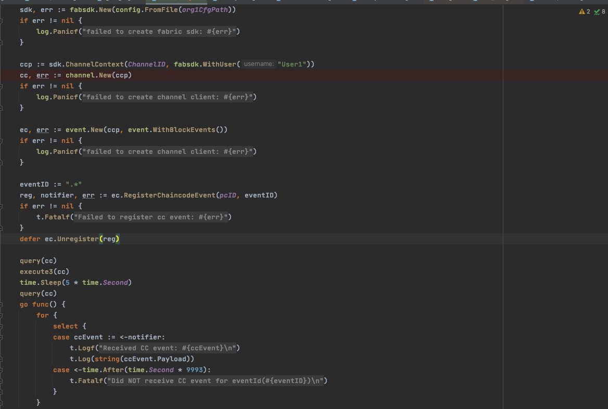
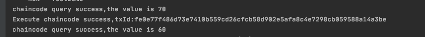
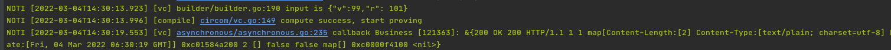
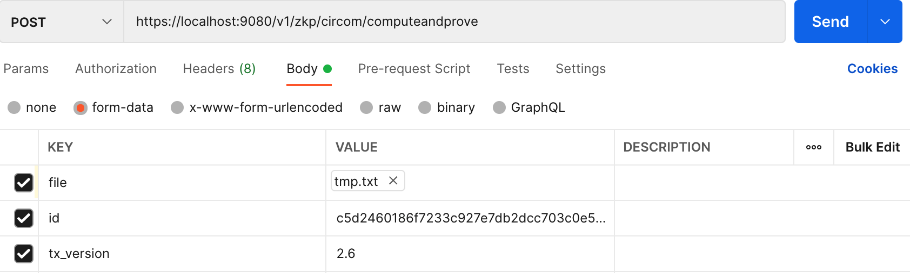
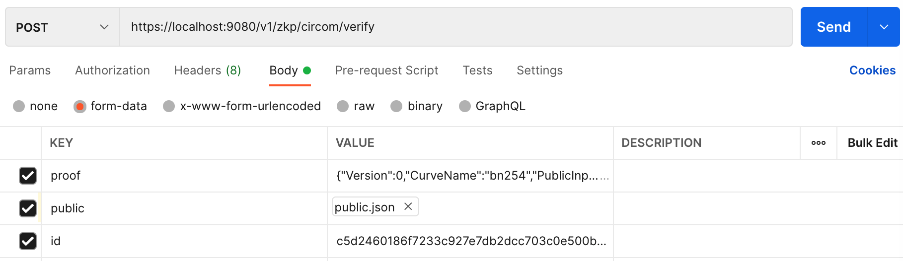
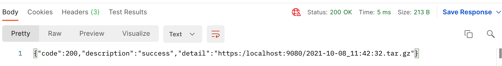
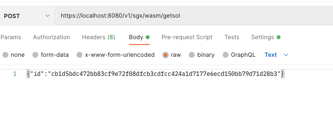
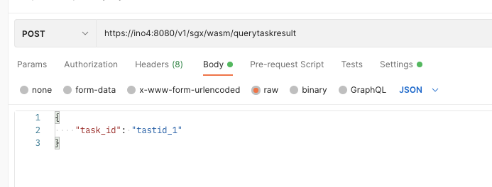

.. _sgx-vc-user-manual:

SGX VC 使用手册
^^^^^^^^^^^^^^^^^^^^

1. 引言
==========

1.1 编写目的
----------------

本文档为sgx vc使用文档，着重以fabric多链为例。

1.2背景
-------------

zkp多链主要是通过插件机制对不同的区块链系统进行支持，在使用fabric的时候需要提前编译好fabric插件。

2. 安装和初始化
=================

1. 编译安装

   - 解压缩tar包，得到zkp目录

   - zkp server  -C ./config.toml运行

2. 初始化fabric网络： 启动fabric节点组网

3. 部署fabric合约：依次部署proxy chaincode, business chaincode

3.配置说明
==============

配置模式

 ::

    [general]
    mode = "sgx"

服务监听相关说明::

    [http]
    tls = true                 #是否启用安全传输层
    port = 8080                #监听端口
    net = "0.0.0.0"            #监听网卡，0.0.0.0表示全部网卡
    domainName = "example.com" #服务域名
    cert = "./certs/tls.cert"  #启用安全传输层情况下的证书文件
    ca = "./certs/ca.cert"     #启用安全传输层情况下的ca文件
    priv = "./certs/tls.priv"  #启用安全传输层情况下的证书私钥文件
    clientAuth = false         #是否验证客户端身份

隐私数据库配置说明::

    dbNum = 0     #连接隐私数据库数量，0表示不连接，此时忽略下面的配置项

    [db1]         #隐私数据库1配置
    dbPath = "petShop"
    dbType = "mysql"
    host = "127.0.0.1"
    port = 3306
    userName = "root"
    pwd = "123456"
    dbName = "flatoVC"
    maxIdle = 2 #最大的空闲连接数，没有redis连接时依然可以保持N个空闲的连接
    maxActive = 11 #最大的激活连接数，同时最多有N个连接
    maxIdleTime = 180 # second

    [db2]         #隐私数据库2配置
    dbPath = "superMarket"
    dbType = "leveldb"
    host = "./leveldb"

    [db3]         #隐私数据库3配置
    dbPath = "coffeeShop"
    dbType = "redis"
    host = "127.0.0.1"
    port = 6379
    userName = "root"
    pwd = "123456"
    dbName = "1"
    maxIdle = 1 #最大的空闲连接数，没有redis连接时依然可以保持N个空闲的连接
    maxActive = 10 #最大的激活连接数，同时最多有N个连接

    #支持任意合理数量的数据库连接，如[db4],[db5]等

电路数据库相关配置::

    [manager]
    data = ".data"      #电路数据库位置

sdk配置说明（fabric）::

    [sdk]
    enable = true
    nodes = [["peer0.org1.example.com", "peer0.org2.example.com"]]
    plugin = "./fabric.so"
    configpath = ["/Users/jalyzhang/Documents/t2/untitled29/fabric-sdk-go/test/demo/org1-config.yaml"]
    user = ["User1"]
    namespace = ["jackchannel"]

    #！！！如果启用SDK请先检查sdkconfig.toml的配置是否正确，以及配置必要的crypto-config

1. enable 为true时，使用插件

2. nodes：根据proxy chaincode部署时的策略，对proxy chaincode使用invoke时需要的背书节点集合。

3. plugin：插件的位置

4. configpath：使用fabric go sdk时的配置文件位置

5. user：对proxy chaincode使用invoke时需要的用户

6. namespace：proxy chaincode和business chaincode所处的channel

4.操作实例
============

4.1 场景介绍
--------------

启动fabric1.4的一个网络，本文档以fabric samples中byfn的网络为例2个org，每个org下有两个节点，1个orderer，依次部署proxy chaincode, business chaincode。

4.2 启动vc节点
----------------

zkp  server -C ./config.toml

|image0|

4.3 sdk操作
----------------

本文档用fabric go sdk在业务调用侧进行一次对business chaincode的invoke操作，并在invoke前后分别做一次query。

进行invoke的参数::

    []string{"proxyCC", "{\"v\":99,\"r\": 101}", "becc", "callback", "http://127.0.0.1:9088/Callback", "result: ${result}, proof: ${proof}"}

分别对应为

proxyContractAddr, input, businessContractAddr, businessContractMethod, WebHook and WebHookBodyPattern

|image1|

sdk执行结果：

|image2|

vc节点执行结果：

|image3|

4.4 非sdk操作
----------------

可以不使用sdk，而直接使用restful接口进行操作。例如4.3所示操作可以使用5.2中接口6computeandprove实现类似效果的操作。

5.restful 接口
=================

5.1 zkp vc
--------------

注：localhost:8080作为参考，最终IP和端口以服务器地址为准。

接口1：编译
>>>>>>>>>>>>>>

- url： `https://localhost:8080/v1/zkp/circom/build <https://localhost:8080//v1/zkp/circom/build>`_

- 输入（form-data格式）::

    file：xxx.tar.gz或xxx.circom（文件格式。tar包形式应该包含所有电路，例如一个circom文件中include其他文件，则应该全部包含。）
    target：xxx.circom （文本格式。指定要编译的文件名称）
    algo：groth16_bn254 （文本格式。算法名称）
    withC：tmp （可省略。给定一个文件夹名称，用于生成withC的文件，compute过程时无需再次传参，默认使用上次生成的witchC文件）

如下图：

|image4|

- 输出::

    xxx.tar.gz的下载链接（包含编译后的solidity合约（链上部分）、带setup的r1cs文件（链下部分））
    id（链下计算ID）

如下图：

|image5|

- 错误提示

输入错误，错误码601，缺少字段，错误信息（"input data error , give input(algo or target is nil) error, should input eg. (file, target, algo)"）;

输入错误，错误码601，字段内容解析错误，错误信息（"input data error , give input(err.Error()) error, should input eg. (file, target, algo)"）；

内部错误，错误码602，编译失败的具体原因，错误信息（"inner compilation error, function(genR1csAndSol) error: err.Error()"）

内部错误，错误码602，数据库操作失败，错误信息（"inner compilation error, function(db.Put) error: err.Error"）

接口2：重置
>>>>>>>>>>>>>

- url： `https://localhost:8080//v1/zkp/circom/resetup <https://localhost:8080//v1/zkp/circom/resetup>`_

- 输入（raw-json格式）::

    id:"xxxxx" （build返回的id）

如下图：

|image6|

- 输出::

    xxx.tar.gz的下载链接（编译后的solidity合约（链上部分，用于合约升级）、带setup的r1cs文件（链下部分））

|image7|

- 错误码：

输入错误，错误码602，没有传入请求body，检查是否是post格式，是否按照接口传入了正确的参数，错误信息（check whether it is an https post request or whether~~ ~~parameters are passed in）

输入错误，错误码601，缺少字段，错误信息（"input data error , give input(your input) error, should input eg. (id)"）

输入错误，错误码601，ID不存在，错误信息（"input data error , give input(your ID) error, should input eg. (a right id)"）

内部错误，错误码602，数据库操作失败，错误信息（"inner compilation error, function(db.Put) error: err.Error"）

接口3：证明
>>>>>>>>>>>>>>>

- url： `https://localhost:9080/v1/zkp/circom/computeandprove <https://localhost:9080/v1/zkp/circom/computeandprove>`_

- 输入（form-data）::

    file：input.tar.gz或public.json（包含privacy.json隐私输入和public.json公共输入）
    id: 链下计算id
    tx_verison: 目前还未对tx_version做检查

如下图：

|image8|

- 输出

正确则直接返回proof。如下图：

|image9|

- 错误提示

输入错误，错误码601，缺少字段，错误信息（input data error , give input(err.error) error, should input eg. (file, id, tx_version)）

输入错误，错误码601，id不存在，错误信息（input data error , give input(err.error) error, should input eg. (a  right id )）

输入错误，错误码601，字段内容解析错误，错误信息（input data error , give input(err.error) error, should input eg. (right input json file)）

内部错误，错误码602，数据库脏数据，错误信息（"inner compilation error, function(ReadR1CS/ReadPkBytes) error: err.Error"），此种情况是从数据库中获取数据，发现数据读取失败，可能的原因是服务器端发生异常，写数据到数据库时内容错误，或者服务器端数据库数据被手动更改

内部错误，错误码602，生成证明失败或计算过程失败，详细原因在error中，错误信息（"inner compilation error, function(ComputeAndProve) error: err.Error"）

接口4：验证
>>>>>>>>>>>>>>

- url：`https://localhost:9080/v1/zkp/circom/verify <https://localhost:9080/v1/zkp/circom/verify>`_

- 输入（form-data）::

    proof:{}（由computeandprove得到）
    public:public.json (公共输入)
    id:链下计算id

如下图：

|image10|

- 输出

成功显示verify success，错误显示具体原因

如下图：

|image11|

- 错误提示

输入错误，错误码601，缺少字段，错误提示（input data error , give input(err.error) error, should input eg. (proof, public, id)）

输入错误，错误码601，proof出错，错误提示（input data error , give input(err.error) error, should input eg. (a right proof)）

输入错误，错误码601，id不存在，错误信息（input data error , give input(err.error) error, should input eg. (a  right id )）

输入错误，错误码601， 输入的public.json解析失败，错误信息（input data error , give input(your public json) error, should input eg. (a  right public json )）

输入错误，错误码601，给定的proof组数与公共输入组数不相等，错误信息（error: give public json num[xxx], but proof num[xxx].）

内部错误，错误码602，数据库脏数据，错误信息（"inner compilation error, function(ReadVkBytes) error: err.Error"）

内部错误，错误码602，验证失败具体返回，错误信息（verify failed, proof[xxx], public json[xxx], error: xxx）

接口5：查询solidity源码
>>>>>>>>>>>>>>>>>>>>>>>>>>

- url： `https://localhost:9080/v1/zkp/circom/getsol <https://localhost:9080/v1/zkp/circom/getsol>`_

- 输入 (raw-json)::

 id：链下计算id

如下图：

|image12|

输出::

 tar包文件的下载链接

|image13|

- 错误信息

输入错误，错误码601，没有传入请求body，检查是否是post格式，是否按照接口传入了正确的参数，错误信息（check whether it is an https post request or whether parameters are passed in）

输入错误，错误码601，字段解析失败，错误信息（input data error , give input(your input) error, should input eg. (only need to provide id)）

输入错误，错误码601，id不存在，错误信息（input data error , give input(err.error) error, should input eg. (a  right id )）

接口6：查询编译结果
>>>>>>>>>>>>>>>>>>>

- url： `https://localhost:9080/v1/zkp/circom/getbin <https://localhost:9080/v1/zkp/circom/getbin>`_

- 输入 (raw-json)::

 id：链下计算id

如下图：

|image14|

- 输出::

    tar包文件的下载链接（编译后的solidity合约（链上部分）、带setup的r1cs文件（链下部分））

如下图：

|image15|

- 错误信息：

输入错误，错误码601，没有传入请求body，检查是否是post格式，是否按照接口传入了正确的参数，错误信息（check whether it is an https post request or whether parameters are passed in）

输入错误，错误码601，字段解析失败，错误信息（input data error , give input(your input) error, should input eg. (only need to provide id)）

输入错误，错误码601，id不存在，错误信息（input data error , give input(err.error) error, should input eg. (a  right id )）

5.2 sgx vc
--------------

接口1：build
>>>>>>>>>>>>>>>>>>>>>

url：https://ino4:8080/v1/sgx/wasm/build

|image16|

接口2：resetup
>>>>>>>>>>>>>>>>>

url：https://ino4:8080/v1/sgx/wasm/resetup

|image17|

接口3：getsol
>>>>>>>>>>>>>>>>>>

url：https://ino4:8080/v1/sgx/wasm/getsol

|image18|

接口4：getbin
>>>>>>>>>>>>>>>>

url：https://ino4:8080/v1/sgx/wasm/getbin

|image19|

接口5：computeandprove
>>>>>>>>>>>>>>>>>>>>>>>>>.

url：https://ino4:8080/v1/sgx/wasm/computeandprove

|image20|

接口6：computeandprove异步
>>>>>>>>>>>>>>>>>>>>>>>>>>>>>

url：https://ino4:8080/v1/sgx/wasm/computeandprove

|image21|

接口7：querytaskresult
>>>>>>>>>>>>>>>>>>>>>>>>>

url：https://ino4:8080/v1/sgx/wasm/querytaskresult

|image22|

接口8：verify
>>>>>>>>>>>>>>>>>>

url：https://ino4:8080/v1/sgx/wasm/verify

|image23|

.. |image0| image:: ../../../images/sgx_vc1.png

.. |image9| image:: ../../../images/sgx_vc10.png

.. |image13| image:: ../../../images/sgx_vc14.png

.. |image15| image:: ../../../images/sgx_vc16.png
.. |image16| image:: ../../../images/sgx_vc17.png

.. |image19| image:: ../../../images/sgx_vc20.png

.. |image21| image:: ../../../images/sgx_vc22.png

.. |image23| image:: ../../../images/sgx_vc24.png

