.. _ELK-Audit-Manual:

ELK 审计使用手册
^^^^^^^^^^^^^^^^^^^

1. 引言
============

1.1 编写目的
--------------

本文档主要是说明Hyperchain用户如何使用elk作为审计后端。在Hyperchain配置文件开启审计后，以及配置好审计后端为elk即可使用elk作为审计后端。

本文档将会详细的说明如何安装部署使用elk，以及一些可能遇到的注意事项。

1.2背景
-----------

 ELK是三个开源软件的缩写，分别表示：Elasticsearch , Logstash(本系统采用更加轻量的filebeat 替代), Kibana , 它们都是开源软件。新增了一个FileBeat，它是一个轻量级的日志收集处理工具(Agent)，Filebeat占用资源少，适合于在各个服务器上搜集日志后传输给Logstash，官方也推荐此工具。

1.3术语
------------

**ELK Stack** :elasticsearch+filebeat+kibana

1.4参考文献
------------

[__ELK介绍__] `__https://www.elastic.co/cn/what-is/elk-stack__ <https://www.elastic.co/cn/what-is/elk-stack>`_

[__elasticsearch 参考文档__] `__https://www.elastic.co/guide/en/elasticsearch/reference/current/index.html__ <https://www.elastic.co/guide/en/elasticsearch/reference/current/index.html>`_

[__kibana 参考文档__] `__https://www.elastic.co/guide/en/kibana/current/index.html__ <https://www.elastic.co/guide/en/kibana/current/index.html>`_

[__filebeat参考文档__] `__https://www.elastic.co/guide/en/beats/filebeat/7.9/index.html__ <https://www.elastic.co/guide/en/beats/filebeat/7.9/index.html>`_

2. 安装和初始化
==================

elk 安装部署一般分为单机版部署和集群版部署。

单机版部署足以应对日常的审计使用，集群版部署主要是为了更好地发挥elasticsearch的性能，主要是适用于大数据分析，本文档不推荐使用集群部署elk

2.1单机版部署
--------------

单机版部署将elasticsearch、filbeat、kibana都放在一台服务器进行设置和使用,推荐使用单机部署，节省服务器资源以及节约时间成本。

默认情况下，用户无需从elastic.io官方网站下载ELK平台进行部署配置，我们提供已经配置好的elasticsearch、filbeat、kibana 压缩包供用户下载使用，这么做的目的是为了简化用户对于这三个组件的配置修改，方便快速使用审计功能。

2.1.1 安装说明
>>>>>>>>>>>>>>>>>>>

(elasticsearch-filbeat-kibana.tar.gz.zip附件可联系平台运维人员获取)

1. 下载上述的附件，得到 elasticsearch-filbeat-kibana.tar.gz.zip 压缩包(为了节省空间，使用了两次压缩)，然后使用下面命令进行解压得到 elasticsearch-7.7.0、filebeat-7.7.0-linux-x86_64、kibana-7.7.0-linux-x86_64 三个组件目录

 ::

 unzip elasticsearch-filbeat-kibana.tar.gz.zip
 tar -xvf elasticsearch-filbeat-kibana.tar.gz

2. 接下来分别进入三个组件的目录修改配置文件，首先修改elasticsearch的配置文件，进入elasticsearch-7.7.0目录，配置文件在config目录下, 进入config目录，可以看到如下的配置文件目录：

|image0|

3. 上述的配置文件大多数时候默认即可，不需要修改。但是为了更好的发挥机器性能，可以修改jvm.options，将jvm的最大堆内存和最小堆内存调整为合适大小（默认堆内存为1G大小。最大设置为机器物理内存的一半，不能超过32G）。 本文介绍使用的机器配置为16G内存，设置为堆内存为4g

|image1|

4. 接下来进入filebeat-7.7.0-linux-x86_64目录，修改filebeat-7.7.0-linux-x86_64的配置文件。filebeat-7.7.0-linux-x86_64目录文件如下图所示：

|image2|

5. filebeat的配置文件为filebeat.yml文件，一般提供的压缩包已经配置好了，用户无需再次配置，如果要更改filebeat端口或者更改其他的配置可以编辑此文件。【请注意：如果修改了filebeat配置文件的端口和ip，那么hyperchain平台对应的发送审计的ip也要改】

6. 接下来进入kibana-7.7.0-linux-x86_64 目录，kibana 的配置文件在config文件夹中，只有一个kibana.yml文件，如下图所示：

|image3|

kibana.yml文件里面可以配置访问elasticsearch的用户名和密码以及elasticsearch的链接地址，因为我们是三个组件在同一台机器，所以无需修改该 配置。

用户名：elastic 密码：hyperchain

完成上述步骤后，就完成了ELK的基本配置，如果有更高级的配置需要，请参考ELK的配置介绍文档。

2.1.2 启动说明
>>>>>>>>>>>>>>>>>>>

es因为安全问题拒绝使用root用户启动，所以需要添加一个非root用户来启动elasticsearch

添加用户组:es，用户:es,she，设置密码

添加目录拥有权限

 ::

    groupadd es
    useradd es -g es -p password # -g 指定组 -p 密码
    chown es:es -R elasticsearch-7.10.0/ # -R 处理指定目录以及其子目录下的所有文件

1. 切换到es用户，启动elasticsearch，进入elasticsearch-7.7.0目录, 执行下面的命令。-d 参数表示启动elasticsearch 使用后台启动的方式

 ::

    su es
    ./bin/elasticsearch -d

执行完成上述命令后， elasticsearch就会在后台启动了，可以使用下面的命令查看elasticsearch 进程是否存在，如果存在说明启动成功，如果不存在说明启动失败，可以查看logs文件夹下的elasticsearch.log 文件，通过日志判断错误类型然后根据下面的注意事项查找解决方案::

 ps -ef | grep elasticsearch

2. 接下来启动kibana, 进入kibana-7.7.0-linux-x86_64 目录， 执行下面的命令即可

 ::

 nohup ./bin/kibana >> kibana.log 2>&1 &

执行完成上述命令后， elasticsearch就会在后台启动了

3. 接下来启动filebeat, 进入filebeat-7.7.0-linux-x86_64， 执行下面的命令即可::

 nohup ./filebeat -e >> filebeat.log 2>&1 &

做完上述操作后，ELK审计平台就已经启动完成了，接下来可以访问kibana页面进行查看审计数据。

2.1.3 启动完成检查
>>>>>>>>>>>>>>>>>>>>>

1. 在网页上访问http://127.0.0.1:5601， ip地址是kibana平台所部署的服务器地址,端口是kibana默认端口为5601，可以看到如下界面，提示登录

|image4|

输入用户名: elastic 和密码：hyperchain进行登录。

2. 登录后即可进入kibana界面查看审计数据。点击图标所示按钮，即可浏览实时的审计日志。关于kibana 的详细使用说明，用户可以自行查看kibana介绍文档。

|image5|

ELK单机部署和使用说明至此结束。

2.2 集群部署
---------------

集群部署比较麻烦，而且没有固定的架构和服务器组合模式，一切都需要根据实际的资源情况以及业务量决定，这里为了简单说明起见，推荐使用3filebeat + 3节点elasticsearch + 3 kibana的架构模式。

假设我们部署的区块链平台为4个节点，那么我们就可以使用4个filebeat 对接每个hyperchain节点，然后这些filebeat节点再配置elasticsearch集群其中的一台elasticsearch 节点作为数据发送节点。

2.2.1 安装说明
>>>>>>>>>>>>>>>>>>>>

1. 下载得到 elasticsearch-filbeat-kibana.tar 压缩包，将该压缩包分别放入三台不同机器上。然后在每个机器上使用下面命令进行解压得到 elasticsearch-7.7.0、filebeat-7.7.0-linux-x86_64、kibana-7.7.0-linux-x86_64 三个组件目录。

2. 分别修改elasticsearch 的配置文件，需要修改的项如下::

    # 1号elasticsearch节点配置，1号节点默认为主节点
    node.name: node-1
    discovery.seed_hosts: ["172.22.67.52:9300","172.22.67.53:9300","172.22.67.54:9300"]

    # 2号elasticsearch节点配置，2号节点默认为主节点
    node.name: node-2
    discovery.seed_hosts: ["172.22.67.52:9300","172.22.67.53:9300","172.22.67.54:9300"]

    # 3号elasticsearch节点配置，3号节点默认为主节点
    node.name: node-1
    discovery.seed_hosts: ["172.22.67.52:9300","172.22.67.53:9300","172.22.67.54:9300"]

需要注意的是ip地址需要修改为自己服务器对应的ip端口，确保所有的elasticsearch能够互联成功。

3. filebeat 无需做任何修改。

4. kibana也无需做任何修改

2.2.2 启动说明
>>>>>>>>>>>>>>>>>

1. 配置修改完成后, 就可以启动了，首先启动elasticsearch， 启动方式跟启动单机版一致。

2. 接下来启动kibana，启动方式跟单机版也是一致的

3. 然后启动filebeat，启动方式跟单机版一致

做完上述操作后，ELK审计集群平台就已经启动完成了。接下来可以访问kibana页面进行查看审计数据，查看数据的方式跟单机版是一致的，这里不再赘述。

需要注意的是，在elasticsearch集群的模式下，区块链平台的配置文件也要对应修改为filebeat的多节点配置

|image6|

3.注意事项
=============

1. 启动elasticsearch 的时候出现下面的提示，这说明我们配置的java8环境不符合elasticsearch7.7的要求，需要至少jdk11版本。有两种方式可以解决该问题，第一种是取消我们配置的JAVA_HOME 环境变量， 因为elasticsearch默认自带了JDK，使用它的即可。另外一个方式就是配置JDK11以上的环境变量。(取消配置的JAVA_HOME 环境变量之后，需要重新连接服务器，才不会出现该提示。）

|image7|

2. 启动elasticsearch 出现下面的错误信息，这种情况一般是上一次elasticsearch没有停止，而我们又去启动elasticsearch,造成重复启动。

|image8|

解决办法：结束进程重新启动elasticsearch即可。

3. 使用kibana发现审计日志有些数据前面有感叹号。如下图所示：

|image9|

解决方案：

点击左下角齿轮按钮，然后点击index Parrterns, 出现下图所示页面

|image10|

点击filebeat-*索引，出现下图所示，点击刷新按钮即可

|image11|

4.vm.max_map_count is too low

|image12|

出现这个错误的原因是因为linux系统的最大句柄数默认为65530， 而elasticsearch 所需要的文件句柄数超过了该限制，所以需要修改linux系统的最大的句柄数，修改方法如下::

 sudo vi /etc/sysctl.conf

在最后一行添加一行

vm.max_map_count=262144

然后执行 下面的命令重新载入配置文件

 ::

 sudo sysctl -p

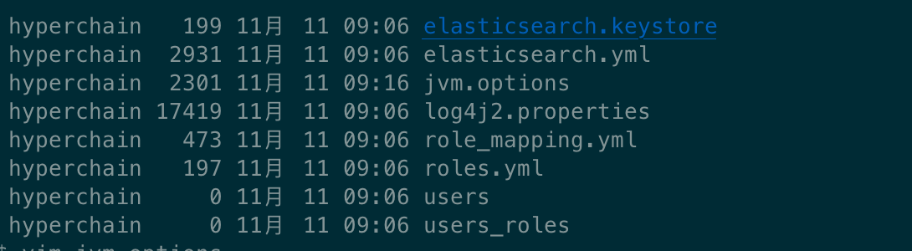
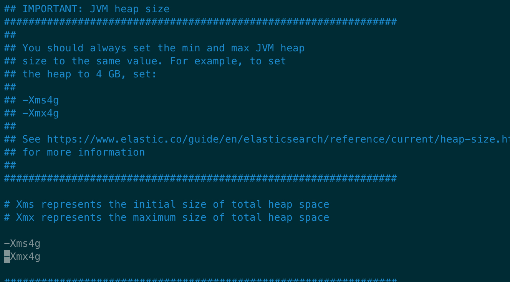
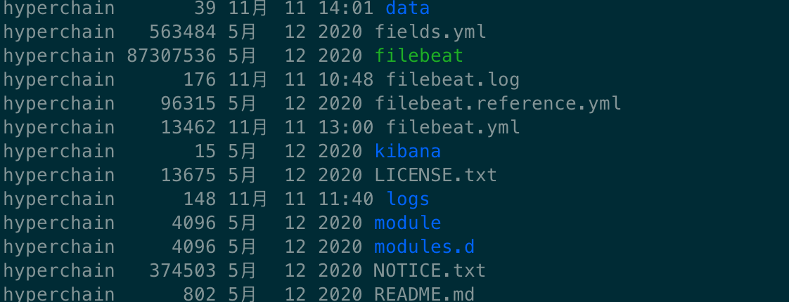
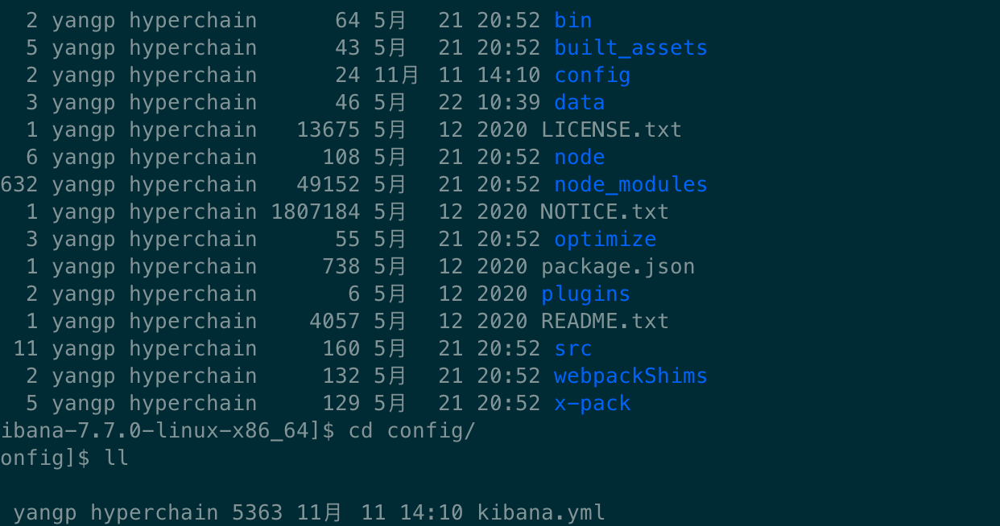
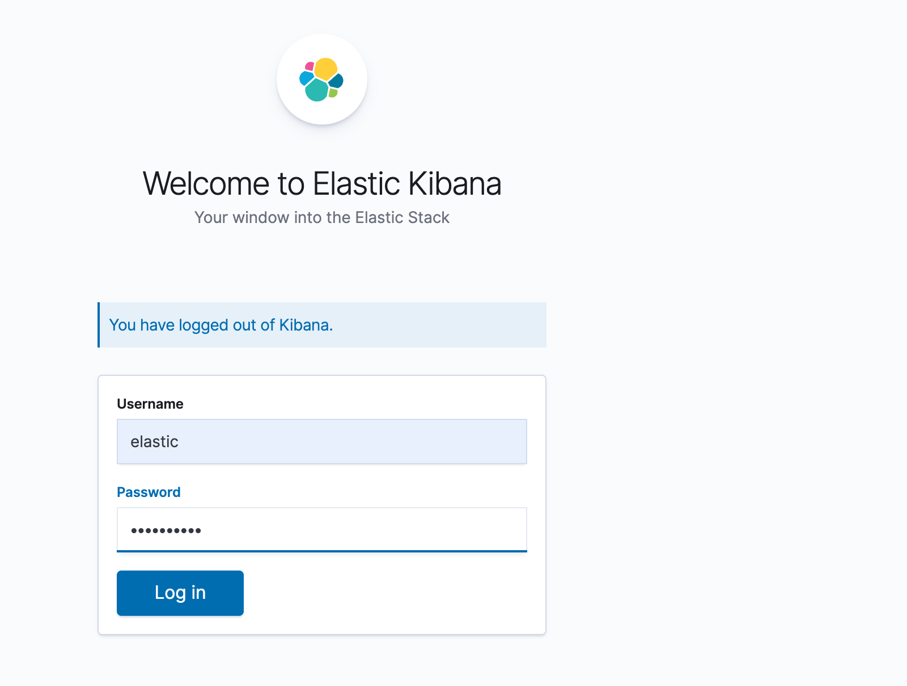
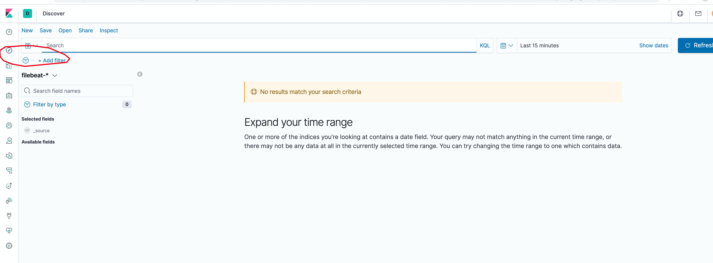
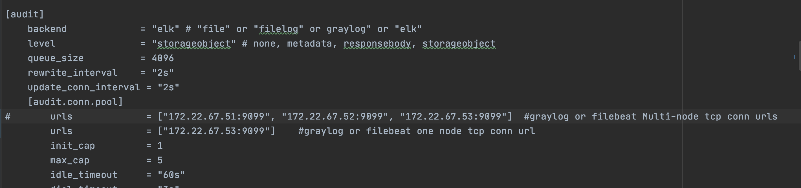

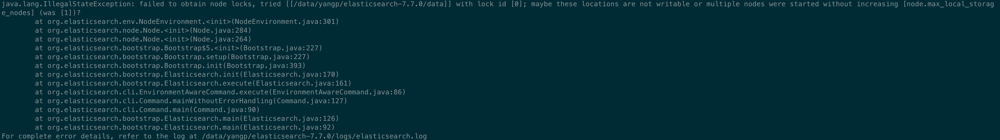
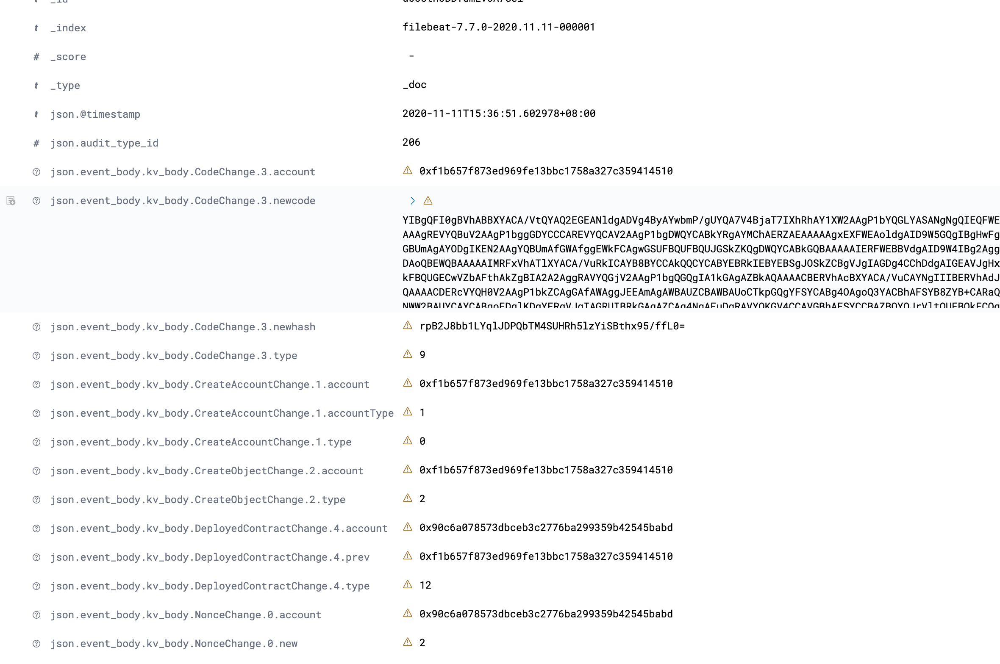
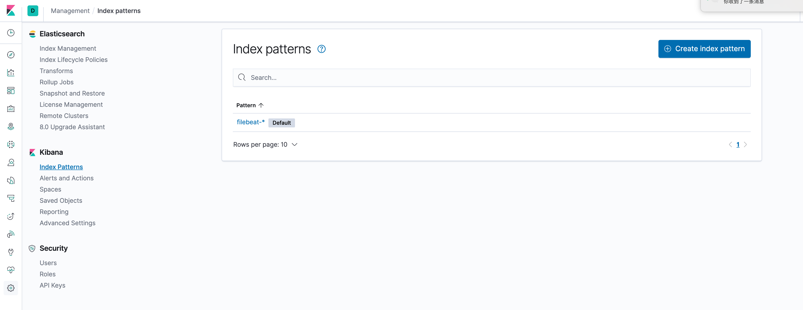
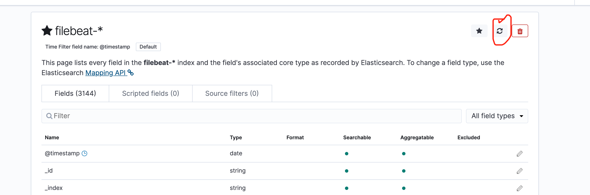
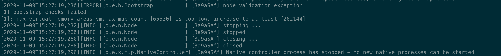

