.. _Graylog-Audit-Manual:

Graylog Audit Manual
^^^^^^^^^^^^^^^^^^^^^^^^^^

1. 引言
============

1.1 编写目的
--------------

本文档主要是说明Hyperchain用户如何使用graylog作为审计后端。在Hyperchain配置文件开启审计后，以及配置好审计后端为graylog即可使用graylog作为审计后端。

本文档将会详细的说明如何安装部署使用graylog，以及一些可能遇到的注意事项。

1.2 参考文献
----------------

graylog 官方网站： `https://www.graylog.org/ <https://www.graylog.org/>`_

关于graylog的使用也可以查看graylog官方说明文档： `https://docs.graylog.org/en/3.3/ <https://docs.graylog.org/en/3.3/>`_

2. 安装和初始化
==================

graylog 安装部署一般分为单机版部署和集群版部署。

单机版部署足以应对日常的审计使用，集群版部署主要是为了更好地发挥elasticsearch的性能，主要是适用于大数据分析，本文档不推荐使用集群部署graylog平台

无论是单机部署和集群部署都需要了解一些graylog的部署特性。graylog 作为审计后端需要3个组件共同完成，包括graylog(提供浏览器界面以及审计数据分析前端) 、Elasticsearch（用于审计数据分析处理后端）、MongoDB(存储一些graylog的配置信息)。

- Graylog节点应重点关注CPU功能。这些还可以为浏览器提供用户界面。

- Elasticsearch节点应具有尽可能多的内存和高速磁盘。因为数据的处理和存储依赖内存和磁盘。

- MongoDB存储元信息和配置数据，不需要很多资源。

2.1 单机版部署
-----------------

单机版部署架构图如下所示：

|image0|

graylog 单机版审计数据处理流程：

hyperchain平台将数据通过TCP/TLS 通信协议传输审计数据到Graylog平台， graylog平台由graylog、mongodb、ElasticSearch 组成。审计数据到达graylog平台后将数据发送给elasticsearch， elasticsearch 对于数据建立索引以及存储方便graylog进行数据检索以及数据的查看。elasticsearch 分析完成数据后将分析结果返回给graylog，graylog将分析结果通过浏览器展示给用户。

2.1.1 安装说明
>>>>>>>>>>>>>>>>>>>

单机版部署将graylog、mongodb、elasticsearch都放在一台服务器进行设置和使用,推荐使用单机部署，节省服务器资源以及节约时间成本。

默认情况下，用户无需从graylog官方网站下载 graylog平台进行部署配置，我们提供已经配置好的graylog、mongodb、elasticsearch 供用户下载使用，这么做的目的是为了简化用户对于这三个组件的配置修改，方便快速使用审计功能。

`graylog-elasticsearch-mongodb.tar.gz.zip <https://upload.filoop.com/RTD-Hyperchain%2Fgraylog-elasticsearch-mongodb.tar.gz.zip>`_

1. 下载上述附件，得到 graylog-elasticsearch-mongodb.tar.gz.zip 压缩包(为了减少体积，压缩了两次)，然后使用下面命令进行解压得到graylog-elasticsearch-mongodb 文件夹，文件夹里面包含了 elasticsearch-6.8.5、graylog-3.3.0、mongodb-linux-x86_64-rhel70-4.2.7三个组件

 ::

    unzip graylog-elasticsearch-mongodb.tar.gz.zip

    tar -xvf graylog-elasticsearch-mongodb.tar.gz

2. 接下来分别进入三个组件的目录修改配置文件，首先修改elasticsearch的配置文件，进入elasticsearch-6.8.5目录，配置文件在config目录下, 进入config目录，可以看到如下的配置文件目录：

|image1|

上述的配置文件大多数时候默认即可，不需要修改。但是为了更好的发挥机器性能，可以修改jvm.options，将jvm的最大堆内存和最小堆内存调整为合适大小（默认堆内存为1G大小。最大设置为机器物理内存的一半，不能超过32G）。 本文介绍使用的机器配置为16G内存，设置为堆内存为4G

|image2|

3. 接下来进入graylog-3.3.0目录，修改graylog的配置文件。graylog目录文件如下图所示：

|image3|

graylog 配置文件为graylog.conf, 这个文件里面需要修改graylog 使用的用户名和密码即可，具体修改配置为下图所示：

|image4|

**password_secret**   是用来加密密码的字符串，这个必须使用 `pwgen` 命令生成一个用于密码加密的字符串, （如果没有pwgen 命令，可以对应操作系统的pwgen 软件）生成方式如下::

  pwgen -N 1 -s 96

默认的graylog root用户名 为 `admin` 。如果不想设置新的用户，那么默认为admin 用户即可。

重新设置密码 可以更改 **root_password_sha2** 字段， 使用 下面命令可以生成 root 密码hash (替换 yourpassword 为你要设置的密码) ，如果没有 shasum命令，可以安装对应操作系统的shasum 软件

 ::

    echo -n yourpassword | shasum -a 256

如果用户不需要设置用户名和密码则可以使用我们默认设置好的用户名和密码即可

用户名：hyperchain  密码：hyperchain

4. 最后就剩mongodb ，mongodb 一般不建议修改任何配置，直接使用即可。如果需要配置mongodb 端口和配置, ，可以修改mongod.conf 文件。mongodb 目录如下：

|image5|

2.1.2 启动说明
>>>>>>>>>>>>>>>>>>>

graylog平台启动需要有严格的启动依赖顺序，mongodb->elasticsticsearch->graylog， 启动需要遵循上述顺序启动。

1. 首先启动mongodb， 进入mongodb-linux-x86_64-rhel70-4.2.7 目录， 然后执行下面的命令。  --dbpath 指明了mongodb 的data目录，可以按照mongodb安装目录进行配置即可，默认不需要修改。

 ::

    nohup ./bin/mongod -f mongod.conf >> mongodb.log 2>&1 &

2. 执行完成上述命令后，mongodb 就会在后台启动了，可以使用下面的命令查看mongod 进程是否存在，如果存在说明启动成功，如果不存在说明启动失败，需要查看日志mongodb.log文件找原因

 ::

    ps -ef | grep mongod | grep -v grep

3. 接下来启动elasticsearch, 进入 elasticsearch-6.8.5目录，执行下面命令启动elasticsearch。-d 参数表示启动elasticsearch 使用后台启动的方式

 ::

    ./bin/elasticsearch -d

4. 执行完成上述命令后， elasticsearch就会在后台启动了，可以使用下面的命令查看elasticsearch版本信息，如果存在说明启动成功，如果不存在说明启动失败，可以查看logs文件夹下的graylog.log 文件，通过日志判断错误类型然后根据下面的注意事项查找解决方案

 ::

    curl http://localhost:9200

5. 接下来启动graylog, 进入graylog-3.3.0 目录，执行下面的命令启动graylog

 ::

    ./bin/graylogctl start

6. 执行完成上述命令后， graylog就会在后台启动了，可以使用下面的命令查看graylog 进程是否存在，如果存在说明启动成功，如果不存在说明启动失败，可以查看log文件夹下的graylog-server.log 文件，通过日志判断错误类型然后根据下面的安装易出现问题介绍查找解决方案。

 ::

    ps -ef | grep graylog | grep -v grep

查看log文件夹下的graylog-server.log文件 如果出现了下图所示，就说明graylog启动成功

|image6|

2.1.3 graylog页面设置
>>>>>>>>>>>>>>>>>>>>>>>>>>

昨晚上述配置设置后，基本就可以启动成功了。但是此时graylog还不能接收消息，需要在graylog 页面上进行一些额外设置才能够使其接收我们的审计消息。

在网页上访问 `http://127.0.0.1:9000/ <http://172.22.67.51:9000/>`_ ， ip地址是graylog平台所部署的服务器地址,端口是graylog默认端口为9000，可以看到如下界面，提示登录

|image7|

此时我们使用用户名和密码都是hyperchain进行登录即可。

1. 首先设置input信息，点击input即可进行进入input创建页面。默认情况下我们已经创建好了一个input, 用户无需创建新的input，只需要对其进行设置即可

|image8|

点击Edit input 按钮，

|image9|

一般情况下只需要进行节点的选择即可，因为只有elasticsearch一个节点，也可以直接选择为global 。 **如果需要变更端口，那么变更的端口需要和** hyperchain **平台设置的graylog地址端口匹配**

|image10|

核对hyperchain所有节点的配置文件，确保ip和端口和graylog匹配

|image11|

做完上述操作后就可以使用hyperchain发送审计日志到graylog平台了

2.1.4 graylog平台停止
>>>>>>>>>>>>>>>>>>>>>>>>>

graylog平台停止 需要依次停止graylog、elasticsearch、mongodb 3个组件，具体操作如下

1. 停止graylog,  进入graylog-3.3.0 目录，执行下面的命令停止graylog, 不能暴力停止，否则会丢失审计数据

 ::

    ./bin/graylogctl stop

2. 停止elasticsearch, elasticsearch停止比较简单，直接找到对应的pid, 然后杀死即可

 ::

    ps aux | grep elasticsearch |  awk '{print $2}' | xargs kill -9

3. 停止mongodb，mongodb停止比较简单，直接找到对应的pid, 然后杀死即可

 ::

    ps aux | grep mongod |  awk '{print $2}' | xargs kill -9

2.2 集群版部署
------------------

集群部署比较麻烦，而且没有固定的架构和服务器组合模式，一切都需要根据实际的资源情况以及业务量决定，这里为了简单说明起见，推荐使用 下图的部署架构，如果有更复杂的业务需求，可以查看graylog官方的介绍文档 `__https://docs.graylog.org/en/3.3/pages/architecture.html__ <https://docs.graylog.org/en/3.3/pages/architecture.html>`_ 进行更大规模的架构部署

|image12|

graylog多节点部署架构说明： 多节点架构推荐将每个组件分散在不同的服务器上，来达到最大的性能。但是这种情况下需要机器数量较多，而且维护比较麻烦。上图展示了 3节点的情况。分别为3个Elasticsearch、3个graylog、3个mongoDB 的情况。 应用数据通过负载均衡器均衡地分发到graylog 3个节点上， graylog3节点又分别与elasticsearch 集群进行数据交换。 3个mongoDB组件 用来存储所有的graylog的元数据信息和配置信息，这样一个简单的集群模式就配置完成了。该架构图并没有规定每个组件被放置在哪个物理机器上，具体组合情况可以根据机器资源以及业务需要进行更合理的配置使用。

2.2.1 安装说明
>>>>>>>>>>>>>>>>>

本文推荐使用 3节点的配置使用，并且将elasticsearch 与graylog和mongodb部署在同一台物理机器上，需要3台机器进行配置。

为了方便介绍，这里本文档使用的三节点ip地址  分别为：172.22.67.51、172.22.67.51、172.22.67.51。 默认172.22.67.51 为主节点。

默认情况下，用户无需从graylog官方网站下载 graylog平台进行部署配置，我们提供已经配置好的graylog、mongodb、elasticsearch 供用户下载使用，这么做的目的是为了简化用户对于这三个组件的配置修改，方便快速使用审计功能。

1. 下载得到 graylog-elasticsearch-mongodb.tar 压缩包，将该压缩包分别上传到对应部署的3台服务器上，然后分别使用下面命令进行解压得到graylog-elasticsearch-mongodb 文件夹，文件夹里面包含了 elasticsearch-6.8.5、graylog-3.3.0、mongodb-linux-x86_64-rhel70-4.2.7三个组件

 ::

    tar -xvf graylog-mongodb-elasticsearch.tar.gz

2. 首先配置mongodb集群，首先分别进入3个节点的mongodb-linux-x86_64-rhel70-4.2.7目录. mogondb的配置文件为mongod.conf 文件, 找到之后配置文件之后，修改每个节点的mongodb配置文件为下面所示::

    systemLog:
       destination: file
       path: "mongodb.log"
       logAppend: true
    storage:
       dbPath: "./data"
       journal:
         enabled: true
    net:
       bindIp: 0.0.0.0
       port: 27017
    replication:
      replSetName: rs0
    setParameter:
       enableLocalhostAuthBypass: false

3. 配置文件修改完成之后需要做mongodb的初始化工作，目的是将所有节点进行联通。初始化mongodb 集群前需要启动所有机器上的mongodb节点，启动步骤跟启动单机版mongodb相同。 启动完毕所有的mongodb 节点之后。然后选取一个节点作为主节点，这里选择1号节点作为主节点。然后主节点上操作，将其他的节点加入集群中，具体操作步骤如下：

|image13|

4. 进入1号节点的mongodb目录执行下面命令，进入mongo 控制台

 ::

    ./bin/mongo

|image14|

5. 进入控制台之后，接下来初始化集群信息，执行下面的命令， 进入集群初始化，在实际部署的时候，需要将各个节点的ip进行替换

 ::

    rs.initiate( {
       _id : "rs0",
       members: [
          { _id: 0, host: "172.22.67.51:27017" },
          { _id: 1, host: "172.22.67.52:27017" },
          { _id: 2, host: "172.22.67.53:27017" }
       ]
    })

6. 执行完成上述命令后，控制台会显示执行完成后的说明信息

|image15|

7. 我们可以继续执行下面的命令进行查看各个节点的配置信息

 ::

    rs.conf()

|image16|

8. 至此mongodb 集群就已经配置完成，并且已经启动了， 如果后续再次重启，只需要停止，然后像启动单节点mongodb一样分别启动即可，无需再次初始化集群信息。

9. 接下来配置elasticsearch 集群信息, 进入每个节点的elasticsearch-6.8.5 目录下面的config目录修改每个elasticsearch 节点的配置文件。

10. 在每个节点的elasticsearch.yaml 文件最后一样分别添加如下信息, 也可以修改原有的配置。

 ::

    # node1需要添加的配置
    node.master: true
    node.name: graylog01
    node.data: true
    discovery.zen.ping.unicast.hosts: ["172.22.67.51:9300", "172.22.67.52:9300", "172.22.67.53:9300"]

    # node2需要添加的配置
    node.master: false
    node.name: graylog02
    node.data: true
    discovery.zen.ping.unicast.hosts: ["172.22.67.51:9300", "172.22.67.52:9300", "172.22.67.53:9300"]

    # node3需要添加的配置
    node.master: false
    node.name: graylog03
    node.data: true
    discovery.zen.ping.unicast.hosts: ["172.22.67.51:9300", "172.22.67.52:9300", "172.22.67.53:9300"]

11. 按照上面说明修改完每个节点elasticsearch.yml配置文件后，就完成了elasticsearch 的配置，接下来开始配置graylog。

12. 分别进入各节点的graylog-3.3.0 目录, 删除各节点下面的graylog-server-node-id 文件， 这个文件是用来唯一标识graylog的身份的，在集群中每个graylog应该有不同的身份，所以不能够再使用默认的统一的身份，应让graylog重新生成该文件，并且将文件路径改为绝对路径，方便下次重启直接使用

13. 开始修改graylog.conf 配置文件， 将graylog.conf 文件中的下面项进行对应的修改, 尤其要注意这其中有两个需要注释掉::

    #node1 graylog.conf 配置
    is_master = true
    #这里需要将相对路径替换为绝对路径
    node_id_file = /data/yangp/graylog-elasticsearch-mongodb/graylog-3.3.0/graylog-server-node-id
    elasticsearch_hosts = http://172.22.67.51:9200,http://172.22.67.52:9200,http://172.22.67.53:9200
    mongodb_uri = mongodb://172.22.67.51:27017,172.22.67.52:27017,172.22.67.53:27017/graylog
    #elasticsearch_shards = 1 (需要将这两行注释掉，因为这个是单节点情况下的配置，集群模式为了更好的性能,不应该使用该配置)
    #elasticsearch_replicas = 0

    #node2 graylog.conf 配置
    is_master = false
    #这里需要将相对路径替换为绝对路径
    node_id_file = /data/yangp/graylog-elasticsearch-mongodb/graylog-3.3.0/graylog-server-node-id
    elasticsearch_hosts = http://172.22.67.51:9200,http://172.22.67.52:9200,http://172.22.67.53:9200
    mongodb_uri = mongodb://172.22.67.51:27017,172.22.67.52:27017,172.22.67.53:27017/graylog
    #elasticsearch_shards = 1 (需要将这两行注释掉，因为这个是单节点情况下的配置，集群模式为了更好的性能,不应该使用该配置)
    #elasticsearch_replicas = 0

    #node3 graylog.conf 配置
    is_master = false
    #这里需要将相对路径替换为绝对路径
    node_id_file = /data/yangp/graylog-elasticsearch-mongodb/graylog-3.3.0/graylog-server-node-id
    elasticsearch_hosts = http://172.22.67.51:9200,http://172.22.67.52:9200,http://172.22.67.53:9200
    mongodb_uri = mongodb://172.22.67.51:27017,172.22.67.52:27017,172.22.67.53:27017/graylog
    #elasticsearch_shards = 1 (需要将这两行注释掉，因为这个是单节点情况下的配置，集群模式为了更好的性能,不应该使用该配置)
    #elasticsearch_replicas = 0

14. 做完上述操作后，集群的配置就已经完成了，接下来就可以启动了

2.2.2 启动说明
>>>>>>>>>>>>>>>>>>>

集群的启动和单节点的启动命令是一样的，严格遵守各个组件的启动顺序，节点之间并没有启动先手顺序之分。

在每个节点按照单机那种命令依次启动集群中的所有节点即可完成启动。

2.2.3 graylog页面设置
>>>>>>>>>>>>>>>>>>>>>>>

graylog集群配置完成后，就可以启动graylog页面了，因为我们启动了三个graylog节点，所以可以访问三者中间的任意一个graylog即可查看我们的审计数据，无需访问三个graylog节点进行查看, 这里我们选择172.22.67.51 这台机器进行页面查看

在网页上访问 `http://127.0.0.1:9000/ <http://172.22.67.51:9000/>`_ ， ip地址是graylog平台所部署的服务器地址,端口是graylog默认端口为9000，可以看到如下界面，提示登录

|image17|

1. 跟单节点设置一样，首先设置input信息

|image18|

点击Edit Input

|image19|

这里需要将Global 勾选，这样就可以在任意一个graylog页面观测到发送到所有graylog的审计信息

|image20|

input设置完成之后, 会发现 已经有3个input在running呢

|image21|

至此，graylog集群的所有配置就完成了，接下来核对hyperchain区块链平台的配置

|image22|

确保hyperchain配置文件的节点信息和graylog集群地址列表一致即可。

接下来就可以通过hyperchain发送审计日志到区块链平台了。

2.2.4 graylog平台停止
>>>>>>>>>>>>>>>>>>>>>>>>>

集群的停止和单机的停止是一样的，在每个节点按照单机那种命令依次停止集群中的所有节点即可完成集群的停止。

3. 注意事项
===============

1. 启动elasticsearch 的时候，出现下面的错误

|image23|

出现这个问题是java环境变量没有配置，graylog 和elasticsearch启动依赖java, 所以需要配置java环境， 注意：jdk需要配置8-11之间的，太低版本或者太高版本都不支持。

2. elasticsearch 启动失败，进入elasticsearch-6.8.5 文件夹下的 logs文件，查看graylog.log 发现出现 bootstrap checks failed,

|image24|

出现这个错误的原因是因为linux系统的最大句柄数默认为65530， 而elasticsearch 所需要的文件句柄数超过了该限制，所以需要修改linux系统的最大的句柄数，修改方法如下::

    sudo vi /etc/sysctl.conf

在最后一行添加一行

vm.max_map_count~~=~~262144

然后执行 下面的命令重新载入配置文件::

    sudo sysctl -p

`Mongodb 启动报错:"/sys/kernel/mm/transparent_hugepage/enabled is 'always'"_张馨如的专栏-CSDN博客 <https://blog.csdn.net/u013075468/article/details/51471033>`_

 ::

    sudo bash -c "echo never > /sys/kernel/mm/transparent_hugepage/enabled"
    sudo bash -c "echo never> /sys/kernel/mm/transparent_hugepage/defrag"

`MongDB 启动警告 WARNING: soft rlimits too low_KK 笔记：专注数据【精通SQL Server 合作请私信】-CSDN博客 <https://blog.csdn.net/kk185800961/article/details/45613267>`_

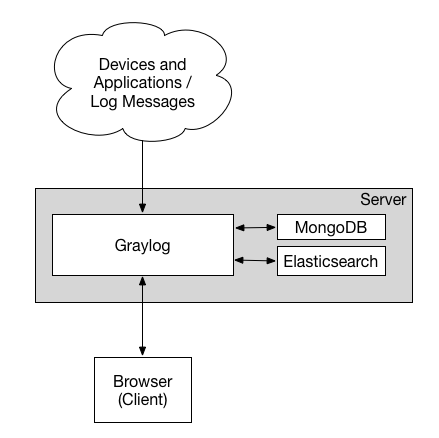
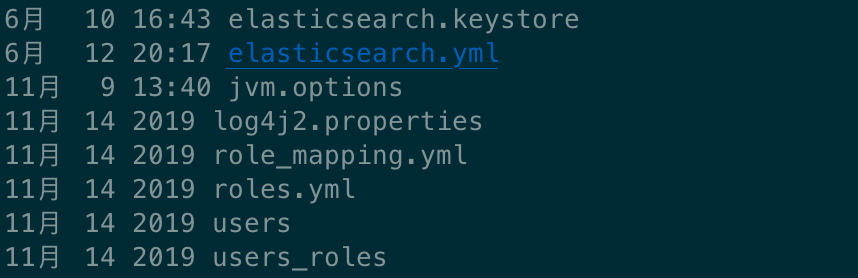
.. |image2| image:: ../../../images/Graylog3.png
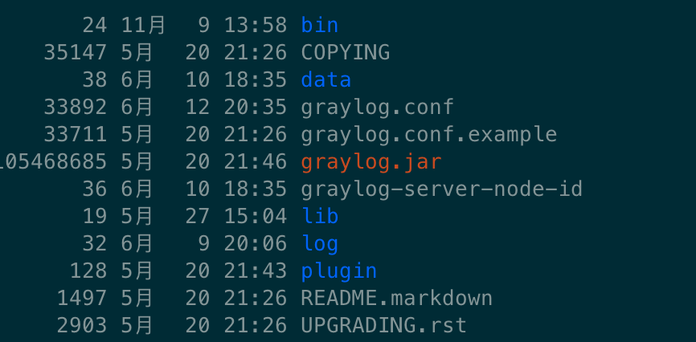
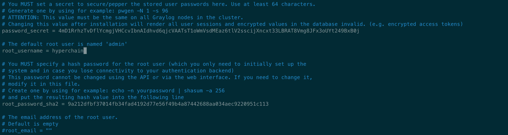
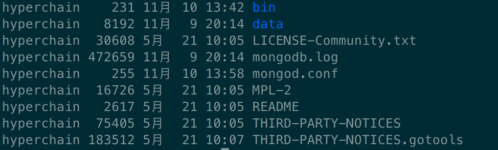
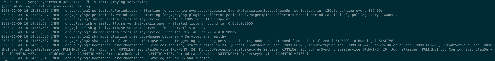

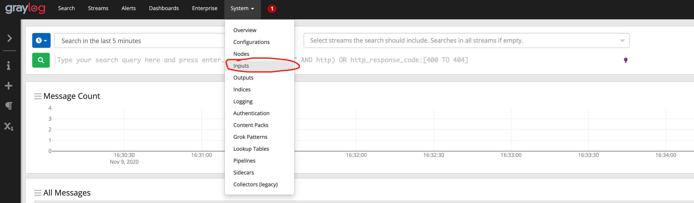
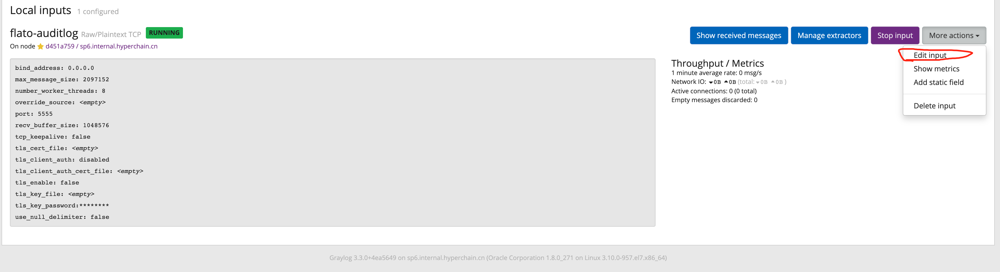
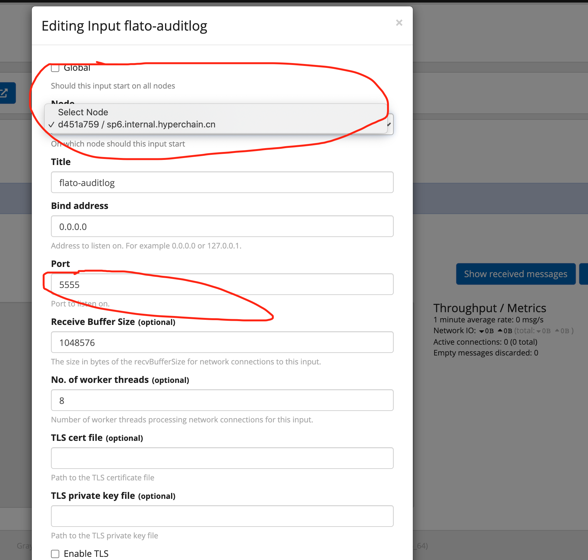
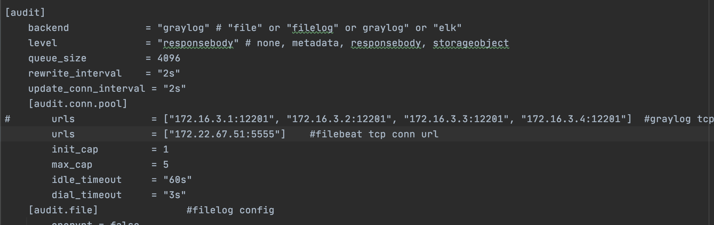
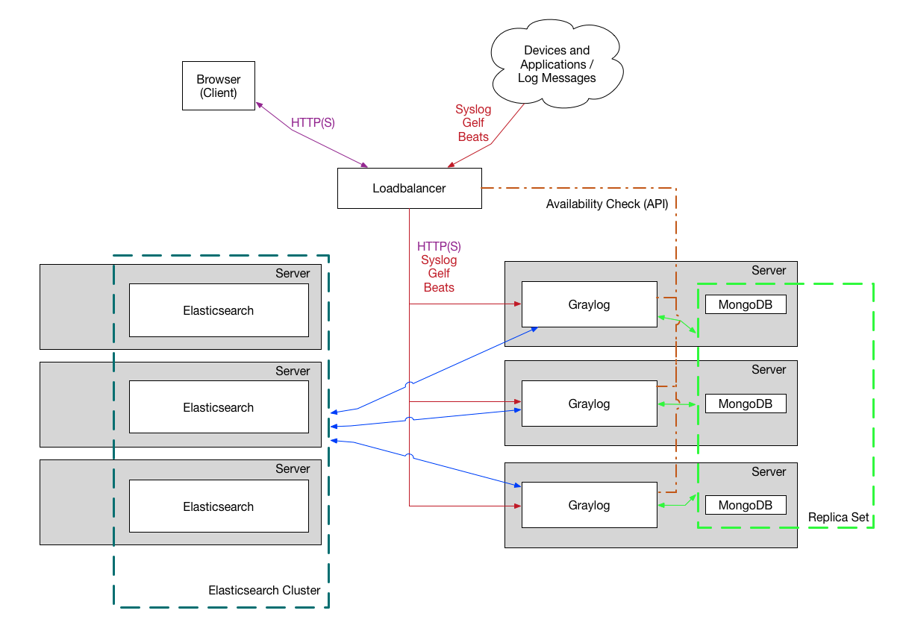
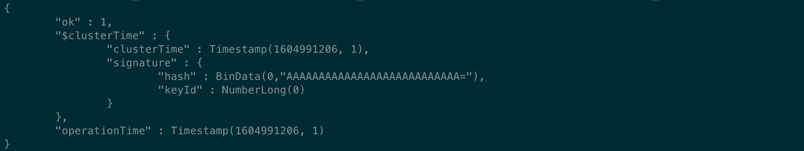
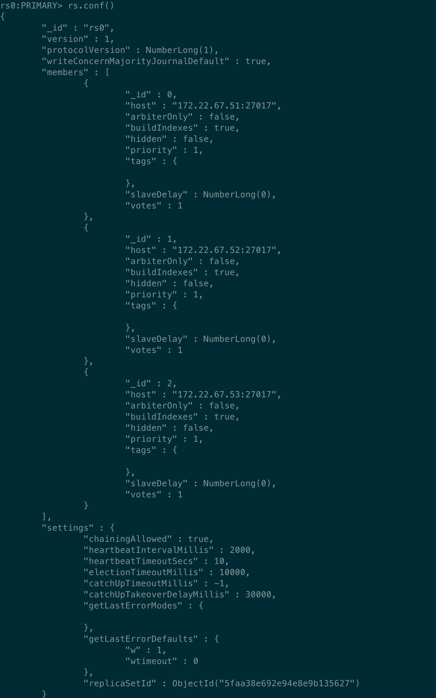

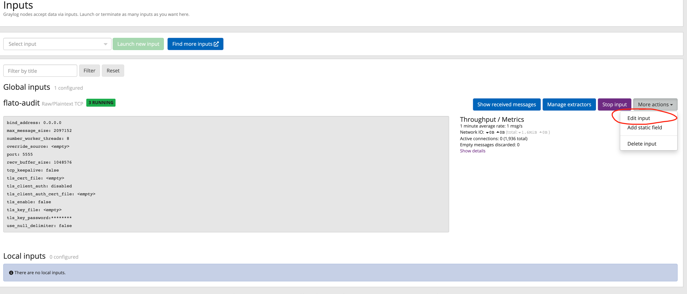
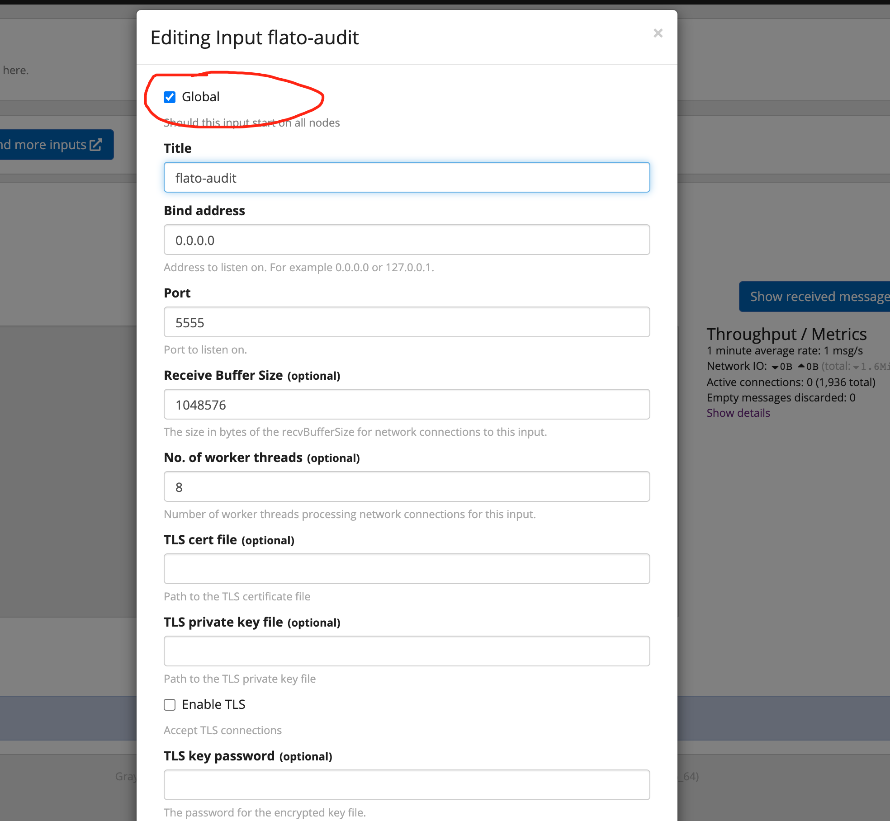
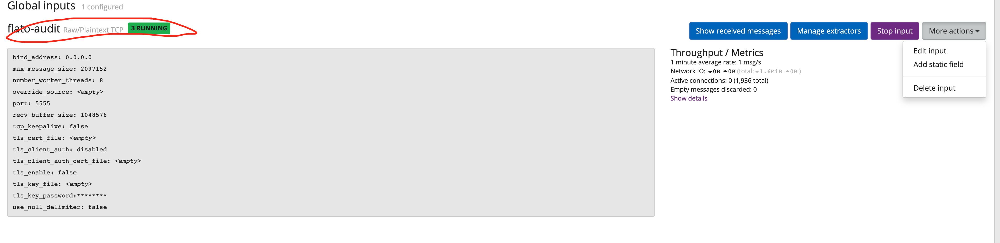
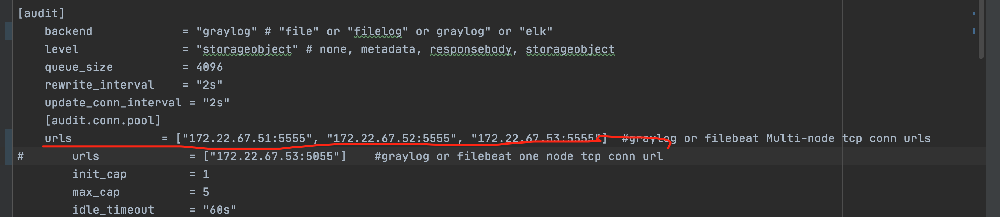
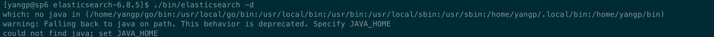
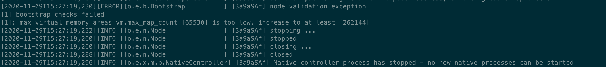

