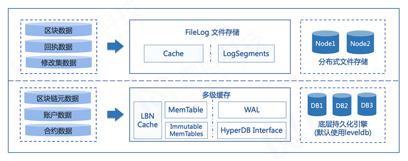

存储模型
========

区块链数据通过多节点冗余存储实现账本可信，而且随着区块的不断追加，数据量会不断增长，整体读写性能也会受到明显影响，如何保证区块链存储的可拓展性是亟需解决的一大问题。

平台为适配多种特性，对数据类型进行了进一步的拆分和分类，主要分为连续型数据和K/V型（Key-Value键值对）数据。

数据结构
--------

连续型数据
^^^^^^^^^

连续型数据包括区块数据、交易回执以及修改集数据：

- 区块数据 ：区块数据即所有区块的集合，主包括区块头内的区块元数据（区块哈希、父区块哈希、时间戳等），以及交易列表信息，是最重要的数据；
- 回执数据 ：回执数据以区块为单位组织，记录所有合法交易的回执；
- 修改集数据 ：修改集数据以区块为单位组织，记录这一区块对账本数据的全量修改信息。

其中，区块数据主要通过区块的形式进行串联，所有区块被从后向前有序地链接在一个链条里，每一个区块都指向其父区块，其主要存储内容如下表所示：

1. 区块定义

- 区块头 ：区块元数据集

- 交易列表 ：收录在区块里的交易信息

2. 区块头定义

- 版本信息：区块结构定义版本信息
- 父区块哈希：父区块哈希值
- 区块哈希：区块内容的哈希标识
- 区块号：区块高度
- 区块时间戳：主节点构造区块的近似时间
- 合约状态哈希：所有合约账户状态的哈希标识
- 交易集哈希：区块中收录的交易列表哈希标识
- 回执集哈希：执行交易产生的回执列表哈希标识
- 其他：区块执行时间戳，区块入链时间戳等

3. 区块的交易列表中存储了被收录的交易数据，每条交易包含以下字段：

- 版本信息：区块结构定义版本信息
- 父区块哈希：父区块哈希值
- 区块哈希：区块内容的哈希标识
- 区块号：区块高度
- 区块时间戳：主节点构造区块的近似时间
- 合约状态哈希：所有合约账户状态的哈希标识
- 交易集哈希：区块中收录的交易列表哈希标识
- 回执集哈希：执行交易产生的回执列表哈希标识
- 其他：区块执行时间戳，区块入链时间戳等

4. 区块的交易列表中存储了被收录的交易数据，每条交易包含以下字段：

- 版本信息：交易结构定义版本信息
- 交易哈希值：根据交易内容生产的哈希标识
- 交易发起者地址：用于标识发起者
- 交易接收者地址：用于标识接收者
- 合约调用信息：调用合约函数标志及调用参数编码后内容
- 交易时间戳：节点收到交易的近似时间
- 交易保留字段：用于存储业务相关数据
- 随机数：随机产生的64位整数
- 用户签名：用户对交易内容签名生成的签名信息

K/V型数据
^^^^^^^^^

K/V型数据主要包括区块链元数据、账户数据以及合约数据：

- 区块链元数据 ：区块链元数据存储当前链高度、交易数量、索引信息等辅助信息；
- 账户数据 ：账户数据包含所有账户信息，包括普通账户和合约账户；
- 合约数据 ：合约数据存储了合约的具体信息，包括合约源码与所有合约内部数据，存储于合约数据库中。

与比特币系统采用UTXO模型不同，平台采用账户模型来表示系统状态。当一笔执行交易结束后，会更改相应账户的状态，例如某用户A发起一笔合约调用交易，使得某合约中的变量a的值由0变为1，并持久化到合约账户数据库中存储。

因此，每一笔交易的执行，即意味着账户状态的一次转移，也代表着区块链系统账本的一次状态转移。相对于创世状态，最新的区块链账本状态被称为世界状态。

合约账户定义

- 合约地址 ：用于标识合约账户的唯一标识
- 合约存储空间哈希 ：利用Merkle树计算合约存储空间所得的标识
- 合约代码哈希 ：合约可执行代码哈希产生的标识
- 余额 ：账户余额
- 创建者 ：创建该合约的账户地址
- 创建区块高度 ：合约被部署时的区块高度
- 合约状态 ：当前合约的可访问状态（正常或冻结）

除以上数据外，合约账户还有两个数据字段：合约源码以及变量存储空间。合约源码就是一段用字节数组编码的指令集，每一次合约的调用其实就是一次合约代码的运行。合约内部定义的变量则会被存储在合约所属的存储空间中。一个简化版的合约账户结构如下所示：

|image0|

存储模式
--------
为了突破区块链系统的存储瓶颈，平台自研混合存储引擎，针对不同的数据类型设计相应存储模式。

|image1|

针对顺序型的区块数据，设计区块链专用存储引擎Filelog；针对随机性较强的K/V型区块链状态数据，选用具备很高随机写顺序读性能的存储引擎LevelDB，并设计多级缓存机制Multicache，实现状态数据的高效存取，以此保证在数据量不断增大的情况下，系统读写性能不受影响。

其中，平台自研的Filelog是一种Append-only形式的数据库，用来存储区块链场景中按照区块号严格递增的数据，因此Filelog的基本操作仅包括read/write两种。Filelog具有顺序写、随机读的特点，相比于LevelDB，Filelog对区块数据写入性能的提升高达90%。

