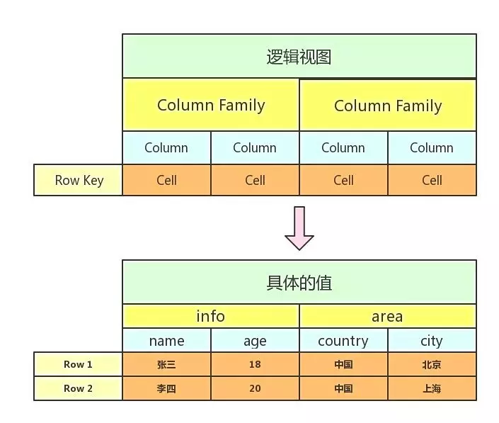

.. _HVM-Contract-book-data-structure:

为方便合约中和账本的交互，以及提供多样化的合约功能，能让合约编写者像使用本地Java集合一样来操作区块链账本，目前hvm中提供了HyperTable，HyperMap、HyperList和NestedMap四种类型，当合约中需要保存持续增长的数据的时候，都应考虑使用提供的账本数据结构。

1. HyperList介绍
================

HyperList是HVM内部定义的一种与ArrayList类似的类型，它是一个有序的Java合约账本数据集合，实现了Java的List接口，数据以懒加载的形式，减少了内存的使用，提高了更新账本的插入效率。

**注意：**

-  HyperList应定义在HVM合约的具体实现类中，且应为合约的成员变量，同时需加上@StoreField注解；

-  考虑到HyperList的持久化存储策略，不建议向HyperList插入大量数据；

-  Value类型\ **不推荐**\ 使用一些含有map或list这种会不断增长的保存数据的结构体；

-  不建议根据对象去查询其在HyperList中的索引位置（如indexOf接口），同时应减少使用迭代器接口；

-  Value类型不能包括泛型。

**HyperList使用示例**
---------------------

 ::

   //定义
   @StoreField
   private HyperList<String> hyperList = new HyperList<>();

    //调用接口示例 hyperList.add(0, “w0”); hyperList.get(0);

    String[] array = new String[]{“a”, “b”, “c”, “d”}; ArrayList arrayList =
    new ArrayList(Arrays.asList(array)); hyperList.addAll(arrayList);
    hyperList.get(hyperList.size() - 1);

    hyperList.contains(“0”); hyperList.equals(arrayList);
    hyperList.hashCode(); hyperList.remove(3); hyperList.remove(“b0”);
    hyperList.set(0, “q”); ListsubList = hyperList.subList(0, 3);

**HyperList使用demo**

   **【源码包可参考HVM使用手册 - HVM合约Demo附件源码 - hvm-manual-demo的hyperlist目录】**

## HyperList接口

### add

向HyperList的末尾位置添加元素::

   public boolean add(E e) {}

==== =============== ===============================
方法 参数            返回值
==== =============== ===============================
add  e：待添加的元素 添加成功返回true，否则返回false
==== =============== ===============================

**示例：**

.. code:: java

   boolean isOK = hyperList.add("1");

在HyperList的指定index位置，添加值

.. code:: java

   public void add(int index, E element) {}

==== =========================================== ======
方法 参数                                        返回值
==== =========================================== ======
add  index：HyperList中的位置element：待添加的值 无
==== =========================================== ======

**示例：**

.. code:: java

   boolean isOK = hyperList.add(0, "w0");

addAll
~~~~~~

在HyperList尾部添加参数中的所有元素

.. code:: java

   public boolean addAll(Collection<? extends E> c) {}

+--------+--------------+----------------------------------------------+
| 方法   | 参数         | 返回值                                       |
+========+==============+==============================================+
| addAll | c：待添      | HyperList添加参                              |
|        | 加的元素集合 | 数中的所有元素，成功返回true，失败返回false  |
+--------+--------------+----------------------------------------------+

**示例：**

.. code:: java

   String[] array = new String[]{"a", "b", "c", "d"};
   ArrayList<String> arrayList = new ArrayList(Arrays.asList(array));
   boolean isOK = hyperList.addAll(arrayList);

在HyperList指定位置添加参数中的所有元素

.. code:: java

   public boolean addAll(int index, Collection<? extends E> c) {}

+----------+-----------------------+-----------------------------------+
| 方法     | 参数                  | 返回值                            |
+==========+=======================+===================================+
| addAll   | index：指定添加位     | HyperList添加集合中的所有         |
|          | 置c：待添加的元素集合 | 元素，成功返回true，失败返回false |
+----------+-----------------------+-----------------------------------+

**示例：**

.. code:: java

   String[] array0 = new String[]{"a0", "b0", "c0", "d0"};
   boolean isOK = hyperList.addAll(0, Arrays.asList(array0));

contains
~~~~~~~~

判断HyperList是否包含该对象

.. code:: java

   public boolean contains(Object o) {}

======== ======= =========================================
方法     参数    返回值
======== ======= =========================================
contains o：对象 HyperList含有对象o返回true，否则返回false
======== ======= =========================================

**示例：**

.. code:: java

   boolean isContains = hyperList.contains("a");

containsAll
~~~~~~~~~~~

判断HyperList是否包含参数中的所有元素

.. code:: java

   public boolean containsAll(Collection<?> c) {}

+--------------+-------+-----------------------------------------------+
| 方法         | 参数  | 返回值                                        |
+==============+=======+===============================================+
| containsAll  | c：   | HyperLi                                       |
|              | 元素  | st包含参数中的所有元素返回true，否则返回false |
|              | 集合  |                                               |
+--------------+-------+-----------------------------------------------+

**示例：**

.. code:: java

   String[] array = new String[]{"a", "b", "c", "d"};
   ArrayList<String> arrayList = new ArrayList(Arrays.asList(array));
   boolean isContains = hyperList.containsAll(arrayList);

equals
~~~~~~

判断HyperList与对象o是否值相等

.. code:: java

   public boolean equals(Object o) {}

====== ============= ===================================================
方法   参数          返回值
====== ============= ===================================================
equals o：Object对象 HyperList对象与参数o值相等则返回true，否则返回false
====== ============= ===================================================

**示例：**

.. code:: java

   String[] array = new String[]{"a", "b", "c", "d"};
   ArrayList<String> arrayList = new ArrayList(Arrays.asList(array));
   boolean isEqual = hyperList.equals(arrayList);

get
~~~

获取HyperList在index位置的值

.. code:: java

   public E get(int index) {}

==== ======================== =============
方法 参数                     返回值
==== ======================== =============
get  index：HyperList中的位置 index位置的值
==== ======================== =============

**示例：**

.. code:: java

   String value = hyperList.get(hyperList.size() - 1);

hashCode
~~~~~~~~

获取HyperList的hash值

.. code:: java

   public int hashCode() {}

======== ==== =================
方法     参数 返回值
======== ==== =================
hashCode 无   HyperList的哈希值
======== ==== =================

**示例：**

.. code:: java

   String hashCode = hyperList.hashCode();

isEmpty
~~~~~~~

判断HyperList是否为空

.. code:: java

   public boolean isEmpty() {}

======= ==== ====================================
方法    参数 返回值
======= ==== ====================================
isEmpty 无   HyperList为空返回true，否则返回false
======= ==== ====================================

**示例：**

.. code:: java

   boolean isEmpty = hyperList.isEmpty();

iterator
~~~~~~~~

获取HyperList的Iterator

.. code:: java

   public Iterator<E> iterator() {}

======== ==== ===================
方法     参数 返回值
======== ==== ===================
iterator 无   HyperList的Iterator
======== ==== ===================

**示例：**

.. code:: java

   Iterator iterator = hyperList.iterator();
   String value = iterator.next();
   boolean hasNext = iterator.hasNext();
   iterator.remove();

listIterator
~~~~~~~~~~~~

获取HyperList的ListIterator，默认位置为0

.. code:: java

   public ListIterator<E> listIterator() {}

============ ==== ==============================
方法         参数 返回值
============ ==== ==============================
listIterator 无   HyperList在位置0的ListIterator
============ ==== ==============================

**示例：**

.. code:: java

   ListIterator listIterator = hyperList.listIterator();

获取HyperList指定位置的ListIterator

.. code:: java

   public ListIterator<E> listIterator(int index) {}

============ =============== ===============================
方法         参数            返回值
============ =============== ===============================
listIterator index：指定位置 HyperList指定位置的ListIterator
============ =============== ===============================

**示例：**

.. code:: java

   ListIterator listIterator = hyperList.listIterator();
   int nextIndex = listIterator.nextIndex();
   boolean hasNext = ilistIterator.hasNext();
   String value = ilistIterator.next();
   int previousIndex = listIterator.previousIndex();
   boolean hasPrevious = listIterator.hasPrevious();
   String value2 = listIterator.previous();

indexOf
~~~~~~~

HyperList中按顺序第一次出现对象o的位置

.. code:: java

   public int indexOf(Object o) {}

======= ======== =====================================
方法    参数     返回值
======= ======== =====================================
indexOf o：对象o HyperList中第一次出现对象o的位置index
======= ======== =====================================

**示例：**

.. code:: java

   int index = hyperList.indexOf("a");

lastIndexOf
~~~~~~~~~~~

HyperList中按顺序最后一次出现对象o的位置

.. code:: java

   public int lastIndexOf(Object o) {}

=========== ======== =======================================
方法        参数     返回值
=========== ======== =======================================
lastIndexOf o：对象o HyperList中最后一次出现对象o的位置index
=========== ======== =======================================

**示例：**

.. code:: java

   int lastIndex = hyperList.lastIndexOf("a");

remove
~~~~~~

根据值删除HyperList中的元素

.. code:: java

   public boolean remove(Object o) {}

====== =============== ===============================
方法   参数            返回值
====== =============== ===============================
remove o：待删除的对象 删除成功返回true，否则返回false
====== =============== ===============================

**示例：**

.. code:: java

   boolean isRemove = hyperList.remove("p");

删除HyperList指定index位置的元素，并返回该值

.. code:: java

   public E remove(int index) {}

====== ======================== ===================
方法   参数                     返回值
====== ======================== ===================
remove index：HyperList中的位置 删除的index位置的值
====== ======================== ===================

**示例：**

.. code:: java

   String oldValue = hyperList.remove(6);

removeAll
~~~~~~~~~

HyperList批量删除与集合中元素相同的所有元素

.. code:: java

   public boolean removeAll(Collection<?> c) {}

+---------+-----------+------------------------------------------------+
| 方法    | 参数      | 返回值                                         |
+=========+===========+================================================+
| re      | c：       | HyperList删除C集合                             |
| moveAll | 待删除的  | 中存在的所有元素，成功返回true，失败返回false  |
|         | 元素集合  |                                                |
+---------+-----------+------------------------------------------------+

**示例：**

.. code:: java

   String[] array0 = new String[]{"a0", "b0", "c0", "d0"};
   boolean isRemove = hyperList.removeAll(Arrays.asList(array0));

retainAll
~~~~~~~~~

HyperList批量删除参数集合中不存在的所有元素

.. code:: java

   public boolean retainAll(Collection<?> c) {}

+---------+------+----------------------------------------------------+
| 方法    | 参数 | 返回值                                             |
+=========+======+====================================================+
| re      | c：  | HyperList批量删除C集                               |
| tainAll | 元素 | 合中不存在的所有元素，成功返回true，失败返回false  |
|         | 集合 |                                                    |
+---------+------+----------------------------------------------------+

**示例：**

.. code:: java

   String[] array = new String[]{"a", "b", "c", "d"};
   ArrayList<String> arrayList = new ArrayList(Arrays.asList(array));
   boolean isRemove = hyperList.retainAll(arrayList);

size
~~~~

获取HyperList的长度

.. code:: java

   public int size() {}

==== ==== =================
方法 参数 返回值
==== ==== =================
size 无   HyperList的总长度
==== ==== =================

**示例：**

.. code:: java

   int size = hyperList.size();

set
~~~

HyperList的index位置的值设为新值，返回旧的值

.. code:: java

   public E set(int index, E element) {}

==== ======================================= ===================
方法 参数                                    返回值
==== ======================================= ===================
set  index：HyperList中的位置element：新的值 返回index位置的旧值
==== ======================================= ===================

**示例：**

.. code:: java

   String oldValue = hyperList.set(0, "q");

subList
~~~~~~~

HyperList从fromIndex到toIndex位置的元素作为List对象返回

.. code:: java

   public List<E> subList(int fromIndex, int toIndex) {}

+------+-------------------------+--------------------------------------+
| 方法 | 参数                    | 返回值                               |
+======+=========================+======================================+
| sub  | fromIndex：起           | List对象，包含                       |
| List | 始位置toIndex：末尾位置 | HyperList从fromIndex到toIndex的元素  |
+------+-------------------------+--------------------------------------+

**示例：**

.. code:: java

   List<String> subList = hyperList.subList(0, 3);

toArray
~~~~~~~

将HyperList转为数组并返回

.. code:: java

   public Object[] toArray() {}

======= ==== ===================
方法    参数 返回值
======= ==== ===================
toArray 无   HyperList转换的数组
======= ==== ===================

**示例：**

.. code:: java

   String[] arrString = hyperList.toArray();

将HyperList转为指定类型的数组并返回

.. code:: java

   public <T> T[] toArray(T[] a) {}

======= ============== ==========================
方法    参数           返回值
======= ============== ==========================
toArray a：类型T的数组 HyperList转换的T类型的数组
======= ============== ==========================

**示例：**

.. code:: java

   Object[] arrObject = hyperList.toArray(new Object[10]);

2. **HyperMap介绍**
===================

HyperMap是HVM内部定义的一种类型，与HashMap类似，都实现了Map接口。而与HashMap不同的是在账本的操作上，HashMap一直是以整个map对象为单位修改账本的，而HyperMap可以做到对于单个key，value的修改，只会涉及到单个key，value在账本中的操作，而不会涉及到整个map对象。

因此HashMap适合小数据量，且变动不频繁的数据，HyperMap适合会持续增长的大数据量，一般情况下都使用HyperMap。

**提供功能**
------------

因为HyperMap和HashMap一样，实现了Map接口，所以其提供的功能与HashMap基本一致。具体功能请查看支持接口章节。

**注意事项**
------------

-  HyperMap使用时要加上@StoreField注解；

-  HyperMap不支持clear功能，调用clear方法会抛出
   UnsupportedOperationException异常。

-  HyperMap执行过程中会用到Value的hashcode()方法，Value类型如果是自定义类，则需要\ **实现自定义类的hashcode()方法**\ ，否则部分可能出现put数据无效的情况;

示例如下：

.. code:: java

   public class MyContract extends BaseContract implements IMain {
       @StoreField
       private Map<String, PointsInfo> mapA = new HyperMap<>();
   }

   public class PointsInfo {
       private int version;
       private int points;

       @Override
       public int hashCode() {
           ...
       }
   }

-  Value类型\ **不推荐**\ 使用一些含有map或list这种会不断增长的保存数据的结构体；

错误示例：

.. code:: java

   class Data {
   	private Map<String, String> map;
   }

   @StoreField
   private HyperMap<String, Data> hyperMap = new HyperMap<String, Data>();

-  HyperMap的Key和Value都不能是泛型，也不能是带有泛型的类型。

错误示例：

.. code:: java

   //以下例子均为示例，不包含全部错误情况
   @StoreField
   private HyperMap<K, Integer> err1 = new HyperMap<K, Integer>();

   @StoreField
   private HyperMap<HyperMap<String, Integer>, Integer> err2 = new HyperMap<HyperMap<String, Integer>, Integer>();

   @StoreField
   private HyperMap<String, HashMap<String, Integer>> err3 = new HyperMap<String, HashMap<String, Integer>>();

   @StoreField
   private HyperMap<ArrayList<String>, Integer> err4 = new HyperMap<ArrayList<String>, Integer>();

demo样例
--------

往HyperMap中插入数据
~~~~~~~~~~~~~~~~~~~~

.. code:: java

   @StoreField
   private HyperMap<String, Integer> map = new HyperMap<String, Integer>();

   @Override
   public void initMap(int count) {
       for (int i = 0; i < count; i++) {
           map.put("t" + i, i + 1);
       }
   }

对HyperMap进行迭代
~~~~~~~~~~~~~~~~~~

.. code:: java

   @StoreField
   private HyperMap<String, Integer> map = new HyperMap<String, Integer>();

   @Override
   public String itrMap() {
       int count = 0;
       StringBuilder ans = new StringBuilder();
       Set<String> itr = map.keySet();
       for (String it : itr) {
           count++;
           ans.append(it + " , ");
       }
       ans.append("count: " + count);
       return ans.toString();
   }

完整例子代码可获取源码包后直接运行体验，需在项目根目录下先运行mvn
package。

**【源码包可参考HVM使用手册 - HVM合约Demo附件源码 -
hvm-manual-demo的hypermap目录】**

**支持接口**
------------

和提供功能一样，HyperMap支持的接口与与HashMap基本一致。

put
~~~

向HyperMap添加键值对

.. code:: java

   public V put(K key, V value);

+-------+------------+-------------------------------------------------+
| 方法  | 参数       | 返回值                                          |
+=======+============+=================================================+
| put   | key：键    | key不能为                                       |
|       | value：值  | 空，若key为空，会抛出异常。如果HyperMap中已存在 |
|       |            | 该key，则返回原来的value，如果不存在，返回null  |
+-------+------------+-------------------------------------------------+

**示例：**

.. code:: java

   hyperMap.put("tom", 59);

.. _get-1:

get
~~~

通过key得到HyperMap中对应的value

.. code:: java

   public V get(K key);

+------+------+-------------------------------------------------------+
| 方法 | 参数 | 返回值                                                |
+======+======+=======================================================+
| get  | key  | 若key为null返回null                                   |
|      |      | 。若map中存在key，返回对应的value。若不存在，返回null |
+------+------+-------------------------------------------------------+

**示例：**

.. code:: java

   int score = hyperMap.get("tom");

.. _remove-1:

remove
~~~~~~

删除HyperMap中的键值对

.. code:: java

   public V remove(Object key);

====== =============== ==============================================
方法   参数            返回值
====== =============== ==============================================
remove key：被删除的键 返回key对应的value。若key不存在map中，返回null
====== =============== ==============================================

**示例：**

.. code:: java

   hyperMap.remove("tom");

.. _size-1:

size
~~~~

获得HyperMap的大小

.. code:: java

   public int size();

==== ==== ======================
方法 参数 返回值
==== ==== ======================
size      HyperMap中键值对的数量
==== ==== ======================

**示例：**

.. code:: java

   int size = hyperMap.size();

.. _isempty-1:

isEmpty
~~~~~~~

判断HyperMap是否为空

.. code:: java

   public boolean isEmpty();

======= ==== =======================================
方法    参数 返回值
======= ==== =======================================
isEmpty      如果HyperMap为空返回true，否则返回false
======= ==== =======================================

**示例：**

.. code:: java

   boolean isEmpty = hyperMap.isEmpty();

containsKey
~~~~~~~~~~~

判断HyperMap是否包含key

.. code:: java

   public boolean containsKey(Object key);

=========== ======= ==============================================
方法        参数    返回值
=========== ======= ==============================================
containsKey key：键 如果HyperMap中包含该key返回true，否则返回false
=========== ======= ==============================================

**示例：**

.. code:: java

   boolean isContain = hyperMap.containsKey("tom");

containsValue
~~~~~~~~~~~~~

判断HyperMap是否包含value

.. code:: java

   public boolean containsValue(Object value);

============= ========= ================================================
方法          参数      返回值
============= ========= ================================================
containsValue value：值 如果HyperMap中包含该value返回true，否则返回false
============= ========= ================================================

**示例：**

.. code:: java

   boolean isContain = hyperMap.containsValue(59);

.. _equals-1:

equals
~~~~~~

判断HyperMap与对象o是否值相等

.. code:: java

   public boolean equals(Object o);

====== ============= ==================================================
方法   参数          返回值
====== ============= ==================================================
equals o：Object对象 HyperMap对象与参数o值相等则返回true，否则返回false
====== ============= ==================================================

**示例：**

.. code:: java

   boolean isEqual = hyperMap.equals("tom"); //false

putAll
~~~~~~

将一个map对象的全部键值对放入HyperMap中

.. code:: java

   public void putAll(Map<? extends K, ? extends V> m);

====== ============================ ======
方法   参数                         返回值
====== ============================ ======
putAll m：需要存入HyperMap的map对象
====== ============================ ======

**示例：**

.. code:: java

   HashMap<String, Integer> map = new HashMap<String, Integer>();
   map.put("tom", 59);
   map.put("bob", 58);
   hyperMap.putAll(map);

.. _hashcode-1:

hashCode
~~~~~~~~

获取HyperMap的hash值

.. code:: java

   public int hashCode();

======== ==== ================
方法     参数 返回值
======== ==== ================
hashCode 无   HyperMap的哈希值
======== ==== ================

**示例：**

.. code:: java

   String hashCode = hyperMap.hashCode();

keySet
~~~~~~

获取HyperMap的key的迭代器

.. code:: java

   public Set<K> keySet();

====== ==== =======
方法   参数 返回值
====== ==== =======
keySet 无   Set对象
====== ==== =======

**示例：**

.. code:: java

   //forEach用法
   Set<String> keySet = hyperMap.keySet();
   for(String key : keySet){
   	System.out.println(key);
   }
   //迭代器用法
   Iterator<String> ite = hyperMap.keySet().iterator();
   while (ite.hasNext()) {
       System.out.println(ite.next);
   }

values
~~~~~~

获取HyperMap的value的迭代器

.. code:: java

   public Collection<V> values();

====== ==== ==============
方法   参数 返回值
====== ==== ==============
values 无   Collection对象
====== ==== ==============

**示例：**

.. code:: java

   //forEach用法
   Collection<Integer> values = hyperMap.values();
   for(Integer value : values){
   	System.out.println(value);
   }
   //迭代器用法
   Iterator<Integer> ite = hyperMap.values().iterator();
   while (ite.hasNext()) {
       System.out.println(ite.next);
   }

entrySet
~~~~~~~~

获取HyperMap的键值对的迭代器

.. code:: java

   public Set<Entry<K, V>> entrySet();

======== ==== =======
方法     参数 返回值
======== ==== =======
entrySet 无   Set对象
======== ==== =======

**示例：**

.. code:: java

   //forEach用法
   Set<String> entrySet = hyperMap.entrySet();
   for(String entry : entrySet){
   	System.out.println(entry);
   }
   //迭代器用法
   Iterator<String> ite = hyperMap.entrySet().iterator();
   while (ite.hasNext()) {
       System.out.println(ite.next);
   }

seekKeySet
~~~~~~~~~~

创建指定位置的Key迭代器，起始位置为参数key所对应的节点。

不同与普通迭代器，指定位置迭代器的迭代顺序为key的json字串的字典序升序。

当传入的key为null时，该接口调用效果同keySet接口。

当传入的key不存在于HyperMap中时，迭代器依旧能够创建成功，其起始位置为HyperMap中第一个比参数key大的节点的位置。

.. code:: java

   public Set<K> seekKeySet(K key);

========== ======================== =============
方法       参数                     返回值
========== ======================== =============
seekKeySet key：迭代器起始节点的key 返回类型：Set
========== ======================== =============

示例：

.. code:: java

   //foreach用法
   Set<K> keySet = map.seekKeySet(key);
   for (K k : keySet) {
   	System.out.println(k);
   }
   //迭代器用法
   Iterator itr = keySet.iterator();
   while (itr.hasNext()) {
   	System.out.println(ite.next());
   }

seekValues
~~~~~~~~~~

创建指定位置的Value迭代器

.. code:: java

   public Collection<V> seekValues(K key)

========== ======================== ====================
方法       参数                     返回值
========== ======================== ====================
seekValues key：迭代器起始节点的key 返回类型：Collection
========== ======================== ====================

示例：

.. code:: java

   //foreach用法
   Collection<V> values = map.seekValues(key);
   for (V value : values) {
   	System.out.println(value);
   }
   //迭代器用法
   Iterator itr = values.iterator();
   while (itr.hasNext()) {
   	System.out.println(ite.next());
   }

seekEntrySet
~~~~~~~~~~~~

创建指定位置的Entry迭代器

.. code:: java

   public Set<Entry<K, V>> seekEntrySet(K key)

============ ======================== =============
方法         参数                     返回值
============ ======================== =============
seekEntrySet key：迭代器起始节点的key 返回类型：Set
============ ======================== =============

示例：

.. code:: java

   //foreach用法
   Set<Node> entrySet = map.seekEntrySet(key);
   for (Node node : entrySet) {
   	System.out.println(node);
   }
   //迭代器用法
   Iterator itr = entrySet.iterator();
   while (itr.hasNext()) {
   	System.out.println(ite.next());
   }

3. **HyperTable介绍**
=====================

HyperTable是HVM提出的第三种数据结构，具有\ **表、行、列簇、列**\ 四个概念。他们之间的关系如下：\ **一个表可以包含多行，一行里有一或多个列簇，每个列簇里包含一或多列。**\ 在一张表中，给定指定的\ **行、列簇、列**\ 可以唯一确定一个值。

HyperTable表结构如下图所示：

|image0|

与Hashmap相似，HyperTable也提供了put和get方法来进行插入和查询。与HashMap不同的是，HyperTable的key是由行、列簇、列共同组成。

一个HyperTable对象对应着一张表。除了表以外，我们还设计了数据结构
``Row``\ 、\ ``ColumnFamily``
分别对应行和列簇，由于确定行和列簇后，对每个列都可以指定对应的唯一的值，这类似Map的作用，所以我们没有另外为列设计一个数据结构。

因此，HyperTable的数据结构包含关系也如下

   **HyperTable ==> Row ==>
   ColumnFamily**\ ，其中Row、ColumnFamily都是HyperTable的内部类。

.. _提供功能-1:

**提供功能**
------------

``HyperTable`` 不仅支持自己插入、更新值，也支持通过其包含的 ``Row``
对象、 ``ColumnFamily``
对象插入、查询、更新值，为用户操作提供了相应的拓展性，假设一行包含多条数据（多个列簇或列），用户可以在拿到
``Row`` 对象后往里插入值，而不需要通过 ``HyperTable``
每次提供相同的行名插入。

此外，\ ``HyperTable``
提供了行的迭代器，即可以通过迭代得到每一行的行名信息，迭代器由
``RowsSet``
实现，其实用方式与普通的Java集合迭代器一致，用户可以查看支持接口一章查看如何获取迭代器。

.. _注意事项-1:

**注意事项**
------------

1. ``HyperTable``
   对\ **行名、列簇名、列名、以及值**\ 的插入有限制，不允许插入任何
   **null** 或 **““** 字符串。

2. ``HyperTable`` 不允许\ **行名、列簇名、列名**\ 包含 \*\*@\*\* 符号。

3. 在使用 ``HyperTable``
   的行迭代器的时候。不支持添加、删除或更新数据的操作，类似 OpenJDK
   的fast-fail机制。

HyperTable支持接口
------------------

.. _put-1:

put
~~~

往表内插入值

.. code:: java

   public void put(String rowName, String colFamName, String colName, String value);

==== ========================================================= ======
方法 参数                                                      返回值
==== ========================================================= ======
put  rowName：行名colFamName：列簇名colName：列名value：插入值 无
==== ========================================================= ======

**示例：**

.. code:: java

   HyperTable hyperTable = new HyperTable();  //表名由系统自动生成
   hyperTable.put("高三","十二班","李四","59");

.. _get-2:

get
~~~

从表中查询值

.. code:: java

   public String get(String rowName, String colFamName, String colName);

+-----+--------------------------+------------------------------------+
| 方  | 参数                     | 返回值                             |
| 法  |                          |                                    |
+=====+==========================+====================================+
| get | rowName：行名colFamN     | 返回类型：String返回查询结果       |
|     | ame：列簇名colName：列名 | ，若值存在，返回值，否则返回null。 |
+-----+--------------------------+------------------------------------+

**示例：**

.. code:: java

   String value = hyperTable.get("高三","十二班","李四"); //value = 59
   value = hyperTable.get("趣链一中","高三","十二班"); //value = null

.. _remove-2:

remove
~~~~~~

通过指定的行、列簇、列删除值，可以删除不存在的值，不会报错。

.. code:: java

   public void remove(String rowName, String colFamName, String colName);

====== ============================================ ======
方法   参数                                         返回值
====== ============================================ ======
remove rowName：行名colFamName：列簇名colName：列名 无
====== ============================================ ======

**示例：**

.. code:: java

   hyperTable.remove("高三","十二班","李四");
   String value = hyperTable.get("高三","十二班","李四"); //value = null

removeRow
~~~~~~~~~

通过指定的行名删除行，该行名对应的行可以不存在，不会报错。该行下的所有列簇和列全部会被删除。

.. code:: java

   public void removeRow(String rowName);

========= ============= ======
方法      参数          返回值
========= ============= ======
removeRow rowName：行名 无
========= ============= ======

**示例：**

.. code:: java

   hyperTable.removeRow("高三");
   String value = hyperTable.get("高三","十二班","李四"); //value = null

.. _containskey-1:

containsKey
~~~~~~~~~~~

通过指定的行、列簇、列查询是否包含某列。

.. code:: java

   public boolean containsKey(String rowName, String colFamName, String colName);

+---------------+------------------------+-----------------------------+
| 方法          | 参数                   | 返回值                      |
+===============+========================+=============================+
| containsKey   | rowName：行名colFamNam | 返回类型：boolean若表中存在 |
|               | e：列簇名colName：列名 | 该列，返回true否则返回false |
+---------------+------------------------+-----------------------------+

**示例：**

.. code:: java

   boolean isExist = hyperTable.containsKey("高三","十二班","李四") //isExist = false;
   hyperTable.put("高三","十二班","李四","59");
   isExist = hyperTable.containsKey("高三","十二班","李四")
   //isExist = true;

containsRow
~~~~~~~~~~~

通过指定行名查询是否包含某行。

.. code:: java

   public boolean containsRow(String rowName);

+-------------+-----------+--------------------------------------------+
| 方法        | 参数      | 返回值                                     |
+=============+===========+============================================+
| containsRow | rowN      | 返回类型：bo                               |
|             | ame：行名 | olean若表中存在该行，返回true否则返回false |
+-------------+-----------+--------------------------------------------+

**示例：**

.. code:: java

   boolean isExist = hyperTable.containsRow("高三") //isExist = true;
   hyperTable.removeRow("高三");
   isExist = hyperTable.containsKey("高三","十二班","李四")
   //isExist = false;

getRow
~~~~~~

获取一行的引用，行名参数可以任意指定，不一定是表内已经存在的行。

.. code:: java

   public HyperTable.Row getRow(String rowName);

+--------+-------+-----------------------------------------------------+
| 方法   | 参数  | 返回值                                              |
+========+=======+=====================================================+
| getRow | 无    | 返回类型：Row即使r                                  |
|        |       | owName不存在，也会返回一个Row对象，但是操作时将报错 |
+--------+-------+-----------------------------------------------------+

**示例:**

.. code:: java

   Row row = hyperTable.getRow("高三");

getName
~~~~~~~

获取该表的表名

.. code:: java

   public String getName();

======= ==== ==============================
方法    参数 返回值
======= ==== ==============================
getName 无   返回类型：String返回该表的表名
======= ==== ==============================

**示例:**

.. code:: java

   String tableName = hyperTable.getName();

**HyperTable.Row支持接口**
--------------------------

   因为行本身需要依赖于表，所以我们规定只能由 HyperTable 的 getRow()
   接口获得 HyperTable.Row
   对象，而不是简单地通过new构造方式构造。同样，HyperTable.Row
   对象内会保存自己所属的 HyperTable 对象的一份引用。

.. _put-2:

put
~~~

往该行插入值，与HyperTable接口功能一致。

.. code:: java

   public void put(String colFamName, String colName, String value);

==== ============================================ ======
方法 参数                                         返回值
==== ============================================ ======
put  colFamName：列簇名colName：列名value：插入值 无
==== ============================================ ======

**示例：**

.. code:: java

   Row row = hyperTable.getRow("高三");
   row.put("十二班","李四","59");

.. _get-3:

get
~~~

从行中查询值，与HyperTable接口功能一致。

.. code:: java

   public String get(String colFamName, String colName);

+------+--------------------+-----------------------------------------+
| 方法 | 参数               | 返回值                                  |
+======+====================+=========================================+
| get  | colFamName：列     | 返回类型：String返回查询                |
|      | 簇名colName：列名  | 结果，若值存在，返回值，否则返回null。  |
+------+--------------------+-----------------------------------------+

**示例：**

.. code:: java

   String value = row.get("十二班","李四"); //value = 59
   value = row.get("十二班","张三"); //value = null

.. _remove-3:

remove
~~~~~~

通过指定的列簇、列删除值。与HyperTable接口功能一致。

.. code:: java

   public void remove( String colFamName, String colName);

====== =============================== ======
方法   参数                            返回值
====== =============================== ======
remove colFamName：列簇名colName：列名 无
====== =============================== ======

**示例：**

.. code:: java

   row.remove("十二班","李四");
   String value = row.get("十二班","李四"); //value = null

.. _containskey-2:

containsKey
~~~~~~~~~~~

通过指定的列簇、列查询是否包含某列。与HyperTable接口功能一致。

.. code:: java

   public boolean containsKey(String colFamName, String colName);

+----------+-----------------------+-----------------------------------+
| 方法     | 参数                  | 返回值                            |
+==========+=======================+===================================+
| con      | colFamName            | 返回类型：boolean若行             |
| tainsKey | ：列簇名colName：列名 | 中存在该列，返回true否则返回false |
+----------+-----------------------+-----------------------------------+

**示例：**

.. code:: java

   boolean isExist = row.containsKey("十二班","李四") //isExist = false;
   row.put("十二班","李四","59");
   isExist = row.containsKey("十二班","李四") //isExist = true;

containsColFam
~~~~~~~~~~~~~~

通过指定行名查询是否包含某行。

.. code:: java

   public boolean containsColFam(String colFamName);

+--------------+-------------+----------------------------------------+
| 方法         | 参数        | 返回值                                 |
+==============+=============+========================================+
| co           | colFa       | 返回类型：boolean若行                  |
| ntainsColFam | mName：行名 | 中存在该列簇，返回true，否则返回false  |
+--------------+-------------+----------------------------------------+

**示例：**

.. code:: java

   boolean isExist = row.containsColFam("十二班") //isExist = true;

getTable
~~~~~~~~

获取所属的表的引用

.. code:: java

   public HyperTable getTable();

======== ==== ==============================================
方法     参数 返回值
======== ==== ==============================================
getTable 无   返回类型：HyperTable返回行所属的HyperTable对象
======== ==== ==============================================

**示例：**

.. code:: java

   hyperTable = row.getTable()

getColFam
~~~~~~~~~

获取一列簇的引用，列簇名参数可以任意指定，不一定是行内已经存在的列簇。

.. code:: java

   public HyperTable.ColumnFamily getColFam(String colFamName);

========= ================== ==========================================
方法      参数               返回值
========= ================== ==========================================
getColFam colFamName：列簇名 返回类型：ColumnFamily返回ColumnFamily对象
========= ================== ==========================================

**示例：**

.. code:: java

   ColumnFamily colFam = row.getColFam("十二班")

.. _getname-1:

getName
~~~~~~~

获取该行名

.. code:: java

   public String getName();

======= ==== ==============================
方法    参数 返回值
======= ==== ==============================
getName 无   返回类型：String返回该行的行名
======= ==== ==============================

**示例:**

.. code:: java

   String rowName = row.getName();

**HyperTable.ColumnFamily支持接口**
-----------------------------------

   与行同理，因为列簇本身需要依赖于行，所以我们规定只能由 HyperTable.Row
   的 getColFam() 接口获得 HyperTable.ColumnFamily 对象，而不是通过 new
   的构造方式构造。同样，HyperTable.ColFam 对象内会保存自己所属的
   HyperTable.Row 和 HyperTable 对象的各一份引用。

.. _put-3:

put
~~~

往该行插入值，与HyperTable接口功能一致。

.. code:: java

   public void put(String colName, String value);

==== ========================== ======
方法 参数                       返回值
==== ========================== ======
put  colName：列名value：插入值 无
==== ========================== ======

**示例：**

.. code:: java

   ColumnFamily colFam = row.getColFam("十二班");
   colFam.put("十二班","李四","59");

.. _get-4:

get
~~~

从行中查询值，与HyperTable接口功能一致。

.. code:: java

   public String get(String colName);

+------+--------------------+-----------------------------------------+
| 方法 | 参数               | 返回值                                  |
+======+====================+=========================================+
| get  | colFamName：列     | 返回类型：String返回查询                |
|      | 簇名colName：列名  | 结果，若值存在，返回值，否则返回null。  |
+------+--------------------+-----------------------------------------+

**示例：**

.. code:: java

   String value = colFam.get("李四"); //value = 59
   value = colFam.get("张三"); //value = null

.. _remove-4:

remove
~~~~~~

通过指定的列删除值。与HyperTable接口功能一致。

.. code:: java

   public void remove( String colName);

====== ============= ======
方法   参数          返回值
====== ============= ======
remove colName：列名 无
====== ============= ======

**示例：**

.. code:: java

   colFam.remove("李四");
   String value = colFam.get("李四"); //value = null

.. _containskey-3:

containsKey
~~~~~~~~~~~

通过指定的列查询是否包含某列。与HyperTable接口功能一致。

.. code:: java

   public boolean containsKey(String colName);

+-------------+-----------+--------------------------------------------+
| 方法        | 参数      | 返回值                                     |
+=============+===========+============================================+
| containsKey | colN      | 返回类型：bo                               |
|             | ame：列名 | olean若行中存在该列，返回true否则返回false |
+-------------+-----------+--------------------------------------------+

**示例：**

.. code:: java

   boolean isExist = colFam.containsKey("李四") //isExist = false;
   colFam.put("李四","59");
   isExist = colFam.containsKey("李四") //isExist = true;

.. _getrow-1:

getRow
~~~~~~

获取所属的行的引用

.. code:: java

   public Row getRow();

====== ==== ==================================
方法   参数 返回值
====== ==== ==================================
getRow 无   返回类型：Row返回列簇所属的Row对象
====== ==== ==================================

**示例：**

.. code:: java

   row = colFam.getRow()

setRow
~~~~~~

注意该新行所属的表必须与该列簇所属的表为同一张表，否则会抛出异常。

.. code:: java

   public void setRow(HyperTable.Row row);

====== =========== ======
方法   参数        返回值
====== =========== ======
setRow row：行对象 无
====== =========== ======

**示例：**

.. code:: java

   Row newRow = hyperTable.getRow("十三班");
   colFam.setRow(newRow);

.. _getname-2:

getName
~~~~~~~

获取该列簇名

.. code:: java

   public String getName();

======= ==== ==============================
方法    参数 返回值
======= ==== ==============================
getName 无   返回类型：String返回该行的行名
======= ==== ==============================

**示例:**

.. code:: java

   String colFamName = colFam.getName();

迭代器接口
==========

rows
----

rows为HyperTable遍历行的迭代器，在迭代过程中不能修改数据。

.. code:: java

   public HyperTable.RowSet rows();

+--------+--------+-----------------------------------------------------+
| 方法   | 参数   | 返回值                                              |
+========+========+=====================================================+
| rows   | 无     | 返回类型：RowSetRowSet为实现了I                     |
|        |        | terable的内部类。其使用方法和普通集合的迭代器一样。 |
+--------+--------+-----------------------------------------------------+

**示例：**
~~~~~~~~~~

.. code:: java

   //foreach用法
   HyperTable.RowSet rowSet = hyperTable.rows();
   for (String rowName:rowSet) {
   	System.out.println(rowName);
   }
   //迭代器用法
   Iterator itr = students.rows().iterator();
   while (itr.hasNext()) {
   	System.out.println(ite.next());
   }

.. _注意事项-2:

**注意事项**\ ：
~~~~~~~~~~~~~~~~

-  行迭代器的迭代顺序为行名加上@符号后的字典序升序。这意味着当表中的行名存在相同前缀，不同长度的情况下，行迭代器的迭代顺序不为严格的行名字典序升序。

例如，表中存在如下四行时:``t, t1, t2, ta``\ ，其迭代顺序如下表所示

================ === === == ===
表中行名的字典序 t   t1  t2 ta
================ === === == ===
加上@后的字典序  t1@ t2@ t@ ta@
实际的迭代顺序   t1  t2  t  ta
================ === === == ===

colFams
-------

遍历列簇的迭代器，在迭代过程中不能修改数据。迭代器返回的是列簇的名称，当rowName对应行不存在时，返回一个空的迭代器。

.. code:: java

   public HyperTable.ColFamSet colFams(String rowName);

+----------+---------------+-------------------------------------------+
| 方法     | 参数          | 返回值                                    |
+==========+===============+===========================================+
| colFams  | rowName：行名 | 返回类型                                  |
|          |               | ：ColFamSetColFamSet为实现了Iterable的内  |
|          |               | 部类。其使用方法和普通集合的迭代器一样。  |
+----------+---------------+-------------------------------------------+

**示例：**

.. code:: java

   //foreach用法
   String rowName = "row";
   HyperTable.ColFamSet colFamSet = hyperTable.colFams(rowName);
   for (String colFamName : colFamSet) {
   	System.out.println(colFamName);
   }
   //迭代器用法
   Iterator itr = hyperTable.colFams(rowName).iterator();
   while (itr.hasNext()) {
   	System.out.println(ite.next());
   }

**注意事项**\ ：

与行迭代器相同，列簇迭代器的迭代顺序为列簇名加上@符号后的字典序升序。

cols
----

遍历列的迭代器，在迭代过程中不能修改数据。迭代器返回的是列的名称，当rowName和colFamName对应列簇不存在时，返回一个空的迭代器。

.. code:: java

   public HyperTable.ColSet cols(String rowName, String colFamName);

+------+--------------------+-----------------------------------------+
| 方法 | 参数               | 返回值                                  |
+======+====================+=========================================+
| cols | rowName：行名      | 返回类                                  |
|      | colFamName：列簇名 | 型：ColSetColSet为实现了Iterable的内部  |
|      |                    | 类。其使用方法和普通集合的迭代器一样。  |
+------+--------------------+-----------------------------------------+

**示例：**

.. code:: java

   //foreach用法
   String rowName = "row";
   String colFamName = "colF";
   HyperTable.ColSet colSet = hyperTable.cols(rowName, colFamName);
   for (String colName:colSet) {
   	System.out.println(colName);
   }
   //迭代器用法
   Iterator itr = hyperTable.cols(rowName, colFamName).iterator();
   while (itr.hasNext()) {
   	System.out.println(ite.next());
   }

**注意事项**\ ：

与行迭代器和列簇迭代器不同，列迭代器的迭代顺序为列名的字典序升序。

例如，列簇中存在列： c,c1,c2,ca其迭代顺序为c,c1,c2,ca。

seekRows
--------

通过行名创建行迭代器的Set，起始位置为行名对应的位置

.. code:: java

   public RowSet seekRows(String rowName);

======== ============= ================
方法     参数          返回值
======== ============= ================
seekRows rowName：行名 返回类型：RowSet
======== ============= ================

**示例：**

.. code:: java

   //foreach用法
   String rowName = "row";
   HyperTable.RowSet rowSet = hyperTable.seekRows(rowName);
   for (String rowName : rowSet) {
   	System.out.println(rowName);
   }
   //迭代器用法
   Iterator itr = hyperTable.seekRows(rowName).iterator();
   while (itr.hasNext()) {
   	System.out.println(ite.next());
   }

**注意事项：**

当传入的行名为空或者包含分隔符时，会抛出Runtime异常

当传入行名在table中不存在时，存在两种情况：

1. 该行排在table中所有行后面（行的排列顺序规则请查看行迭代器注意事项），创造迭代器失败，抛出异常

2. table中存在行排在该行后面，返回起始位置为排在该行后面第一行的行迭代器。

3. 行迭代器的迭代顺序为行名加上@符号后的字典序升序。这意味着当表中的行名存在相同前缀，不同长度的情况下，行迭代器的迭代顺序不为严格的行名字典序升序。

例如，表中存在如下四行时:``t, t1, t2, ta``\ ，其迭代顺序如下表所示

================ === === == ===
表中行名的字典序 t   t1  t2 ta
================ === === == ===
加上@后的字典序  t1@ t2@ t@ ta@
实际的迭代顺序   t1  t2  t  ta
================ === === == ===

.. _demo样例-1:

demo样例
--------

往HyperTable中插入数据
~~~~~~~~~~~~~~~~~~~~~~

.. code:: java

   @StoreField
   HyperTable students = new HyperTable();

   @Override
   public void initTable() {
       int count = 1;
       for (String row : ROW_NAME) {
           for (String colf : COLF_NAME) {
               for (String col : COL_NAME) {
                   students.put(row, colf, col + count, "value" + col + count);
               }
           }
           count++;
       }
   }

对行进行迭代
~~~~~~~~~~~~

.. code:: java

   @StoreField
   public HyperTable students = new HyperTable();

   @Override
   public String getRows() {
       StringBuilder ans = new StringBuilder();

       Iterator itr = students.rows().iterator();
       while (itr.hasNext()) {
           ans.append(itr.next() + " ");
       }
       return ans.toString();
   }

完整例子代码可获取源码包后直接运行体验，需在项目根目录下先运行mvn
package。

【源码包可参考HVM使用手册 - **HVM合约Demo附件源码 -
hvm-manual-demo的hypertable目录**\ 】

4. **NestedMap介绍**
====================

NestedMap是HVM内部定义的一种类型，它基于另一个HVM内部定义的类型HyperMap做了改进。主要体现在

-  在功能上，HyperMap不支持嵌套使用，NestedMap支持嵌套使用。

-  在性能上，NestedMap对于缓存做了优化，相同的场景中，NestedMap的使用效率要高于HyperMap

.. _提供功能-2:

**提供功能**
------------

NestedMap和HashMap一样，实现了Map接口，所以其提供的功能与HashMap基本一致，不过在部分接口的使用上还是略有差别，具体请查看直接接口章节。

**注意事项**

-  NestedMap定义为合约类的字段时使用时要加上@StoreField注解

-  NestedMap的key的类型必须为八种基本类型或者是String类型

-  NestedMap不支持clear功能，调用clear方法会抛出
   UnsupportedOperationException异常。

-  NestedMap不支持size功能，调用size方法会抛出
   UnsupportedOperationException异常。

-  与其他账本数据结构不同，NestedMap允许在合约方法中定义和初始化，不过在合约方法中定义的NestedMap对象，必须先被put进一个已经初始化过的NestedMap对象中，才能进一步的使用。

错误示例：

.. code:: java

   @StoreField
   private NestedMap<String, NestedMap<String, Integer>> school = new NestedMap<String, NestedMap<String, Integer>>();

   public void example1() {
   	NestedMap<String, Integer> class1 = new NestedMap<>();
   	//此时会抛出异常，因为class1没有被彻底初始化。
   	class1.put("bob", 89);
   	school.put("class1", class1);
   }

正确示例：

.. code:: java

   @StoreField
   private NestedMap<String, NestedMap<String, Integer>> school = new NestedMap<String, NestedMap<String, Integer>>();

   public void example1() {
   	NestedMap<String, Integer> class1 = new NestedMap<>();
   	school.put("class1", class1);
   	//此时不会抛出异常，因为class1在被put进school时，被彻底初始化了。
   	class1.put("bob", 89);
   }

-  NestedMap的value类型\ **不推荐**\ 使用一些含有map或list这种会不断增长的保存数据的结构体；

错误示例：

.. code:: java

   class Data {
   	private Map<String, String> map;
   }

   @StoreField
   private NestedMap<String, Data> nestedMap = new NestedMap<String, Data>();

-  NestedMap的Value不能是泛型，也不能是除了NestedMap以外的带有泛型的类型。

错误示例：

.. code:: java

   //以下例子均为示例，不包含全部错误情况

   @StoreField
   private NestedMap<String, HashMap<String, Integer>> err1 = new NestedMap<String, HashMap<String, Integer>>();

   @StoreField
   private NestedMap<String, List<String>> err2 = new NestedMap<String, List<String>>();

正确示例：

.. code:: java

   @StoreField
   private NestedMap<String, Integer> nm1 = new NestedMap<String, Integer>();

   @StoreField
   private NestedMap<String, NestedMap<String, Integer>> nm2 = new NestedMap<String, NestedMap<String, Integer>>();

   @StoreField
   private NestedMap<String, NestedMap<String, NestedMap<String, Integer>>> nm3 = new NestedMap<String, NestedMap<String, NestedMap<String, Integer>>>();

.. _demo样例-2:

demo样例
--------

非嵌套使用，往NestedMap中插入数据
~~~~~~~~~~~~~~~~~~~~~~~~~~~~~~~~~

.. code:: java

   @StoreField
   private NestedMap<String, Integer> map = new NestedMap<String, Integer>();

   @Override
   public void initMap(int count) {
       for (int i = 0; i < count; i++) {
           map.put("t" + i, i + 1);
       }
   }

非嵌套使用，对NestedMap进行迭代
~~~~~~~~~~~~~~~~~~~~~~~~~~~~~~~

.. code:: java

   @StoreField
   private NestedMap<String, Integer> map = new NestedMap<String, Integer>();

   @Override
   public String itrMap() {
       int count = 0;
       StringBuilder ans = new StringBuilder();
       Set<String> itr = map.keySet();
       for (String it : itr) {
           count++;
           ans.append(it + " , ");
       }
       ans.append("count: " + count);
       return ans.toString();
   }

嵌套使用，往一个两层的NestedMap中插入数据
~~~~~~~~~~~~~~~~~~~~~~~~~~~~~~~~~~~~~~~~~

.. code:: java

   @StoreField
   public NestedMap<String, NestedMap<String, Integer>> school = new NestedMap<>();

   public void writeSchool() {
   	for (int i = 0; i < 20; i++) {
   		NestedMap<String, Integer> n = new NestedMap<>();
   		school.put("class" + i, n);
   		for (int j = 0; j < 50; j++) {
   			n.put("student" + i + j, i * 100 + j);
   		}
   	}
   }

嵌套使用，对一个两层的NestedMap进行迭代
~~~~~~~~~~~~~~~~~~~~~~~~~~~~~~~~~~~~~~~

.. code:: java

   @StoreField
   public NestedMap<String, NestedMap<String, Integer>> school = new NestedMap<>();

   public String iterSchool() {
   	StringBuilder ans = new StringBuilder();
   	Set<Map.Entry<String, NestedMap<String, Integer>>> set = school.entrySet();
   	ans.append("school\n");
   	for (Map.Entry<String, NestedMap<String, Integer>> entry : set) {
   		ans.append("\t" + entry.getKey() + "\n");
   		Set<Map.Entry<String, Integer>> set1 = entry.getValue().entrySet();
   		for (Map.Entry<String, Integer> entry1 : set1) {
   			ans.append("\t\t" + entry1.getKey() + ": " + entry1.getValue() + "\n");
   		}
   	}
   	return ans.toString();
   }

完整例子代码可获取源码包后直接运行体验，需在项目根目录下先运行mvn
package。

**【源码包可参考HVM使用手册 - HVM合约Demo附件源码 -
hvm-manual-demo的nestedmap目录】**

.. _支持接口-1:

**支持接口**
------------

和提供功能一样，NestedMap支持的接口与与HashMap基本一致。不过需要注意的是put和remove接口不会返回旧值而是直接返回空。

.. _put-4:

put
~~~

向NestedMap添加键值对

.. code:: java

   public V put(K key, V value);

+-------+------------+-------------------------------------------------+
| 方法  | 参数       | 返回值                                          |
+=======+============+=================================================+
| put   | key：键    | key和value都不能为空，若k为空，                 |
|       | value：值  | 会抛出异常。返回值固定为空NestedMap的value类型  |
|       |            | 为NestedMap的情况下，如果NestedMap中已存在该key |
|       |            | ，会将原来的value所包含的所有数据在账本中删除。 |
+-------+------------+-------------------------------------------------+

**示例：**

.. code:: java

   nestedMap.put("tom", 59);

.. _get-5:

get
~~~

通过key得到NestedMap中对应的value

.. code:: java

   public V get(K key);

+-------+-------+------------------------------------------------------+
| 方法  | 参数  | 返回值                                               |
+=======+=======+======================================================+
| get   | key   | 若key为null返回null。                                |
|       |       | 若map中存在key，返回对应的value。若不存在，返回null  |
+-------+-------+------------------------------------------------------+

**示例：**

.. code:: java

   int score = nestedMap.get("tom");

.. _remove-5:

remove
~~~~~~

删除NestedMap中的键值对

.. code:: java

   public V remove(Object key);

+----------+-----------+-----------------------------------------------+
| 方法     | 参数      | 返回值                                        |
+==========+===========+===============================================+
| remove   | key：被   | 返回值固定为空NestedM                         |
|          | 删除的键  | ap的value类型为NestedMap的情况下若map中存在ke |
|          |           | y，会删除key对应的NestedMap对象的所有键值对。 |
+----------+-----------+-----------------------------------------------+

**示例：**

.. code:: java

   nestedMap.remove("tom");

.. _isempty-2:

isEmpty
~~~~~~~

判断NestedMap是否为空

.. code:: java

   public boolean isEmpty();

======= ==== ========================================
方法    参数 返回值
======= ==== ========================================
isEmpty      如果NestedMap为空返回true，否则返回false
======= ==== ========================================

**示例：**

.. code:: java

   boolean isEmpty = nestedMap.isEmpty();

.. _containskey-4:

containsKey
~~~~~~~~~~~

判断NestedMap是否包含key

.. code:: java

   public boolean containsKey(Object key);

=========== ======= ===============================================
方法        参数    返回值
=========== ======= ===============================================
containsKey key：键 如果NestedMap中包含该key返回true，否则返回false
=========== ======= ===============================================

**示例：**

.. code:: java

   boolean isContain = nestedMap.containsKey("tom");

.. _equals-2:

equals
~~~~~~

判断NestedMap与对象o是否值相等

.. code:: java

   public boolean equals(Object o);

====== ============= ===================================================
方法   参数          返回值
====== ============= ===================================================
equals o：Object对象 NestedMap对象与参数o值相等则返回true，否则返回false
====== ============= ===================================================

**示例：**

.. code:: java

   boolean isEqual = nestedMap.equals("tom"); //false

.. _putall-1:

putAll
~~~~~~

将一个map对象的全部键值对放入NestedMap中

.. code:: java

   public void putAll(Map<? extends K, ? extends V> m);

====== ============================= ======
方法   参数                          返回值
====== ============================= ======
putAll m：需要存入NestedMap的map对象
====== ============================= ======

**示例：**

.. code:: java

   HashMap<String, Integer> map = new HashMap<String, Integer>();
   map.put("tom", 59);
   map.put("bob", 58);
   nestedMap.putAll(map);

.. _keyset-1:

keySet
~~~~~~

获取NestedMap的key的迭代器

.. code:: java

   public Set<K> keySet();

====== ==== =======
方法   参数 返回值
====== ==== =======
keySet 无   Set对象
====== ==== =======

**示例：**

.. code:: java

   //forEach用法
   Set<String> keySet = nestedMap.keySet();
   for(String key : keySet){
   	System.out.println(key);
   }
   //迭代器用法
   Iterator<String> ite = nestedMap.keySet().iterator();
   while (ite.hasNext()) {
       System.out.println(ite.next);
   }

.. _values-1:

values
~~~~~~

获取NestedMap的value的迭代器

.. code:: java

   public Collection<V> values();

====== ==== ==============
方法   参数 返回值
====== ==== ==============
values 无   Collection对象
====== ==== ==============

**示例：**

.. code:: java

   //forEach用法
   Collection<Integer> values = nestedMap.values();
   for(Integer value : values){
   	System.out.println(value);
   }
   //迭代器用法
   Iterator<Integer> ite = nestedMap.values().iterator();
   while (ite.hasNext()) {
       System.out.println(ite.next);
   }

.. _entryset-1:

entrySet
~~~~~~~~

获取NestedMap的键值对的迭代器

.. code:: java

   public Set<Entry<K, V>> entrySet();

======== ==== =======
方法     参数 返回值
======== ==== =======
entrySet 无   Set对象
======== ==== =======

**示例：**

.. code:: java

   //forEach用法
   Set<String> entrySet = nestedMap.entrySet();
   for(String entry : entrySet){
   	System.out.println(entry);
   }
   //迭代器用法
   Iterator<String> ite = nestedMap.entrySet().iterator();
   while (ite.hasNext()) {
       System.out.println(ite.next);
   }

.. _seekkeyset-1:

seekKeySet
~~~~~~~~~~

创建指定位置的Key迭代器，起始位置为参数key所对应的节点。

不同与普通迭代器，指定位置迭代器的迭代顺序为key的json字串的字典序升序。

当传入的key不存在于NestedMap中时，迭代器依旧能够创建成功，其起始位置为NestedMap中第一个比参数key大的节点的位置。

.. code:: java

   public Set<K> seekKeySet(K key);

========== ======================== ================================
方法       参数                     返回值
========== ======================== ================================
seekKeySet key：迭代器起始节点的key key为null时抛出异常返回类型：Set
========== ======================== ================================

示例：

.. code:: java

   //foreach用法
   Set<K> keySet = map.seekKeySet(key);
   for (K k : keySet) {
   	System.out.println(k);
   }
   //迭代器用法
   Iterator itr = keySet.iterator();
   while (itr.hasNext()) {
   	System.out.println(ite.next());
   }

.. _seekvalues-1:

seekValues
~~~~~~~~~~

创建指定位置的Value迭代器

.. code:: java

   public Collection<V> seekValues(K key)

+------------+-------------------+-------------------------------------+
| 方法       | 参数              | 返回值                              |
+============+===================+=====================================+
| seekValues | key：迭           | key为                               |
|            | 代器起始节点的key | null时抛出异常返回类型：Collection  |
+------------+-------------------+-------------------------------------+

示例：

.. code:: java

   //foreach用法
   Collection<V> values = map.seekValues(key);
   for (V value : values) {
   	System.out.println(value);
   }
   //迭代器用法
   Iterator itr = values.iterator();
   while (itr.hasNext()) {
   	System.out.println(ite.next());
   }

.. _seekentryset-1:

seekEntrySet
~~~~~~~~~~~~

创建指定位置的Entry迭代器

.. code:: java

   public Set<Entry<K, V>> seekEntrySet(K key)

============ ======================== ================================
方法         参数                     返回值
============ ======================== ================================
seekEntrySet key：迭代器起始节点的key key为null时抛出异常返回类型：Set
============ ======================== ================================

示例：

.. code:: java

   //foreach用法
   Set<Node> entrySet = map.seekEntrySet(key);
   for (Node node : entrySet) {
   	System.out.println(node);
   }
   //迭代器用法
   Iterator itr = entrySet.iterator();
   while (itr.hasNext()) {
   	System.out.println(ite.next());
   }

