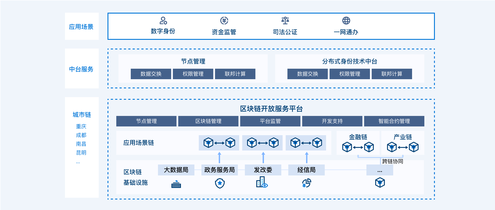
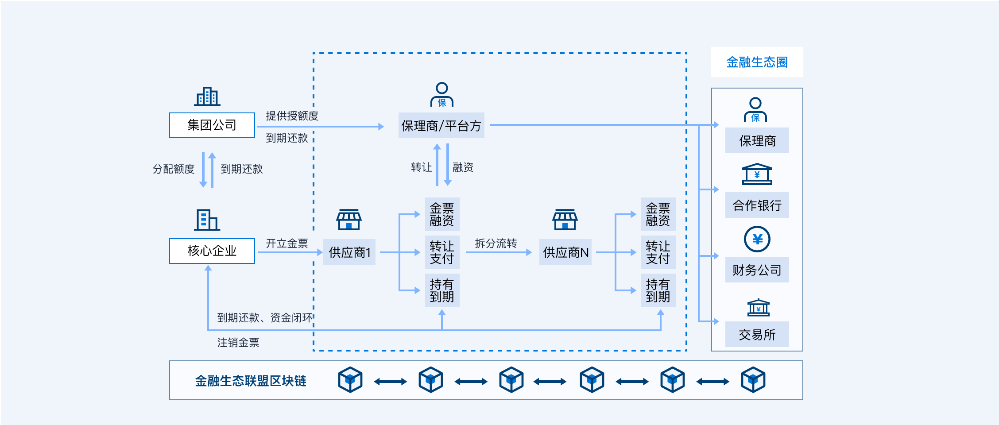
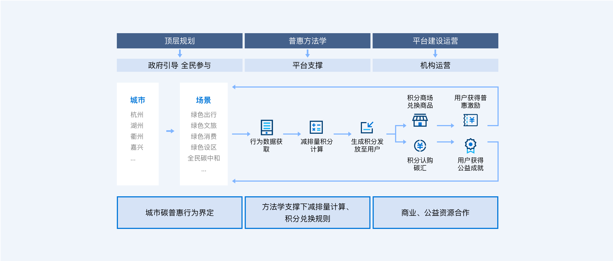
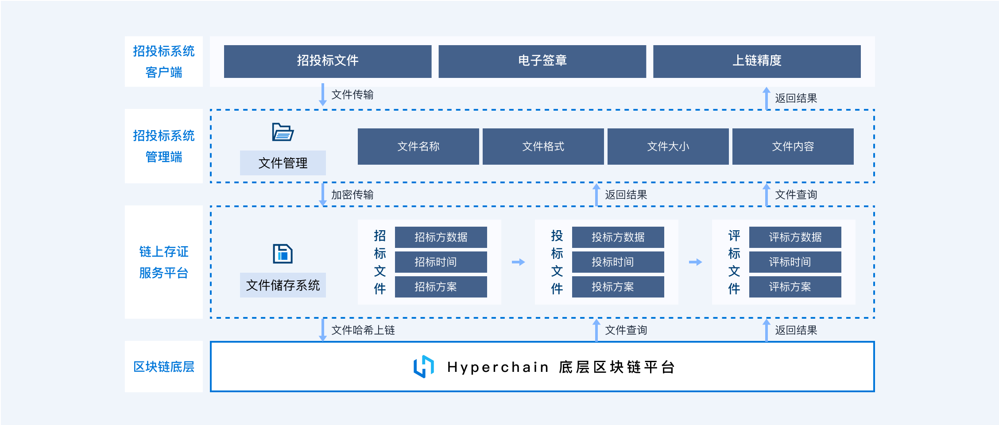
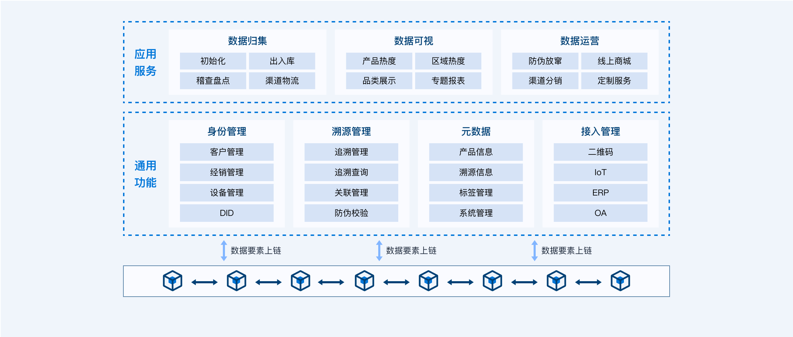
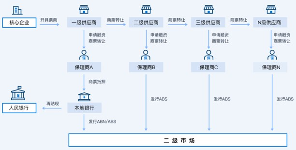
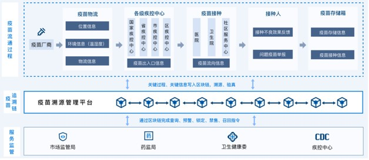
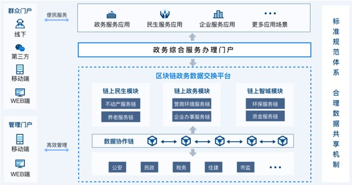
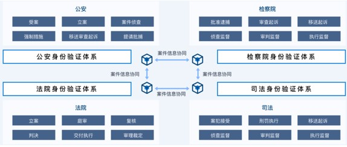
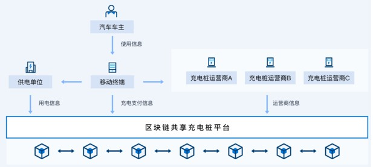

应用案例
^^^^^^^^^^^^^

智慧城市
-------------

推动区块链底层技术服务和新型智慧城市建设相结合，提升城市管理的智能化、精准化水平。

城市链服务
>>>>>>>>>>>>>>>

基于区块链底层基础设施，提供智能合约、数字身份、数据共享、隐私计算等多维度区块链核心能力，向上打造区块链生态应用场景，助力智慧城市高效协同监管，让区块链深入融合到智慧城市的各个方面，推动智慧城市向可信智慧城市升级。

智慧城市场景存在以下痛点问题：

- **数据孤岛导致协同效率低下** ：政府内部行政区隔形成天然屏障，导致数据结构与接口不统一、标准化程度不高、互联互通程度严重不足，业务数据分散保存在不同部门的不同系统，条块打通困难，信任成本高。
- **数据泄露降低技术可信度** ：隐私数据泄露事件频发，用户作为数据的生产者，在本质上缺少数据所有权和掌控权，往往未经同意就被第三方平台采集和出售，导致用户隐私数据大规模泄露事件。。
- **群众和企业办事流程繁琐** ：政务服务条块分割、业务流程烦琐、办事材料繁多、电子化信息提取困难等问题降低了政务服务水平。

本方案具有以下价值：

- **提升智慧城市数据可信共享** ：城市链可实现各系统原始数据或数据指纹上链流通，为企业和部门跨系统之间的数据共享提供可信能力基础。
- **提升智慧城市社会治理效度** ：城市链打破传统中心化平台社会治理模式，采用分布式多方共识、一主多链、智能合约等区块链技术手段，全面提升社会治理效率、治理有效性。

落地方案架构如下：

数字金融
-------------

基于区块链构建的金融设施和市场活动将形成更加完善的金融网络，助推数字金融高质量发展。

供应链金融
>>>>>>>>>>>>>>>

基于区块链搭建的应收账款平台，利用标准化数字资产凭证实现核心企业信用的应收账款凭证在供应链上的可签发、可流转、可融资、可拆分、可抵偿、可跟踪等业务，通过引入外部金融机构，为应收账款提供低成本融资利率。

供应链金融场景存在以下痛点问题：

- **原始贸易数据伪造** ：物流信息、仓单、应收账款伪造，业务风险和金融风险高。
- **四流难合一** ：企业间系统不互通，线下纸质化传递效率低。存在“信息孤岛”问题，加大风控难度。
- **核心企业信用难传递** ：信用传递仅在一级，无法传递其他供应商，生态服务范围受限。
- **无法有效控制履约风险** ：缺乏有效的管控机制，资金挪用、恶意违约等情况时有发生。

本方案具有以下价值：

- **降低融资成本** ：多级供应商融资体系，全链条信息可视化共享，提高资金流转效率。
- **挖掘优质资产** ：保障业务真实性，助力金融机构高效便捷地服务整个产业链。
- **实现穿透式监管** ：供应链交易数据上链后不可篡改，且全程可追溯。

落地方案架构如下：

数字政法
-------------

趣发挥区块链技术所具备的“信任工具”的作用，推动政法智能化建设。

公检法司联盟链
>>>>>>>>>>>>>>>>>>>>>>>

区块链为公检法司联盟链，并基于该联盟链建设公检法司协作系统。通过“区块链+数据共享”打破各机构间信息孤岛，实现案件数据实时可信共享互通。

公检法司联盟协作存在以下痛点问题：

- **机构间存在“数据孤岛”** ：公检法司部分业务场景尚未实现可信网络内数据互通，机构间数据交换时无法确保信息未被篡改。
- **机构间协作机制不完善** ：公检法司工作开展过程，各机关在处理案件过程中，先多为线下协作，易发生不合规、不到位等情况。
- **身份互认难，协作不通畅** ：身份认证体系不同，在数据交换、业务协作时无法相验身份，导致线上协作共享难。

本方案具有以下价值：

- **办案流程链上溯源** ：案件全流程链上协作，数据跨网可信共享，办理流程链上溯源。
- **机构身份链上互认** ：机构身份链上可验可查，实现跨机构身份互认互信。
- **办案流程规范检验** ：结合智能合约实现办案全流程规范化自动核验。

方案架构图如下：

|image3|

能源双碳
-------------

区块链将创新性地促进能源行业转型重塑，在“双碳”目标推进过程中拥有显著的技术价值优势。

碳普惠
>>>>>>>>>>>>>>>>>>>>>>>

建成全民碳普惠平台，对接个人减排场景，通过方法学认定与核查机制，将个人减排行为转化为碳减排量，实现碳资产交易流通管理，并面向民众提供碳普惠趣味玩法与激励机制，促进民众践行低碳理念。区块链对碳普惠认定、核查、交易、消纳等过程留痕可溯、交叉验真。

碳普惠场景存在以下痛点问题：

- **个人碳减排机制不完善** ：居民生活领域涉及民生，难以通过政策手段实现减碳，个人减碳缺乏必要工具与抓手。
- **民众低碳理念认知不足** ：民众对碳排放、碳减排的认知尚未形成，对为什么要减碳、如何减碳、哪些行为减碳暂无了解。
- **减排核算方法仍待健全** ：由于碳排放点分散，数据收集难度大，难以对居民生活领域的碳排放与碳减排情况进行精准核算。

本方案具有以下价值：

- **普及低碳理念形成正向激励** ：通过城市成长体系、喂养体系等丰富玩法，融入减排理念常识，民众通过减排获得积分，实现持续的激励及行为导向。
- **促进居民生活领域节能减排** ：通过碳普惠平台建设，设计绿色减排场景，接入各类减排数据源，摸清居民生活领域减排基本盘与潜力，助力政府推进居民生活领域减排。
- **创新低碳社会建设新模式** ：用趣味玩法将个人减碳推广工作融入平台，形成个人侧减排-激励-科普正向循环，创新低碳社会建设新模式。

方案架构图如下：

企业数字化
-------------

区块链作为数字化发展的关键技术，将助力企业适应新业态经济，培育发展新动能。

招投标管理
>>>>>>>>>>>>>>>>>>>>>>>

以区块链技术为基础设施搭建的招投标管理平台，为招投标代理商、企业招投标提供投标全程上链监管、投标文件隐私安全保障等服务支撑。

招投标管理场景存在以下痛点问题：

- **共享不畅，招投标低效重负** ：投标企业需要辗转众多机构把数据进行分析整合，然后投标。导致投标企业负担较重，效率较低。
- **数据无法追溯，监管核验难** ：电子化招投标流程中，相关平台数据存在平台中心系统中，数据无法追溯，监管部门无法对交易数据进行有效检核。

本方案具有以下价值：

- **全流程链上可信追溯** ：全流程数据在区块链上进行存证，确保招投标全流程信息透明共享、不可篡改。
- **标书文件隐私安全保障** ：标书通过区块链进行可信联盟存储，并进行防掉包、防泄漏设计。
- **企业治理高效合规** ：支持精确定责，提升多方协同规范操作与办事效率。

落地方案架构如下：

数字乡村
-------------

在乡村振兴战略背景下，结合智慧化、数字化农业发展趋势，大力推动区块链技术在农业发展中的应用，助力数字乡村建设。

农品溯源服务
>>>>>>>>>>>>>>>>>>>>>>>

趣链农品溯源服务平台满足三农领域产品溯源、商品防伪、政府监管、设备管理等多场景应用要求，构建“源头可追溯、流程可跟踪、信息可查询、责任可追究”的农品高质量管理体系，主要应用于农林牧渔等特色产品溯源、冷链物流、订单农业等场景。平台依托可信数据治理体系助力品牌价值提升、服务食品安全战略，促进城乡融合发展。

农品溯源服务场景存在以下痛点问题：

- **溯源数据难可信** ：传统模式溯源数据易篡改、造假成本低，消费者对溯源内容真实性多有质疑，不仅无法为信誉好、质量优的产品保驾护航，而且导致溯源服务沦为鸡肋。
- **溯源协同难互信** ：溯源作为链接产业上下游重要手段，传统溯源模式一方面基于利益考量导致跨主体间数据互通难度大，另一方面标准林立且数据合规要求导致溯源数据无法实现互信互认。
- **溯源管理难采信** ：传统模式溯源平台在响应业务审计、统计分析、处置决策等管理需求时难以提供及时准确的高质量数据支撑，往往导致问题趋势误判和风险处置不及时。

本方案具有以下价值：

- **助力可信监管** ：区块链技术具有多方共识、共同验证、数据一经上链不可篡改等特点，这天然有利于监督管理部门对行业生产制造流程进行监管。
- **提高经济效益** ：减少伪劣产品销售，打击假冒伪劣产品销售，促进正规渠道正品销量增长，增加销售额和利润。
- **统一溯源标准** ：利用区块链技术及其他技术（如物联网等），能够将产品特性品质和生产行为客观化、数据化、固证化，使生产活动变得透明。
- **加强消费者信任度** ：全流程信息可见，形成可信任的数据环境，增强消费者对产品溯源信息可信度，加强品牌形象。

落地方案架构如下：

数字版权
-------------

用区块链技术构建更加可信安全的数字版权体系。

飞洛印
>>>>>>>>>>>>>>>>>>>>>>>

飞洛印，是趣链科技针对业务溯源、数据资产、版权保护、品牌维权场景推出的一站式数据价值保护平台。平台联合多家公证处、法院、知识产权中心等权威机构，构建司法服务联盟，为企业、个人提供具备司法效力的数据存证、侵权取证、在线公证、确权交易等链上服务生态，保障每个人的数据价值。

应用场景：

- **司法取证** ：将侵权、违规等信息转化成电子证据在区块链上固定，作为后续诉讼的可信证据。
- **版权保护** ：将设计、作品等在飞洛印上进行登记保全，若被侵权可发起诉。
- **公证服务** ：提供司法有效的区块链存取证平台，对用户在平台上进行的存取证可一键申请公证。
- **数据保管** ：对业务数据进行区块链固证，提高数据可信度，便于数据审计追溯。

产品特性：

- **全场景应用** ：业内领先的场景应用案例落地，覆盖电子合同、知识产权保护、招投标存证、金融纠纷存证、商品溯源等业务场景，根据客户需求灵活支持多类区块链存证、溯源业务模式。
- **强司法保障** ：强大的节点联盟方成员共同见证数据，保障数据司法有效性，节点联盟方包括杭州互联网公证处、上海市新虹桥公证处、浙江知识产权研究与服务中心等。
- **多服务模式** ：灵活的服务模式选择，面向企业及个人用户提供SaaS服务、系统对接服务、私有化部署服务等，满足不同类型用户的多样化需求。
- **低成本接入** ：为用户提供成熟且司法有效的电子数据取证技术，支持用户零门槛接入使用，无需用户投入开发成本，实现低成本、高效使用取证、存证、溯源服务。
- **高存储安全** ：基于行业领先的国产自主可控区块链技术研发，满足行业区块链技术与性能测评标准，全方位保障用户数据数据安全。

更多关于飞洛印产品介绍请参考 https://www.hyperchain.cn/products/fly

更多
-------------

想了解更多应用案例介绍，可进入 `趣链科技官网 <https://www.hyperchain.cn/>`_ - 解决方案

