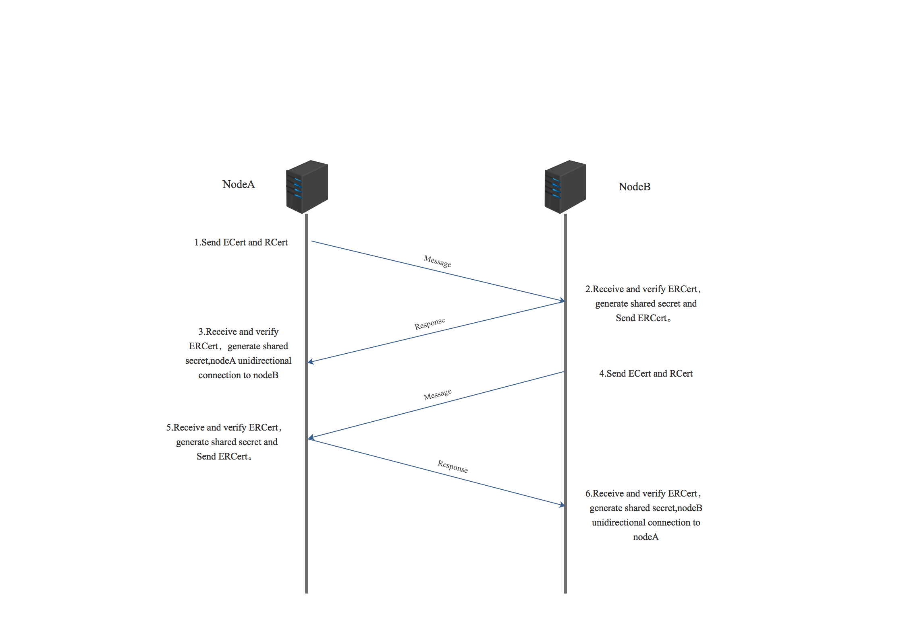

数字证书
========

1.概述
------

Hyperchain是一个联盟链级别的区块链服务平台，拥有精确的权限控制粒度，需要通过多级的CA证书来进行权限控制。权限控制主要分为两个方面：

-  节点权限控制
-  交易权限控制

首先我们需要知道的是，权限控制是Namespace级别的，即每个Namespace就会拥有一个相应CaManager来进行CA证书的管理以及Namespace级别的权限控制。以下是我们的PKI体系(证书体系)图：

|image0|

-  root.ca(根证书颁发机构):它代表PKI体系中的信任锚。数字证书的验证遵循信任链。根CA是PKI层次结构中最上层的CA，用于签发证书认证机构以及角色证书准入认证机构。
-  eca.ca(准入证书颁发机构):用于给节点颁发节点准入证书(ecert)和sdk证书(sdkcert)。
-  rca.ca(角色证书颁发机构):用于给节点颁发角色证书(rcert)。
-  ecert.cert(准入证书):准入证书是长期证书，是颁发给节点的，用于节点的准入，若无准入证书，则该节点无法加入此Namespace，同时准入证书也作为交易证书的颁发机构用于颁发交易证书。
-  rcert.cert(角色证书):角色证书是长期证书，是颁发给节点的，用于节点的角色的认证，若无角色证书，则此节点为NVP，无法参与共识，反之则为VP节点。
-  sdkcert.cert(sdk证书):SDK证书时颁发给SDK的，用于进行SDK的身份认证，同时SDK证书时获取交易证书的（Tcert）的判别依据。
-  tcert.cert(交易证书):SDK发送交易时需携带交易证书，若无交易证书或证书验证失败，则抛弃交易。

2.证书简述
----------

Hyperchian区块链平台证书均符合ITU-T
X.509国际标准，它仅包含了公钥信息而没有私钥信息，是可以公开进行发布的，所以X.509证书对象一般都不需要加密。X.509证书的格式通常如下:

::

    ---BEGIN CERTIFICATE---
    ……PEM编码的X.509证书内容(省略)……
    ---END CERTIFICATE---

PEM编码全称是Privacy Enhanced
Mail，是一种保密邮件的编码标准。通常来说，对信息的编码过程基本如下：

-  信息转换为ASCII码或其他编码方式，比如采用DER编码。
-  使用对称加密算法加密经过编码的信息。
-  使用BASE64对加密码后的信息进行编码。
-  使用一些头定义对信息进行封装，主要包含了进行正确解码需要的信息。

除此以外Hyperchain区块链平台证书内具体包含以下信息：

1、X.509版本号：指出该证书使用了哪种版本的X.509标准，版本号会影响证书中的一些特定信息。目前的版本是3。

2、证书持有人的公钥：包括证书持有人的公钥、算法(指明密钥属于哪种密码系统)的标识符和其他相关的密钥参数。

3、证书的序列号：由CA给予每一个证书分配的唯一的数字型编号，当证书被取消时，实际上是将此证书序列号放入由CA签发的CRL（Certificate
Revocation List证书作废表，或证书黑名单表）中。这也是序列号唯一的原因。

4、主题信息：证书持有人唯一的标识符(或称DN-distinguished name)这个名字在
Internet上应该是唯一的。DN由许多部分组成，看起来象这样：

::

    CN=Bob Allen, OU=Total Network Security Division
    O=Network Associates, Inc.
    C=US

这些信息指出该科目的通用名、组织单位、组织和国家或者证书持有人的姓名、服务处所等信息。

5、证书的有效期：证书起始日期和时间以及终止日期和时间；指明证书在这两个时间内有效。

6、认证机构：证书发布者，是签发该证书的实体唯一的CA的X.509名字。使用该证书意味着信任签发证书的实体。(注意：在某些情况下，比如根或顶级CA证书，发布者自己签发证书)

7、发布者的数字签名：这是使用发布者私钥生成的签名，以确保这个证书在发放之后没有被撰改过。

8、签名算法标识符：用来指定CA签署证书时所使用的签名算法。算法标识符用来指定CA签发证书时所使用的公开密钥算法和HASH算法。

3.CA相关配置
------------

CA所需配置在namespace.toml配置文件内，具体参数如下：

::

    [encryption]
    [encryption.ecert]
     eca    = "config/certs/eca.cert"
     ecert  = "config/certs/ecert.cert"
     priv   = "config/certs/ecert.priv"

    [encryption.rcert]
     #if you do not have rcert, leave this item blank
     rca    = "config/certs/rca.cert"
     rcert  = "config/certs/rcert.cert"
     priv   = "config/certs/rcert.priv"

    [encryption.tcert]
     #Tcert whitelist configuration.
     whiteList = false
     listDir  = "config/certs/tcerts"

    [encryption.check]
     enable     = true  #enable ERCert
     enableT    = false  #enable TCert

首先前六个参数，分别是配置改Namespace的相关证书路径，分别是eca,ecert和ecert对应的私钥，rcar,rcert和rcert对应的私钥。

其次是TCert相关配置，平台支持TCert白名单策略，即在\ ``whiteList=true``
时，即开启TCert白名单策略，在\ ``listDir``\ 参数配置下的TCert证书则是立即可用交易证书。反之，当\ ``whiteList``\ 为false时，则不开启白名单策略，只有在该交易证书合法性验证通过，且确定该交易证书确定为本节点且在Namespace下颁布的交易证书时才可完全验证通过。

最后的两个参数则为配置开关参数，\ ``enable``\ 为开启准入证书以及角色证书的校验开关，反之则不进行验证，\ ``enableT``\ 则为开启交易证书验证的开关配置，只有当该参数置为true时才进行交易证书的验证。动态的开关配置也使区块链配台更加灵活。

4.证书获取以及校验流程
----------------------

4.1 ECert和RCert
~~~~~~~~~~~~~~~~

4.1.1 获取
^^^^^^^^^^

​
准入证书以及角色证书主要是通过线下颁布进行控制，有Certgen证书签发工具进行证书的生成。

4.1.2 校验
^^^^^^^^^^

​ 若ECert以及RCert校验开关开启，则具体验证流程如下图所示：

|image1|

​
ECert以及RCert在节点初次握手连接时进行了证书的互换以及验证，由此来确定了节点是否允许入链以及相关连接节点的角色信息。

4.2 TCert
~~~~~~~~~

​ TCert的获取以及验证的流程图如下图所示：

|image2|

.. 获取-1:

4.2.1 获取
^^^^^^^^^^

​
首先，SDK或者外部应用需要向连接节点发起GetTcert的消息，该消息需要携带SDKCert对该SDK或外部应用进行身份认证，在认证通过后进行TCert证书的生成以及颁布。

.. 校验-1:

4.2.2 校验
^^^^^^^^^^

​
若SDK或者外部应用获取TCert成功后，则接下来的交易需要携带相关交易证书给相关节点进行验证，只有交易证书验证通过后才会进行接下来的交易执行。

.. |image2| image:: ../../images/tcert.png
