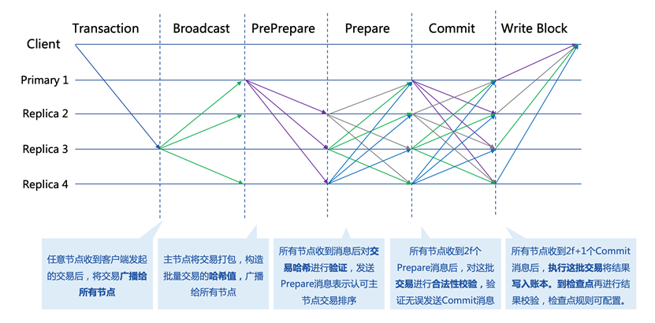
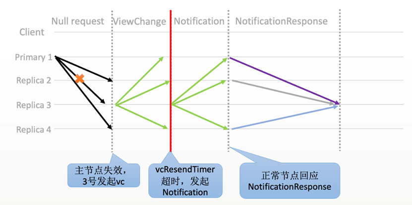
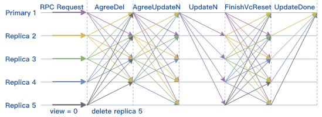

.. role:: math(raw)
   :format: html latex
..

共识机制
^^^^^^^^^^^^

共识算法是用于保证分布式系统一致性的机制。这里的一致性可以是交易顺序的一致性、账本一致性、节点状态的一致性等。一般地，我们根据容错类型将共识算法分为两类。

- **拜占庭容错** : 拜占庭容错强调的是能够容忍部分区块链节点由于硬件错误、网络拥塞或断开以及遭到恶意攻击等情况出现的不可预料的行为。BFT系列算法是典型的拜占庭容错算法，比如PBFT、HotStuff等。
- **非拜占庭容错** : 非拜占庭容错通常指能够容忍部分区块链节点出现宕机错误，但不容忍出现不可预料的恶意行为导致的系统故障。常见的CFT共识算法有Paxos、Raft等。

平台采用 **自适应共识机制** ，支持RBFT、NoxBFT（BFT类）以及RAFT（CFT类）等多种共识算法，以满足不同的业务场景需求。下文将主要介绍RAFT、RBFT和NoxBFT两类共识算法。

1. RAFT
------------

RAFT介绍
>>>>>>>>>>>>

由前文所了解, 分布式共识算法可以分为两类，即拜占庭容错（Byzantine Fault Tolerance，BFT）和非拜占庭容错类共识(Crash Fault Tolerance，CFT)。与BFT类共识算法相比，CFT共识，尤其是Raft共识算法，从性能、可理解性和可实现性等方面来说具有一定优势。

平台目前已经支持的RBFT共识为BFT类共识算法，与不限制共识成员的公链不同，联盟链中所有参与节点的身份都是已知的，每个节点有很高的可信度，故在某些可信度高的业务场景下可采用不容拜占庭节点的传统共识算法，如RAFT、ZAB等共识协议。基于此，我们同时支持Raft共识机制。

共识流程
>>>>>>>>>>>>

角色介绍
::::::::::::

首先在Raft共识机制中，节点共分为三种角色：

- **领导者（Leader）** : 接受客户端请求，并向从节点同步请求日志，当日志同步到大多数节点上后将提交日志，并广播给从节点。
- **从节点（Follower）** : 单向接收并持久化主节点同步的日志。
- **候选节点（Candidate）** : 主节点选举过程中的过渡角色,当从节点在规定的超时时间内没有收到主节点的任何消息，将转变为候选节点，并广播选举消息，且只有候选状态的节点才会接收选举投票的消息。候选节点有可能被选举为主节点，也有可能回退为从节点。

在同一时刻，集群中只有一个Leader，负责生成日志数据（对应在区块链中即负责打包）并广播给Follower节点，为了保证共识的正确性和简单性，所有Follower节点只能单向接收从Leader发来的日志数据，即Leader节点不会接收Follower节点发来的日志数据。

具体流程
:::::::::::::

Raft算法共识流程分为主节点选举和日志同步两步。将时间分为一个个的任期（term），每一个term以Leader选举开始。在成功选举Leader之后，Leader会在整个term内管理整个集群。如果Leader选举失败，该term就会因为没有Leader而结束，任期选举图如图所示。

|image7|

领导人选举
''''''''''''''

Raft 使用心跳（heartbeat）触发Leader选举。当服务器启动时，Leader向所有Followers周期性发送heartbeat。如果Follower在选举超时时间内没有收到Leader的heartbeat，就会等待一段随机的时间（避免同一时刻有多个Candidate参与竞选导致系统可能出现的多次选举失败）后发起一次Leader选举。

Follower将其当前term加一然后转换为Candidate。它首先给自己投票并且给集群中的其他服务器发送RequestVoteRPC。结果有以下三种情况：

- 赢得了多数的选票，成功选举为Leader；
- 收到了Leader的消息，表示有其它服务器已经抢先当选了Leader；
- 没有服务器赢得多数的选票，Leader选举失败，等待选举时间超时后发起下一次选举。

选举出Leader后，Leader通过定期向所有Followers发送心跳信息维持其统治。若Follower一段时间未收到Leader的心跳则认为Leader可能已经挂了，再次发起Leader选举过程。Raft保证选举出的Leader上一定具有最新的已提交的日志。

日志同步
''''''''''''''

Leader选出后，就开始接收客户端的请求。Leader把请求作为日志条目（Log entries）加入到它的日志中，然后并行的向其他Follower节点发起 AppendEntries RPC以复制该日志条目。当这条日志被复制到大多数服务器上，Leader将这条日志应用到它的状态机并向客户端返回执行结果。具体步骤如下：

|image8|

1. Client将transaction发给任意一个节点；
2. 节点接收到的transaction后，将其封装在一个Propose提案中，并抛给Leader节点；
3. Leader节点收到新区块的提案消息后，将提案信息（即log entry）append到自己的log日志集中，并广播对应的log entry给Follower节点；
4. Follower节点接收到Leader节点的 log entry消息后，将其append到自己的log中，并向Leader发送append response消息，表明自己已经收到该log entry并同意其排序；
5. Leader节点收到n/2+1个append response消息后，该 log entry达到committed状态（此时Leader可apply log entry中的transaction并写入区块）；
6. Leader节点再次广播append 消息给Follower节点，通知其他节点该log entry已经是committed状态；
7. Follower节点接收到Leader节点的append消息后，该log entry达到committed状态，随后可apply该log entry中的transaction并写入区块。
8. 继续处理下一次Request。

注意:

- 某些Followers可能没有成功的复制日志，Leader会无限的重试 AppendEntries RPC直到所有的Followers最终存储了所有的日志条目。
- 日志由有序编号（log index）的日志条目组成。每个日志条目包含它被创建时的任期号（term），和用于状态机执行的命令。如果一个日志条目被复制到大多数服务器上，就被认为可以提交（commit）了。

**Raft日志同步保证如下两点：**

1. 如果不同日志中的两个条目有着相同的索引和任期号，则它们所存储的命令是相同的。
2. 如果不同日志中的两个条目有着相同的索引和任期号，则它们之前的所有条目都是完全一样的。另外，对于安全的保证，Raft增加了如下两条限制：

- 拥有最新的已提交的log entry的Follower才有资格成为Leader。
- Leader只能推进commit index来提交当前term的已经复制到大多数服务器上的日志，旧term日志的提交要等到提交当前term的日志来间接提交（log index 小于 commit index的日志被间接提交）。

优势
>>>>>>>>>

Raft的优势在于使用过程中拥有与Paxos相近的效率,但是比Paxos算法更易理解，而且更有利于工程化实现；可以直接从Leader的角度描述协议的流程与论证正确性。同时，还提供了协议的安全性证明和形式化证明，在可信场景中拥有良好的性能。

2. RBFT
------------

相关变量
>>>>>>>>>>

在一个由N个节点（N>=4）组成的共识网络中，RBFT最多能容忍f个节点的拜占庭错误，其中：

.. math:: f=[(N- 1)/3]

能够保证达成共识的节点个数为：

.. math:: Quorum=[(N + f +1)/2]

常规流程
>>>>>>>>>>

共识算法RBFT的核心在于保证了区块链各节点以 **相同的顺序** 处理来自客户端的交易。下图为最少集群节点数下的共识流程，其中N=4，f=1。图中的Primary1为共识节点动态选举出来的主节点，负责对客户端发来的交易进行排序打包，Replica2，3，4为从节点。所有节点执行交易的逻辑相同并能够在主节点失效时参与新主节点的选举。

|image0|

1. **交易转发阶段** ：客户端Client将交易发送到区块链中的任意节点；Replica节点将接收到的交易广播给所有节点,节点将收到的交易放入交易缓存池；
2. **Preprepare** ：Primary会选择交易缓存池交易进行打包，构造交易哈希的batch；Primary通过batch构造PrePrepare消息广播给其他节点；
3. **Prepare阶段** ：Replica接收来自Primary的PrePrepare消息之后,对batch中的交易哈希进行验证，验证无误后构造Prepare消息发送给其他Replica节点，表明该节点接收到来自主节点的PrePrepare消息并认可主节点的batch排序。
4. **Commit阶段** ：Replica接收到2f个节点的Prepare消息之后对batch的消息进行合法性验证，验证通过之后向其他节点广播Commit消息，表示本节点同意Primary节点的验证结果。
5. **写入账本** ：Replica节点接收到2f+1个Commit之后执行batch中的交易并写入本地账本。

需要注意的是，主节点除负责对交易排序打包外，与从节点功能无异。并且当从节点不认可主节点的排序结果时可以发起相应请求，集齐Quorum个该请求即可切换主节点。

- **检查点机制**

平台设计检查点机制用于对执行结果进行校验。检查点的大小K默认设置为10个区块，节点在写入到K的整数倍个区块后达到一个检查点，广播该检查点的信息对账本一致性进行校验，校验通过后，平台就达到了一个稳定检查点（stable checkpoint）。检查点的大小可按需配置。

- **交易缓存池**

交易缓存池用于共识节点进行交易缓存，一方面可以限制客户端发送交易的频率，另一方面减少了主节点的带宽压力。首先，通过限制交易池的缓存大小，平台可以在交易池达到上限后拒绝接收来自客户端的交易，因此在合理评估机器性能的情况下，可通过合理设置交易缓存大小，从而最大限度地利用机器性能而又不至于出现异常。其次，共识节点在接收到来自客户端的交易后先将其存入本地交易池，随后向全网其他共识节点广播该交易，保证所有共识节点都维护了一份完整的交易列表；主节点在打包后只需要将交易哈希列表放到PrePrepare消息中进行广播即可，而不用将完整的交易列表打包进行广播，从而大大减轻了主节点的出口带宽压力。如果从节点在验证之前发现缺少了某些交易，也只需要向主节点索取缺少的那些交易而不用索取整个区块里面所有的交易。

视图更换流程
>>>>>>>>>>>>>

视图更换（ViewChange）是指因原Primary节点失效而Replica节点参与新Primary节点选举的过程。视图变更能够解决主节点成为拜占庭节点的问题，是保证整个共识算法健壮性的关键。当前可检测到的拜占庭行为有以下情况：

- 节点停止工作

不再发送任何消息: 这种错误可以通过nullRequest机制保证，行为正确的主节点会在没有交易发生时向所有从节点发送nullRequest表明仍在正常工作，如果从节点在规定时间内没有收到主节点的nullRequest，则会引发ViewChange行为选举新的Primary。

- 节点发送错误的消息

错误可能是消息内容不正确、包含恶意交易的消息等，需要注意的是，这里的消息类型不仅是batch，也有可能是用于ViewChange的功能性消息。这种错误的解决方案是从节点在接收主节点的消息时，都会对内容进行相应的验证，如果发现主节点的交易包含不符合相应格式的交易或者恶意交易，即验证不通过的时候，会发起ViewChange选举新的Primary。

Viewchange流程如下所示：

|image1|

1. Replica节点检测到主节点有以上异常情况，向全网广播ViewChange消息；
2. 当新主节点收到Quorum个ViewChange消息时，会发送NewView消息。视图切换成功，新的主节点也切换成功。

算法优势
>>>>>>>>>>

RBFT基于PBFT做了一系列的优化，交易吞吐量可达万级TPS，延迟为毫秒级别。通过新增以下特性大大增强了共识模块的的可用性与稳定性：

1. **动态数据自动恢复机制** ：保证网络异常后能快速恢复工作，提升稳定性；
2. **动态节点增删机制** ：支持在系统正常运行时动态增删共识节点，提升可扩展性；
3. **共享交易池** ：通过预先的交易广播和共享，仅共识交易哈希，降低了主节点的出口带宽。

- 动态数据失效恢复

区块链网络在运行过程中由于网络抖动、突然断电、磁盘故障等原因，可能会导致部分节点的执行速度落后于大多数节点或者直接宕机。在这种场景下，节点需要能够做到自动恢复并将账本同步到当前区块链的最新账本状态，才能参与后续的交易执行。为了解决这类数据恢复问题，RBFT算法提供了一种动态数据自动恢复机制。

RBFT的自动恢复机制通过主动索取区块和正在共识的区块信息使自身节点的存储尽快和系统中的最新存储状态一致。自动恢复机制大大增强了整个区块链系统的可用性。RBFT为了恢复的方便，对执行的数据设置检查点机制。这样可以确保每个节点检查点之前的数据都是一致的。除了检查点之外，还有部分数据是当前还未共识的本地执行数据。在恢复过程中，首先需要本节点的检查点与区块链其他正在正常服务节点的检查点同步。其次，需要恢复检查点之外的部分数据。

自动恢复机制的基本处理流程如下所示：

|image2|

图中的Replica 4为新启动节点或者其他需要做数据自动恢复的节点，运行中节点为集群中其他正常运行的节点。
 Replica 4自动恢复流程如下：

1. Replica 4 首先广播NegotiateView消息，获取当前其余节点的视图信息；
2. 其余三个节点向Replica 4发送NegotiateViewResponse，返回当前视图信息；
3. Replica 4 收到Quorum个NegotiateViewResponse消息后，更新本节点的视图；
4. Replica 4 广播RecoveryInit消息到其余节点，通知其他节点本节点需要进行自动恢复，请求其余节点的检查点信息和最新区块信息；
5. 正常运行节点在收到RecoveryInit消息之后，发送RecoveryResponse，将自身的检查点信息以及最新区块信息返回给Replica 4节点；
6. Replica 4节点在收到Quorum个RecoveryResponse消息后，开始尝试从这些response中寻找一个全网共识的最高的检查点，随后将自身的状态更新到该检查点；
7. Replica 4节点向正常运行节点索要检查点之后的PQC数据，最终同步至全网最新的状态。

- 节点动态增删

在联盟链的场景下，由于联盟的扩展或者某些成员的退出，需要联盟链支持成员的动态治理服务，而传统的PBFT算法不支持节点的动态增删。RBFT为了能够更便捷地管控联盟成员的准入和准出，基于PBFT增加了保持集群非停机情况下动态增删节点的功能。

**新增节点**

新增节点流程如下所示（New为新增节点）：

|image3|

1. 首先，新的节点需要获取证书颁发机构颁发的证书，然后向联盟中的所有节点发送NewNode请求；
2. 各个节点确认同意后会向联盟中的其他节点进行全网广播，发送AgreeAdd消息；当一个节点得到Quorum个同意加入的回复后会与新的节点建立连接，随后开始回应新增节点的共识消息请求（在此之前，新增节点的所有共识消息是不予处理的）；
3. 随后，当新的节点和N-f（N为区块链联盟节点总数）个节点建立连接后就可以执行主动恢复算法，同步区块链联盟成员的最新状态。之后向其他节点广播ReadyForN请求；
4. 现有节点在收到ReadyForN请求后，重新计算新增节点加入之后的N,view等信息，随后将其与PQC消息封装到AgreeUpdateN消息中，进行全网广播；
5. New加入后的共识网络会产生一个新的主节点，该主节点在收到N-f个AgreeUpdateN消息后，以新的主节点的身份发送UpdateN消息；
6. 全网所有节点在收到UpdateN消息之后确认消息的正确性，进行VCReset；
7. 每个节点完成VCReset后，全网广播FinishVcReset消息；
8. 节点在收到N-f个FinishVcReset消息后，处理后续请求，完成新增节点流程。

**删除节点**

RBFT节点的动态删除和节点的动态增加流程类似，流程如下所示（Replica5为删除节点）：

|image4|

1. 节点管理员通过调用RPC请求得到删除节点的哈希值，然后发起删除节点请求；
2. 接收到删除请求的节点管理员确认同意该节点退出，然后向全网广播AgreeDel消息，表明自己同意该节点退出整个区块链共识的请求；
3. 当现有节点收到Quorum个AgreeDel消息后，该节点更新连接信息，断开与请求退出的节点间的连接；并在断开连接之后向全网广播AgreeUpdateN消息，表明请求整个系统暂停执行交易的处理行为，为更新整个系统参与共识的N，view做准备；
4. 当节点收到Quorum个AgreeUpdateN消息后，更新节点系统状态，与增加节点步骤5）及之后的流程一样，不再重复。至此，请求退出节点正式退出区块链系统。

3. NoxBFT
-------------

联盟链一般采用RAFT、BFT类共识算法，性能方面能得到一定的保证，但随着节点数量增多到几百甚至上千个共识节点的规模，所需要交换的信息量也呈指数级增长，最终导致系统负载增加及网络通信量增大，性能下降会很明显，可扩展性问题也随之产生。

为了解决大规模节点组网场景下共识效率低下、可扩展性不强的问题，平台自研NoxBFT，借鉴Hotstuff算法，将全网网络复杂度由O (n2)降低至O (n)，并在Hotstuff算法基础上，在算法的活性、可靠性、数字签名性能方面进一步进行优化，支持大规模节点扩展，在1000节点规模下吞吐量可达3000TPS。

NoxBFT中的Nox是Node of X的缩写，意指节点数不限，适用于大规模节点的BFT类共识算法。

共识主流程
>>>>>>>>>>>>

共识主流程指的是共识算法运行良好的情况下，共识推进的流程，在NoxBFT中，主要是Proposal提案阶段与Vote投票阶段的循环，正常的共识流程如下所示：

|image5|

1. **Transaction&Broadcast** ：任意节点收到交易之后，首先将其存入到本地mempool中，随后将其广播给其他所有节点，收到广播的节点也会将其存入到各自的mempool中。每个节点在接收到交易后，都会进行交易的去重判断，剔除重复交易之后才能进入到节点的mempool中，需要注意的是，现在交易的接收与广播流程并不在共识主流程中，而是由mempool负责进行；
2. **Proposal** ：当前轮次的主节点负责进行打包，从mempool中取出若干笔符合要求的交易打包成一个batch，并附带上一轮的QC封装成一个proposal，广播给其他节点；
3. **Vote** ：所有的节点（包括主节点）在监听到提案消息后，都会验证proposal的合法性（safety rules），验证通过后，首先检查该proposal中的QC是否能够提交前序的区块，如果达到了3-chain安全性提交规则（commit rules），则直接提交区块，等待区块执行完成之后将其中的交易从mempool中移除（CommitTxs）。最后，节点会将投票（vote）信息发送至下一轮的主节点，其中下一轮的主节点选择策略定义在liveness活性规则中。需要注意的是，每个节点的投票中都会附带上节点签名；
4. **Proposal** ：下一轮的主节点收到quorum个vote后，聚合成一个QC，并开始下一轮打包，并重复步骤2与步骤3，一直到出现超时的情况。

超时轮换主节点流程
>>>>>>>>>>>>>>>>>>>>

当主节点由于网络原因或者其他因素导致从节点无法按期收到Proposal进行投票时，NoxBFT就会触发超时机制，通过Pacemaker活性模块让全网快速地进入到下一个round继续共识。超时轮换主节点的流程如下所示：

|image6|

1) **Transaction&Broadcast&Proposal** ：所有共识节点接收交易并且广播交易，当前的主节点正常的进行打包并广播proposal；
2) **Round Timeout** ：由于网络原因，导致主节点proposal并没有及时地发送到从节点，因此从节点不会对本轮次进行投票；
3) **Broadcast TimeoutMsg** ：所有节点都无法按期收到本轮的Proposal，导致超时，全网广播TimeoutVote消息，其中会附带上本节点当前所处的轮次号以及节点的签名；
4) **Proposal** ：下一轮的主节点在一定时间内收到 quorum个TimeoutVote消息，构造成TC（Timeout cert），并从mempool中取出若干笔合法交易打包成batch，即可将TC与batch封装成一个新的提案proposal进行广播。

算法优势
>>>>>>>>>>>>

- 活性机制优化

活性机制是保证共识能够持续推进的关键所在。在HotStuff的原始论文中，对于活性机制的定义较为模糊，只用了一个全局一致的超时时间来确定轮次的超时。
   
而在NoxBFT中，我们设计并实现了一个更加灵活的超时机制来应对实际互联网环境中不稳定的延迟与断网情况。具体的：每个节点在进入到新的轮次（R）时，各自启动一个超时器，超时时间初始值为initial_timeout（该值可配置），如果本轮能够正常收到主节点的QC的话，则正常进入下一轮，并重启一个时长为initial_timeout的超时器，如果本轮超时的话，则节点不断广播超时消息TimeoutMsg，直到收到quorum个TimeoutMsg进入下一轮（R+1），此时启动一个initial_timeout*K的超时器，其中K值大于1（该值可配置），如果R+1轮连续超时进入R+2轮的话，则R+2轮的超时时间为initial_timeout*(K^2)。以此类推，如果节点因为系统网络不稳定导致进入多轮超时的话，不会频繁地进行轮次切换，而是以一个逐渐放缓的速率进行轮次切换，大大减少了轮次切换的次数。

- 交易缓存池

在区块链中，为了防止交易丢失，需要设计一个交易缓存池用于缓存客户端发送过来的交易。发起提案时，共识模块会从交易缓存池中取出一定量的交易进行打包，作为提案消息发送给其他节点。交易缓存池不仅能用于交易缓存，还可进行交易去重。这里说的交易去重是指相同的交易不会被执行两次，也即防止双花。通过设置交易缓存池，共识阶段就可以发现重复交易，不会将重复交易作为提案消息通过网络发送给其他节点，从源头上杜绝重复交易的发生。

在NoxBFT中，我们设计的交易的唯一性标准是通过交易内容的hash值来确定的。同时，我们将所有已经上链的交易hash值写入到布隆过滤器中，通过布隆过滤器的去重特性可以达到快速的交易去重的目的，只有比较小的概率需要通过读取账本数据库来确定交易不存在。

- 快速恢复机制

网络波动可能导致共识节点丢失部分共识消息，从而落后于其他共识节点。在HotStuff的原始论文中，作者并没有显式地去描述状态同步的流程，而将其作为工程实现的一部分抛给了实现者。为了实现一个工程可  用的算法，让落后的共识节点恢复正常的定序功能，我们提供了状态同步功能StateSync来拉取最新的区块、账本信息等。落后的节点将分两阶段来进行同步：

1. 当节点落后足够多的时候，我们会通过直接拉取区块执行的方式恢复到一个最新的稳定检查点stable checkpoint高度；
2. 当节点落后足够少的时候，我们可以通过直接向其他节点所要QC的方式来快速恢复共识进度。

此外，为了提高同步的效率，我们采用了并行向不同源节点拉取区块的机制。并行的数量n采用可配置的方式来设置，落后节点将向分数最高的前n个节点并行发送请求分别向不同节点拉取不同的区块片段。落后节点收到源节点的响应信息后，首先会将拉取到区块在本地进行持久化，随后按序地执行落后的交易，并提高对应源节点的分数，以便下次高效地选取源节点。通过该机制，我们可以以最快的速度拉取所有丢失的交易等待执行，减少了整个等待执行的时间。

- 聚合签名

在HotStuff论文中，作者提出了对于共识消息中的签名和验签可以通过聚合签名进行加速。但是，HotStuff本身并没有实现聚合签名，而只是使用了最基本的椭圆曲线进行签名和验签。

NoxBFT则实现并改进了Ed25519的聚合签名算法。一方面我们将椭圆曲线计算过程中的一些可以进行预先进行计算的数据在编译过程中就提前计算出来，加速运行时的计算速度；另一方面，我们实现了一个大数类型专门用于加速Ed25519的计算过程。通用的大数类型由于要无限扩展，所以需要使用链表，这不利于缓存命中。而我们的大数类型则充分考虑了Ed25519使用的大数长度是确定性的，从而采用了数组的形式，并且尽可能压缩大数的存储。最终，我们的Ed25519算法比官方提供的库要快2.5倍。基于我们的Ed25519算法实现的聚合签名算法同样也比基于官方库的实现性能更高。

.. |image1| image:: ../../images/viewchange1.png

.. |image3| image:: ../../images/addnode1.png

