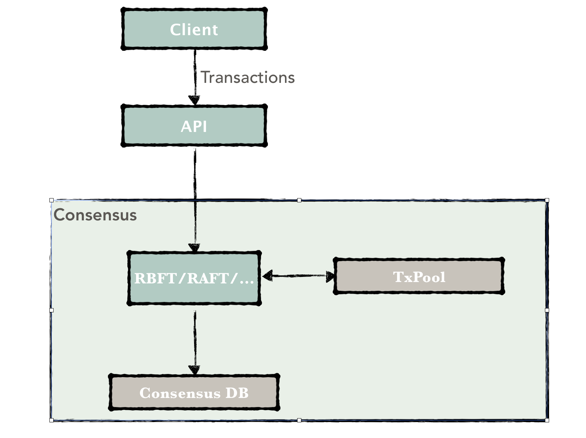
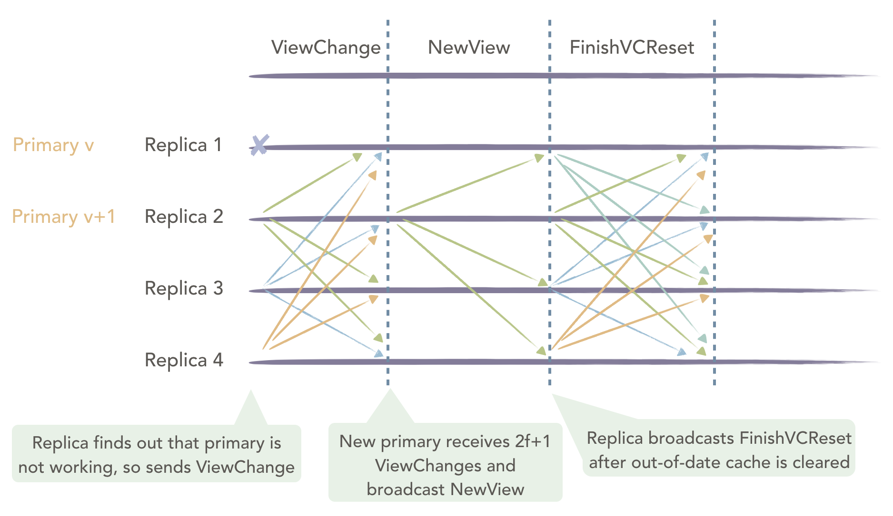
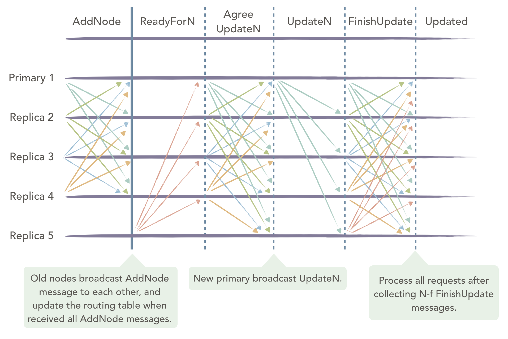

.. role:: math(raw)
   :format: html latex
..

共识
====

1. 概述
-------

共识机制是保证区块链中所有共识节点（即验证节点：validating peer，
VP）按照相同顺序执行交易、写入账本的基础，而记账节点（即非验证节点：non-validating
peer， NVP）只需要从其所连接的共识节点中同步账本信息，因此无需参与共识。

Hyperchain平台支持可插拔的共识机制，可以针对区块链的不同应用场景提供不同的共识算法，当前版本已经实现了\ `PBFT算法 <http://www.usenix.net/legacy/publications/library/proceedings/osdi2000/castro/castro.pdf>`__\ 的改良算法：高鲁棒拜占庭容错算法RBFT（Robust
Byzantine Fault
Tolerance），其算法构思来源于多篇论文(尤其是\ `Aardvark <https://www.usenix.org/legacy/event/nsdi09/tech/full_papers/clement/clement.pdf>`__)，后续将陆续支持RAFT等共识算法。

客户端发送交易到Hyperchain平台，API层解析出交易后转发给共识模块，共识模块接收并缓存交易到本地的交易池（TxPool）中，交易池承担着缓存交易与打包区块的作用，因此是作为共识模块的子模块实现的。另外，共识模块还需要维护一个共识的数据库，用于存储算法所需的变量以便宕机后的自主恢复，例如RBFT算法需要维护视图，PrePrepare，Prepare，Commit等共识信息。

|image0|

2. RBFT相关变量
---------------

在一个由N个节点（N>=4）组成的共识网络中，RBFT最多能容忍f个节点的拜占庭错误，其中：

.. math:: f=\lfloor \frac{N-1}{3} \rfloor

而能够保证达成共识的节点个数为：

.. math:: quorum=\lceil \frac{N+f+1}{2} \rceil

3. RBFT常规流程
---------------

RBFT的常规流程保证了区块链各共识节点以相同的顺序处理来自客户端的交易。RBFT同PBFT的容错能力相同，需要至少3f+1个节点才能容忍f个拜占庭错误。下图为最少集群节点数下的共识流程，其N=4，f=1。图中的Primary1为共识节点动态选举出来的主节点，负责对客户端发来的交易进行排序打包，Replica2，3，4为从节点。所有节点执行交易的逻辑相同并能够在主节点失效时参与新主节点的选举。

常规流程
~~~~~~~~

RBFT共识保留了PBFT原有的三阶段处理流程（PrePrepare、Prepare、Commit）的同时增加了重要的交易验证（validate）环节，在保证对交易执行顺序达成共识的同时也保证了对区块验证结果的共识。

|image1|

RBFT常规流程在原生的PBFT算法中穿插了交易验证环节，主节点将交易打包成块后先行验证，并将验证结果包含到PrePrepare消息中进行全网广播，这样PrePrepare消息中既包含了排好序的交易信息也包含了区块验证结果。从节点在收到主节点的PrePrepare消息后先检查消息的合法性，检查通过后广播Prepare消息表明本节点同意主节点的排序结果；在收到（quorum-1）个Prepare消息后从节点才会开始验证区块，并将验证结果与主节点的验证结果进行比对，比对结果一致则广播Commit表明本节点同意主节点的验证结果，否则直接发起ViewChange表明本节点认为主节点有异常行为。RBFT常规流程具体分为如下几个步骤：

1. **交易转发阶段：**\ 客户端将交易发送到区块链中的任意节点（包括共识节点与记账节点），其中记账节点在收到交易后会主动转发给与其相连的共识节点；而共识节点在收到客户端的交易后将其广播给其他共识节点，这样所有共识节点的交易池中都会维护一份完整的交易列表；
2. **PrePrepare阶段：**\ 主节点按照如下策略进行打包：用户可以根据需求自定义打包的超时时间（batch
   timeout）与打包的最大区块大小（batch
   size），主节点在超时时间内收集到了足够多（超过最大区块大小个数）的交易或者超时时间到达后仍未收集到足够多的交易都会触发主节点的打包事件。主节点将交易按照接收的时间顺序打包成块，并进行验证，计算执行结果，最后将定序好的交易信息连同验证结果等写入PrePrepare消息中广播给所有共识节点，开始三阶段处理流程；
3. **Prepare阶段：**\ 从节点在收到主节点的PrePrepare消息后，首先进行消息合法性检查，检查当前的视图与区块号等信息，检查通过后向共识节点广播Prepare消息；
4. **Commit阶段：**\ 从节点在收到（quorum-1）个Prepare消息以及相应的PrePrepare消息后进行验证，并将验证结果与主节点写入PrePrepare消息中的验证结果进行比对，比对结果一致则广播Commit表明本节点同意主节点的验证结果，否则直接发起ViewChange表明本节点认为主节点存在异常行为，需要切换主节点；
5. **写入账本：**\ 所有共识节点在收到quorum个Commit消息后将执行结果写入本地账本。

Hyperchain通过在共识模块中加入验证机制，可以保证从节点对主节点的每一次排序打包的结果进行校验，尽早地发现主节点的拜占庭行为，提升了系统的稳定性。

检查点
~~~~~~

为了防止运行过程中产生过多的消息缓存，共识节点需要定时清理一些无用的消息缓存。RBFT通过引入PBFT算法中的检查点（checkpoint）机制进行垃圾回收并将检查点的大小K固定设置为10。节点在写入到K的整数倍个区块后达到一个检查点，并广播该检查点的信息，待收集到其他（quorum-1）个共识节点相同的检查信息后就达到了一个稳定检查点（stable
checkpoint），随后即可清理该检查点之前的一些消息缓存，保证了运行过程中消息缓存不会无限制地增长。

交易池
~~~~~~

交易池是共识节点用于缓存交易的场所，交易池的存在一方面限制了客户端发送交易的频率，另一方面也减少了主节点的带宽压力。首先，通过限制交易池的缓存大小，Hyperchain平台可以在交易池达到限制大小后拒绝接收来自客户端的交易，这样，在合理评估机器性能的情况下，通过合理设置交易缓存大小，可以最大限度地利用机器性能而又不至于出现异常。其次，共识节点在接收到来自客户端的交易后先将其存到自己的交易池中，随后向全网其他共识节点广播该条交易，保证了所有共识节点都维护了一份完整的交易列表；主节点在打包后只需要将交易哈希列表放到PrePrepare消息中进行广播即可，而不用将完整的交易列表打包进行广播，大大减轻了主节点的出口带宽压力。如果从节点在验证之前发现缺少了某些交易，也只需要向主节点索取缺少的那些交易而不用索取整个区块里面所有的交易。

4. RBFT视图变更
---------------

RBFT视图变更能够解决主节点成为拜占庭节点的问题。在RBFT算法中，参与共识的节点可根据角色分为主节点和从节点。主节点最重要的功能是将收到的交易按照一定策略打包成块，为交易定序，并让所有节点按照此顺序执行。然而，如果主节点发生宕机、系统错误或者被攻占（即成为拜占庭节点），从节点需要及时发现主节点异常并选举产生新的主节点。这将是所有BFT类算法为满足稳定性必须要解决的问题。

视图
~~~~

在RBFT与PBFT中，都引入了视图（View）概念，即每次更换一个主节点的同时都会切换视图。目前RBFT采用轮换的方式切换主节点，并且view从0开始只增不减。当前的view和总节点数量N决定了主节点id：

.. math:: PrimaryId = (view + 1) \bmod N

可检测到的拜占庭行为
~~~~~~~~~~~~~~~~~~~~

目前RBFT能够检测到的主节点的拜占庭行为主要有2种场景：

1. 主节点停止工作，不再发送任何消息；
2. 主节点发送错误的消息。

对于场景一，RBFT由nullRequest机制保证，行为正确的主节点会在没有交易发生时，向所有从节点定时发送nullRequest来维持正常连接。如果从节点在规定时间内没有收到nullRequest，则会触发ViewChange流程选举新的主节点。

对于场景二，从节点会对主节点发出的消息进行验证，如上一节中提到的包含在PrePrepare消息中的验证结果，如果从节点验证不通过的话，会直接发起ViewChange流程选举新的主节点。

此外，RBFT还提供了可配置的ViewChangePeriod选项。用户可以根据需要设置此选项，每写入一定数量区块后进行主动的ViewChange轮换主节点，一来能够缓解主节点作为打包节点的额外压力，二来也使所有参与共识的节点都能承担一定的打包工作，保证了公平性。

视图变更流程
~~~~~~~~~~~~

|image2|

上图中，Primary
1为拜占庭节点，需要进行ViewChange。在RBFT中的ViewChange流程如下：

1. 从节点在检测到主节点有异常情况（没有按时收到nullRequest消息）或者接收到来自其他f+1个节点的ViewChange消息之后会向全网广播ViewChange消息，自身view从v更改为v+1；
2. 新视图中主节点收到N-f
   个ViewChange消息后，根据收到的ViewChange消息计算出新视图中主节点开始执行的checkpoint和接下来要处理的交易包，封装进NewView消息并广播，发起VcReset；
3. 从节点接收到NewView消息之后进行消息的验证和对比，如果通过验证，进行VcReset，如果不通过，发送ViewChange消息，进行又一轮ViewChange；
4. 所有节点完成VcReset之后向全网广播FinishVcReset；
5. 每个节点在收到N-f个FinishVcReset消息之后，开始处理确定的checkpoint后的交易，完成整个ViewChange流程。

由于共识模块与执行模块之间是异步通信的，而ViewChange之后执行模块可能存在一些无用的validate缓存，因此共识模块需要在ViewChange完成之前通知执行模块清除无用的缓存，RBFT通过VcReset事件主动通知执行模块清除缓存，并在清理完成之后才能完成ViewChange。

5. RBFT自主恢复
----------------

区块链网络在运行过程中由于网络抖动、突然断电、磁盘故障等原因，可能会导致部分节点的执行速度落后于大多数节点。在这种场景下，节点需要能够做到自动恢复才能继续参与后续的共识流程。为了解决这类数据恢复的问题，RBFT算法提供了一种动态数据自动恢复的机制(recovery)，recovery通过主动索取现有共识网络中所有节点的视图、最新区块等信息来更新自身的存储状态，最终同步至整个系统的最新状态。在节点启动、节点重启或者节点落后的时候，节点将会自动进入recovery，同步至整个系统的最新状态。

自主恢复流程
~~~~~~~~~~~~

|image3|

上图中，Replica
4为落后节点，需要进行recovery。此节点在RBFT中的自动恢复流程如下：

1. Replica 4 首先广播NegotiateView消息，获取当前其余节点的视图信息；
2. 其余三个节点向Replica 4发送NegotiateViewResponse，返回当前视图信息。
3. Replica 4 收到quorum个NegotiateViewResponse消息后，更新本节点的视图；
4. Replica 4
   广播RecoveryInit消息到其余节点，通知其他节点本节点需要进行自动恢复，请求其余节点的检查点信息和最新区块信息；
5. 正常运行节点在收到RecoveryInit消息之后，发送RecoveryResponse，将自身的检查点信息以及最新区块信息返回给Replica
   4节点；
6. Replica
   4节点在收到quorum个RecoveryResponse消息后，开始尝试从这些response中寻找一个全网共识的最高的检查点，随后将自身的状态更新到该检查点；
7. Replica
   4节点向正常运行节点索要检查点之后的PQC数据，最终同步至全网最新的状态。

6. RBFT节点增删
----------------

在联盟链场景下，由于联盟的扩展或者某些成员的退出，需要联盟链支持成员的动态进出服务，而传统的PBFT算法不支持节点的动态增删。RBFT为了能够更加方便地控制联盟成员的准入和准出，添加了保持集群非停机的情况下动态增删节点的功能。

新增节点流程
~~~~~~~~~~~~

|image4|

上图中，Replica 5为待新增的节点。RBFT节点的动态新增节点流程如下：

1. 新增节点Replica
   5通过读取配置文件信息，主动向现有节点发起连接，确认所有节点连接成功后更新自身的路由表，并发起recovery；
2. 现有节点接收到Replica
   5的连接请求后确认同意该节点加入，然后向全网广播AddNode消息，表明自己同意该新节点加入整个共识网络；
3. 当现有节点收到N条（N为现有区块链共识网络中节点总数）AddNode消息后，更新自身的路由表，随后开始回应新增节点的共识消息请求（在此之前，新增节点的所有共识消息是不予处理的）；
4. Replica 5完成recovery之后，向全网现有节点广播ReadyForN请求；
5. 现有节点在收到ReadyForN请求后，重新计算新增节点加入之后的N,view等信息，随后将其与PQC消息封装到AgreeUpdateN消息中，进行全网广播；
6. Replica
   5加入后的共识网络会产生一个新的主节点，该主节点在收到N-f个AgreeUpdateN消息后，以新的主节点的身份发送UpdateN消息；
7. 全网所有节点在收到UpdateN消息之后确认消息的正确性，进行VCReset；
8. 每个节点完成VCReset后，全网广播FinishUpdate消息；
9. 节点在收到N-f个FinishUpdate消息后，处理后续请求，完成新增节点流程。

.. |image1| image:: ../../images/normal.png

.. |image3| image:: ../../images/recovery.png

