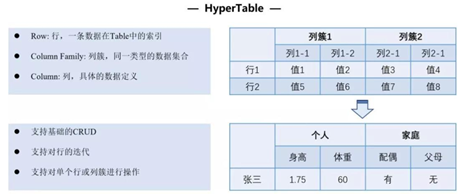

执行引擎
^^^^^^^^

平台支持合约安全、执行高效、编程友好的合约执行沙盒环境，研发了三种合约执行引擎：HVM（HyperVM）、EVM（HyperEVM）、BVM等，分别支持
Java、Solidity、Go等编程语言，提供完善的合约生命周期管理。

HVM
------

HVM概述
>>>>>>>>>>>

由于当前Java语言的流行以及其强大的生态，使用Java语言编写合约无疑会让合约开发更加便捷且易于推广。HVM为趣链科技首创支持Java语言的智能合约执行引擎，支持符合Java编写规范多种数据结构，内置数据表结构，可以实现业务数据可视化，在保证智能合约执行的安全性、确定性、可终止性的前提下，提供了一系列灵活的应用模式和工具方法集，以满足复杂多样的业务场景需求，为广泛的区块链开发人员提供更便捷、灵活、安全的区块链应用开发模式。

HVM使用
>>>>>>>>>>>

HVM执行机制从外部来看主要负责合约执行的操作。从SDK调用一笔HVM的合约，首先需要共识模块将通过共识的区块交易发送给执行模块，然后执行模块调用HVM暴露出来的合约接口，最后合约执行完成后会将结果返回，将执行结果写入账本中。在架构层面，HVM自上而下主要分为三个部分：合约操作层、库函数层以及虚拟机层。
    
|image0|

1. 合约操作层

这一层与用户直接相关联，主要包括合约部署、调用等全生命周期管理。
    
- 合约部署 ：编写Java智能合约，并通过SDK发交易的形式将其部署到区块链上；
- 合约调用 ： 根据合约地址，调用相应合约中的逻辑。
- 合约升级 ： 因业务要求或者实现逻辑更新，需要对合约进行升级操作时，需要用新合约来替换掉旧合约，由于升级合约是一个链级操作（改变整个链上的状态），所以需要采用CAF联盟自治框架才可以进行合约升级，保证链上合约的安全控制。
- 合约冻结/解冻 ：将链上的合约冻结，在合约所有者解冻之前，禁止任何人调用，冻结不同于销毁，其具备一个可逆的过程，可以通过合约解冻的操作重新使用。
- 合约销毁 ：将链上原来部署的合约进行废止操作，不同于合约冻结，合约销毁是一个不可逆的操作，被销毁的合约不能够被访问，不可以恢复，不允许再进行任何操作，但合约销毁后的数据仍然会存在链的底层账本中，仅用于监管审计。
    
2. 库函数层

库函数包括数据结构、账本操作、日志信息以及加解密等功能。
    
- **数据结构符合 Java 编写范式**：HyperList、HyperMap为平台独立研发，为了方便Java 软件开发者习惯，使其无需感知区块链底层 KV 结构即可编写相应业务逻辑代码。HyperMap 和 HyperList 的使用类似于开发者所熟知的 HashMap 和 ArrayList，但做了原创性地优化，在减少内存使用的同时也提高了更新账本的插入效率。

|image1|
    
- **内置数据表结构 HyperTable**：为了满足复杂业务场景下数据类型多样化、业务数据可视化与可分析的需求，智能合约需要支持复杂的表结构数据组织形式。HVM 提供了内置数据结构 HyperTable，支持在合约内部按照表的形式组织业务数据，便于业务数据可视化以及后续的数据分析与价值挖掘。这种结构可以让原Solidity 语言中复杂嵌套的数据操作简单化，同时在性能方面，能有效解决序列化、反序列化造成的性能瓶颈，整体维护成本更低、使用更高效。
    
|image2|

- **内置嵌套Map数据结构**：HyperList、HyperMap数据结构都无法满足复杂数据组织结构的需求；HyperTable的表结构拥有严格的层级格式（表-行-列簇-列-值），缺乏在复杂结构下的灵活性（例如：不可只有列，没有列簇）。针对上述问题，HVM推出新型的数据结构——NestedMap，支持用户按需进行灵活的数据组织，并且实现对多层映射数据更高的读写性能。

3. 虚拟机层
    
这一层用户感知较浅，主要是在合约执行过程中，对于合约解析执行的内部操作。为了提高整体的执行效率，HVM设计定制类加载器，类加载缓存提供合约地址
到合约类加载器的映射，一个合约类加载器保存合约的字节码和合约类实例，采用最近最少使用淘汰策略（LRU）减少类重复加载带来的开销；指令解析从开始
的每次对指令进行解析到将指令做成单例，并进行栈帧复用，大量节省指令执行时间，提高整体执行效率。
    
HVM优势
>>>>>>>>>>

- 支持多级日志
    
日志在应用开发过程中的作用至关重要，能帮助开发者快速定位和发现问题。由于 EVM 未对出现的异常进行详细定位，给编译调试造成极大的难度。而 HVM
通过内置日志工具类，支持六种日志级别：critical、error、warning、notice、info、debug。可以为每种常见的错误进行合理的提示，方便使用者
对合作操作过程中产生的异常进行debug，方便开发和运维快速定位问题。
    
- 分层调用模式
    
HVM采取分层调用的模式，可以有效降低合约升级的成本。其实现方法主要通过InvokeBean的方式在业务调用层在不更新合约的情况下定义丰富的业务逻辑，
合约层只实现最核心、最基本的原子操作。以转账场景为例，合约层只有增加余额和减少余额的方法，在InvokeBean调用层定义转账的逻辑：如余额是否充足、
减少转让方余额和增加接收方余额。
    
- 支持加解密工具
    
一些业务场景需要在智能合约中进行签名验签逻辑处理，从而进行身份认证，便于进行权限判断或者后续业务的开展。因此 HVM 设计了基于 TEE的加解密工具，
支持在合约中调用存储于 TEE 的公私钥完成签名、验签操作，并支持 ECDSA国标系列、SM 国密系列等多种加解密算法，具有方便友好安全的特性。
    
- 支持合约访问控制
    
合约编码者可以通过智能合约和访问控制策略来限制访问数据的角色和用户，在合约中针对节点、角色、用户定制不同的合约函数访问权限。合约编码者可以在
合约中为一些高权限的函数设置权限控制，使得该函数只能被固定地址的调用者调用，从而实现访问权限控制。
    
EVM
-----

EVM概述
>>>>>>>>>>>

Hyper EVM在合约执行方面，优化执行的内部细节，包括跳转表的初始化逻辑优化、EVM初始化上下文流程优化，减少了内存的频繁分配和对象的创建过程，加快
了EVM初始化速度。同时，HyperEVM会跟随以太坊EVM版本迭代更新，适配最新的以太坊EVM特性。

BVM
-----

BVM概述
>>>>>>>>>>>

BVM全称是 **Built-in Virtual Machine** ，是用于处理内置合约的虚拟机类型。BVM的出现让开发者自主定义一些内置合约（即是合约代码由开发人员预先写好，在平台启动时直接创建对象加载，无需用户手动部署），提供用户所需的专属功能。具有性能优良、无需（额外）部署、权限灵活等特性。

目前BVM支持存证和提案两类内置合约
>>>>>>>>>>>>>>>>>>>>>>>>>>>>>>>>>

- 存证类内置合约 : “SetHash”场景，表示存证场景下文件哈希的存储形式。HashContract中只有两个操作：存和取，对应Set方法和Get方法。

- 提案类内置合约 : 包括更改配置和权限管理等事件，如新增节点投票。提案合约提供创建提案、取消提案、提案投票以及执行提案的操作，分别对应Create、Cancel、Vote、Execute方法。

BVM优势
>>>>>>>>>>>

- 性能优良：由于嵌入系统中，所以可以接近原生代码执行速度。
- 无需部署：无需用户额外部署，可以理解为平台刚启动就被 “部署”在某个固定地址上。
- 权限灵活：不属于任何用户，都不可以对该合约进行升级或冻结、解冻的相关操作。

.. |image0| image:: ../../images/HVM1.png
.. |image1| image:: ../../images/HVM2.png

 
