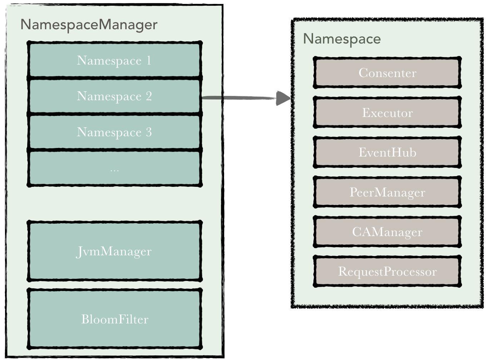

分区共识
========

1.概述
------

Hyperchain通过Namespace(名字空间)机制实现区块链网络内部交易的分区共识。Hyperchain平台的使用者可以按照名字空间进行业务交易划分，同一个Hyperchain联盟链网络中的节点按照其所参与的业务组成以名字空间为粒度的子区块链网络。名字空间通过业务的交易共识、分发以及存储的物理级别隔离实现业务级别的隐私保护。

2.集群架构
----------

名字空间可以动态创建，单个Hyperchain节点按照其业务需求可以选择参与一个或者多个名字空间。如下图所示是Namespace机制的整体集群架构图——六个节点参与两个命名空间的集群示意图，Node1、Node2、
Node4和Node5组成namespace1，而Node2、Node3、Node5和Node6组成namespace2。其中Node1和Node4仅参与了namespace1，Node3和Node6仅参与了namespace2，而Node2和Node4则同时参与了两个名字空间。名字空间中通过CA认证方式控制节点的动态加入和退出，每个节点可以允许参与到一至多个Namesapce中。

带特定Namespace信息的交易的验证、共识、存储以及传输仅在参与特定Namespace的节点之间进行，不同Namespace之间的交易可实现并行执行。如下图所示Node1仅能参与namespace1中交易的验证以及相应账本的维护而Node2能够同时参与namespace1和namespace2的交易执行和账本维护，但Node2中的namespace1和namespace2的账本互相隔离互不可见。

|image0|

3.节点架构
----------

加入分区共识机制之后的\ ``Hyperchain``\ 单节点将包含一个
``NamespaceManager``\ 对象。\ ``NamespaceManager``\ 是分区共识机制的关键管理组件，负责namespace的注册、启动、停止、注销等一系列的生命周期状态操作。NamespaceManager中包含多个namespace，此外还包含JvmManager和BloomFilter。

具体而言：

-  ``JvmManager``
   负责管理jvm执行器，JvmManager是否开启需要在配置文件中进行配置；
-  ``BloomFilter``
   为交易的布隆过滤器，主要负责重复交易的检测，防止重放攻击；

分区共识中的一个分区被称为一个\ ``namespace``\ ，每个namespace之间互相隔离，包括执行空间以及数据存储空间均做到完全隔离。每个节点默认加入到名为global的namespace中。每个\ ``namespace``\ 包含\ ``consenter``,\ ``executor``,\ ``eventHub``,\ ``peerManager``,\ ``caManager``,\ ``requestProcessor``\ 等关键组件，这几个关键组件实现各自namespace的共识服务，交易执行存储，模块间异步交互，节点间通讯、身份认证、交易处理等功能。

|image1|

具体而言：

-  ``Consenter``
   提供共识服务，目前支持RBFT算法，负责对交易进行定序，保证同一namespace内的hyperchain节点的账本一致性；
-  ``Executor``
   为执行器，执行器主要负责namespace中的智能合约的调用以及账本状态的维护；
-  ``EventHub``
   为事件总线，是namespace内各关键组件间事件进行异步交互的消息中转中心；
-  ``PeerManager`` 提供节点通讯管理，负责namespace成员之间网络通信；
-  ``CaManager`` 为证书认证中心，负责进行互联网上的身份认证；
-  ``RequestProcessor``
   为请求处理组件。负责处理JSON-RPC消息，最终通过反射调用相应api。

Namespace的生命周期如下图所示。首先在namespaceManager中进行注册，创建并初始化此namespace。之后start此namespace，启动namespace中所有组件的功能，进行Running状态。Stop将停止此namespace中所有组件，最后在namespaceManager注销此namespace。

|image2|

4.系统数据流
------------

在引入namespace之后hyperchain节点的交易执行流程有所改变，客户端能够发送交易到其期望的namespace。交易传递到hyperchain平台之后json
rpc会首先进行参数检查以及签名验证等前期工作，之后json
rpc服务会将请求转发到NamespaceManager，NamespaceManager在会根据请求中的namespace字段信息将交易请求发送到具体的namespace进行执行。不同namespace之间的交易能够并发执行。对应的namespace将调用RequestProcessor进行交易的处理，首先检查请求的参数，如果没有问题，通过反射调用相应处理函数并返回结果。

|image3|

.. |image0| image:: ../../images/namespace_arch.png

.. |image2| image:: ../../images/namespace_life.png
.. |image3| image:: ../../images/namespace_flow.png
