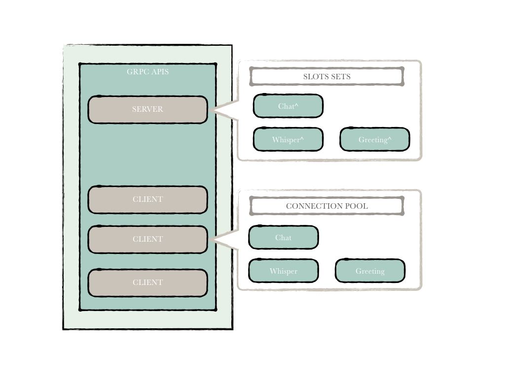

P2P
===

1. 概述
-------

P2P模块是Hyperchain底层网络通信模块，它保证了通信链路的数据传输安全，用户可以通过配置文件来配置是否启用传输安全TLS、是否启动数据传输加密（或更换数据加密算法）。在该模块中，物理连接（Network层）与逻辑连接分离，模块整体架构如下图所示：

.. figure:: ../../images/p2p_architecture.001.jpeg
   :alt: p2p_architecture.001

2. Hypernet
-----------

Hypernet作为Hyperchain的底层通信基础设施，通过注册slot的形式向上层提供网络通信服务，其主要的功能包括通信链路的建立，数据传输，链路安全，链路活性控制等功能。其拥有\ ``Server``\ 和\ ``Client``\ 两个重要成员。整体架构图如下：

Server
~~~~~~

在Hypernet中，Server负责注册网络插口(slot)、监听服务、分发来自Client的各类消息。

**网络插口slot**

slot作为Hypernet同上层进行通信的主要机制，其实现其实是一个多维的线程安全的map映射，将相关方法映射到不同的消息处理器中进行处理。

slots作为Server成员，拥有一组对应到不同namespace中的slot，分别处理来自不同namespace消息。

Client
~~~~~~

Client与Server相对应，主要用于处理不同的消息发送请求。通常一个Client对应于多个不同的远端Server（因为一个节点会与多个节点相连）,
并且与不同Server通信，交由Sever的信息将会分发到不同的namespace中的slot去处理。

TLS
^^^

传输层安全是Hyperchain默认开启的功能，采用Hyperchain内部的TLSCA签发的证书进行安全通信，从传输层面保障信息通信的安全性。进一步地，该选项是可选的。

TLS
能够在传输层保障信息传输的安全性，是目前较为通用的网络传输实施标准，在几乎所有的网络安全传输中都采用了该技术。

3. P2PManager
-------------

``P2PManager``\ 用于分配不同namespace中的\ ``PeerManager``\ ，它在全局中只有一个实例。

PeerManager
~~~~~~~~~~~

``PeerManager``\ 主要负责以下几个部分：

-  对外提供不同的消息发送服务接口;
-  提供相应的消息向上推送服务;
-  使用\ ``PeerManagerEventHub``\ 这个消息中间件对\ ``PeerManager``\ 的控制消息进行分发管理，进行整个逻辑网络的状态维护，同时承担较为复杂的消息处理逻辑。

在整个网络中，节点可称为\ ``Node``\ 或\ ``Peer``\ ，下面来看这两者的区别。

Peer
^^^^

逻辑上的所有remote节点都称为peer,
一个远端节点对应一个peer，peer主要用于处理逻辑上的消息发送请求。其主要工作就是对消息进行加密，然后调用Hypernet
Client的对应的消息发送方法，并且消息中需要附着namespace信息。

Node
^^^^

Node即本地节点，它也是逻辑上的server，主要负责逻辑上的节点消息处理，对从网络中接收到的消息进行解密然后抛给Hyperchain消息中间件\ ``eventhub``\ ，由消息中间件识别这是哪一类消息应该交给哪一个模块去处理，比如共识模块、执行模块。

数据传输加密
^^^^^^^^^^^^

数据传输加密是指对网络上传输的交易信息和通信消息的加密，根据用户的需求可以对所有在Hyperchain上传输的信息进行加密，其加密方案同TLS类似，先通过ECDH算法协商对应的会话密钥，然后利用该会话密钥对业务信息进行加密，对端进行解密。所有的节点之间的通信都会利用不同的会话密钥进行加密。这是对传输层安全的一个补充。目前hyperchain的消息可以通过配置进行对称加密，如果有更加复杂的消息加密需求可以使用该方式进行处理。
