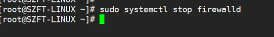
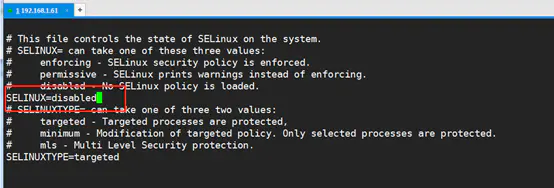
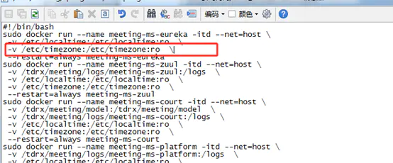
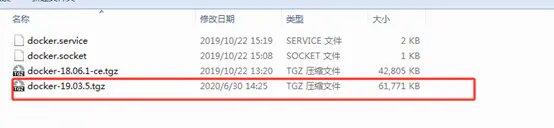
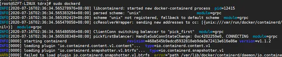
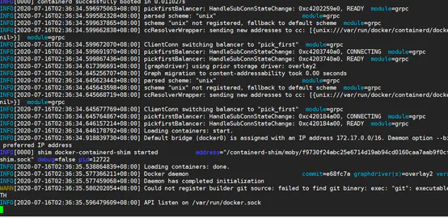
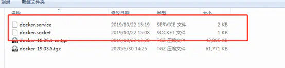

.. _Containerized_deployment:

容器化部署
^^^^^^^^^^^^^

1. 引言
=======

本文档针对需要使用容器化来进行部署的项目使用，在一些部署环境中必须通过镜像+挂载空磁盘的部署情况，无法将配置文件和证书放置到容器环境中，可通过开启环境变量配置模式的方式，来启动平台，方便此类环境的节点部署，本文档将介绍如何进行环境变量部署。

2.安装docker
============

【如客户方提供服务器已有docker服务则可以跳过此章节，直接阅读第2.2章节】

Docker离线安装部署文档

**文档基于centos 7.5; docker 19.03.5**

**1. 准备linux环境**

**1.1 先关闭防火墙** `sudo systemctl stop firewalld`

|image1|

**1.2 关闭selinux策略**
`vi /etc/selinux/config`
修改完成后，重启一次系统；可以使用reboot

|image2|

**1.3 检查文件**
检查是否存在/etc/timezone文件，如果没有，在后面执行 `docker run`
命令的时候，需要删除命令中关于/etc/timezone
的映射，以免报错，只使用/etc/localtime 做时间同步。

|image3|

准备工作完成。

**2. 安装docker**

如果没有安装包，在官网下载二进制安装包,下载地址\ `https://download.docker.com/linux/static/stable/x86_64/ <https://links.jianshu.com/go?to=https%3A%2F%2Fdownload.docker.com%2Flinux%2Fstatic%2Fstable%2Fx86_64%2F>`__

|image4|

下面只需要安官网的步骤执行就可以了，官网安装网址\ `https://docs.docker.com/engine/install/binaries/ <https://links.jianshu.com/go?to=https%3A%2F%2Fdocs.docker.com%2Fengine%2Finstall%2Fbinaries%2F>`__

就下面这三步：

**2.1** **解压**\ ：tar xzvf docker-19.03.5.tgz

**2.2** **拷贝**\ ： sudo cp docker/\* /usr/bin/

**2.3** **运行**\ ： sudo dockerd &。

这一步可以不用后台执行，即直接执行sudo
dockerd，命令行界面会直接打印执行结果，查看执行结果。

|image5|

|image6|

如果没有异常，按 ctrl + c 强制退出，Docker
其实已经安装好了，后面会配置开机启动。

**3. 配置docker开机启动**

这里包括两个文件（强调一下必须先执行1.2步骤，即关闭selinux，并且重启了系统）

|image7|

docker.service ::

   [Unit]

   Description=Docker Application Container Engine

   Documentation=https://docs.docker.com

   After=network-online.target firewalld.service

   Wants=network-online.target

   [Service]

   Type=notify

   # the default is not to use systemd for cgroups because the delegate issues still

   # exists and systemd currently does not support the cgroup feature set required

   # for containers run by docker

   ExecStart=/usr/bin/dockerd

   ExecReload=/bin/kill -s HUP $MAINPID

   # Having non-zero Limit*s causes performance problems due to accounting overhead

   # in the kernel. We recommend using cgroups to do container-local accounting.

   LimitNOFILE=infinity

   LimitNPROC=infinity

   LimitCORE=infinity

   # Uncomment TasksMax if your systemd version supports it.

   # Only systemd 226 and above support this version.

   #TasksMax=infinity

   TimeoutStartSec=0

   # set delegate yes so that systemd does not reset the cgroups of docker containers

   Delegate=yes

   # kill only the docker process, not all processes in the cgroup

   KillMode=process

   # restart the docker process if it exits prematurely

   Restart=on-failure

   StartLimitBurst=3

   StartLimitInterval=60s

   [Install]

   WantedBy=multi-user.target

docker.socket::

   [Unit]

   Description=Docker Socket for the API

   PartOf=docker.service

   [Socket]

   # If /var/run is not implemented as a symlink to /run, you may need to

   # specify ListenStream=/var/run/docker.sock instead.

   ListenStream=/run/docker.sock

   SocketMode=0660

   SocketUser=root

   SocketGroup=docker

   [Install]

   WantedBy=sockets.target

执行下列命令，设置docker开机自启；在docker.service，
docker.socket所在的文件夹中执行下命令，设置docker开机自启。

 ::

   sudo cp docker.socket /etc/systemd/system

   sudo cp docker.service /etc/systemd/system

   sudo systemctl daemon-reload

   sudo systemctl start docker

   sudo systemctl enable docker

重启一下系统，检验docker是否开机自启

 ::

    sudo reboot

重启成功后，执行docker ps 检验docker是否启动成功。

到这里docker已经安装完成，并且开机自启。

2.1 安装docker-compose
----------------------

 ::

   # 如服务器无外网则可以在电脑浏览器中先下载好而后上传服务器/usr/local/bin/docker-compose目录
   curl -L https://get.daocloud.io/docker/compose/releases/download/1.29.1/docker-compose-`uname -s`-`uname -m` > /usr/local/bin/docker-compose

   # 给docker compose 目录授权
   sudo chmod +x /usr/local/bin/docker-compose

   	# 将文件软链到/usr/bin/目录下cp /roo
   ln -s /usr/local/bin/docker-compose /usr/bin/docker-compose

   # 查看一下version，显示有版本号那就说明安装成功了
   docker-compose version

2.2 部署容器
------------

1.拉取镜像

具体版本镜像请询问@汪剑锋或者@相关对接人员

 ::

   docker pull harbor.hyperchain.cn/hyperchain/hyperchain@sha256:4b9a33331c4a98943a476a3f6ad38f763598445a77dafcd0f631ff72e6d50dd7

2.创建目录（所有节点在同一台服务器的话需要分别创建对应的节点目录）

 ::

   mkdir ~/hyperchain/

3.写入部署包

 ::

   上传deploy.tar.gz
   tar -xvf deploy.tar.gz -C ~/hyperchain/

4.上传LICENSE文件

 ::

   //外部人员可通过内部工作人员签发拿到License文件
   //压缩包中解压出的license文件需要重命名为LICENSE并放到~/hyperchain/目录
   mv 20221119@.LICENSE ~/hyperchain/LICENSE

5.docker-compose.yml

vim docker- compose.yml

 ::

   version: '3'
   networks:
     mynet1:
       ipam:
         config:
         - subnet: 172.19.0.0/24
   services:
           hyperchain1:
                   image: 6d73921dbb35
                   container_name: hyperchain1
                   networks:
                           mynet1:
                                   ipv4_address: 172.19.0.2
                   ports:
                           - "8081:8081"
                           - "50011:50011"
                           - "12001:12001"
                   volumes:
                           - ~/hyperchain/node1/configuration:/opt/hyperchain/configuration
                           - ~/hyperchain/node1/namespaces:/opt/hyperchain/namespaces
                           - ~/hyperchain/node1/system:/opt/hyperchain/system
                           - ~/hyperchain/node1/tls:/opt/hyperchain/tls
                           - ~/hyperchain/LICENSE:/opt/hyperchain/LICENSE
                   working_dir: /opt/hyperchain/
                   entrypoint: ./hyperchain start
                   restart: always

           hyperchain2:
                   image: 6d73921dbb35
                   container_name: hyperchain2
                   networks:
                           mynet1:
                                   ipv4_address: 172.19.0.3
                   ports:
                           - "8082:8081"
                           - "50012:50011"
                           - "12002:12001"
                   volumes:
                           - ~/hyperchain/node2/configuration:/opt/hyperchain/configuration
                           - ~/hyperchain/node2/namespaces:/opt/hyperchain/namespaces
                           - ~/hyperchain/node2/system:/opt/hyperchain/system
                           - ~/hyperchain/node2/tls:/opt/hyperchain/tls
                           - ~/hyperchain/LICENSE:/opt/hyperchain/LICENSE
                   working_dir: /opt/hyperchain/
                   entrypoint: ./hyperchain start
                   restart: always

           hyperchain3:
                   image: 6d73921dbb35
                   container_name: hyperchain3
                   networks:
                           mynet1:
                                   ipv4_address: 172.19.0.4
                   ports:
                           - "8083:8081"
                           - "50013:50011"
                           - "12003:12001"
                   volumes:
                           - ~/hyperchain/node3/configuration:/opt/hyperchain/configuration
                           - ~/hyperchain/node3/namespaces:/opt/hyperchain/namespaces
                           - ~/hyperchain/node3/system:/opt/hyperchain/system
                           - ~/hyperchain/node3/tls:/opt/hyperchain/tls
                           - ~/hyperchain/LICENSE:/opt/hyperchain/LICENSE
                   working_dir: /opt/hyperchain/
                   entrypoint: ./hyperchain start
                   restart: always

           hyperchain4:
                   image: 6d73921dbb35
                   container_name: hyperchain4
                   networks:
                           mynet1:
                                   ipv4_address: 172.19.0.5
                   ports:
                           - "8084:8081"
                           - "50014:50011"
                           - "12004:12001"
                   volumes:
                           - ~/hyperchain/node4/configuration:/opt/hyperchain/configuration
                           - ~/hyperchain/node4/namespaces:/opt/hyperchain/namespaces
                           - ~/hyperchain/node4/system:/opt/hyperchain/system
                           - ~/hyperchain/node4/tls:/opt/hyperchain/tls
                           - ~/hyperchain/LICENSE:/opt/hyperchain/LICENSE
                   working_dir: /opt/hyperchain/
                   entrypoint: ./hyperchain start
                   restart: always

6.创建并启动容器

 ::

   ##在docker-compose.yml文件同级目录执行,
   ##创建并启动节点容器
   docker-compose -f docker-compose.yml up -d
   ##注意不要重复执行此命令，如需要删除节点执行
   docker-compose -f docker-compose.yml down

7.重启容器

 ::

   docker-compose -f docker-compose.yml stop
   docker-compose -f docker-compose.yml start

注意：部分配置项在节点执行过程中会被程序改写，如果不清楚改写后的内容，建议在启动成功后，不在使用之前配置的环境变量内容，下次重启时只在环境变量中配置需要修改的配置内容。

