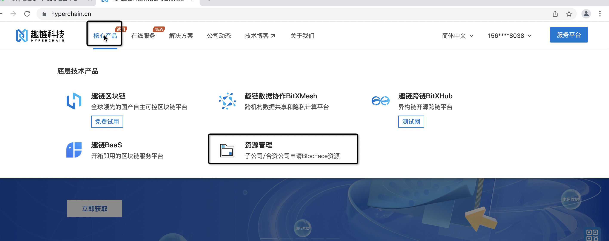
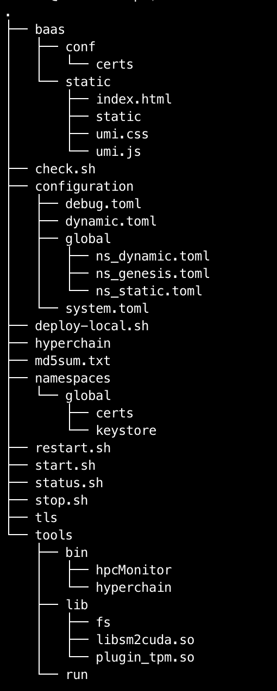
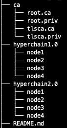
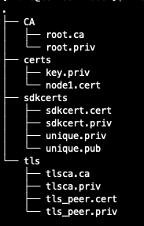
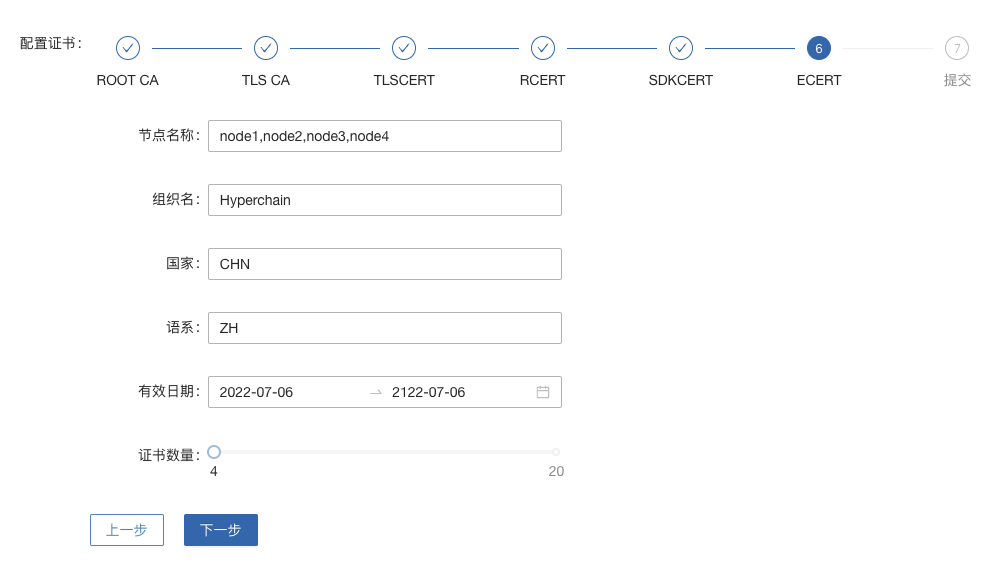
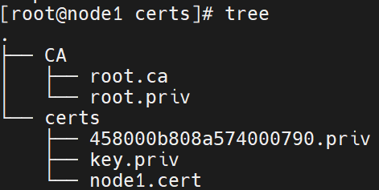
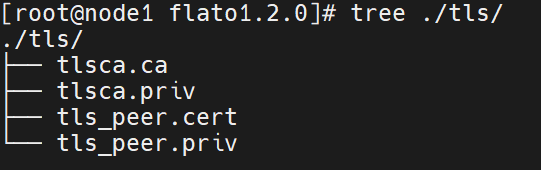
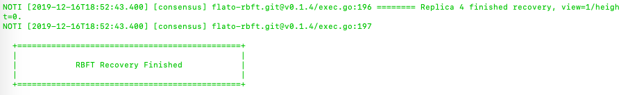

.. _Deployment_docs:

部署文档
^^^^^^^^^^^

前言
====

该文档将介绍如何部署一个拥有4个节点的Hyperchain集群，用户需要 **分别登录到4台服务器** 上进行操作。

这里假设4台服务器的IP分别为 `node1` 、 `node2` 、 `node3` 和 `node4` ，操作用户都是 `hyperchain` 。

**该部署文档是为模拟平台上线部署的场景而编写的，所有的部署操作都只有普通用户权限。不推荐使用root用户部署平台，容易养成不好的操作习惯，也不利于发现操作步骤中的错误。**

第一章 获取安装包以及用户登录
=============================

1.1 获取安装包
--------------

如果您已通过其他方式获取安装包请忽略此步骤。

【线下获取】对接趣链科技相关人员

【公司外部】登录服务平台官方资源库下载

-  https://baas.hyperchain.cn

-  没有开放权限的，可以找@王炎炎申请支持

|image1|

【公司内部】登录OA：\ https://moffi.hyperchain.cn

-  点击签发->平台组件->组件列表->hyperchain->下载，选择使用您平台的hyperchain版本下载

-  点击签发->证书->创建证书，选择V1.7+证书体系，按步骤点击后下载得到证书zip文件

-  点击签发->许可->我的许可，申请适合您需求的LICENSE，审批通过后在许可状态中下载LICENSE文件

【免费试用版】\ https://docs.hyperchain.cn/document/detail?type=1&id=55

至此，您已经获得了所有需要的安装包，注意： **证书和LICENSE文件将在hyperchain部署完成时用到，详见3.2节。**

1.2 创建使用用户及文件权限
--------------------------

创建平台部署所需的用户，例如创建如下用户::

    用户名：hyperchain
    密码：hyperchain

可用如下命令创建新用户::

   sudo useradd -m -d /home/hyperchain -s /bin/bash -k /etc/skel hyperchain
   sudo passwd hyperchain

修改部署路径及数据存放路径的目录权限，例如 `/data/hyperchain`

 ::

   sudo chown -R hyperchain:hyperchain  /data/hyperchain

1.3 上传安装包
--------------

登录服务器前需要上传hyperchain安装包和另外的小工具。

以服务器地址 `node1` ，用户名 `hyperchain` 为例，操作步骤如下::

   #上传hyperchain安装包
   #具体操作时将hyperchain-install.tar.gz换成实际安装包名，将node1换成实际服务器IP地址
   scp hyperchain-installer.tar.gz hyperchain@node1:~
   #上传nt工具包（可选）
   #具体操作时将node1换成实际服务器IP地址
   scp nt-linux64.tar.gz hyperchain@node1:~

1.4 登录操作用户
----------------

 ::

   #具体操作时将node1换成服务器IP地址
   ssh hyperchain@node1
   Password:
   #输入登录密码

1.5 重复操作
------------

请按照\ **1.2~1.3**\ 中的步骤，再分别登录到 `node2~node4` 上，以继续之后的操作。

第二章 检查系统环境
===================

首先以 `node1` 服务器为例，完成以下的检查步骤。

2.1 检查服务器时间
------------------

检查Hyperchain节点所在服务器的时间是否与标准时间同步，如果不同步请联络系管理员同步系统时钟。

 ::

   #查看服务器时间命令
   date

2.2 检查服务器配置
------------------

检查服务器配置是否与预期的配置一致，如果不一致请联系系统管理调整配置。

 ::

   #查看CPU主频
   cat /proc/cpuinfo | grep 'model name' | uniq
   #查看CPU核数
   cat /proc/cpuinfo | grep 'model name' | wc -l
   #查看内存大小
   #如果free -h执行失败，可以直接调用free查看
   free -h
   #查看挂载的文件系统大小
   df -h

2.3 检查端口占用情况
--------------------

检查Hyperchain节点所需的端口是否被其他进程占用，如已被占用请联络系统管理员进行调整或将各节点dynamic.toml
中jsonrpc、grpc的端口改为其他端口即可(详见4.3)

检查端口是否被监听，以查看8001端口为例：

 ::

   #查看端口是否被占用的命令
   unetstat -nap | grep 8001

如果存在被占用的情况，上述命令会打印出以下类似信息::

   (Not all processes could be identified, non-owned process info
    will not be shown, you would have to be root to see it all.)
   tcp6       0      0 :::8001                 :::*                    LISTEN      30207/./process1

2.4 检查网络连通性
------------------

检查网络连通性的目的，就是为了检查Hyperchain节点所监听的端口能否被其他节点访问到，如果其他节点访问不到请联络系统管理做处理。

可以使用以下三种方法检查网络连通性， `选择任意一种即可` 。

-  nt工具

-  nc命令

-  Python HTTP模块

2.4.1 使用nt工具测试连通性
~~~~~~~~~~~~~~~~~~~~~~~~~~

nt是一个专门用于测试网络连通性的工具。

假设Hyperchain节点IP地址node1~node4，需要验证node2~node4与node1上8001端口的连通性，使用方法如下::

   #登录node1
   #具体操作时将node1换成服务器IP地址
   ssh hyperchain@node1
   #解压nt工具包
   tar xvf nt-linux64.tar.gz
   cd nt-linux64
   #启动nt监听
   ./nt server -l 0.0.0.0:8001
   #登录node2
   #具体操作时将node2换成服务器IP地址
   ssh hyperchain@node2
   #解压nt工具包
   tar xvf nt-linux64.tar.gz
   #编辑servers.txt，向servers.txt中加入需要检测的IP:Port，本例中填入一下内容
   #具体操作时将node1换成服务器IP地址
   echo 'node1:8001' > servers.txt
   #检查servers.txt内容是否符合预期
   cat servers.txt
   #启动客户端测试
   ./nt client
   #看到类似如下带SUCCESS字样的输出，即表明测试成功
   [CLIENT] TEST node1:8001    [SUCCESS] RESP: s: server_resp [0.0.0.0:8001], C->S: 0 ms, RTT: 0 ms
   #在node3、node4上重复在node2上操作即可
   #测试完之后返回到node1
   #按 CTRL-C 结束server监听
   CTRL-C

**nt工具支持同时检查多个IP:Port的连通性，只要在servers.txt中以每行一个IP:Port的格式填写即可。**

2.4.2 使用nc命令测试连通性
~~~~~~~~~~~~~~~~~~~~~~~~~~

还可以用nc命令测试连通性，此方法的优点是操作步骤简单，但缺点是有些系统不会自带安装nc命令。

 ::

   #安装nc命令如下：
   sudo yum install -y nc

假设Hyperchain节点IP地址node1~node4，需要验证node2~node4与node1上8001端口的连通性，使用方法如下::

   #登录node1
   #具体操作时将node1换成服务器IP地址
   ssh hyperchain@node1
   #启动nc监听, -l设置开启监听模式，-k开启支持多客户端同时连接模式，-p指定监听端口
   nc -l -k -p 8001
   #登录node2
   #具体操作时将node2换成服务器IP地址
   ssh hyperchain@node2
   #使用nc命令测试连通性，-w选项设置3秒等待时间,-i选项设置连接成功后空闲等待时间(空闲超3秒即退出)
   #具体操作时将node1换成服务器IP地址
   nc -w 3 -i 3 -v node1 8001
   #如果出现以下带Connected字样的输出，表示测试成功。
   Ncat: Connected to node1:8001.
   Ncat: Idle timeout expired (3000 ms).
   #在node3、node4上重复在node2上操作即可
   #测试完之后返回到node1
   #按 CTRL-C 结束nc监听
   CTRL-C

2.4.3 使用Python的HTTP模块测试连通性
~~~~~~~~~~~~~~~~~~~~~~~~~~~~~~~~~~~~

使用Python自带的HTTP模块也能快速开启对一个端口的监听，如果在使用上述两种方法时遇到问题，可以考虑使用此方法快速测试网络连通性。

假设Hyperchain节点IP地址node1~node4，需要验证node2~node4与node1上8001端口的连通性，使用方法如下::

   #登录node1
   #具体操作时将node1换成服务器IP地址
   ssh hyperchain@node1
   #启动Python HTTP模块监听，命令如下(注意大小写)
   python -m SimpleHTTPServer 8001
   #登录node2
   #具体操作时将node2换成服务器IP地址
   ssh hyperchain@node2
   #使用curl命令测试连通性
   #具体操作时将node1换成服务器IP地址
   curl node1:8001 >& /dev/null && echo yes || echo no
   #如果测试成功就打印yes，否则打印no
   #在node3、node4上重复在node2上操作即可
   #测试完之后返回到node1
   #按 CTRL-C 结束Python监听
   CTRL-C

2.5 检查系统字符集
------------------

`hyperchain` 节点默认使用的字符集为 `UTF-8`
，请检查 `SDK` 或者应用服务器的默认字符集是否为 `UTF-8` ，如果不是，有可能造成签名非法。

**1、首先使用locale命令看看当前系统所使用的字符集，如下可以看到是en英文**

 ::

   [root@dev ~]# locale
   LANG=en_US.UTF-8
   LC_CTYPE="en_US.UTF-8"
   LC_NUMERIC="en_US.UTF-8"
   LC_TIME="en_US.UTF-8"
   LC_COLLATE="en_US.UTF-8"
   LC_MONETARY="en_US.UTF-8"
   LC_MESSAGES="en_US.UTF-8"
   LC_PAPER="en_US.UTF-8"
   LC_NAME="en_US.UTF-8"
   LC_ADDRESS="en_US.UTF-8"
   LC_TELEPHONE="en_US.UTF-8"
   LC_MEASUREMENT="en_US.UTF-8"
   LC_IDENTIFICATION="en_US.UTF-8"
   LC_ALL=

**2、如上面的命令输出非utf-8字符集则按如下方法修改配置文件并重启系统测试**（在CentOS6里面该文件是/etc/sysconfig/i18n）

 ::

   vim /etc/locale.conf
   LANG="en_US.UTF-8"

2.6 检查最大文件句柄数
----------------------

启动hyperchain之前，需要保证文件句柄数至少为65535，否则有可能会由于文件句柄数不足引发系统宕机。

 ::

   > ulimit -n
   65535

查询到的数值应至少为65535，否则，建议联系当前服务器的管理员进行修改（如有管理员权限则可以使用以下命令修改）::

   #临时修改
   ulimit -HSn 65535
   #永久修改
   cat << EOF >> /etc/security/limits.conf
   * soft nofile 65535      # open files  (-n)
   * hard nofile 65535

   * soft nproc 65565
   * hard nproc 65565       # max user processes   (-u)
   EOF

查询到的数值应至少为65535，否则，建议联系当前服务器的管理员进行修改。

2.7 重复操作
------------

在完成以上步骤后， `node1` 服务器的系统环境就检查完毕了。请按照 **2.1~2.5** 中的步骤，再分别登录到 `node2~node4` 上做一次检查。

第三章 安装节点
===============

首先以node1服务器为例，完成以下的安装步骤。

3.1 备份数据
------------

在做安装操作之前，需要先检查目标目录是否有数据，如果不是首次安装，请先备份一下历史数据。

3.2 安装节点
------------

以下步骤以安装node1上的Hyperchain为例

首先解压安装包

 ::

   #回到用户主目录，解压安装包
   cd
   #根据实际情况修改hyperchain-install.tar.gz
   tar xvf hyperchain-installer.tar.gz
   #根据实际情况修改hyperchain-abcdef
   cd hyperchain-abcdef

假设目标安装目录是 `/data/hyperchain` ,
请先对照操作步骤 **2.2** 中的文件系统检查结果，再次确认目标目录的大小满足需求。

 ::

   df -h

**注意，在安装之前，一定要确认好目标目录的大小，这点经常会被忽略。请务必仔细检查，以避免不必要的麻烦。**

倘若检查结果没有问题，请执行以下命令完成安装：

 ::

   ./deploy-local.sh -d /data/hyperchain
   #如果想直接安装到当前目录，执行以下命令；
   #./deploy-local.sh -d ./

**注意：确保操作用户对-d指定的安装目录具有可写权限，否则安装将会出错。**

部署完成可看到如下信息::

   hyperchain has been successfully installed in: /data/hyperchain

   Please run these commands to start hyperchain process:
   cd /data/hyperchain
   ./start.sh

然后把之前申请的证书和license文件从本地机器复制到该节点的安装目录下（需要\ **先退出用户登录在本地终端执行该命令**\ ，执行完毕后再登录）::

   #在本地解压证书文件
   #根据具体情况替换证书文件名字
   unzip 2019-10-31_06_43_59_allcerts.zip

解压后的2019-10-31_06_43_59_allcerts文件夹里包含了一个README文件，请先仔细阅读该文件，并按照文件内容进行操作。

 ::

   #上传LICENSE文件
   #根据具体情况替换LICENSE文件的名字
   scp license.zip hyperchain@node1:/data/hyperchain
   #解压license文件
   unzip xvf license.zip
   #解压出的license文件名可能不是LICENSE，需要重命名
   #根据实际情况替换LICENSE_20191031文件的名字
   mv LICENSE_20191031 LICENSE

最后，再执行以下命令，完成Hyperchain节点的安装::

   source ~/.bashrc

3.3 验证安装是否成功
--------------------

在执行完步骤3.2后，需要验证一下节点是否已经正确安装。请执行以下命令做测试::

   #/data/hyperchain为Hyperchain的目标安装目录，可根据实际情况做修改
   cd /data/hyperchain/
   ./hyperchain --version

假如显示正确的版本信息，说明节点安装成功，示例如下::

   $ ./hyperchain --version
   Hyperchain Commercial Version: v2.7.0

如果出现了以下报错信息，说明openssl的动态链接库没有安装成功

 ::

   error while loading shared libraries: libxxx. so: cannot open shared object file: No such file or directory

需要向用户目录下的 `.bashrc` 文件添加一行::

   #添加一个环境变量LD_LIBRARY_PATH，根据实际情况修改/data/hyperchain路径
   echo 'export LD_LIBRARY_PATH=/data/hyperchain/tools/lib/' >> ~/.bashrc
   #导出环境变量
   source ~/.bashrc

在完成以上操作之后，再执行一次 `./hyperchain --version` ，应该就可以输出正常的版本信息了。

至此，node1服务器上的Hyperchain节点就算完成了。

第四章 检查、修改配置文件
=========================

安装包中的配置文件只包含了最精简化的配置， **安装包中的配置文件已经足够满足hyperchain的正常使用** 。若您是第一次使用hyperchain，且希望更深入地使用hyperchain时，可以查阅相关功能的使用手册从而知晓配置文件的修改方法；若您以前已经部署过hyperchain的历史版本，那么仍可以沿用原先的全量配置文件，只不过需要参考《配置变更》对一些配置上的变化进行确认。

**注意，以下操作都是在Hyperchain的目标安装目录操作的，不是在原先未安装前的目录下操作。本例中，是在/data/hyperchain路径下检查、修改配置文件。**

安装包中的文件内容包括：

|image2|

4.1 检查LICENSE文件
-------------------

由于LINCESE文件和Hyperchain安装包不是一起打包分发的，所以在启动节点前，需要检查一下LICENSE文件是否已经更新到正确版本。

LICENSE文件位于Hyperchain节点的根录下，文件名即LICENSE，如果不确定是否是最新版本，可以用原始的LICENSE文件再覆盖一遍。

 ::

   #解压缩
   cd ~
   unzip 07668027-61cc-4cf0-950b-0f8a59eaf7b6.zip
   #解压出来后，LICENSE文件夹的名字可能是20220802@.LICENSE
   #更新所有节点的LICENSE
   #拷贝命令的目标文件名，必须是LICENSE，没有后缀
   cp 20220802@.LICENSE /data/hyperchain/LICENSE

**请依次检查4个节点的LICENSE文件。**

4.2 vi编辑器使用方法
--------------------

下面的配置文件的编辑需要使用到vi文本编辑器，在此介绍vi的使用方法

1、使用vi命令加文件名对某个文件进行编辑，进入vi编辑文件的界面

 ::

   vi anyFile.txtna

2、按下i键进入编辑模式，方向键控制光标移动

3、编辑完成后，按下Esc键进入命令模式，输入:wq保存修改并退出vi

 ::

   :wq

4、若要放弃本次编辑，按下Esc键进入命令模式,输入:q!放弃修改并退出vi

 ::

   :q!

4.3 修改配置文件
----------------

**4.3.1 dynamic.toml**
~~~~~~~~~~~~~~~~~~~~~~~

编辑 `dynamic.toml`

 ::

   vi configuration/dynamic.toml

其内容如下::

   self = "node1"

   [port]
   jsonrpc     = 8081
   grpcApi         = 11001 #rpc
   grpc        = 50011 # p2p
   baas        = 12001

   [p2p]
   	[p2p.ip.self]
           # domain 用于指定本地节点目前处在的网络域名称，比如本地节点目前
           # 所处的域名称为“domain1”
   	    domain = "domain1"

   	    # addrs 用于指定本地节点网络可互通的网络域有哪些，并且指定了这些域
           # 下的节点应该使用哪个 IP 地址来连自己（即本地节点），这个 IP 地址可能为本地
           # 节点的 IP 地址，也可能是代理设备的地址
           addrs = [
                "domain1 127.0.0.1:50011",
                "domain2 127.0.0.1:50011",
                "domain3 127.0.0.1:50011",
                "domain4 127.0.0.1:50011",
            ]

   [[namespace]]
       name = "global"
       start = true

-  **修改port配置**

内容为::

   [port]
   jsonrpc     = 8081
   grpcApi         = 11001
   grpc        = 50011
   baas        = 12001

**因为我们选择4服务器4节点模式，每个节点可以使用默认的port配置，但是为了介绍如何正确修改节点配置，这里还是区别一下各节点的端口，即1~4号节点分别使用为** `xxxx1~xxxx4` **号端口**

以2号节点为例，它的port内容如下::

   [port]
   jsonrpc     = 8082
   grpcApi         = 11002
   grpc        = 50012
   baas        = 12002

需要注意的是，在默认配置中除了1号节点不需要修改port配置，其他节点都要修改port配置。请依次配置剩余节点的port配置。

-  **修改域配置**

以下是详细的配置说明::

   	[p2p.ip.self]
           # 本节点所在域名的域名
   	    domain = "domain1"
   		# 本节点在不同的域中的地址
   		# 举例来说，如果节点2属于域`domain2`，那么节点2访问节点1时需要用节点1声明的在`domain2`域中对外暴露的地址，换句话说，节点2访问本节点时用的地址是`127.0.0.1:50012`。
   	    addrs = [
   	     "domain1 127.0.0.1:50012",
   	     "domain2 127.0.0.1:50012",
   	     "domain3 127.0.0.1:50012",
   	     "domain4 127.0.0.1:50012",
   	    ]

这里是配置是比较容易出错的地方，最简单的配置方式就是：

-  所有节点都只使用一个domain1：所有节点都在同一个内网环境，只要配置一个domain和该节点在这个domain里的IP地址

**请按照上述内容格式，依次更新剩余节点的域配置。**

**更复杂的网络环境下：**

在一些加入了类似Nginx代理的网络中，这个文件的配置极其容易出错，一般可以这样理解，服务器node1在domain1中有自己的 `node1_domain1_ip` ；但是在domain2中它的 `node1_domain2_ip` ，是它在domain2中 `最内层的一个Nginx代理上，所分配的服务器node1转发地址` ，domain2中其他的服务器node2、node3是通过连接最内层的Nginx上的 `node1_domain2_ip` 访问处于外部的node1服务器的。所以domain2中最内层Nginx上的 `node1_domain2_ip` ，就是node1服务器dymanic.toml中，该填的 `domain2 node1_domain2_ip` 地址。

4.3.2 ns_dynamic.toml
~~~~~~~~~~~~~~~~~~~~~

编辑 `ns_dynamic.toml`

 ::

   vi configuration/global/ns_dynamic.toml

其内容如下::

   [consensus]
   algo = "RBFT"

   [self]
   n           = 4         # 运行时修改。表示所连vp节点的个数，该值在网络中有节点加入或退出时会实时变化。
   hostname    = "node1"   # 本地节点的hostname
   new         = false     # 运行时修改。新节点成功加入网络以后，该值会从true变为false。

   [[nodes]]
   hostname    = "node1"

   [[nodes]]
   hostname    = "node2"

   [[nodes]]
   hostname    = "node3"

   [[nodes]]
   hostname    = "node4"

   trustNodes = false #运行时修改。节点成功加入共识以后，该值会变为false。当需要信任配置当nodes列表时，将此值配为true

   [p2p]
           [p2p.ip.remote]
                  # hosts 用于指定本地节点启动后要向哪些节点发起连接，并且指定了通往
                  # 这些节点的可连通地址，这个地址可能是对端节点的 IP 地址，也可能是
                  # 代理设备的地址。
                  # 如果该列表里指定了本地节点自己的hostname和地址，则自动忽略该项。
                   hosts = [
                    "node1 127.0.0.1:50011",
                    "node2 127.0.0.1:50012",
                    "node3 127.0.0.1:50013",
                    "node4 127.0.0.1:50014",
               ]

其中需要注意 `[[nodes]]` 配置，本次部署时部署多少个VP节点，就加入多少个 `[[nodes]]` 部分::

   [[nodes]]
     hostname = "node4"

**上面的** `hostname` **必须要与** `dynamic.toml` **文件中的self 配置中保持一致；**

在 `self`  **部分需要注意的几个配置项以及配置解释**::

   [self]
   n         = 4           # 运行时修改。表示所连vp节点的个数，该值在有节点新增或退出时实时变化。
   hostname    = "node1"
   new         = false     # 运行时修改。新节点成功加入网络以后，该值会从true变为false。

-  **修改host配置**

内容为::

   [p2p.ip.remote]
   hosts = [
    "node1 127.0.0.1:50011",
    "node2 127.0.0.1:50012",
    "node3 127.0.0.1:50013",
    "node4 127.0.0.1:50014",
     ]

配置规则很简单： `hostname ip_address:port` 将所有的节点的节点名称和IP地址端口配置好即可（port为节点间通讯的端口）。

修改方法为：

-  将每行的 `127.0.0.1` 替换为4台服务器各自的IP地址

-  将每行的 `5001x` 端口换成每个Hyperchain节点自己的grpc端口

**因为我们选择单服务器单节点模式，实际上每个节点可以使用默认的50011端口，但是为了介绍如何正确修改节点配置，这里还是将grpc端口定为** `50011~50014`

以服务器IP `10.10.10.1~10.10.10.4` 为例，将hosts.toml文件修改为类似以下的内容::

   hosts = [
   "node1 10.10.10.1:50011",
   "node2 10.10.10.2:50012",
   "node3 10.10.10.3:50013",
   "node4 10.10.10.4:50014"]

需要注意的是，在同一个网络域中，4个节点的hosts配置都是一致的，请依次配置。

**需要注意的是，本例中除了1号节点不需要修改ns_dynamic.toml，其他节点都要修改配置。请依次配置剩余节点的ns_dynamic.toml文件。**

4.3.3 跨域网络
~~~~~~~~~~~~~~~~~~~~~~~~~~~~~~~

跨域网络相关内容请查阅 **《跨域网络使用手册》**

4.4 修改配置文件ns_genesis.toml
-------------------------------

4.4.1 [genesis]模块说明：
~~~~~~~~~~~~~~~~~~~~~~~~~~~~~~~

-  `[genesis]` **配置的是ca证书信息**

   -  `ca_mode` **ca模式，配置后不支持修改。支持的ca模式有：中心化ca，即Center，也叫非分布式ca；分布式ca，即Distributed；无ca，即none。**

   -  `root_ca` **当ca模式为中心化ca，即Center时，需要配置中心化ca使用的rootca，即root.cert的内容，其他模式下无需配置。**

 ::

   [genesis]  #以下仅为格式范例，直接使用会导致节点启动失败
   ca_mode = "Center"
   root_ca = ["""-----BEGIN CERTIFICATE-----
   MIICODCCAeSgAwIBAgIBATAKBggqhkjOPQQDAjB0MQkwBwYDVQQIEwAxCTAHBgNV
   BAcTADEJMAcGA1UECRMAMQkwBwYDVQQREwAxDjAMBgNVBAoTBWZsYXRvMQkwBwYD
   VQQqEwVlY2VydDBWMBAGByqGSM49AgEGBSuBBAAKA0IABDoBjgQsvY4xhyIy3aWh
   4HLOTTY6te1VbmZaH5EZnKzqjU1f436bVsfi9HLE3/MCeZD6ISe1U5giM5NuwF6T
   ZEOjaDBmMA4GA1UdDwEB/wQEAwIChDAmBgNVHSUEHzAdBggrBgEFBQcDAgYIKwYB
   BQUHAwEGAioDBgOBCwEwDwYDVR0TAQH/BAUwAwEB/zANBgNVHQ4EBgQEAQIDBDAM
   VQQLEwAxDjAMBgNVBAMTBW5vZGUxMQswCQYDVQQGEwJaSDEOMAwGA1UEKhMFZWNl
   cnQwIBcNMjAwNTIxMDQyNTQ0WhgPMjEyMDA0MjcwNTI1NDRaMHQxCTAHBgNVBAgT
   ADEJMAcGA1UEBxMAMQkwBwYDVQQJEwAxCTAHBgNVBBETADEOMAwGA1UEChMFZmxh
   dG8xCTAHBgNVBAsTADEOMAwGA1UEAxMFbm9kZTExCzAJBgNVBAYTAlpIMQ4wDAYD
   BgMqVgEEBWVjZXJ0MAoGCCqGSM49BAMCA0IAuVuDqguvjPPveimWruESBYqMJ1qq
   ryhXiMhlYwzH1FgUz0TcayuY+4KebRhFhb14ZDXBBPXcn9CYdtbbSxXTogE=
   -----END CERTIFICATE-----
   """]

4.4.2 [genesis.alloc] 模块说明：
~~~~~~~~~~~~~~~~~~~~~~~~~~~~~~~~~~~~~

在ns_genesis.toml文件中需要配置创世账户以及创世节点，里面没有默认配置，可自行安装当前链的实际情况进行配置。

-  `[genesis.alloc]` 配置的是创世账户的 **address** ，这些账户及其对应的余额会在区块链启动时被创建

-  链启动时，会将带ns_genesis.toml配置文件中，有余额的账户初始化为链级管理员和合约管理员；链启动后（初始化完成后），只能通过提案管理链级角色，为其他账户授权或回收角色，其他账户有了余额也不会再被初始化为具有角色的账户

-  **示例如下，要注意的是，以下例子中的账户，它们的私钥并不会对外暴露，因此请您自行创建创世账户，配置相应的address，并妥善保管账户私钥（账户可通过sdk生成）**

 ::

   [genesis.alloc] # 若需要配置多个账户，按以下格式新增即可，数量至少一个
   "0x856e2b9a5fa82fd1b031d1ff6863864dbac7995d" = "1000000000"
   "0xb18c8575e3284e79b92100025a31378feb8100d6" = "1000000000"
   "XXXXXXXXXXXXXXXXXXXXXXXXXXXXXXXXXXXXXXXXXX" = "1000000000"
   "XXXXXXXXXXXXXXXXXXXXXXXXXXXXXXXXXXXXXX" = "1000000000"

**litesdk** 创建账户举例说明

 ::

   Account account = accountService.genAccount(Algo.SMRAW);
   #更多加密方式详见litesdk使用手册

**gosdk** 创建账户举例说明

 ::

   ac, err := account.NewAccountJson(account.ECDES, "123")
   #更多加密方式详见gosdk使用手册

4.4.3 [[genesis.nodes]] 模块说明：
~~~~~~~~~~~~~~~~~~~~~~~~~~~~~~~~~~~~~~~~

-  `[[genesis.nodes]]` 配置的是创世节点相关的信息

   -  `genesisNode` 是创世节点的名称（hostname），

   -  `certContent`
      是此节点的证书信息，可以是本节点的cert证书，也可以是其他节点颁发给本节点的证书(如果是通过OA申请的证书,会是hyperchain2.0目录下对应节点的certs/node$i.cert的内容)

   -  有多少个创世节点就加多少个对应的 `[[genesis.nodes]]` 配置

**注：**\ 需要确保每个节点启动时，ns_genesis.toml配置相同。

示例如下：

.. code:: yaml

   [genesis]
   ca_mode = "Center" # ca模式，配置后不支持修改。支持的ca模式有：中心化ca，即Center；分布式ca，即Distributed；无ca，即none
   root_ca = ["""-----BEGIN CERTIFICATE-----
   XXXXX
   XXXXX
   XXXXX
   -----END CERTIFICATE-----
   """] # 当ca模式问中心化ca，即Center时，需要配置中心化ca使用的root ca，其他模式下无需配置

   [genesis.alloc] # 创世账户，用户需用自己生成的账户地址替换创世账户地址，后续妥善保管这些账户的私钥
   "0x856e2b9a5fa82fd1b031d1ff6863864dbac7995d" = "1000000000"
   "0xb18c8575e3284e79b92100025a31378feb8100d6" = "1000000000"

   [[genesis.nodes]] # 创世节点列表
   genesisNode = "node1" # 创世节点名称，与hostname对应
   certContent = """-----BEGIN CERTIFICATE-----  #注意。此处必须有3个"
   XXXXX
   XXXXX
   XXXXX
   -----END CERTIFICATE-----""" # 创世节点证书，即此节点的ecert，注意。此处必须有3个"

   [[genesis.nodes]]
   genesisNode = "node2"
   certContent = """-----BEGIN CERTIFICATE-----
   XXXXX
   XXXXX
   XXXXX
   -----END CERTIFICATE-----"""

   [[genesis.nodes]]
   genesisNode = "node3"
   certContent = """-----BEGIN CERTIFICATE-----
   XXXXX
   XXXXX
   XXXXX
   -----END CERTIFICATE-----"""

   [[genesis.nodes]]
   genesisNode = "node4"
   certContent = """-----BEGIN CERTIFICATE-----
   XXXXX
   XXXXX
   XXXXX
   -----END CERTIFICATE-----"""

也可以使用以下脚本助你生成 **ns_genesis.toml配置文件**

`allcerts.zip <https://upload.filoop.com/RTD-Hyperchain%2Fstructure_genesis.sh>`_

将脚本和oa上下载的证书压缩包（*allcerts.zip结尾的压缩包）放在同一个目录下，依次执行以下命令，脚本会生成一份完整的 **ns_genesis.toml**

.. code:: text

   sudo yum insstall -y unzip

   bash  structure_genesis.sh

4.4.4注意事项
~~~~~~~~~~~~~

1. **需要确保每个节点启动时，ns_genesis.toml配置相同（包括新增的节点,nvp,lp,cvp）**

2. **ns_genesis.toml配置文件只在首次部署时需要编辑，后续任何场景下都不再变动**

3. **部署时请不要使用示例中的配置**

4.5 证书配置
------------

4.5.1 非分布式CA证书配置
~~~~~~~~~~~~~~~~~~~~~~~~

证书部署完成后请将root.priv单独保存，不要放在ca目录中，避免安全问题

证书是和节点绑定的，因为证书中写入了hostname的信息，因此node1的证书拷贝到node2是不能正常工作的

当 `genesis.ca_mode` 配置为 `Center`
时，表示使用中心ca，即非分布式ca。此时，需要将下载的ca目录下的root.ca的文件内容配置到 `genesis.root_ca`
这个配置项中。

在OA上下载的V1.7+证书套件解压后会看到ca、hyperchain1.0、hyperchain2.0三个目录，详细使用可见README.md。 **注意下载时需要指明节点对应的节点名称（hostname），名称应该和稍后部署时填写的节点名称一致。**

其中hyperchain2.0目录里的证书套件用来部署hyperchain2.7.0，打开hyperchain2.0目录后可以看到一系列node目录，如下图所示。

|image3|

以节点1为例，部署时直接\ **将证书套件里node1目录下的CA、certs目录（如下图）放到./namespaces/global/certs/目录下**\ 即可。将tls目录下的tlsca.ca
、tls_peer.cert、tls_peer.priv放到hyperchain项目node1的./tls目录下即可，tls相关的配置在system.toml的http.security配置项下。sdkcerts目录下的文件用于sdk平台使用，使用时替换sdk中对应的文件即可，详细使用可以查看Gosdk接口使用文档或Litesdk接口使用文档。

|image4|

注意事项：

-  如果发生找不到证书这类错误，请修改./configuration/global/ns_static.toml文件中添加

.. code:: text

   [encryption.root]
   ca    = "certs/CA"

   [encryption.ecert]
   ecert  = "certs/certs"

-  如果节点启动报错\ **“the searched certificate configuration item does
   not match hostname : need hostname1, but
   hostname2”**\ 此类的错误，请检查（可通过certgen工具）证书生成时是否有误。在OA上申请SDKCERT,ECERT时，节点名称（域名）一栏需要填写每个节点对应的hostname，如下图：

|image5|

4.5.2 分布式CA证书配置
~~~~~~~~~~~~~~~~~~~~~~

当\ ``genesis.ca_mode`` 配置为\ ``Distributed``
时，表示使用分布式ca。分布式ca模式下不需要配置\ ``genesis.root_ca`` 。

目前分布式CA的证书能够通过certgen生成或INFO进行下载，证书放置路径和非分布式CA相同。

通过OA下载分布式CA证书需要选择“分布式CA”选项：

|image6|

通过certgen生成的方式需要借助于如下脚本：

`gencert.sh <https://upload.filoop.com/RTD-Hyperchain%2Fgencert.sh>`_

下载完成后将其放到和可执行 certgen 二进制文件同一目录下，输入

.. code:: text

   ./gencert.sh

指令运行，按照提示输入相关内容即可完成证书的创建。

该shell脚本是通过调用certgen相关指令来完成创建证书的操作的，能够让操作者选择生成分布式CA或者非分布式CA的证书。无论是分布式CA还是非分布式CA都会选择是否生成国密自签证书和国密公私钥，需要说明的是，选择了生成国密自签证书会自动生成国密公私钥对，选择生成非国密自签证书会生成非国密公私钥对，两者需要配套。

对于分布式CA来说，该脚本默认生成4个CA，需要按照提示输入CA相关信息；并默认生成4个节点的证书，生成顺序为：

-  node1需要生成node2.cert(root2颁发), node3.cert(root3颁发),
   node4.cert(root4颁发);

-  node2需要生成node1.cert(root1颁发),node3.cert, node4.cert;

-  node3需要生成node1.cert, node2.cert, node4.cert;

-  node4需要生成node1.cert, node2.cert, node3.cert;

其中CA1与node1对应按照提示输入信息即可。

对于非分布式CA来说，默认生成一个CA，输入CA相关信息后会提示输入要生成的节点证书的数量，例如如果有5个节点需要生成证书，输入5，然后根据提示输入相关信息即可。

4.5.3 SOLO模式的证书说明
~~~~~~~~~~~~~~~~~~~~~~~~

共识算法配置为solo的情况下启动hyperchain时，hyperchain单节点运行的模式称为solo模式。solo模式仅用于单节点功能的演示或者测试，不需要节点间的链接，因而我们不需要额外的证书配置。

当ns_dynamic.toml的[consensus.algo]配置为“SOLO”时，节点工作于solo模式。节点不需要任何证书的配置，故 `genesis.ca_mode`
需要配置为 `None` ，即无ca模式。

4.5.4不启用证书功能
~~~~~~~~~~~~~~~~~~~

当用户对区块链安全有较高要求时（例如有信息安全等级保护要求时）可能选择使用外部的硬件SSL
VPN网关来保证准入控制和链路安全，这时可以手动关闭准入控制功能。方法是手动将ns_static.toml中的 **[encryption.check.enableT]** 设置为false，且ns_genesis.toml中的 `genesis.ca_mode`
配置为 `None` 。这种情况下节点不需要配置任何证书即可启动。

ns_static.toml:

.. code:: text

   [encryption.check]
   enableT    = false  #enable TCert

ns_genesis.toml:

.. code:: yaml

   [genesis]
   ca_mode = "None"

这时节点关闭准入控制功能，但是仍然会启用链路加密。可以同将 **[encryption.security.algo]** 设置为pure关闭链路加密功能（默认为sm4加密保护）。

.. code:: text

   [encryption.security]
   algo   = "pure"

请 **注意** 这种情况下 **请务必采取必要的外部措施保护区块链网络安全** 。

4.6 检查配置文件
----------------

假设服务器IP地址为 `10.10.10.1~10.10.10.4` ，各自使用的端口是 `xxxx1~xxxx4` ，以下是配置文件更新后的样例。

4.6.1 各节点dynamic.toml
~~~~~~~~~~~~~~~~~~~~~~~~

1号节点：

.. code:: javascript

   self = "node1"

   [port]
   jsonrpc     = 8081
   grpc        = 50011
   baas        = 12001
   grpcApi 	= 11001

   [p2p]

   	[p2p.ip.self]
   	    domain = "domain1"

   	    addrs = [
   		     "domain1 10.10.10.1:50011cd glo",
   	    ]

   [[namespace]]
       name = "global"
   	start = true

2号节点：

.. code:: javascript

   self = "node2"

   [port]
   jsonrpc     = 8082
   grpc        = 50012
   baas        = 12002
   grpcApi 	= 11002

   [p2p]

   	[p2p.ip.self]
   	    domain = "domain1"

   	    addrs = [
   	     "domain1 10.10.10.2:50012",
   	    ]

   [[namespace]]
       name = "global"
   	start = true

3号节点：

.. code:: javascript

   self = "node3"

   [port]
   jsonrpc     = 8083
   grpc        = 50013
   baas        = 12003
   grpcApi 	= 11003

   [p2p]

   	[p2p.ip.self]
   	    domain = "domain1"

   	    addrs = [
   	     "domain1 10.10.10.3:50013",
   	    ]

   [[namespace]]
       name = "global"
   	start = true

4号节点：

.. code:: javascript

   self = "node4"

   [port]
   jsonrpc     = 8084
   grpc        = 50014
   baas        = 12004
   grpcApi 	= 11004

   [p2p]

   	[p2p.ip.self]
   	    domain = "domain1"

   	    addrs = [
   	     "domain1 10.10.10.4:50014",
   	    ]

   [[namespace]]
       name = "global"
   	start = true

4.5.2 各节点ns_dynamic.toml
~~~~~~~~~~~~~~~~~~~~~~~~~~~

1号节点：

.. code:: javascript

   [consensus]
   algo = "RBFT"

   [self]
   n         = 4
   hostname    = "node1"
   new         = false

   [[nodes]]
   hostname    = "node1"

   [[nodes]]
   hostname    = "node2"

   [[nodes]]
   hostname    = "node3"

   [[nodes]]
   hostname    = "node4"

   [p2p]
           [p2p.ip.remote]
                   # this node will connect to those peer, if here has self hostname, we will ignore it
                   hosts = [
                    "node2 10.10.10.2:50012",
                    "node3 10.10.10.3:50013",
                    "node4 10.10.10.4:50014",
               ]

2号节点：

.. code:: javascript

   [consensus]
   algo = "RBFT"

   [self]
   n         = 4
   hostname    = "node2"
   new         = false

   [[nodes]]
   hostname    = "node1"

   [[nodes]]
   hostname    = "node2"

   [[nodes]]
   hostname    = "node3"

   [[nodes]]
   hostname    = "node4"

   [p2p]
           [p2p.ip.remote]
                   # this node will connect to those peer, if here has self hostname, we will ignore it
                   hosts = [
                    "node1 10.10.10.1:50011",
                    "node3 10.10.10.3:50013",
                    "node4 10.10.10.4:50014",
               ]

3号节点：

.. code:: javascript

   [consensus]
   algo = "RBFT"

   [self]
   n         = 4
   hostname    = "node3"
   new         = false

   [[nodes]]
   hostname    = "node1"

   [[nodes]]
   hostname    = "node2"

   [[nodes]]
   hostname    = "node3"

   [[nodes]]
   hostname    = "node4"

   [p2p]
           [p2p.ip.remote]
                   # this node will connect to those peer, if here has self hostname, we will ignore it
                   hosts = [
                    "node1 10.10.10.1:50011",
                    "node2 10.10.10.2:50012",
                    "node4 10.10.10.4:50014",
               ]

4号节点：

.. code:: javascript

   [consensus]
   algo = "RBFT"

   [self]
   n         = 4
   hostname    = "node4"
   new         = false

   [[nodes]]
   hostname    = "node1"

   [[nodes]]
   hostname    = "node2"

   [[nodes]]
   hostname    = "node3"

   [[nodes]]
   hostname    = "node4"

   [p2p]
           [p2p.ip.remote]
                   # this node will connect to those peer, if here has self hostname, we will ignore it
                   hosts = [
                    "node1 10.10.10.1:50011",
                    "node2 10.10.10.2:50012",
                    "node3 10.10.10.3:50013",
               ]

4.7证书检查
-----------

4.7.1非分布式证书检查

./namespaces/global/certs/目录下文件

|image7|

./tls/目录下文件

|image8|

第五章 启动节点
===============

5.1 保存配置
------------

在启动节点前，备份整个/data/hyperchain目录，主要是dynamic.toml和ns_dynamic.toml需要备份。

备份方法如下：

.. code:: bash

   #根据实际情况修改/data/hyperchain
   cd /data/hyperchain/. ./
   tar zcvf ~/hyperchain-backup.tar.gz hyperchain

**请依次备份4个节点的Hyperchain目标安装目录，本例中就是** `/data/hyperchain` **目录。**

5.2 启动节点
------------

启动请再按照步骤 `3.3` 检查一次hyperchain二进制程序能否正常执行。

.. code:: bash

   #根据实际情况修改/data/hyperchain
   cd /data/hyperchain/
   ./hyperchain --version

检查完毕后，使用 `start.sh` 启动hyperchain进程:

.. code:: bash

   #根据实际情况修改/data/hyperchain
   cd /data/hyperchain
   ./start.sh
   #或者如果上面命令失败，尝试下面这个命令，待服务正常后，再使用脚本重启
   ./hyperchain

**依次启动4台服务器上的hyperchain进程。**

5.3 查看日志
------------

查看hyperchain的日志，查看运行情况。

System级别日志的路径默认为：

`/data/hyperchain/system/logs`

Namespace级别日志的路径默认(以global为例)：

`/data/hyperchain/namespaces/global/data/logsls`

若Namespace级别日志显示如下信息，即表示节点正常加入共识网络，hyperchain平台部署启动完成。

|image9|

**请依次检查4台服务器上的Hyperchain日志。**

5.4 停止节点
------------

停止某个节点的hyperchain，执行步骤如下：

.. code:: bash

   cd /data/hyperchain
   ./stop.sh
   #或者如果上面命令失败，尝试直接kill进程

5.5 重启节点
------------

重启某个节点的hyperchain，执行步骤如下：

.. code:: bash

   cd /data/hyperchain
   ./restart.sh
   #或者如果上面命令失败，则先stop后start

5.6 失败恢复
------------

若启动失败，需要使用5.1小节当中的备份进行失败恢复

将/data/hyperchain中的dynamic.toml和ns_dynamic.toml两个配置文件替换为备份中的相应配置文件

.. code:: javascript

   tar xvf ~/hyperchain-backup.tar.gz ~/
   cp ~/hyperchain/configuration/dynamic.toml /data/hyperchain/configuration/dynamic.toml
   cp ~/hyperchain/configuration/global/ns_dynamic.toml /data/hyperchain/configuration/global/ns_dynamic.toml

