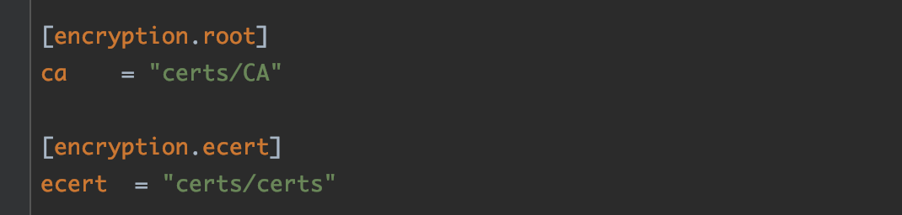
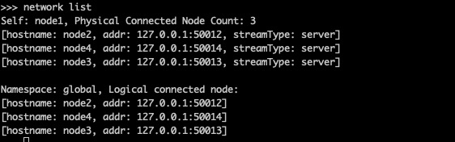
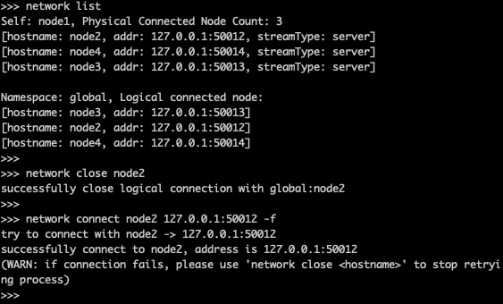
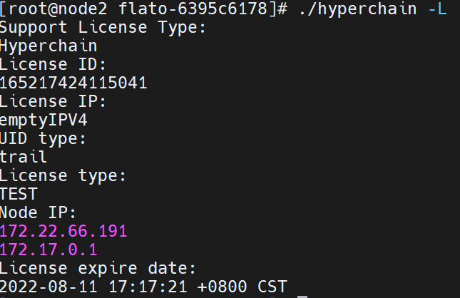
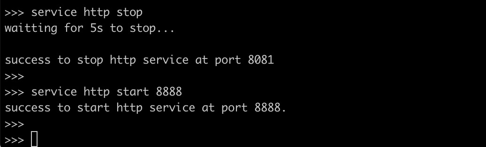
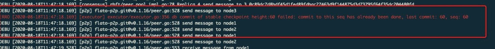

.. _Operations_manual:

运维手册
^^^^^^^^^^^

第一章 前言
===========

1.1 版本声明
------------

本文档著作权归趣链科技单独所有，未经趣链科技事先书面许可，任何主体不得以任何形式复制、修改、抄袭、传播全部或部分本文档内容。

1.2 服务声明
------------

本文档意在向客户介绍趣链科技区块链底层平台的运维说明。您所购买的趣链科技的产品、服务的种类、服务标准等应由您与趣链科技之间的商业合同约定，除非双方另有约定，否则，趣链科技对本文档内容不做任何明示或默示的承诺或保证。

第二章 平台部署
===============

参照《v2.7.0 部署文档》

第三章 配置管理
===============

在2.0.8版本及以后的安装包中的配置文件只包含了最精简化的配置， **安装包中的配置文件已经足够满足hyperchain的正常使用** 。若您是第一次使用\ **hyperchain**\ ，且希望更深入地使用\ **hyperchain**\ 时，可以查阅相关功能的使用手册从而知晓配置文件的修改方法；若您以前已经部署过\ **hyperchain**\ ，那么仍可以沿用原先的全量配置文件，只不过需要参考《配置变更》对一些配置上的变化进行确认。

3.1 配置文件说明
----------------

   以下是2.7.0中全量的配置文件，\ **各配置项的含义及默认值请参考附录**\ 。

3.1.1 system.toml
~~~~~~~~~~~~~~~~~

在该配置文件中记录了一些\ **系统级别的、无法动态修改的**\ 配置项，包括输出日志等级、输出日志文件的路径、JSONRPC配置、流量控制参数等：

`system.toml <https://upload.filoop.com/RTD-Hyperchain%2Fsystem.toml>`_

3.1.2 dynamic.toml
~~~~~~~~~~~~~~~~~~

该配置文件包含了一些\ **全局的，可运行时动态修改的配置项：**

`dynamic.toml <https://upload.filoop.com/RTD-Hyperchain%2Fdynamic.toml>`_

3.1.3 ns_dynamic.toml
~~~~~~~~~~~~~~~~~~~~~

该配置文件中记录了\ **namespace级别的可动态修改的配置项**\ ，包括当前节点的启动方式、启动身份、区块链网络节点数目以及每个节点的网络配置信息：

`ns_dynamic.toml <https://upload.filoop.com/RTD-Hyperchain%2Fns_dynamic.toml>`_

3.1.4 ns_static.toml
~~~~~~~~~~~~~~~~~~~~

该配置文件中记录了所有namespace级别的配置项，包括\ **共识算法详细配置、加密证书的配置、数据库相关配置、日志等级配置**\ 等等，这些配置都是\ **无法在运行中修改**\ 的，各个配置项的释义在注释以及文末的附录中给出：

3.1.5 ns_genesis.toml
~~~~~~~~~~~~~~~~~~~~~

该配置文件中记录了所有创世状态相关的配置项，包括\ **ca模式、创世root
ca、创世账户配置、创世节点配置**\ 等等，这些配置都是\ **无法在运行中修改**\ 的，各个配置项的释义在注释以及文末的附录中给出：

3.2 节点流控配置（投产推荐）
----------------------------

节点流控主要分为节点所在服务器的流控配置以及平台级别的流控配置。

**3.2.1 服务器流控配置**
~~~~~~~~~~~~~~~~~~~~~~~~

一般来说，由于平台的tps比较稳定，流量根据tps也处于稳定状态，但是例如节点宕机落后和新增节点等特殊情况下的recovery行为会向其他节点拉取区块，为了避免公网共享带宽环境下不影响其他应用程序的带宽占用情况，可根据需要限制节点带宽。推荐以下三种服务器流控方法：

**3.2.1.1 网络中心统一调控**

可由各机构的网络中心进行调控配置，由于各家机构策略不一，不做详述，可咨询各家机构的网络运维工作人员。

**3.2.1.2 TC（Traffic Control）服务器端限流配置**

对于应用服务器来说，报文分组从输入网卡（入口）接收进来，经过路由的查找，以确定是发给本机的，还是需要转发的，如果是转发的，则会从输出网卡（出口）发出，网络流量的控制通常发生在输出网卡处。一般说来，由于我们无法控制自己网络之外的设备，入口处的流量控制相对较难，因此我们这里处理的流量控制一般指出口处的流量控制。

tc.sh配置文件详解：

.. code:: javascript

   tc qdisc del dev eth0 root 2> /dev/null > /dev/null
   # 删除原有的tc规则
   tc qdisc add dev eth0 root handle 1: htb
   # 为网卡eth0创建htb根队列
   tc class add dev  eth0 parent 1: classid 1:1 htb rate  100mbit ceil 100mbit
   # 为根队列创建子队列1:1分配带宽100M
   tc class add dev  eth0 parent 1:1 classid 1:10 htb rate  10mbit ceil 10mbit
   # 为1:1队列创建子队列1:10分配带宽10M
   tc qdisc add dev  eth0 parent 1:10 sfq perturb 10
   # 防止一个段内的ip占用整个宽带
   tc filter add dev eth0 protocol ip parent 1: prio 1 u32 match ip dst 10.200.0.0/16 flowid 1:1
   # 为跟队列添加优先级为1的过滤器使得发往10.200.xxx.xxx的包转到1:1队列
   tc filter add dev eth0 protocol ip parent 1: prio 2 u32 match ip dst 0.0.0.0/0  flowid 1:10
   # 为跟队列添加优先级为2过滤器使得发往所有ip的包都转到1:10队列

需要注意的是，tc.sh的相关命令都需要root权限。

**3.2.1.3 Nginx转发限流配置**

由于各家机构对节点服务器带宽要求不尽相同，可能需要nginx做统一的转发限流。我们目前提供nginx安装包及三个脚本：start.sh、stop.sh、reload.sh，可通过这三个脚本满足基本nginx配置需求。

假设A机构需要使用nginx做限流转发的话则为如下情况：

.. code:: bash

   机构A(hyperchain-1):
   node1:172.16.0.1(内),port:50011
   node2:172.16.0.2(内),port:50011
   nginx:172.16.0.3(内),115.200.10.1(外)
   机构B(hyperchain-2):
   node3:10.200.10.1(内),118.180.10.1(外),port:50011
   node4:10.200.10.2(内),118.180.10.2(外),port:50011

则可编辑nginx/conf/nginx.conf如下：

.. code:: yaml

   stream {
       server {
           #node1
           listen               10001;
           proxy_pass           172.16.0.1:50011;
       }
       server {
           #node1-node3
           listen               10002;
           proxy_pass           118.180.10.1:50011;
           proxy_upload_rate    500k;
       }
       server {
           #node1-node4
           listen               10003;
           proxy_pass           118.180.10.2:50011;
           proxy_upload_rate    500k;
       }
      server {
           #node2
           listen               10004;
           proxy_pass           172.16.0.2:50011;
       }
       server {
           #node2-node3
           listen               10005;
           proxy_pass           118.180.10.1:50011;
           proxy_upload_rate    500k;
       }
       server {
           #node2-node4
           listen               10006;
           proxy_pass           118.180.10.2:50011;
           proxy_upload_rate    500k;
       }
   }

需要注意的是，如果通过nginx节点间已经建立好长连接，这时如果修改poxy_upload_rate将不能通过reload.sh生效。所以，务必配置好nginx启动后，再启动hyperchain平台。

3.2.2 平台流控配置
~~~~~~~~~~~~~~~~~~

平台级别的流控主要有外部请求限流和平台带宽限流两部分，前者表示该节点可处理的来自客户端的突发的最大HTTP请求数，限制的是来自客户端的压力，一定程度上可防止系统遭受DDoS攻击。后者表示节点间通信的网络出口带宽限流，与《3.2.1
服务器流控配置》一样可以实现网络出口带宽限流，但区别在于，本节所述的网络出口带宽限流会根据配置文件里配的最大网络带宽来计算hyperchain协议消息最大大小，从而达到带宽限流目的。

**3.2.2.1 外部请求限流**

外部请求限流表示节点可处理的突发HTTP请求数是多少，该配置项可在配置文件\ ``configuration/<分区名>/ns_static.toml``\ 中进行配置：

.. code:: yaml

   [rpc.qps.flowCtrl]
   enable   = true # 是否开启外部请求限流
   capacity = 100  # 令牌桶容量
   limit    = 2000 # 稳定状态下节点的最大qps限制

说明：\ ``rpc.qps.flowCtrl.limit``
代表节点稳定状态下的最大qps，如上文配置，2000即表示令牌桶每0.5ms恢复一个令牌。\ ``rpc.qps.flowCtrl.capacity``
代表令牌桶容量，capacity+limit
可以认为是节点允许的突发流量最大值。如前文配置，在该配置下，节点同一时间内可处理的突发HTTP请求数为
2000 + 100 = 2100。一般来说，设置节点最大突发流量数只需要配置
``rpc.qps.flowCtrl.limit``\ 即可。

**3.2.2.2 节点带宽限流**

节点带宽限流限制的是节点出口带宽的最大大小，该配置项可在配置文件
``configuration/system.toml``\ 中进行配置，该配置默认关闭。需要说明的是，节点实际出口带宽与交易大小和并发处理交易数（TPS）有强关联，开启该配置可能导致当节点实际出口带宽值超过配置设置的最大出口带宽时容易进入viewchange状态拒收新交易，但节点最终总能恢复到正常状态并接受处理新交易：

.. code:: yaml

   [flow.control.bandwidth]
   enable            = false
   outgoingBandwidth = "500Mb" # NOTE: The unit is Mb/s NOT MB/s

3.3 性能相关配置
----------------

下文列出了影响系统性能的若干配置项，若您期望达到最佳性能效果或遇到性能下降的情况，请参考以下配置说明：

3.3.1 共识模块
~~~~~~~~~~~~~~

配置所在文件：ns_dynamic.toml

``consensus.set.set_size``

节点单次广播的交易数量，默认值为25，建议区间【10,500】，极端情况set_size=1时,
性能下降20%左右。

``consensus.set.batch_size``

主节点单次打包的交易数量上限，默认值为500，建议区间【250,8000】，且宜大不宜小，极端情况batch_size=[1-16]时，性能下降95%左右。

``consensus.rbft.k``

RBFT共识算法的checkpoint间隔（以区块为单位），默认值为10，建议区间【8,32】。

**在不同场景下的最佳性能配置：**

-  在普通转账场景下，当batch_size=【6000,8000】，set_size=【200,500】，可获得最佳性能，该配置比默认配置下的最高TPS提升10%左右；

-  在合约存证场景下，当batch_size=【200,300】，set_size=【32,64】，可获得最佳性能，该配置比默认配置下的最高TPS提升10%左右。

3.3.2 网络模块
~~~~~~~~~~~~~~

配置所在文件：system.toml

``flow.control.bandwidth``

限制带宽上限，flow.control.bandwidth.enable
默认为false，flow.control.bandwidth.outgoingBandwidth
默认值为500Mb/s。如果实际所需带宽小于outgoingBandwidthh配置，则性能无影响；如果实际所需带宽大于outgoingBandwidth配置，实际TPS等于outgoingBandwidth配置值除以实际所需带宽
，再乘以理论TPS。因此\ ``flow.control.bandwidth``\ 需要根据实际所需带宽进行配置。

3.3.3 执行与存储模块
~~~~~~~~~~~~~~~~~~~~

配置所在文件：ns_static.toml

``database.indexdb.layer1.enable``

是否开启索引数据库，默认关闭。对于普通转账/extra存证场景，开启索引数据库后是否对系统性能产生影响，由磁盘性能决定，ssd几乎不会有性能影响，本地独享hdd会有30%左右的性能下降，共享存储hdd可能会有80%的性能下降；对于合约存证场景，由于实际业务场景的TPS都在1000以内，到不了磁盘瓶颈，故暂无影响。

``duplicate.tx_drift_time``

SDK端和平台端服务器之间的时间差值，用以保证平台对交易是否过期判断的准确性，默认值为5min。在默认配置进行持续时间为5分钟的压测，性能会下降20%左右，所以如果要进行短时间高TPS压测，务必同步服务器时间，并将tx_drift_time改为1s~5s。注意，不能设0s，因为即使同步了时间，服务器间始终会有时差，导致交易拒收。

``sync.fetcher.sync_journal_receipt``

拉取区块时，是否同时间拉取journal和receipt。对于NFT等存在一笔交易修改大量账本数据的场景，该值可以选择配置为false。否则会导致一个区块的相关数据过大，从而触发网络层的带宽流控等限制。

``sync.fetcher.batch_block_num``

一次拉取多少个数据分片，该配置适用于拉取任何数据的过程，可以根据区块、journal和receipt的大小，决定该值。

``sync.fetcher.task.timeout``

一个拉取任务的超时时间，对于网络环境较差的情况，可以适当的调大这个参数。

``sync.fetcher.task.limit``

内存中可以同时存在的未完成的任务数量，数据拉取方可以根据自身的内存大小，选择配置该值。

``sync.provider.available_mem``

sync
chain过程中，提供方允许一起提供的数据的最大内存限制，如果有大区块或者大的journal的场景，提供方需要修改该配置为一个合理的值。

``multicache底层的leveldb配置``

每一个multicache数据库底层都有一个leveldb相关的配置，这个配置需要根据具体的数据情况，进行leveldb的性能调优。

第四章 节点管理
===============

请查阅 权限管理目录下的《节点增删管理》

第五章 证书管理
===============

5.1 证书体系
------------

5.1.1 证书体系介绍
~~~~~~~~~~~~~~~~~~

按照PKI系统的规范，证书按照在证书链中的位置，可以被分为最终实体证书、中间证书、根证书（我们简称为rootCA）三种。中间证书和根证书都可以签发证书，而最终实体证书不能继续签发证书。在证书链中，相邻的两个证书是签发和被签发的关系，因此可以相对地称二者为父证书和子证书。验证子证书的有效性时需要用到对应的父证书。

验证一个子证书的有效性可以粗略的认为分成以下步骤：\ **验证证书内容、验证证书签名、查询是否被吊销**\ 。验证证书签名是一个验签的过程，\ **hyperchain**\ 使用父证书的公钥验证该证书的签名是否有效，查询是否被吊销则是通过查询吊销列表（一个黑名单）完成。我们更需要重点强调的是对证书内容的验证。该验证证书内容的步骤中，\ **hyperchain**\ 除了验证基本的过期时间、签发结构和被签发主体的身份等内容，还会验证和区块链有关的相应信息，这属于\ **hyperchain**\ 对证书的特有要求：

1. **证书用途**\ 。证书中会有相应字段规定证书的用处，根据证书的功能可划分为节点证书和SDK证书。顾名思义，节点证书配置在节点上用于节点身份的验证，而SDK证书(**sdkcert**)则配置在平台SDK上以确定SDK合法身份。节点证书包括：\ **ecert**\ 和\ **rcert**\ ，其中VP节点将配置ecert，而NVP节点和LP节点则配置rcert。

2. **该证书所属节点的hostname**\ 。证书是和节点绑定的，因为证书中写入了hostname的信息，因此node1的证书拷贝到node2是不能正常工作的。

证书能够被验证通过有个关键的前提条件，即节点能获取到其父证书并且承认该父证书的有效性。如果不能获取到父证书，那么内容验证或者签名验证都无从说起。

部署和运维人员应该在相应的目录中放置必需的CA证书，在\ **hyperchain**\ 中我们称该目录为\ **可信CA列表**\ ，也就是说部署人员应该将所有认可的、有效的、必需的CA证书加入到可信CA列表中。启动后，当有外来证书需要被验证时，\ **hyperchain**\ 会从可信CA列表中搜索证书并尝试构建证书链，如果构建成功则能够进一步完成上述的三部验证，否则验证失败。可信CA列表的路径配置在ns_static.toml的encryption.root.ca中。

|image1|

encryption.ecert.ecert配置了节点的证书目录。

需要注意的是，在使用证书功能时需要配置文件ns_genesis.toml配置的ca模式为中心化ca（非分布式ca）Center或分布式ca
Distributed。

5.1.2 概念及用途
~~~~~~~~~~~~~~~~

**1 namespace级别**

每个节点都有配置命名空间，不同的命名空间之间是物理隔离的，但可以处于同一个区块链网络内。所有在一个命名空间中的节点都处于同一条业务链上，不同的命名空间处于不同的业务链上，就比如不同的数据库一样。以下介绍namespace级别的相关证书，它们主要实现节点的准入控制并放置在cert目录下：

-  ROOTCA（节点根目录/namespaces/global/certs/CA）根部证书，用于节点证书的分发

ROOTCA参与以下几类具体节点证书的生成、验证及吊销，是所有证书的根证书。区块链中可能存在多个ROOTCA，一个ROOTCA只能验证由自己颁发的证书的合法性。

-  ECERT（节点根目录/namespaces/global/certs/certs）
   节点准入证书，用于证明该节点为VP节点，可参与共识验证

-  RCERT（节点根目录/namespaces/global/certs/certs）
   节点角色证书，用于证明该节点为NVP节点和LP节点，不参与共识验证，仅参与记账

持有ECERT或RCERT的节点和SDK才能访问区块链网络。运行中的节点会定期检查其他节点的证书合法性。

-  SDKCERT（sdk目录/certs，不同sdk会有不同）
   客户端准入证书，用于证明SDK的合法性

非法的SDK将无法向节点发出请求。

**2 链级别**

除上述证书外，\ **hyperchain**\ 还设置了跨namespace的节点级证书，主要用于节点间ssl通信，放置在tls目录下。

-  TLSCA（certs/tls） 安全传输层协议CA证书，用于TLSCERT的分发

-  TLSCERT（certs/tls）节点安全传输层协议证书，用于传输层

在传输网络传输过程中需要验证传输层安全协议证书的安全性，验证通过即可以进行正常网络通信，反之则无法进行网络通信。

5.2 certgen使用说明
-------------------

certgen作为\ **hyperchain**\ 证书管理的配套工具，用来生成和管理相关的CA证书和数字证书。certgen主要包括证书签发，公私钥生成，证书检查等功能。

5.2.1 下载
~~~~~~~~~~

可以通过OA系统或者飞洛下载

目前提供多种操作系统版本下载

|image2|

安装包解压后包含certgen二进制文件、README.md文档、依赖库tools和两个脚本文件。两个脚本分别为install.sh和gencert.sh。前者可以完成安装功能，后者可以快速生成证书套件。

5.2.2 生成证书
~~~~~~~~~~~~~~

**1** **根证书签发**

签发根证书(自签证书)，命令如下：

.. code:: javascript

   $ certgen gs --cn=CommonName --org=Org ./root.ca ./root.priv

运行上述命令，会在指定路径生成root.ca、root.priv两个文件，即根证书文件。需要通过\ ``--cn``
指定根证书的name，\ ``--org`` 指定根证书的组织。

默认情况下生成的是secp156k1曲线的证书，可以通过\ ``--c``
flag来指定曲线类型，可选的类型有p256、secp256k1、sm2这三种。p256又可以叫做secp256r1等，但在该flag中统一使用p256代表这类椭圆曲线。另外\ ``--from``\ 和\ ``--to``\ flag用于指定证书的有效期限。下同。

例如签发国密根证书（自签），命令如下：

.. code:: javascript

   $ certgen gs --c=sm2 --cn=CommonName --o=Org ./root_gm.ca ./root_gm.priv

运行上述命令，在指定路径产生root_gm.ca、root_gm.priv两个文件，即国密根证书和对应私钥。

**2 子证书签发（子密钥不存在）**

**hyperchain**\ 平台使用的子证书根据用途不同分为两种类型，分别是ECert和SDKCert。通过\ ``-ct``
可以指定子证书的类型为上述两种之一（类型名称不区分大小写）。子证书也可以不拥有类型，只需要不指定\ ``-ct``
即可。

ECERT：

.. code:: text

   $ certgen gc --cn=node --o=hyperchain --isca=y --ct=ecert root.ca root.priv node.cert node.priv

需要通过\ ``--cn`` 指定子证书的name，\ ``--o``
指定子证书的组织，\ ``--isca=y`` 表示是ca证书。

第一个参数为根证书存储路径，第二个参数为根证书的私钥存储路径，第三个参数为节点的证书存储路径，第四个参数为节点的私钥存储路径。

SDKCERT：

.. code:: text

   $ certgen gc --cn=node --org=hyperchain --isCA=n --ct=sdkcert root.ca root.priv node.cert node.priv

需要通过\ ``--n`` 指定子证书的name，\ ``--org``
指定子证书的组织，\ ``--isca=n`` 表示是非ca证书。

同时可以使用 ``--c`` flag来指定椭圆曲线，\ ``--c`` 可选的曲线类型有
p256、secp256k1、sm2共三种。

   注意：国密子证书只能由国密父证书生成，密钥是p256或者secp256k1的父证书，可以生成secp256k1或者p256类型的子证书。同样适用于下面的子证书签发命令（gc）。

**2 生成公私钥对**

生成一对公私钥，该指令需两个参数:

.. code:: text

   $ certgen gk ./key.priv ./key.pub

第一个参数表示要生成的密钥对的私钥存储路径，第二个参数表示要生成的密钥对的公钥存储路径。

使用flag ``--c`` 可以指定生成公私钥对的用到的椭圆曲线类型。

3*\* 子证书签发(子密钥已存在)*\*

此方式需要各个节点的公钥，通过公钥生成子证书时不需要特别指明曲线类型。

**hyperchain**\ 平台使用的子证书根据用途不同分为两种类型，分别是ECert和SDKCert。通过\ ``-t``
可以指定子证书的类型为上述两种之一（类型名称不区分大小写）。子证书也可以不拥有类型，只需要不指定\ ``-t``
即可。

ECERT：

.. code:: text

   $ certgen gc --cn=node --org=hyperchain --isca=y --ct=ecert root.ca root.priv key.pub node.cert

需要通过\ ``--cn`` 指定子证书的name，\ ``--org``
指定子证书的组织，\ ``--isca=y`` 表示是ca证书。

第一个参数为根证书存储路径，第二个参数为根证书的私钥存储路径，第三个参数为节点的公钥存储路径，第四个参数为节点的证书存储路径。

使用\ ``--from``\ 和\ ``--to``\ 指定子证书的有效期。

SDKCERT：

.. code:: text

   $ certgen gc --cn=node --org=hyperchain --isca=n --ct=sdkcert root.ca root.priv key.pub node.cert

需要通过\ ``--cn`` 指定子证书的name，\ ``--org``
指定子证书的组织，\ ``--isca=n`` 表示是非ca证书。

**3 Tls证书签发**

生成根CA:

.. code:: text

   $ certgen gs --c sm2 --from 2020-12-4 --to 2030-12-4 ./tls_root.ca ./tls_root.priv --cn hyperchain

需要通过\ ``--cn``\ 指定根证书的name，\ ``--org``\ 指定根证书所属的组织。

通过\ ``--c``\ 指定该自签名证书的曲线类型，\ ``--from``\ 和\ ``--to``\ 指定了证书的有效日期和时间。

生成tls证书:

.. code:: text

    $ certgen gc --isca=n --from 2020-12-04 --to 2030-12-04 --c sm2  ./tls_root.ca ./tls_root.priv ./tls_peer1.cert  --cn hyperchain

通过\ ``--isca=n``\ 表示该tls子证书为非ca证书，\ ``--cn``\ 指定该证书的name，\ ``--org``\ 指定该子证书所属的组织。

通过\ ``--c``\ 指定该tls证书的曲线类型，\ ``--from``\ 和\ ``--to``\ 指定了证书的有效日期和时间。

5.2.3 检查证书
~~~~~~~~~~~~~~

检查子证书是否由该CA证书签发：

.. code:: javascript

   $ certgen cc ./root ./sub
   root cert path: pathToCA
   sub cert path: pathToCert

5.2.4生成IDCert（账户证书）
~~~~~~~~~~~~~~~~~~~~~~~~~~~

使用gc命令可以签发账户证书。其中账户证书中绑定的地址需要通过–cn指定

.. code:: text

   certgen gc ./root.ca ./root.priv   ./idcert.cert \
   --cn "ffffffffff04dd69707ba4aa9d350a59d1aaaaa1" \
   --to "2221-10-30" --ct idcert

通过上述命令产生./idcert.cert文件，该文件为pen编码的x509格式，其中不包含私钥信息，不能直接用于在SDK中新建账户。通过openssl的pkcs12命令可以将格式转换为需要的pfx格式。需要两个输入为证书和私钥。

.. code:: text

   openssl pkcs12 -export \
   -out certificate.pfx -inkey subcert.priv -in idcert.cert

注意，pfx是有加密保护的格式，因此在生成pfx证书时需要输入密码。此后SDK调用NewAccount时需要传入此密码。

5.3 CA证书签发管理方案
----------------------

5.3.\ **1 CA生成及保管（certgen）**
~~~~~~~~~~~~~~~~~~~~~~~~~~~~~~~~~~~

-  **非分布式CA**

该模式下仅需要维护一套CA和对应的证书。

.. code:: text

   # 签发ROOTCA
   $ certgen gs --cn=node --org=hyperchain -isca=y root.ca root.priv

-  **分布式CA**

该模式下可维护任意多套CA、Cert、私钥。所以需要为每个CA签发ROOTCA。

5.\ **3.2 节点cert签发（certgen）**
~~~~~~~~~~~~~~~~~~~~~~~~~~~~~~~~~~~

-  **非分布式CA**

创世的四个VP节点需要使用以上CA通过certgen的如下命令生成各自节点的一套证书：

.. code:: text

   # 签发ECert:
   $ certgen gc --cn=node --org=hyperchain --isca=n --ct=ecert
    ./root.ca ./ root.priv ./ecert.cert ./ecert.priv
   # 签发SDKCert:
   $ certgen gc --cn=node --org=hyperchain --isca=n --ct=sdkcert
    ./root.ca ./root.priv ./sdkcert.cert ./sdkcert.priv

需要通过\ ``--cn`` 指定子证书的name，\ ``--org``
指定子证书的组织，\ ``--isca`` 表示是否是ca证书。同时可以使用 ``--c``
flag来指定椭圆曲线。

新增证书签发命令：(根据自定义公钥进行子证书签发)

.. code:: text

   #签发ECert:
   $ certgen gc --cn=node --org=hyperchain --isca=n --ct=ecert ./parent.cert ./parent.priv ./subcert.pub ./subcert.cert
   #签发SDKCert:
   $ certgen gc --cn=node --org=hyperchain --isca=n --ct=sdkcert ./parent.cert ./parent.priv ./subcert.pub ./subcert.cert

注：subcert.pub必须事前生成。

-  **分布式CA**

对分布式CA来说，每个CA都需要向节点颁发证书。

假设有四个节点为node1、node2、node3、node4,
那么node1的certs目录应当含有一个私钥和node2、node3、node4为其颁发证书，证书中的信息为node1节点的信息。node2给node1颁发证书，意为root2.ca对node1的公钥进行签发的证书。

这里假设为node1生成由node2颁发的证书：

.. code:: text

   # 签发ecert
   $ certgen gc --cn=subcert --org=hyperchain -isca=n --ct=ecert ./parent.cert ./parent.priv ./subcert.pub ./subcert.cert

那么此时\ ``--cn``
需要指定为node1的CommonName，第一个参数为node2的根证书，第二个参数为node2的私钥存储路径，第三个参数为node1的公钥存储路径，第四个参数为node2给node1颁发的证书存储路径。

分布式CA下，需要生成的相应子证书如下：

node1需要为node2、node3、node4颁发子证书；

node2需要为node1、node3、node4颁发子证书；

node3需要为node1、node2、node4颁发子证书；

node4需要为node1、node2、node3颁发子证书。

生成sdkcert:

.. code:: text

   #签发SDKCert:
   $ certgen gc --n=node --org=hyperchain --isca=n -ct=sdkcert ./parent.cert ./parent.priv ./subcert.pub ./subcert.cert

注：subcert.pub必须事前生成。

5.3.3 VP节点的cert文件配置
~~~~~~~~~~~~~~~~~~~~~~~~~~

**非分布式CA**

非分布式CA即原有的中心化CA，在该模式下仅需要维护一套CA和对应的证书。采用的策略是启动时从配置项读入，内存维护相应证书和CA，没有运行中持久化的需要。对于一个VP节点主要包括两个子目录：CA、certs。

-  CA目录：保存CA证书和CA私钥（root.ca和root.priv）。所有节点的CA目录下内容应该完全一致，使用同一个CA进行认证

-  certs目录：保存由节点保存CA所颁发的一套证书，至少包含三个文件，节点私钥（key.priv）、节点ECERT证书（node1.cert）、节点SDKCERT（sdkcert.cert）

-  tls目录：保存安全传输层协议证书，包含tlsCA（tlsca.ca、tlsca.priv）及其生成的tls子证书（tls_peer.cert、tls_peer.priv）

|image3|

**分布式CA**

分布式CA可维护任意多套CA、Cert、私钥。与非分布式的目录结构相同，包括CA目录和certs目录。根据节点为\ **hyperchain**\ 启动节点和后续加入节点两种类型，证书的配置有所区别：

-  启动节点

在规范化部署的四节点启动时，节点1的目录内容如下所示（其余三个节点配置类似）：

::

   - CA目录：保存CA证书和CA私钥。四个节点的CA目录下内容应该完全一致。其中root1为node1的CA，root2为node2的CA，root3为node3的CA，root4为node4的CA。

   - certs目录：保存节点私钥（key.priv）、由其他节点CA所颁发的一套证书。至少包含三个文件，node2节点CA（root2）颁发给node1的ECERT证书（node2.cert）、node3节点CA（root3）颁发给node1的ECERT证书（node3.cert）、node4节点CA（root4）颁发给node1的ECERT证书（node4.cert）。

|image4|

-  新加入节点

如果有新节点要加入\ **hyperchain**\ ，无需再配置证书，但需要保证节点目录下有CA和certs目录（空目录）。

5.3.4 ns_static.toml文件相关配置
~~~~~~~~~~~~~~~~~~~~~~~~~~~~~~~~

**证书目录配置项**

-  [encryption.root]配置项，修改为 ``ca = "certs/CA"``

-  [encryption.ecert]配置项，修改为 ``ecert = "certs/certs"``

5.3.5 sdk文件相关配置
~~~~~~~~~~~~~~~~~~~~~

在GOSDK中：

gosdk/conf/hpc.toml文件配置

如需使用sdkcert进行交互验证：
``sendTcert = true``\ ，否则置为\ ``false``

同时将配置项privacy.sdkcertPath和privacy.sdkcertPrivPath配置指向SDK证书和私钥文件即可，如下：

.. code:: text

   sdkcertPath = "certs/sdkcert.cert"
   sdkcertPrivPath = "certs/sdkcert.priv"

在LiteSDK中：

liteSDK没有配置文件，配置项目都通过参数传入。当使用SDKcert功能时，需要读入证书和私钥文件并将内容传入相应方法。具体内容可以参考LiteSDK使用手册。

第六章 IPC命令
==============

在hyperchain
的运行目录下，有一个\ ``hpc_1.ipc``\ （取决于配置文件中的配置）文件。使用如下命令进入交互式命令模式：

.. code:: javascript

   ./hyperchain -s --ipc=hpc_1.ipc

将会进入交互式命令行模式。关于IPC命令使用说明可以详见help。本章将主要介绍IPC命令常用的几个命令。

6.1 网络连接管理
----------------

你可以使用\ ``network``\ IPC命令进行物理网络连接的管理。详细使用可参考\ **IPC使用手册**\ 。

6.1.1 列出连接主机
~~~~~~~~~~~~~~~~~~

可以查询得到当前节点的主机名（Self），已连接节点数（Connected Node
Count），以及对应的连接的各个节点的主机名和相应网络地址。

|image5|

6.1.2 更新连接主机IP
~~~~~~~~~~~~~~~~~~~~

当节点配置文件里配错了对端节点的IP地址，可以在本地节点不停机重启的情况下通过IPC命令更新所要连的节点IP。步骤主要分为两步，首先，通过
close 子命令断开连接，然后，再通过 connect 子命令指定新IP进行连接。

network close ：关闭到某个节点的连接。

network connect -f：向某个指定节点建立连接。

|image6|

6.1.3 检测通信延迟
~~~~~~~~~~~~~~~~~~

network ping ：测试本地节点到某个已经建立网络连接的对端节点的通信延迟。

|image7|

network ping -a
：测试某个开启gRPC服务的ip:port，是否可通，这里的延迟时间等于建立一次gRPC连接以及一次RPC调用的时间。

|image8|

6.2 日志级别修改
----------------

ipc命令也支持日志级别修改，修改的日志级别立即生效：

logger setlevel ：修改namespace级别模块的日志级别

|image9|

logger setlevel system ：修改系统级别模块的日志级别

|image10|

6.3 LICENSE信息查询
---------------------

使用 `./hyperchain -L`

|image11|

6.4 对外服务管理
----------------

通过ipc命令可以启动、关闭或者重启hyperchain的对外HTTP
JSON-RPC服务，比较实用的一个功能是在节点不重启的情况下，通过\ ``service``\ 命令修改该服务监听的端口号。

启动JSON-RPC服务：service http start

关闭JSON-RPC服务：service http stop

重启JSON-RPC服务：service http restart

|image12|

6.5 非交互式命令
----------------

上述命令也支持非交互方式进行，请使用如下命令进行：

.. code:: javascript

   ./hyperchain -s --ipc=hpc_1.ipc --nit --cmd="network list"

第七章 日志说明
===============

7.1 日志配置
------------

Hyperchain日志主要分为系统日志和NS（NameSpace）日志，这两者相互独立，互不影响。

-  系统日志：相关配置位于\ ``configuration/dynamic.toml``\ 文件中，主要包括系统级别的main、metrics、jsonrpc、nsmgr、audit、txgen、hypernet、config等模块；

-  NS日志：相关配置位于\ ``configuration/<分区名>/ns_dynamic.toml``\ 文件中，主要包括每个namespace下的config、p2p、consensus、db、execmgr、eventhub等模块。

系统日志和NS日志的配置内容相同，位于各自配置文件的\ ``[log]``\ 和\ ``[log.module]``\ 配置项中。其中\ ``[log]``\ 是日志通用配置，\ ``[log.module]``\ 配置各模块的日志级别。

通用的动态日志配置项如下：

-  ``dump_interval``\ ：日志文件生成时间间隔，避免单个日志文件过大，默认为24h；

-  ``max_log_size``\ ：日志文件的最大大小，默认为200MB；

通用的静态日志配置项如下（一般不需要用户去修改）：

-  ``dump_file``\ ：是否输出日志文件，推荐开启，默认为true；

-  ``log_dir``\ ：日志文件输出的目标目录路径；

-  ``log_level``\ ：默认的日志级别，可被module下的模块设置覆盖，目前主要包括\ ``DEBUG``\ 、\ ``INFO``\ 、\ ``NOTICE``\ 、\ ``WARNING``\ 、\ ``ERROR``\ 、\ ``CRITICAL``

-  ``check_size_interval``\ ：检查系统级别日志文件大小的时间间隔

NS日志和系统日志静态配置分别位于\ ``configuration/<分区名>/ns_static.toml``\ 和\ ``configuration/dynamic.toml``\ 示例如下：

.. code:: text

   [log]
   dump_file           = true # dump the log file or not
   log_dir             = "data/logs"
   log_level           = "NOTICE" # default loglevel for all modules which can be override by module level log setting
   file_format         = "2006-01-02T15:04:05.000"
   console_format      = "2006-01-02T15:04:05.000"
   check_size_interval = "2m"

NS日志动态配置\ ``configuration/<分区名>/ns_dynamic.toml``\ 示例如下：

.. code:: text

   [log]
   dump_interval       = "24h"  # Valid time units are "ns", "us" (or "µs"), "ms", "s", "m", "h". such as "300ms", "2h45m".
   max_log_size        = "200mb"  # "mb", "kb"

   [log.module] #set log level by module
   config      = "WARNING"
   p2p         = "NOTICE"
   consensus   = "INFO"
   db          = "NOTICE"
   eventhub    = "NOTICE"
   execmgr     = "NOTICE"
   syncmgr     = "NOTICE"
   filemgr     = "NOTICE"
   mq          = "INFO"
   node        = "NOTICE"
   api         = "NOTICE"
   hvm         = "NOTICE"
   logger      = "NOTICE"
   identitymanager = "NOTICE"
   peermonitor = "NOTICE"
   namespace   = "NOTICE"
   bloom 		= "NOTICE"
   txgen		= "NOTICE"
   cmc         = "NOTICE"

系统日志动态配置\ ``configuration/dynamic.toml``\ 示例如下：

.. code:: text

   [log]
   dump_interval       = "24h"  # Valid time units are "ns", "us" (or "µs"), "ms", "s", "m", "h". such as "300ms", "2h45m".
   max_log_size        = "200mb"  # "mb", "kb"

   [log.module] #set log level by module
   main     = "NOTICE"
   metrics  = "NOTICE"
   jsonrpc  = "NOTICE"
   nsmgr    = "NOTICE"
   audit    = "NOTICE"
   hypernet = "NOTICE"
   config   = "WARNING"
   logger   = "NOTICE"
   cvp      = "NOTICE"
   grpcapi  = "NOTICE"
   peermonitor = "NOTICE"
   cm          = "NOTICE"

7.2 日志格式
------------

hyperchain的所有模块都制定了统一的日志格式，方便用户通过日志查看系统状态。

日志记录格式如下：

.. code:: bash

   #日志格式
   log_level [time] [module_name] file_name:line_number content

   #日志示例
   NOTI [2020-08-21T16:18:03.824] [consensus] flato-rbft.git@v0.2.8/exec.go:183 ======== Replica 4 finished recovery, view=1/height=0.

各字段含义如下：

-  ``log_level``:
   日志级别，目前主要包括\ ``DEBUG``\ 、\ ``INFO``\ 、\ ``NOTICE``\ 、\ ``WARNING``\ 、\ ``ERROR``\ 、\ ``CRITICAL``\ ，其中在发生极严重错误时会输出\ ``CRITICAL``

-  ``time``: 日志输出时间，精确到毫秒

-  ``module_name``\ ：模块名称，如共识模块为\ ``consensus``\ 、网络模块为\ ``P2P``\ （逻辑连接层）和\ ``hypernet``\ （物理连接层）

-  ``file_name``\ ：文件名称

-  ``line_number``\ ：所在行数

-  ``content``\ ：日志记录内容

7.3 常见日志说明
----------------

7.3.1 Hyperchain版本号
~~~~~~~~~~~~~~~~~~~~~~

Hyperchain节点启动时，系统级别日志里会打印出当前运行二进制的版本号信息：

.. code:: text

   NOTI [2022-06-22T17:11:27.889] [main] go-hyperchain/hpc.go:117 Hyperchain Version:
   release-2.7.0-20220622-a8054147b-v2.7.0-7

该日志表示当前Hyperchain的版本是release-2.7.0版本，打包二进制时间是2022年06月22日，二进制的提交号是a8054147b

7.3.2 License信息
~~~~~~~~~~~~~~~~~

Hyperchain节点启动时，系统级别日志里会打印License过期时间：

.. code:: text

   NOTI [2022-06-22T17:11:27.890] [main] license/license.go:116 Now use license type[Unknown license type]   namespace=system
       ╋=============================================================╋
       ┃                                                             ┃
       ┃                          WELCOME TO                         ┃
       ┃                                                             ┃
       ┃                _    _                                       ┃
       ┃               | |  <_> ___  ___ ._ _  ___ ___               ┃
       ┃               | |_ | |/ | '/ ._>| ' |<_-</ ._>              ┃
       ┃               |___||_|\_|_.\___.|_|_|/__/\___.              ┃
       ┃    license to                                               ┃
       ┃                           趣链科技                          ┃
       ┃                                      exp date 2022-12-31    ┃
       ┃                                                             ┃
       ┃      2016-2022 (c) Hangzhou Qulian Technology Co.,Ltd.      ┃
       ╋=============================================================╋

该日志标志着License检查成功，同时打印出了License的过期时间为2022年12月31日

7.3.3 Hyperchain服务启动日志
~~~~~~~~~~~~~~~~~~~~~~~~~~~~

.. code:: text

   NOTI [2022-06-22T17:38:55.703] [main] go-hyperchain/hpc.go:342 Hyperchain server starting...

该日志标识着Hyperchain服务开始启动

7.3.4 分区启动日志
~~~~~~~~~~~~~~~~~~

hyperchain运行过程中一个节点可能参与到多个分区之中，其中启动一个分区的相关日志如下：

.. code:: text

   NOTI [2022-06-22T17:32:00.924] [namespace] namespace/namespace.go:737 Try to start namespace global

该日志标志着开始启动global分区

.. code:: text

   NOTI [2022-06-22T17:32:07.872] [namespace] namespace/namespace.go:1022 Namespace global start successfully

该日志标志着global分区启动成功

**7.3.5 网络连接成功日志**
~~~~~~~~~~~~~~~~~~~~~~~~~~

namespace级别日志出现以下日志，则表示这两个节点的网络已成功连上，可以开始相互收发网络消息：

.. code:: text

   NOTI [2022-06-22T17:32:12.856] [p2p] flato-p2p@v0.2.27-5/hs_proto.go:135 successful connect to [global] (node2)

该日志标志着global分区成功连接到了hotstname为node2的节点

**7.3.6 共识世代检查日志**
~~~~~~~~~~~~~~~~~~~~~~~~~~

hyperchain共识节点运行过程中，每发生一次节点增删，都会进行一次世代变更（epoch
change），相关日志如下：

.. code:: none

   NOTI [2020-08-26T14:14:16.014] [consensus] flato-rbft.git@v0.2.8/epoch_mgr.go:192 ======== Replica 4 turn into a new epoch, epoch=1/N=4/view=0/height=10.
   NOTI [2020-08-26T14:14:16.014] [consensus] flato-rbft.git@v0.2.8/epoch_mgr.go:194

     +==============================================+
     |                                              |
     |            RBFT Start New Epoch              |
     |                                              |
     +==============================================+

该日志标志着世代切换成功，当前共识节点总数N为4个，世代号epoch为1，视图值view为0，区块高度height为0。

7.3.7 数据恢复成功日志
~~~~~~~~~~~~~~~~~~~~~~

hyperchain共识节点启动或者发生异常后，都会进行数据恢复流程。

.. code:: none

   NOTI [2020-08-26T14:14:16.014] [consensus] flato-rbft.git@v0.2.8/exec.go:183 ======== Replica 4 finished recovery, epoch=1/view=1/height=0.
   NOTI [2020-08-26T14:14:16.014] [consensus] flato-rbft.git@v0.2.8/exec.go:184

     +==============================================+
     |                                              |
     |            RBFT Recovery Finished            |
     |                                              |
     +==============================================+

该日志标志着数据恢复完成，当前世代值为1，视图值view为1，区块高度height为0

7.3.8 区块共识完成日志
~~~~~~~~~~~~~~~~~~~~~~

.. code:: none

   NOTI [2020-08-26T14:14:55.188] [consensus] flato-rbft.git@v0.2.8/rbft_impl.go:1243 ======== Replica 4 Call execute, view=1/seqNo=1/txCount=500/digest=XXX

该日志标志着共识模块完成了1号区块的共识，开始执行1号区块，区块中包含500比交易，区块的摘要为XXX。

7.3.9 区块执行完成日志
~~~~~~~~~~~~~~~~~~~~~~

.. code:: text

   NOTI [2020-08-26T14:14:55.189] [executor] executor/validator.go:191 commit 1

该日志标志着1号区块执行完成

7.3.10 区块提交完成日志
~~~~~~~~~~~~~~~~~~~~~~~

.. code:: text

   NOTI [2020-08-26T14:14:55.195] [executor] executor/commitor.go:255 Block number 1
   NOTI [2020-08-26T14:14:55.195] [executor] executor/commitor.go:256 Block hash b04662998b2c97ea84a1cb8bbc61bc667e3a262065abbe87c1045be76b8296f6

该日志标志着1号区块提交写块完成，并且打印出了1号区块的哈希值

7.3.11 sync chain执行相关日志
~~~~~~~~~~~~~~~~~~~~~~~~~~~~~

开始sync chain：

.. code:: text

   NOTI [2020-08-26T14:14:55.195] [syncmgr] syncmgr/sync_mamanger.go:269 syncMgr receive sync request, target height: XXX, target hash: XXXXXXXX

sync chain成功：

.. code:: text

   NOTI [2020-08-26T14:14:55.195] [syncmgr] syncmgr/state_machine.go:255 sync-chain process success

第八章 异常处理
===============

8.1 网络异常
------------

8.1.1 端口占用
~~~~~~~~~~~~~~

当grpc端口、jsonrpc端口、grpcApi端口任意一个端口被占用时，节点无法启动。

在容器里部署节点1后，其默认的jsonrpc端口8081被宿主机抢占，这时向节点1发送jsonrpc请求，结果在命令行显示Recv
failure：Connection reset by peer的报错

**处理方式：**\ lsof
-i：8081查看端口号占用情况，kill掉占用端口的进程，重启节点

|image13|

8.1.2节点网络异常
~~~~~~~~~~~~~~~~~

集群中节点网络断开或开启防火墙，会导致节点间连接失败，查询节点状态，返回状态为timeout，表明本节点与该节点之间的网络连接断开。

**处理方式**\ ：恢复网络或关闭防火墙后重启该节点。

``注意``\ ：出现该情况有可能是该节点未开放相应端口，请务必确认所有节点之间的网络通信正常，防止因为防火墙等问题导致节点间不能通信。

8.2 共识异常
------------

8.2.1 重启后相同区块高度的节点数不超过规定数目
~~~~~~~~~~~~~~~~~~~~~~~~~~~~~~~~~~~~~~~~~~~~~~

所有节点重新启动后，拥有相同区块高度的节点数不超过算法规定的数值。当N为4，F为1时，该值为3。

.. code:: text

   quorum = int(math.Ceil(float64(N+F+1) / float64(2)))

出现这种情况，即区块链网络中拜占庭节点的数量已经超过了算法容错的数目。

**处理方式**\ ：等待超过quorum个节点正常启动后再发送交易进行共识写块。

8.2.2 Viewchange异常
~~~~~~~~~~~~~~~~~~~~

**报错信息：**\ Replica 2 received viewChange from replica 3

当在所有节点上看到这条消息，且消息都是来自相同的节点例如3号节点时，
说明节点3发生了异常情况触发了ViewChange，无需理会3号节点的行为，当节点ViewChange超时后会自动触发recovery，最终达成一致。

**处理方式**\ ：自动恢复

如果在在所有节点都看到类似消息而且不断出现时

**处理方式**\ ：重启所有节点

8.2.3 Duplicate transaction异常
~~~~~~~~~~~~~~~~~~~~~~~~~~~~~~~

**报错信息：**\ Duplicate transaction in addTxs with hash XXX

如果偶尔出现以上信息，是正常情况，可能是客户端在长时间未收到交易回执后重发交易导致的。

**处理方式**\ ：自动恢复。

8.2.4 system is too busy异常
~~~~~~~~~~~~~~~~~~~~~~~~~~~~

**报错信息：**\ system is too busy

如果在SDK客户端出现这种报错，则说明客户端发送交易的频率过高，导致平台不能及时处理，交易缓存池达到了上限。

**处理方式**\ ：SDK停止发送交易，等待平台处理一段时间后再发送交易。

8.3 数据异常
------------

8.3.1 第一个区块merkle root不一致
~~~~~~~~~~~~~~~~~~~~~~~~~~~~~~~~~

**报错信息：**\ mappedMerkleRoot and calculated root not match

-  首次启动集群，若集群中的节点的genesis账户不一致，则在产生第一个区块时，报错merkle
   root不一致；

-  新增节点到集群中，若新增节点的genesis账户和集群中节点不一致，则新节点同步数据产生第一个区块时，报错merkle
   root不一致；

**处理方式：**\ 保持集群节点间的genesis账户一模一样后，重启节点

8.3.2 数据同步失败
~~~~~~~~~~~~~~~~~~

**报错信息**\ ：syncchain failed

当节点发现自身数据落后时，就会主动向其他节点请求数据，这个过程叫syncchain；syncchain同步过程由于节点网络问题或对方节点处于归档状态，会导致本次syncchain失败，失败后会尝试向其他节点重试，直到syncchain成功。

**处理方式：**\ 自动恢复

8.3.3 同一高度，重复commit
~~~~~~~~~~~~~~~~~~~~~~~~~~

**报错信息：**

|image14|

节点到达checkpoint高度或发生一笔配置交易时，就会自动进行commit操作，但是由于某些外部原因删除共识数据库，并且重启节点，重启后的节点会对最近checkpoint高度或最后一笔配置交易进行commit，就会出现上述报错。

**处理方式：**\ 自动恢复

8.3.4 链上预期高度与已存在的epoch不对应
~~~~~~~~~~~~~~~~~~~~~~~~~~~~~~~~~~~~~~~

**报错信息：**

.. code:: text

   CRIT [2020-08-26T14:14:55.195] [syncmgr] epochmgr/epoch_mamanger.go:172 epochMgr check target[epoch-height: XXX, target block-height: XXX] failed, inform to stop ns...

2.7.0
版本新增拉取epoch的过程，当执行模块发现epoch信息自身携带的区块高度，高于本次sync
chain请求预期的高度时，本次sync
chain请求其实是非法的，这种场景系统无法自动恢复数据，请联系运维人员确认问题情况，采取后续措施。

8.4 句柄值异常
--------------

8.4.1 系统句柄配置过低
~~~~~~~~~~~~~~~~~~~~~~

**报错信息**\ ：to many open files

在节点运行过程中，写数据，特别是进行归档操作时，节点异常，节点日志报错to
many open
files，原因是归档过程中leveldb的句柄打开数量会急剧增多，hyperchain上层限制总的系统文件句柄数不能小于16384。

**处理方式：**\ 修改服务器系统的句柄值，将句柄值改为65535后，重启节点

8.5 配置异常
------------

8.5.1 配置异常
~~~~~~~~~~~~~~

**报错信息：**\ new namespace [global] failed: While parsing config: (2,
25): parsing error: no value can start with h

出现 “While parsing config: (X, X): parsing error….”
日志意味着，namespace级别配置文件的格式存在异常，需要检查一下配置文件的格式，注意不要出现中文字符、双引号要成对出现等。这行日志括号里的阿拉伯数字表示配置文件解析出错的行、列号。

|image15|

8.5.2 lock文件异常
~~~~~~~~~~~~~~~~~~

**报错信息：**\ Please make sure that you have deleted the lock file
before restart Hyperchain.

在节点遇到上述任何异常，包括license过期、配置项异常、句柄值异常等，都会在根目录生成lock文件以防止守护进程启动异常的节点；修复方法为解决异常后，删除lock文件后重启启动节点

|image16|

第九章 产品激活、续期
=====================

9.1 激活
--------

使用Hyperchain需要拥有本产品的激活码。本产品的激活码为名为LICENSE的文件。激活本产品只需将LICENSE文件放置在产品根目录下即可。

9.2 续期
--------

当您购买的Hyperchain产品即将到期时，您可以重新向本公司购买新的激活码，在不停止hyperchain服务的情况下动态替换旧LICENSE文件即可。

9.3 查询
--------

您可以通过\ ``./hyperchain -L``\ 来查看LICENSE文件的过期时间以及IP信息。

联系我们
========

您可以通过以下联系方式联系我们：

联系电话: 0571-89990052

Email: tech_support@hyperchain.cn

我们的工作时间是：9:00 AM to 5:00 PM PST (Monday-Friday, except
Holidays)

**请您在联系我们之前，将以下信息附上：**

================ =========
姓名
================ =========
公司
联系电话
电子邮箱
操作系统及版本号
产品版本号
问题概述
问题描述
================ =========

附录
====

配置项具体含义说明
------------------

- `dynamic.toml配置说明.md <https://upload.filoop.com/RTD-Hyperchain%2Fdynamic.toml%E9%85%8D%E7%BD%AE%E8%AF%B4%E6%98%8E.md>`_

- `ns_dynamic.toml配置说明.md <https://upload.filoop.com/RTD-Hyperchain%2Fns_dynamic.toml%E9%85%8D%E7%BD%AE%E8%AF%B4%E6%98%8E.md>`_

- `ns_dynamic.toml配置说明.md <https://upload.filoop.com/RTD-Hyperchain%2Fns_genesis.toml%E9%85%8D%E7%BD%AE%E8%AF%B4%E6%98%8E.md>`_

- `ns_static.toml配置说明.md <https://upload.filoop.com/RTD-Hyperchain%2Fns_static.toml%E9%85%8D%E7%BD%AE%E8%AF%B4%E6%98%8E.md>`_

- `system.toml配置说明.md <https://upload.filoop.com/RTD-Hyperchain%2Fsystem.toml%E9%85%8D%E7%BD%AE%E8%AF%B4%E6%98%8E.md>`_

.. |image2| image:: ../../../images/Operations2.png
.. |image3| image:: ../../../images/Operations3.png
.. |image4| image:: ../../../images/Operations4.png

.. |image9| image:: ../../../images/Operations9.png

.. |image13| image:: ../../../images/Operations13.png

.. |image15| image:: ../../../images/Operations15.jpg
.. |image16| image:: ../../../images/Operations16.png

