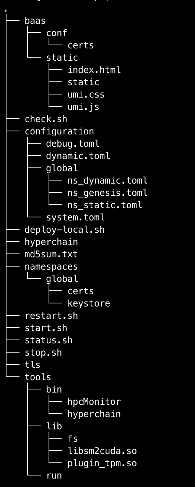

.. _check_conf:

#####################
检查、修改配置文件
#####################

**注意，以下操作都是在Flato的目标安装目录操作的，不是在原先未安装前的目录下操作。本例中，是在/opt/flato路径下检查、修改配置文件。**

安装包中的文件内容包括：

 |image0|

检查LICENSE文件
--------------------

由于LINCESE文件和Flato安装包不是一起打包分发的，所以在启动节点前，需要检查一下LICENSE文件是否已经更新到正确版本。

LICENSE文件位于Flato节点的根录下，文件名即LICENSE，如果不确定是否是最新版本，可以用原始的LICENSE文件再覆盖一遍。

::

 #解压缩
 cd ~
 tar xvf LICENSE-20180701.tar.gz 
 #解压出来后，LICENSE文件夹的名字可能是License-20180701
 #更新所有节点的LICENSE
 #根据实际情况修改License-20180701/LICENSE-abcdef和/opt/flato
 #拷贝命令的目标文件名，一定是LICENSE
 cp License-20180701/LICENSE-abcdef /opt/flato/LICENSE

**请依次检查4个节点的LICENSE文件。**

vi编辑器使用方法
---------------------

下面的配置文件的编辑需要使用到vi文本编辑器，在此介绍vi的使用方法

1、使用vi命令加文件名对某个文件进行编辑，进入vi编辑文件的界面

::

	vi anyFile.txtna

2、按下i键进入编辑模式，方向键控制光标移动

3、编辑完成后，按下Esc键进入命令模式，输入 `:wq` 保存修改并退出vi

::

	:wq

4、若要放弃本次编辑，按下Esc键进入命令模式,输入 `:q!` 放弃修改并退出vi

::

	:q!
 
修改配置文件 
-------------------

4.3.1 dynamic.toml
>>>>>>>>>>>>>>>>>>>>>>>>>>>

编辑 `dynamic.toml`

::

	vi configuration/dynamic.toml

其内容如下::

 self = "node1"

 ##########################################################
 #
 # key ports section
 #
 ##########################################################
 [port]
 jsonrpc     = 8081
 grpc        = 50011 # p2p

 ##########################################################
 #
 # p2p system config
 # 1. define the remote peer's hostname and its IP address
 # 2. define self address list under different domain
 #
 ##########################################################
 [p2p]
	[p2p.ip.remote]
		# this node will connect to those peer, if here has self hostname, we will ignore it
		hosts = [
		 "node1 127.0.0.1:50011",
		 "node2 127.0.0.1:50012",
		 "node3 127.0.0.1:50013",
		 "node4 127.0.0.1:50014",
	    ]

	[p2p.ip.self]
	    domain = "domain1"
	    # addr is (domain,endpoint) pair, those items defined the ip address:port which
	    # other domains' host how connect to self
	    addrs = [
	     "domain1 127.0.0.1:50011",
	     "domain2 127.0.0.1:50011",
	     "domain3 127.0.0.1:50011",
	     "domain4 127.0.0.1:50011",
	    ]

 [[namespace]]
    name = "global"
	start = true

- **修改host配置**

内容为::

 [p2p.ip.remote]
 hosts = [
  "node1 127.0.0.1:50011",
  "node2 127.0.0.1:50012",
  "node3 127.0.0.1:50013",
  "node4 127.0.0.1:50014",
   ]

配置规则很简单： `hostname ip_address:port` 将所有的节点的节点名称和IP地址端口配置好即可（port为节点间通讯的端口）。

修改方法为：

- 将每行的 `127.0.0.1` 替换为4台服务器各自的IP地址

- 将每行的 `5001x` 端口换成每个Flato节点自己的grpc端口

**因为我们选择单服务器单节点模式，实际上每个节点可以使用默认的50011端口，但是为了介绍如何正确修改节点配置，这里还是将grpc端口定为** `50011~50014`

以服务器IP `10.10.10.1~10.10.10.4` 为例，将hosts.toml文件修改为类似以下的内容::

 hosts = [
 "node1 10.10.10.1:50011",
 "node2 10.10.10.2:50012",
 "node3 10.10.10.3:50013",
 "node4 10.10.10.4:50014"]

需要注意的是，4个节点的hosts配置都是一致的，请依次配置。

- **修改port配置**

内容为::

 [port]
 jsonrpc     = 8081
 grpc        = 50011 # p2p

**因为我们选择单服务器单节点模式，实际上每个节点可以使用默认的port配置，但是为了介绍如何正确修改节点配置，这里还是区别一下各节点的端口，即1~4号节点分别使用为** `xxxx1~xxxx4` **号端口**

以2号节点为例，它的port内容如下::

 [port]
 jsonrpc     = 8082
 grpc        = 50012 # p2p

需要注意的是，本例中除了1号节点不需要修改port配置，其他节点都要修改port配置。请依次配置剩余节点的port配置。

- **修改addr配置**

以下是详细的配置说明::

	[p2p.ip.self]
        # 本节点所在域名的域名
	    domain = "domain1"
		# 其他节点访问本节点的时候的地址
	    addrs = [
	     "domain1 127.0.0.1:50012",
	     "domain2 127.0.0.1:50012",
	     "domain3 127.0.0.1:50012",
	     "domain4 127.0.0.1:50012",
	    ]

这里配置时候需要注意,配置的是其他节点访问本节点时，使用的本节点的IP地址，举个例子，如果节点2属于域 `domain2` ，那么节点2访问节点1时需要用节点1声明的在 `domain2` 域中对外暴露的地址，换句话说，节点2访问本节点时用的地址是`127.0.0.1:50012`。

需要注意的是，这里的域的数目可以比host数目少。

这里是配置是比较容易出错的地方，最简单的配置方式就是：

- 所有节点都在一个domain里：所有节点都在同一个内网环境，只要配置一个domain和该节点在这个domain里的IP地址

**请按照上述内容格式，依次配置剩余服务器的addr配置。**

**更复杂的网络环境下：**

在一些加入了类似Nginx代理的网络环境中，这个文件的配置极其容易出错，一般可以这样理解，服务器node1在domain1中有自己的 `node1_domain1_ip` ；但是在domain2中它的 `node1_domain2_ip` ，是它在domain2中 `最内层的一个Nginx代理上，所分配的服务器node1转发地址` ，domain2中其他的服务器node2、node3是通过连接最内层的Nginx上的 `node1_domain2_ip` 访问处于外部的node1服务器的。所以domain2中最内层Nginx上的 `node1_domain2_ip` ，就是node1服务器addr.toml中，该填的 `domain2 node1_domain2_ip` 地址。

ns_dynamic.toml
>>>>>>>>>>>>>>>>>>>>>>>>>>

编辑 `ns_dynamic.toml`

::

 vi configuration/global/ns_dynamic.toml 

其内容如下::

 [consensus]
 algo = "RBFT"
     [consensus.set]
     set_size       = 25    # How many transactions should the node broadcast at once
     [consensus.pool]
     batch_size       = 500    # How many txs should the primary pack before sending pre-prepare
     pool_size        = 50000  # How many txs could the txPool stores in total

 [self]
 n         = 4           # 运行时修改。表示所连vp节点的个数，该值在节点运行过程中会实时变化。
 hostname    = "node2"   # 运行时修改，仅限于CVP节点。对于cvp来说，该值会发生变化，仅在cvp节点升级为vp的时候，这里的hostname会被替换为要升级vp的hostname。
 new         = false     # 运行时修改。新节点成功加入网络以后，该值会变为false。
 # the value can only be vp、nvp and cvp, case-insensitive
 type        = "vp"		# （未来将使用的节点类型配置项，还未合并）运行时修改，仅限于CVP节点。对于cvp来说，该值会发生变化，仅在cvp节点升级为vp的时候，该值从“cvp”变为“vp”。
 vp          = true      # （过时配置，目前使用的节点类型配置项）

 #[[cvps]]				# 运行时修改。cvps在节点运行过程中实时变化。
 #hostname 	= "cvp1"

 #[[cvps]]
 #hostname 	= "cvp2"

 #[[nvps]]				# 运行时修改。nvps数组在节点运行过程中实时变化。
 #hostname	= "nvp1"

 #[[nvps]]				
 #hostname	= "nvp2"

 [[nodes]]				# 运行时修改。nodes数组在节点运行过程中实时变化。
 hostname    = "node1"
 score       = 10

 [[nodes]]
 hostname    = "node2"
 score       = 10

 [[nodes]]
 hostname    = "node3"
 score       = 10

 [[nodes]]
 hostname    = "node4"
 score       = 10

其中需要注意 `[[nodes]]` 配置，连接多少个VP节点，就加入多少个 `[[nodes]]` 部分::

 [[nodes]]
   hostname = "node4"
   score = 10

**上面的** `hostname` **必须要在** `dynamic.toml` **文件中的host配置中存在；**

在 `self` **部分需要注意的几个配置项以及配置解释** ::

 [self]
 n         = 4           # 运行时修改。表示所连vp节点的个数，该值在节点运行过程中会实时变化。
 hostname    = "node1"   # 运行时修改，仅限于CVP节点。对于cvp来说，该值会发生变化，仅在cvp节点升级为vp的时候，这里的hostname会被替换为要升级vp的hostname。
 new         = false     # 运行时修改。新节点成功加入网络以后，该值会变为false。
 # the value can only be vp、nvp and cvp, case-insensitive
 type        = "vp"		# （未来将使用的节点类型配置项，还未合并）运行时修改，仅限于CVP节点。对于cvp来说，该值会发生变化，仅在cvp节点升级为vp的时候，该值从“cvp”变为“vp”。
 vp          = true      # （过时配置，目前使用的节点类型配置项）

通常我们拿到默认的配置文件，只需要修改其中的self部分，将hostname改为本节点对应的内容即可。

以2号节点为例，它的self内容如下::

 [self]
 n         = 4           
 hostname    = "node2"   
 new         = false     
 type        = "vp"		
 vp          = true     

**需要注意的是，本例中除了1号节点不需要修改ns_dynamic.toml，其他节点都要修改配置。请依次配置剩余节点的ns_dynamic.toml文件。**

ns_static.toml
>>>>>>>>>>>>>>>>>>>

在ns_static.toml的最上方有创世账户的默认配置，如下所示::

 [genesis]
 [genesis.alloc]
 "000f1a7a08ccc48e5d30f80850cf1cf283aa3abd" = "1000000000"
 "e93b92f1da08f925bdee44e91e7768380ae83307" = "1000000000"
 "6201cb0448964ac597faf6fdf1f472edf2a22b89" = "1000000000"
 "b18c8575e3284e79b92100025a31378feb8100d6" = "1000000000"
 "856E2B9A5FA82FD1B031D1FF6863864DBAC7995D" = "1000000000"
 "fbca6a7e9e29728773b270d3f00153c75d04e1ad" = "1000000000"

这些账户及其对应的余额会在区块链启动时被创建。 **需要注意的是，作为默认账户，它们的私钥并不会对外暴露，因此请您自行创建创世账户，填入所有创世节点的配置文件，并妥善保管账户私钥。**

检查配置文件
----------------

假设服务器IP地址为 `10.10.10.1~10.10.10.4` ，各自使用的端口是 `xxxx1~xxxx4` 。

在做完步骤 **检查、修改配置文件** 前4步之后，共涉及了1个LICENSE文件的更新和4个配置文件的修改，以下是配置文件更新后的样例。

各节点dynamic.toml 
>>>>>>>>>>>>>>>>>>>>>>>>>

1号节点::

 self = "node1"

 ##########################################################
 #
 # key ports section
 #
 ##########################################################
 [port]
 jsonrpc     = 8081
 grpc        = 50011 # p2p

 ##########################################################
 #
 # p2p system config
 # 1. define the remote peer's hostname and its IP address
 # 2. define self address list under different domain
 #
 ##########################################################
 [p2p]
 	[p2p.ip.remote]
 		# this node will connect to those peer, if here has self hostname, we will ignore it
		hosts = [
		 "node1 10.10.10.1:50011",
		 "node2 10.10.10.2:50012",
		 "node3 10.10.10.3:50013",
		 "node4 10.10.10.4:50014",
	    ]

	[p2p.ip.self]
	    domain = "domain1"

	    # addr is (domain,endpoint) pair, those items defined the ip address:port which
	    # other domains' host how connect to self
	    addrs = [
	     "domain1 10.10.10.1:50011",
	    ]

 [[namespace]]
    name = "global"
  	start = true

2号节点::

 self = "node2"

 ##########################################################
 #
 # key ports section
 #
 ##########################################################
 [port]
 jsonrpc     = 8082
 grpc        = 50012 # p2p 

 ##########################################################
 #
 # p2p system config
 # 1. define the remote peer's hostname and its IP address
 # 2. define self address list under different domain
 #
 ##########################################################
 [p2p]
	[p2p.ip.remote]
		# this node will connect to those peer, if here has self hostname, we will ignore it
		hosts = [
		 "node1 10.10.10.1:50011",
		 "node2 10.10.10.2:50012",
		 "node3 10.10.10.3:50013",
		 "node4 10.10.10.4:50014",
	    ]

	[p2p.ip.self]
	    domain = "domain1"

	    # addr is (domain,endpoint) pair, those items defined the ip address:port which
	    # other domains' host how connect to self
	    addrs = [
	     "domain1 10.10.10.2:50012",
	    ]

 [[namespace]]
    name = "global"
	start = true

3号节点::

 self = "node3"

 ##########################################################
 #
 # key ports section
 #
 ##########################################################
 [port]
 jsonrpc     = 8083
 grpc        = 50013 # p2p 

 ##########################################################
 #
 # p2p system config
 # 1. define the remote peer's hostname and its IP address
 # 2. define self address list under different domain
 #
 ##########################################################
 [p2p]
	[p2p.ip.remote]
		# this node will connect to those peer, if here has self hostname, we will ignore it
		hosts = [
		 "node1 10.10.10.1:50011",
		 "node2 10.10.10.2:50012",
		 "node3 10.10.10.3:50013",
		 "node4 10.10.10.4:50014",
	    ]

	[p2p.ip.self]
	    domain = "domain1"

	    # addr is (domain,endpoint) pair, those items defined the ip address:port which
	    # other domains' host how connect to self
	    addrs = [
	     "domain1 10.10.10.3:50013",
	    ]

 [[namespace]]
    name = "global"
	start = true

4号节点::

 self = "node4"

 ##########################################################
 #
 # key ports section
 #
 ##########################################################
 [port]
 jsonrpc     = 8084
 grpc        = 50014 # p2p

 ##########################################################
 #
 # p2p system config
 # 1. define the remote peer's hostname and its IP address
 # 2. define self address list under different domain
 #
 ##########################################################
 [p2p]
 	[p2p.ip.remote]
 		# this node will connect to those peer, if here has self hostname, we will ignore it
		hosts = [
		 "node1 10.10.10.1:50011",
		 "node2 10.10.10.2:50012",
		 "node3 10.10.10.3:50013",
		 "node4 10.10.10.4:50014",
	    ]

	[p2p.ip.self]
	    domain = "domain1"

	    # addr is (domain,endpoint) pair, those items defined the ip address:port which
	    # other domains' host how connect to self
	    addrs = [
	     "domain1 10.10.10.4:50014",
	    ]

 [[namespace]]
    name = "global"
	start = true

各节点ns_dynamic.toml 
>>>>>>>>>>>>>>>>>>>>>>>>>>

::

 	[consensus]
 	algo = "RBFT"

	[consensus.set]
	set_size       = 25    # How many transactions should the node broadcast at once

	[consensus.pool]
	batch_size       = 500    # How many txs should the primary pack before sending pre-prepare
	pool_size        = 50000  # How many txs could the txPool stores in total

 	[self]
	n         = 4           # 运行时修改。表示所连vp节点的个数，该值在节点运行过程中会实时变化。
	hostname    = "node2"   # 运行时修改，仅限于CVP节点。对于cvp来说，该值会发生变化，仅在cvp节点升级为vp的时候，这里的hostname会被替换为要升级vp的hostname。
	new         = false     # 运行时修改。新节点成功加入网络以后，该值会变为false。
	# the value can only be vp、nvp and cvp, case-insensitive
	type        = "vp"		# （未来将使用的节点类型配置项，还未合并）运行时修改，仅限于CVP节点。对于cvp来说，该值会发生变化，仅在cvp节点升级为vp的时候，该值从“cvp”变为“vp”。
	vp          = true      # （过时配置，目前使用的节点类型配置项）

	#[[cvps]]				# 运行时修改。cvps在节点运行过程中实时变化。
	#hostname 	= "cvp1"

	#[[cvps]]
	#hostname 	= "cvp2"

	#[[nvps]]				# 运行时修改。nvps数组在节点运行过程中实时变化。
	#hostname	= "nvp1"

	#[[nvps]]				
	#hostname	= "nvp2"

	[[nodes]]				# 运行时修改。nodes数组在节点运行过程中实时变化。
	hostname    = "node1"
	score       = 10

	[[nodes]]
	hostname    = "node2"
	score       = 10

	[[nodes]]
	hostname    = "node3"
	score       = 10

	[[nodes]]
	hostname    = "node4"
	score       = 10

检查证书配置
-----------------

非分布式CA证书配置
>>>>>>>>>>>>>>>>>>>>>>>>>

flato在默认配置下都是以非分布式CA的方式进行启动。

在INFO或者OA上下载的V1.7+证书套件解压后会看到ca、flato、hyperchain三个目录，详细使用可见README.md。 **注意下载时需要指明节点对应的节点名称（hostname），名称应该和稍后部署时填写的节点名称一致。**

其中flato目录里的证书套件用来部署flato，打开flato目录后可以看到一系列node目录，如下图所示。

 |image1|

以节点1为例，部署时直接 **将证书套件里node1目录下的CA、certs目录（如下图）放到./namespaces/global/certs/目录下** 即可。将tls目录下的 `tlsca.ca` 、 `tls_peer.cert` 、 `tls_peer.priv` 放到flato项目node1的 `./tls` 目录下即可。tls相关的配置在 `global.toml` 的p2p配置项下。

 |image2|

注意事项：

- 如果发生找不到证书这类错误，请检查 `./configuration/global/ns_static.toml` 文件中的

[encryption.]配置项，修改为 `ca = "certs/CA"`

[encryption.ecert]配置项，修改为 `ecert = "certs/certs"`

- 如果节点启动报错 **"the searched certificate configuration item does not match hostname : need hostname1, but hostname2"** 此类的错误，请查看证书生成时是否有误。在INFO或者OA上申请SDKCERT,ECERT时，节点名称（域名）一栏需要填写每个节点对应的hostname，如下图：

 |image3|

分布式CA证书配置
>>>>>>>>>>>>>>>>>>>>>>

目前分布式CA的证书能够通过certgen生成或INFO进行下载，证书放置路径和非分布式CA相同，但是需要修改 `./configuration/global/ns_static.toml` 文件中的

[distributedCA]配置项，修改为 `enable = true`

通过INFO下载分布式CA证书需要选择 **“分布式CA”** 选项：

 |image4|

通过certgen生成的方式需要借助于如下脚本：

下载完成后将其放到和可执行 certgen 二进制文件同一目录下，输入

::

 ./gencert.sh

指令运行，按照提示输入相关内容即可完成证书的创建。

该shell脚本是通过调用certgen相关指令来完成创建证书的操作的，能够让操作者选择生成分布式CA或者非分布式CA的证书。无论是分布式CA还是非分布式CA都会选择是否生成国密自签证书和国密公私钥，需要说明的是，选择了生成国密自签证书会自动生成国密公私钥对，选择生成非国密自签证书会生成非国密公私钥对，两者需要配套。

对于分布式CA来说，该脚本默认生成4个CA，需要按照提示输入CA相关信息；并默认生成4个节点的证书，生成顺序为：

node1需要生成node2.cert(root2颁发), node3.cert(root3颁发), node4.cert(root4颁发);

node2需要生成node1.cert(root1颁发),node3.cert, node4.cert;

node3需要生成node1.cert, node2.cert, node4.cert;

node4需要生成node1.cert, node2.cert, node3.cert;

其中CA1与node1对应按照提示输入信息即可。

对于非分布式CA来说，默认生成一个CA，输入CA相关信息后会提示输入要生成的节点证书的数量，例如如果有5个节点需要生成证书，输入5，然后根据提示输入相关信息即可。

不启用证书功能
>>>>>>>>>>>>>>>>>>>>

当用户对区块链安全有较高要求时（例如有信息安全等级保护要求时）可能选择使用外部的硬件SSL VPN网关来保证准入控制和链路安全，这时可以手动关闭准入控制功能。方法是手动将ns_static.toml中的 **[encryption.check.enable]** 和 **[encryption.check.enableT]** 设置为false。这种情况下节点不需要配置任何证书即可启动。

::

 [encryption.check]
 enable     = false   #enable RCert
 enableT    = false  #enable TCert

这时节点关闭准入控制功能，但是仍然会启用链路加密。可以同将 **[encryption.security. algo]** 设置为pure关闭链路加密功能（默认为sm4加密保护）。

::

 [consensus]
 algo = "SOLO"

请 **注意** 这种情况下 **请务必采取必要的外部措施保护区块链网络安全** 。

.. |image0| image:: ../../../images/Deployment1.png

.. |image2| image:: ../../../images/Deployment3.png
.. |image3| image:: ../../../images/Deployment4.png	
.. |image4| image:: ../../../images/Deployment5.png	