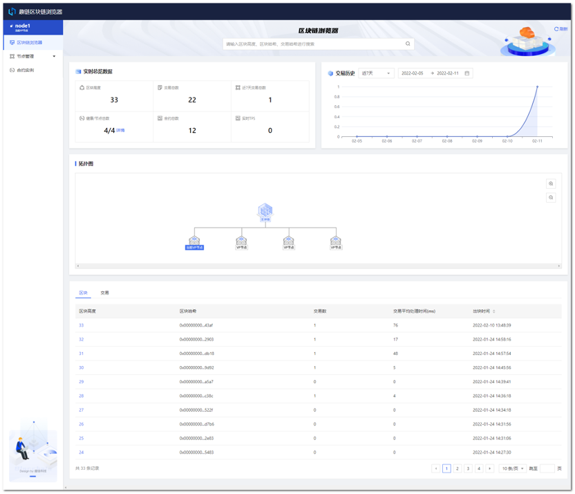
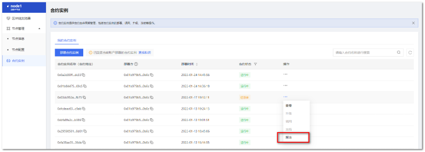

趣链区块链浏览器
^^^^^^^^^^^^^^^^^^

1. 功能概述
==============

趣链区块链浏览器是管理人员可视化管理hyperchain相关链上业务的可视化工具，支持查看区块链上信息、节点/合约实例可视化管理等核心操作。

本使用手册将从启动趣链区块链浏览器、查看区块链浏览器、节点管理、合约实例管理等方面展开介绍。

2. 使用说明
==============

2.1 快速启动
--------------

2.1.1 配置说明
>>>>>>>>>>>>>>>>>>

使用区块链浏览器功能需要在hyperchain启动之前进行相关配置。主要配置项如下::

1. **system.toml**

 ::

    [baas]
    enable = true

在system.toml配置文件下，将bass.enable配置设置为true

2. **dynamic.toml**

 ::

    [port]
    ......
    baas        = 12001

在dynamic.toml配置文件下，配置baas的访问端口，默认为12001。即在hyperchain启动成功后，可以在浏览器访问 **ip:12001** 来打开区块链浏览器。

3. **证书配置**

趣链区块链浏览器通过sdk访问节点，故需要在节点的baas/conf目录下配置相关证书。

需要配置的证书及目录结构如下::

    conf
    ├── certs
    │   ├── sdkcert.cert
    │   ├── sdkcert.priv
    │   ├── unique.priv
    │   └── unique.pub
    │   ├── tls
    │   │   ├── tls_peer.cert
    │   │   ├── tls_peer.priv
    │   │   └── tlsca.ca

注意，证书的配置取决于链上相关证书是否开启。

2.1.2 启动趣链区块链浏览器
>>>>>>>>>>>>>>>>>>>>>>>>>>>

您在部署hyperchain后，可获取目标节点的IP和端口信息（具体方式参见hyperchain部署手册），在相同域下的电脑设备内打开网页浏览器，在地址栏中输入对应的IP和端口，即可进入对应节点的趣链区块链浏览器。

示例：

|image0|

2.2 区块链浏览器
--------------------

区块链浏览器页面内，支持查看 **实时总览数据** 和 **网络拓扑图** ，更进一步地，您可以从“区块”、“交易”两个维度进一步查看区块链数据。

|image1|

2.2.1 查看区块
>>>>>>>>>>>>>>>>>

**步骤一：** 在搜索框中输入区块高度或区块哈希，或者点击【区块】tab下的【区块高度】，进入区块详情页。

|image2|

**步骤二：** 在区块详情页中，可以查看区块详情和该区块下进行的交易，还可以继续搜索想要查看的区块和交易。其中，父区块哈希和交易哈希可以点击跳转至对应详情页，区块哈希、父区块哈希、Merkle树的根哈希可复制。

|image3|

2.2.2 查看交易
>>>>>>>>>>>>>>>>>>>

**步骤一：** 在搜索框中输入交易哈希，或者点击【交易】tab下的【交易哈希】，进入交易详情页。

|image4|

**步骤二：** 在交易详情页中，可以查看交易详情，还可以继续搜索想要查看的区块和交易。其中，区块哈希可以点击跳转至对应详情页，交易哈希、区块哈希、发起地址、接收地址可复制。

|image5|

2.3 节点管理-节点信息
-----------------------

趣链区块链浏览器提供【节点信息】和【节点配置】两个可视化的节点管理页面。下文将介绍【节点信息】的使用说明，【节点配置】请参考2.4节内容。

2.3.1 查看节点信息
>>>>>>>>>>>>>>>>>>>>>

**步骤一：** 点击【节点管理】下【节点信息】，进入节点信息页面。

**步骤二：** 在节点信息页面中，可以查看该当前节点的具体信息，包括：节点类型、节点ID、节点端口。

|image6|

2.3.2 节点连接状态管理
>>>>>>>>>>>>>>>>>>>>>>>>

1. **建立节点连接**

**步骤一：** 点击【节点管理】下【节点信息】，进入节点信息页面。

**步骤二：** 在节点信息页面中，可以看到节点关联列表，点击【建立节点连接】。

|image7|

**步骤三：** 在弹窗中填写待与当前节点关联的新节点参数，点击【确定】开始建立连接。

|image8|

参数说明如下：

- **节点名称** ：新节点的节点名称，不可与当前节点关联列表的节点名称相同；

- **节点IP地址** ：新节点的端口信息，系统检验可连接后，即可建立新节点与当前节点的网络连接。

**步骤四：** 连接成功后，可在节点关联列表中查看。

2. **重新连接节点**

**步骤一：** 点击【节点管理】下【节点信息】，进入节点信息页面。

**步骤二：** 在节点信息页面中，可以看到节点关联列表，选择与当前节点建立连接的其他节点，点击【…】操作列的【重新连接】。

|image9|

**步骤三：** 在弹窗内，点击“确定”，即可重新建立所选节点与当前节点之间的连接。

|image10|

3. **断开节点连接**

**步骤一：** 点击【节点管理】下【节点信息】，进入节点信息页面。

**步骤二：** 在节点信息页面中，可以看到节点关联列表，选择与当前节点建立连接的其他节点，点击【…】操作列的【断开连接】。

|image11|

**步骤三：** 在弹窗内，点击“确定”，即可断开所选节点与当前节点之间的连接，断开连接后该所选的节点将会从关联节点列表中消失，请谨慎操作。

|image12|

4. **节点链路检测**

**步骤一：** 点击【节点管理】下【节点信息】，进入节点信息页面。

**步骤二：** 在节点信息页面中，可以看到节点关联列表，选择与当前节点建立连接的其他节点，点击【…】操作列的【链路检测】。

|image13|

**步骤三：** 在弹窗内，您可以查看到链路检测结果。

|image14|

2.4 节点管理-节点配置
------------------------

2.4.1 节点网络配置
>>>>>>>>>>>>>>>>>>>>>>

节点网络配置是针对节点Domain配置，支持新增Domain和修改Domain操作。

1. **新增Domain**

**步骤一：** 点击【节点配置】中【网络配置】，进入网络配置页面。

|image15|

**步骤二：** 点击【新增Domain】，在新增行中，填写Domain参数，点击【保存】。

|image16|

**步骤三：** 保存后，点击【更新网络配置】，网络配置更新成功。

|image17|

2. **修改Domain**

**步骤一：** 点击【节点配置】中【网络配置】tab，进入网络配置页面。

|image18|

**步骤二：** 选择列表中某个Domain，点击【修改】。在修改框中，重新填写Domain参数，点击【保存】。

|image19|

**步骤三：** 保存后，点击【更新网络配置】，网络配置更新成功。

2.4.2 节点日志等级配置
>>>>>>>>>>>>>>>>>>>>>>>>>

1. **查看当前日志等级**

**步骤一：** 点击【节点配置】中，【日志等级】tab，进入日志等级配置页面。

|image20|

**步骤二：** 在选择框中，选择系统级别或Namespace级别的日志等级，查看不同模块下日志等级配置。

|image21|

2. **修改日志等级配置**

**步骤一：** 点击【节点配置】中，【日志等级】tab，进入日志等级配置页面。

|iamge22|

**步骤二：** 点击【修改日志等级】，在弹窗中填写修改参数，点击【确定】，可修改日志等级。

|image23|

每个分区模块的日志级别，日志级别由高到低为CRITICAL/ ERROR/WARNING/NOTICE INFO，级别越低日志内容越详细，对系统性能影响越大。

2.4.3 节点命名空间配置
>>>>>>>>>>>>>>>>>>>>>>>>>>>

节点命名空间配置提供可视化的 **命名空间启动或停止** 操作。

**步骤一：** 点击【节点配置】中，【命名空间】tab，进入命名空间配置页面。

|image24|

**步骤二：** 选择某个命名空间，点击【启动】/【停止】按钮。

|image25|

**步骤三：** 该节点会启动/停止在命名空间中的运行。

2.4.4 节点全量配置
>>>>>>>>>>>>>>>>>>>>>

**步骤一：** 点击【节点配置】中，【全量配置】tab，进入全量配置界面。

|image26|

**步骤二：** 在左侧文件目录下，选择文件，进入编辑框修改配置。

|image27|

**步骤三：** 修改完成后，点击【更新高级配置】，链将重启并完成配置更新。

2.5 合约实例
--------------

本模块提供对合约实例的管理操作。目前，支持Solidity合约实例和Java合约实例管理。

2.5.1 部署合约实例
>>>>>>>>>>>>>>>>>>>>>

**前置条件：**

1. 已编写完成的合约文件，并有编译文件；

2. 准备私钥文件（用于当前账户部署的合约实例的操作授权）；

3. 当前节点连接正常；

4. 联盟链正常运行。

**操作步骤：**

1. 点击【合约实例】tab，进入合约实例页面；

2. 点击【上传私钥】，上传合约部署、升级等操作时需要使用的私钥，点击【确定】；

|image28|

3. 私钥上传完成后，点击【部署合约实例】，在弹窗中填写部署参数，点击【确定】，开始部署合约；

|image29|

参数说明：

- **合约实例类型：** 支持Solidity和Java两种合约类型

- **可选入参：** 部署合约实例的初始化参数，如没有可不填

- **合约文件：** 对于Solidity合约需分别上传编译后的abi文件和bin文件；对于Java合约需分别上传编译后的abi文件和jar文件

4. 部署成功后，合约实例列表中将自动更新该合约实例，其状态为【运行中】。

2.5.2 查看合约实例
>>>>>>>>>>>>>>>>>>>>

**前置条件** ：合约已完成部署。

**操作步骤** ：

1. 点击【合约实例】tab，进入合约实例页面；

2. 选择目标合约实例，点击【查看】，可进入合约实例详情页；

|image30|

3. 如下所示，在详情页可查看合约实例地址、合约类型、部署地址、合约调用记录等。

|image31|

2.5.3 调用合约实例
>>>>>>>>>>>>>>>>>>>>>

**前置条件** ：

1. 在合约实例列表中，已有合约实例，且状态为【运行中】；

2. 联盟链处于正常运行状态。

**操作步骤** ：

1.   点击【合约实例】tab，进入合约实例页面；

2.   选择某个合约实例，点击【调用】；

|image32|

3.   弹窗中，填写调用参数，点击【确定】。

**Solidity合约调用参数说明**

======== ==============================
参数名   填写说明
======== ==============================
函数名   该合约实例的调用函数名
可选入参 该合约的调用参数，如没有可不填
合约文件 该合约编译后的abi文件
======== ==============================

**Solidity合约调用示例**

|image33|

**Java 合约调用参数说明**

======== ==============================
参数名   填写说明
======== ==============================
BeanName 该合约实例的调用方法名
可选入参 该合约的调用参数，如没有可不填
合约文件 该合约编译后的abi文件
======== ==============================

**Java合约调用示例**

|image34|

1. 调用成功，会跳出调用结果的详情弹窗，可查看调用信息，点击蓝色字符串【交易哈希】，可进行跳转至对应的区块链浏览器交易详情页，或者您也可在合约详情中查看调用记录。

|image35|

2.5.4 升级合约实例
>>>>>>>>>>>>>>>>>>>>>

**前置条件：**

1. 在合约实例列表中，已有合约实例，且状态为【运行中】；

2. 链处于正常运行状态。

**操作步骤** ：

1. 点击【合约实例】tab，进入合约实例页面；

2. 选择目标合约实例，点击【升级】；

3. 弹窗中填写升级参数，点击【确定】，合约开始升级；

**Solidity合约升级参数说明**

======== ======================================
参数名   填写说明
======== ======================================
可选入参 该合约的调用参数，如没有可不填
合约文件 分别上传该合约编译后的abi文件与bin文件
======== ======================================

**Java 合约升级参数说明**

======== ======================================
参数名   填写说明
======== ======================================
可选入参 该合约的调用参数，如没有可不填
合约文件 分别上传该合约编译后的abi文件与bin文件
======== ======================================

1. 升级成功后，列表将自动刷新，且在合约实例详情中将新增相应的升级记录信息。

2.5.5 冻结合约实例
>>>>>>>>>>>>>>>>>>>>>>

由于区块链网络中，数据一旦上链就不可篡改，那么对于合约也一样，一旦部署上链就不可以被删除。但是，会出现用户不需要使用合约或合约出现问题需要暂停使用的情况，针对这一问题，平台提供了合约冻结功能，可以暂停合约的使用。

**前置条件** :

1. 在合约实例列表中，已有合约实例，且状态为【运行中】；

2. 链处于正常运行状态。

**操作步骤** ：

1. 点击【合约实例】tab，进入合约实例页面；

2. 选择某个合约实例，点击【冻结】；

|image36|

3. 冻结成功后，列表将自动刷新，合约状态更新为【已冻结】。

|image37|

2.5.6 解冻合约实例
>>>>>>>>>>>>>>>>>>>>>

**前置条件** ：

1. 在合约实例列表中，已有合约实例，且状态为【已冻结】；

2. 联盟链处于正常运行状态。

**操作步骤** ：

1. 点击【合约实例】tab，进入合约实例页面；

2. 选择某个【已冻结】的合约实例，点击【解冻】；

|image38|

3. 在弹窗中点击确定；

|image39|

4. 解冻成功后，列表将自动更新，合约状态更新为【运行中】。

3. 注意事项
================

1. 区块链浏览器为节点级别功能，目前监控功能仅针对global分区，后续版本将完善

2. cvp节点暂不支持区块链浏览器开启

3. 区块链浏览器相关日志保存在节点目录下的baas/logs

4. 当前版本暂不支持部署java合约

.. |image0| image:: ../../images/browser1.png

.. |image2| image:: ../../images/browser3.png
.. |image3| image:: ../../images/browser4.png

.. |image5| image:: ../../images/browser6.png

.. |image7| image:: ../../images/browser8.png

.. |image9| image:: ../../images/browser10.png

.. |image11| image:: ../../images/browser12.png

.. |image19| image:: ../../images/browser20.png
.. |image20| image:: ../../images/browser21.png

.. |image23| image:: ../../images/browser24.png

.. |image25| image:: ../../images/browser26.png

.. |image28| image:: ../../images/browser29.png
.. |image29| image:: ../../images/browser30.png
.. |image30| image:: ../../images/browser31.png
.. |image31| image:: ../../images/browser32.png

.. |image33| image:: ../../images/browser34.png
.. |image34| image:: ../../images/browser35.png
.. |image35| image:: ../../images/browser36.png
.. |image36| image:: ../../images/browser37.png
.. |image37| image:: ../../images/browser38.png

.. |image39| image:: ../../images/browser40.png

.. |image| image:: ../../images/browser.png
.. |image| image:: ../../images/browser.png

