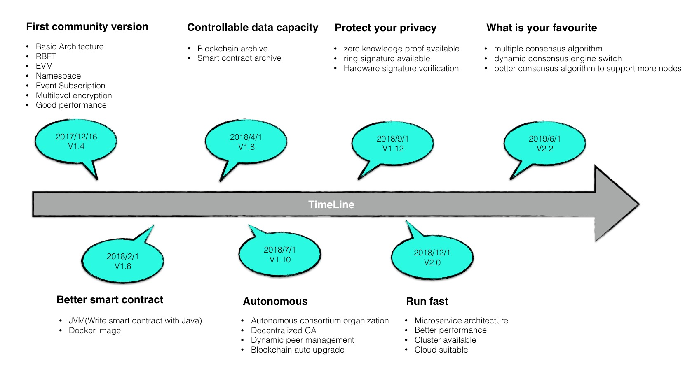

Hyperchain 开发路线图
=====================

Hyperchain目前在开源社区开放的是1.4稳定版本，在今后还将不断推出新的特性。欢迎Hyperchain社区的爱好者一起参与到我们的开发到中！

First community version
-----------------------

这是Hyperchain的第一个社区版本，包括了联盟链平台的完整组件：

1. 基于RBFT算法的共识引擎；
2. 兼容以太坊的EVM智能合约虚拟机；
3. 数据分区，从物理上实现业务隔离；
4. 丰富的事件订阅接口，实时捕捉区块链平台动态；
5. 多级加密机制，包括非对称加密，对称秘钥，基于数字证书的准入机制；
6. 可用级别的性能表现，满足大部分业务场景的需求；

Better smart contract
---------------------

这个版本拟计划于2018年2月份推出，主要特性为支持用Java语言来编写智能合约，降低区块链应用开发的门槛。

除此之外，还将推出更加容易使用的hyperchain
docker镜像，支持一键集群部署。

Controllable data capacity
--------------------------

目前现有的区块链数据都是累增的，因此区块链数据本身的存储容量将会是一个很大的问题。

我们拟将于2018年4月推出区块链数据的归档策略，可以支持区块链数据的归档以及合约数据的归档。

Autonomous
----------

现有的联盟链准入机制存在以下几个问题：

-  存在单点故障；
-  容易被单个节点控制整个联盟链网络；
-  自动化程度较低；

因此，我们拟将在2018年7月推出一个实现去中心化的自治的准入机制的版本，能够实现自动化的成员管理，身份切换，版本升级等。

Protect your pricacy
--------------------

目前在同一个分区中，区块链数据是被所有节点所共享的，从而也就没有用户隐私可言。在2018年的9月，我们将推出支持两种高级密码学特性的版本，来实现用户隐私的保护。

两个密码学技术分别是（1）零知识证明（2）环签名技术。

Run fast
--------

目前Hyperchain的性能表现虽然能够满足大部分业务场景的需求，但是对于特别高频且复杂的场景还是束手无策。因此，我们将对现有的架构做较大的调整，以微服务，适合云计算的架构来改造hyperchain，从而达到提升性能表现的目的。

该版本计划于2018年的12月推出。

What is your favourite
----------------------

在2019年的6月，我们将推出一个支持多种共识算法的版本，能够支持动态的共识引擎切换，并计划提出一个全新的共识算法，能够在联盟链中支持更大的节点规模。
