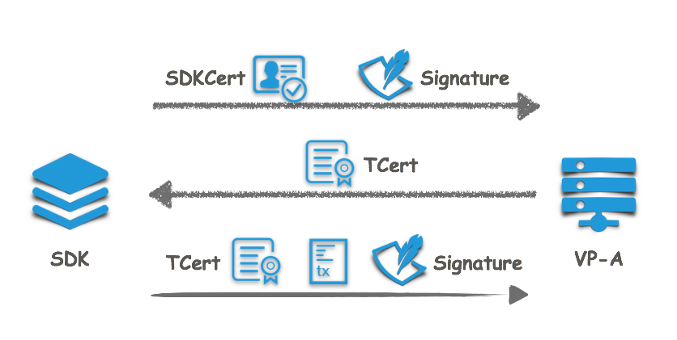
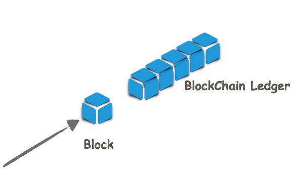

交易执行流程
============

本文意在描述一条交易从最初产生到最终上链的交易机制。场景包括发起交易的客户端和与之直连的共识节点A，客户端通过SDK与共识节点A以交易的形式与区块链账本进行交互；共识节点A与其他共识节点B、C、D...全连接，同时共识节点A有两个用于备份的记账节点a1和a2。
|image0|

**假设**

我们假设客户端已经拿到证书管理中心（CA）颁发的准入证书（SDKCert），智能合约已经部署在同一命名空间的区块链节点上。

**客户端发起交易**

现在要做的是发起一笔交易请求（调用已部署合约中的一个方法）。

客户端首先通过调用SDK的接口初始化一个 *HyperchainAPI*
对象，初始化过程中，SDK会以SDKCert和公钥向共识节点A请求获取发起交易所需的TCert。然后通过调用SDK的
*Transaction*
接口生成一条交易，SDK会用客户端指定的私钥对交易进行签名，再对交易进行JSONRPC协议封装后用TCert对应的私钥进行消息签名。SDK与节点间支持
*HTTP/HTTPS* 短连接和 *WebSocket* 长连接。 |image1|

**节点受理交易，发送到全网共识节点**

节点A收到交易后先进行TCert验证，节点只会对通过TCert验证的请求进行处理。节点的API模块还会做如下交易验证：

（1）根据流控配置确认是否接受交易请求；
（2）验证交易字段的合法性，包括交易的格式，是否为空值，以及时间戳的合法性；
（3）是否已经提交过相同交易（重放攻击）； （4）验证交易签名。

当交易通过以上验证后，会被提交到共识模块，共识模块将收到的交易向全网的共识节点进行广播。

**交易的共识：排序，验证，写块**

交易将会经历共识算法（RBFT）的三步走流程。

(1) *预准备 · Pre-Prepare*
    共识主节点会将一定时间内（或者一定数量）的交易定序后打包成一个区块，然后发送到全网进行共识。
    |image2|
(2) *准备 · Prepare* 所有共识节点对区块进行预处理，并广播结果哈希。
(3) *提交 · Commit* 所有共识节点写入区块，并更新区块链账本。 |image3|

在执行过程中发现的非法交易会被存储到数据库的非法交易记录中，并不会记录到区块链账本上。区块链账本上存储了所有合法交易。

所有共识节点在区块成功生成后也会将区块推送到所连接的所有记账节点进行记账。

**交易回执**

SDK在 *Transaction*
接口中实现了定时向节点获取交易结果，即查询交易回执。区块链网络设置的交易打包数量和打包时间会影响交易的延迟。

.. |image0| image:: ../../images/tx_flow.png

.. |image2| image:: ../../images/txs_to_block.png

